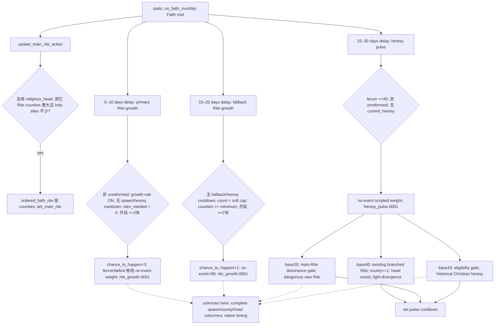
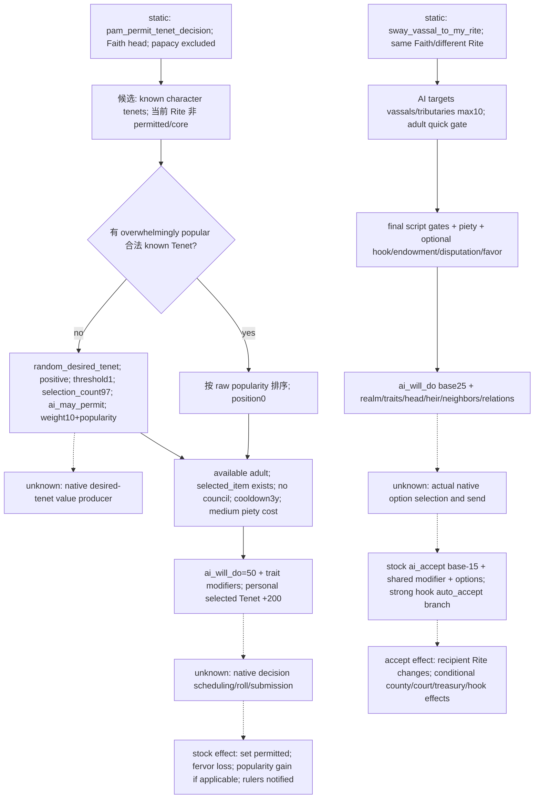

# CK3 1.20.0.2 宗教 stock：Faith、Rite、Tenet 与 AI 脚本入口

状态：**`research`**。下列 `static-confirmed` 只指冻结安装包中的原版数据、规则和脚本；没有 native ABI、provider、fixture、paused snapshot 或实际宗教操作验收。本包不改变自动玩家策略。2026-10-01 用户已明确开放宗教研究；本包仅做非战争宗教，战争、圣战和 holy order 不在研究范围。

## 冻结与可复现产物

- 新版：CK3 `1.20.0.2 Crozier / Steam25588574`；冻结根为 `Z:/ck3_mod_rewrite/artifacts/migrations/2026-09-30/post-update-1.20.0.2/installation/`，EXE SHA-256 `AE1BA6FF060BA603842F6F4A2DED0AF4B7D3666B3DD271F75FB01B0DA8E81B2D`。
- 旧版：`Z:/ck3_mod_rewrite/Crusader Kings III/` 的冻结 `1.19.0.6 Scribe`；本次读取 EXE SHA-256 `2D00FF3101EF70B566F2FCBAE292F09263199C80E9DC8F139B82D7D96F83DB86`，与 `artifacts/migrations/2026-09-30/pre-update/metadata/build-identity.json` 的 reference 身份相同。因此此处版本差异有旧版文件支持。
- 提取脚本：[research/religion12002_stock.py](../../research/religion12002_stock.py)。只读冻结文件，写入 `artifacts/g2-offline-2026-10-01/religion/stock/`；未访问 CK3 进程、pipe、Steam 实际安装或 UI。
- [stock-evidence-manifest.json](Z:/ck3_mod_rewrite/artifacts/g2-offline-2026-10-01/religion/stock/stock-evidence-manifest.json) SHA-256 `484a01c411a4848ffe78afacd92867909a9291f38f8a0262eca00765f085946b` 绑定两版 EXE、每个来源文件 SHA、行区间、提取脚本和四份产物。
- [stock-inventory.json](Z:/ck3_mod_rewrite/artifacts/g2-offline-2026-10-01/religion/stock/stock-inventory.json) SHA `a4468289cb85d6e1ae268dd4e9172fefe632e5da4b0c4b9ffe371d41b1f29dff`；[stock-religion.diff](Z:/ck3_mod_rewrite/artifacts/g2-offline-2026-10-01/religion/stock/stock-religion.diff) SHA `cb94f2383bb9328c0030bf44b1caa2366389f0414ed1fafc3ab7785ae77352db`；[stock-entrypoints.json](Z:/ck3_mod_rewrite/artifacts/g2-offline-2026-10-01/religion/stock/stock-entrypoints.json) SHA `c6d971882c19c8e9f541f206fb21e5c5f15c584a0d2f474f3ee1dec911f681a0`；[stock-evidence-windows.txt](Z:/ck3_mod_rewrite/artifacts/g2-offline-2026-10-01/religion/stock/stock-evidence-windows.txt) SHA `ee638f90e20fd96bab66769d5ef50d7a2cdc5f8f0a5366487e75ce4edee03b06`。

库存是明确路径/文件名范围：`common/religion/`、`common/spiritual_fulfillment/`、非战争 `events/religion_events/`，宗教/PAM 命名文件及本页用到的通用 defines/rules。共 **167 个路径：71 新增、4 删除、92 修改**；92 个既有文件的 UTF-8 解码文本也不同，不能仅归因于 BOM/换行。它不是全游戏宗教相关调用点 census。混合文件的完整 diff 可以含其它域行，本页仅解释宗教段；入口 JSON 是顶层脚本块定位，不表示所有块都已逐条研究。

复现依次运行 `inventory`、`entrypoints`、`evidence` 三个子命令。`evidence` 已成功检查所有选定行区间存在并输出 manifest；没有把离线文件检查记成游戏测试。

## 1.19 → 1.20 的真实结构变化

| `static-confirmed` 变化 | 1.19 来源 | 1.20 来源与含义 |
| --- | --- | --- |
| Faith 从 Religion 内嵌定义拆出 | `religion_types/_religion_types.info:51-64` | `faith_types/_faith_types.info:1-64`：独立 `faith_details.religion`、`main_rite`、`origin`；冻结文件有 103 个 authored Faith 顶层块 |
| Rite 成为独立身份和规则载体 | 无 `rite_types/` | `_rite_types.info:35-40,58-75`：Rite 指向 parent Faith；无 scripted Rite 的 Faith 会创建同名 dynamic Rite；冻结三份 txt 有 152 个 authored Rite 块，不能等同当局已实例化数量 |
| Doctrine 与 Core Tenet 的持有者重组 | Faith 的 `doctrine = key`，Tenet 也定义在 `doctrine_types/30_core_tenets.txt` | `_faith_types.info:29-43,60-64`：scripted main Rite 持有 Core Tenet 和 Rite 专属 Doctrine；Faith intrinsic Doctrine 只补未占的组，Rite 的同组 Doctrine 优先 |
| Tenet 独立类型、个人 Tenet、五档状态 | 原 `30_core_tenets.txt` 有 73 个块 | 新 `tenet_types/00_tenet_types.txt` 71 个、`00_pam_tenets.txt` 26 个，共 97；新增 26 key，删除旧 `tenet_monasticism`、`tenet_rite`。这两个删除不能自动推断为无替代机制 |
| 选择时的候选状态分开 | 原 `selected_doctrines` | `_tenet_types.info:78-101`：`selected_tenets` 是当前 UI 所选条目，不保证等于现存 Faith 条目；`can_pick` 的 actor 可为空；个人 Tenet 用 Character scope 的 `can_pick_as_personal_tenet` |
| UI Doctrine 分类新增 | 无 `doctrine_category_types/` | 新文件有 6 个 authored category；分类本身不证明原生合法性或权重 |
| Spiritual Fulfillment 新增 | 无 `common/spiritual_fulfillment/` | 类型按 Religion 映射，空列表 fallback；正阈值含等号向上、负阈值含等号向下（`_spiritual_fulfillment_type.info:11-25`）。Christian 有 `-95/-65/-30/0/30/65/95`，fallback 有 `-65/-30/0/30/65` |

Tenet 的变化有实际语义，不只是搬文件：`tenet_aniconism` 旧 `piety_cost` 在 Faith 上用 `religion_tag/has_doctrine`，旧 `is_shown` 限 Abrahamic；新 `00_tenet_types.txt:64-94` 改用 Rite 上的 `rite_religion_tag/rite_has_tenet`，Abrahamic 条件进入 `can_pick`，并写 `divergence_multiplier=1.5`。旧脚本 `has_doctrine = tenet_*` 不能无条件当成新版等价观测。

Spiritual Fulfillment 会影响可观察成本：fallback 类型 `:118-175` 的负档有 `faith_conversion_piety_cost_mult=-0.5/-0.25`，正档有 `+0.25/+0.5`；最低档另有 `rite_creation_piety_cost_mult=-0.20`。Christian 的 `sp_easier_conversion/sp_harder_conversion` 又被 Sway-to-Rite 成本消费。因此 piety 或 Faith key 单独不足以推导最终费用。

## Fervor 与月度 Rite / Heresy 入口

旧 `events/religion_events/fervor_events.txt` 在新版冻结树不存在。旧 [fervor.1002 专题](fervor-1002.md) 的历史 production/fixture 资格仍属于 1.19；本包不能把该事件旧合同迁移为新版可用事件。

`NFaith.YEARLY_FERVOR_GROWTH` 从旧 `00_defines.txt:793` 的 **3.5** 改成新 `:799` 的 **0.5**，changelog 保留从 10 年改成 1 年；旧按 Faith size 的增长 modifier define 删除。新 `:803-822` 增加每 Rite 100 counties、低 Fervor 40、heretical Rite depletion 与过量 Rite 保护的参数。这里冻结的是参数与原版注释；精确 native yearly producer、取整及刷新顺序尚未反汇编闭合。

来源：`religion_on_actions.txt:1255-1267,1591-1607,1811-1855,1861-1917`；router `events/dlc/pam/heresy/pam_heresy_pulse.txt:15-177`。base50/20/10 还受 pluralism、Christian Situation phase 与对应候选门影响，不能宣称固定 62.5%/25%/12.5% 实际发生率。`chance_to_happen` 和加权 no-event 也须分别保留。

新 `NRite` 参数 `00_defines.txt:829-839`：创建时 divergence **>=100** 会产生 Faith；heretical threshold 值 65 的注释是 “above”，不能与创建阈值混成一个门。Tenet status divergence 数组按 **Unknown/Known/Prohibited/Permitted/Core** 为 `{15,15,30,5,-5}`，注释称 Core 两向检查；精确 native divergence 汇总未知。

分裂 Faith 的原版注释说 native 起始 fervor=0，但 `on_faith_created:12-17` 在 `scope:diverged=true` 时立即调用 `diverged_faith_starting_fervor_effect`；该 effect `00_religion_effects.txt:339-344` 加上 `02_religion_values.txt:4806` 的 **50**。因此不能依据“starts at 0”的注释声称脚本链处理后的读回恒为 0；native 初值本身尚未由本包验证。

## 转换、创建与编辑：脚本最终门的覆盖范围

原 `00_rules.txt:25-83` 的 `faith_creation` 改成新 `can_create_rite:31-33` 和 `can_edit_rite:24-26`，分别调用 `00_religious_triggers.txt:3140-3253`、`:3022-3137`。创建要求 adult、和平、非 Faith head、没有 `has_created_a_faith`；编辑要求 adult、和平、自己是 Rite head、没有 `has_edited_a_rite`，且无 ongoing ecumenical council。两者按 clergy/count-tier/puppet 条件分支处理资格；unreformed 分支另外检查已改革标记、圣地/Empire Faith Gate 条件与 `block_reformation_var`。这些通用身份条件不是完整原生费用/Doctrine 门；规则文件注释明确说明它们在 piety 与 Doctrine 要求之外叠加。

| 新 `00_rules.txt` 的 `static-confirmed` 规则 | 必须保留的 scope 与条件 |
| --- | --- |
| `faith_conversion:38-89` | `scope:new_faith.main_rite` enabled + convertible；adult、非当前 Faith head、非 antipope；两个目标 Faith 的 block-conversion variable；原版保留一个在进行中 GHW 的合法性布尔条件，本包不展开战争树 |
| `rite_conversion:94-126` | `scope:new_rite` enabled + convertible；同样身份门；**`faith = scope:new_rite.faith`**，所以该入口是同 Faith 内改 Rite |
| Realm State Rite 例外 | `top_liege.primary_title.state_rite` 等于目标 Rite，或其 Faith 等于目标 Faith，免 recency 与 knowledge 两门；其它门仍保留 |
| 知识门 | 非 State Rite 时，同 Faith 改 Rite 的 `knows_rite_level(target)>0.4`；改 Faith 同 Religion 时 `>0.5`，或统一外层 `>0.6`；全为严格大于（`pam_values.txt:168-170`） |
| UI recency | `pam_on_conversion_effect:11516-11524` **只给 `is_ai=no`** 写 `faith_conversion_recently_converted`，期限 `pam_ui_conversion_cooldown=5` 年；不可把玩家 UI 冷却当成 AI 统一 scheduler |

原生 AI define `common/defines/ai/00_ai.txt:1839-1842` 独立写 `MIN_YEARS_BETWEEN_RITE_CHANGE=5`，注释为 landed rulers 重新评估 Rite 的最短年数。本包没有定位其 scheduler、候选枚举或评分 caller，**不证明其行为与 UI recency 相同**。

`_rite_types.info:47-50` 的 `convert=no` 禁止角色转入、默认 yes；`can_convert_to_rite=yes` 是在目标 Rite scope 读取此类可转换状态。它与 actor/target 完整转换合法性须分开。新 `_tenet_types.info:160` 仍提旧名 `faith_creation`，而真实新版 `00_rules.txt:22-33` 已采用 create/edit Rite 两规则；此处依据执行脚本记录迁移，未把滞后注释当成新版接口证明。

费用入口：Tenet `piety_cost` 的 root 是 Rite（`_tenet_types.info:58-66`）；`rite_creation_cost_mult` 保留 old Faith/old Rite/character context（`02_religion_values.txt:3363-3375`）；`faith_conversion_cost_mult:3382-3442` 使用 learning、目标/当前 Faith 的 fervor、同 Religion 折扣，后续还有 Doctrine、政府、家庭和环境分支。`FAITH_CONVERSION_PIETY_MINIMUM=250`、`RITE_CREATION_PIETY_COST=1.0` 是冻结 define，**不是任意角色/目标的最终报价**。最终 native 合法性、费用和结果 DTO 尚未提供，本包不能据此设置 action-ready。

## 已闭合的非战争 AI 脚本切片

虚线表示本包没有闭合的 native 执行环节。右侧 stock effect 已被源码直接证明，但本次没有执行该动作，也没有证明 native 概率或最终排序。

**Tenet 许可**：`pam_decisions.txt:3627-3823` 冻结候选、选择、门、成本和效果；`pam_scripted_triggers.txt:2459-2470,2566-2590,2676-2682` 分别是当前 Rite 状态门、AI 宗教情境限制、Faith 上的 popularity override。`pam_raw_tenet_popularity_value` 在 actor.faith 或 fallback tenet_char.faith 上读取 `tenet_popularity(prev)`；另一 helper 在 Faith scope 读取 `tenet_popularity(scope:pam_popularity_tenet)`（`pam_values.txt:2255-2275`），两者都不是 Character 欲望值。创建 desired pool、candidate personal scoring 与实际 actor 原生结果仍未知；数值 `selection_count=97` 不授权手工把所有 97 项当成已知/可选。

**Sway vassal 到自己的 Rite**：`pam_interactions.txt:3201-3614` 的显示门还要求领属/贡属/house lane 关系；adult、incapable、对方为相关宗教 head 等身份受最终门约束。费用 `:3279-3291` 引用 `pam_sway_ruler_to_my_rite_cost_value`，optional disputation 另加 medium piety；puppet action 的界面费用归零但其 acceptance effect 自行扣真实 puppet piety。cost value `pam_values.txt:9563-9599` 按对方高出的 tier、herald、domicile 和 Fulfillment 再调整。AI targets 与意愿不同于 acceptance；base25 不能当成 25% 成功率。

`pam_sway_to_rite_on_accept_effect:11641-11746` 设置 recipient Character.rite；AI recipient +10 opinion。只有 founding-window + connected-recipient 时才走 domain/court 广泛转换；否则 capital conversion 还检查同 Faith、不同 Rite 和邻居领属关系。endowment 在接受后实际 `pay_treasury_or_gold` 给 recipient；favor 选项给 recipient 一个对 actor 的 favor hook。decline `:11749-11781` 给 AI recipient -10 opinion。这些物质后果需要后继独立读回，不能以 interaction ACK/通知消失替代。

**Confession 与 Study Scripture**：`pam_decisions.txt:26-124` 的 confession 要 PAM、Christian Fulfillment、Rite 至少 permitted confession、未 excommunicated、chaplain存在且 available、本人活着/未参与 activity/未被囚禁；cooldown5y。AI potential `stress_level>=1`，意愿 base35，stress2/3 各+30、humble/zealous各+20、cynical-40。effect 仅触发 `pam_decision_events.0001` 并显示 tooltip；本包没有闭合随机 confession outcome，不能宣称点击即获得固定 stress/Fulfillment delta。

Study Scripture `pam_decisions.txt:6106-6207` 的 cost 为空，仍有5y cooldown、playable religious government + PAM、无同类 scheme、无 lapsed-studies、available、`can_start_scheme(type=study_scripture,target=root)`。effect 启 scheme 并触发 `study_scripture_outcome.10`；AI 排除囚禁/战争/stress>=1/lazy/正在进行 personal scheme，再要求 piety<=750、ai_zeal>=100、submissive 或非 scholar 至少一项，base100。最终 scheme 开启/停止其它 personal scheme、结果和进度仍需 native 观测，不能只记录空 cost 即称无代价。

其它 entrypoints 已定位但不作全链结论：`00_religious_interactions.txt` 的 conversion/demand-conversion、indulgences、excommunication；PAM 的 clergy/cardinal/candidacy/rite outreach；`study_faith` / `study_scripture` / `find_follower_of_faith` scheme；`pagan_conversion_pulse:1609-1678` 的 AI/tribal/authority/development/innovation 门。完整顶层块与直接 AI/cost/effect 字段行号在 entrypoints JSON；其余 native 调用链和结果仍待各专题研究。

## Known / Unknown 与下一次施工输入

| 层次 | 本包交付 | 未闭合入口 |
| --- | --- | --- |
| stock 身份 | Religion → Faith → Rite；Character.rite、Faith.main_rite、title.state_rite、head_of_rite 分离；103/152/97 authored definitions | 当前进程有效对象、history/DLC 实例化与指针布局由 exact ABI 专题负责 |
| stock 资格/费用 | conversion/create/edit rules、knowledge thresholds、Tenet candidate rules、Rite sway options 与成本来源 | 原生最终 `can_*`、reason、exact evaluated cost、selection context/query ABI |
| stock AI | permit-Tenet widget selection、sway intent/acceptance、confession/study-scripture potential/intent、monthly pulse trees | desired-tenet producer、landed-Rite reevaluation、原生 scheduler/roll/command、实际 AI 选择 |
| stock 结果 | 列明允许 Tenet、Rite sway、split Faith +50 fervor 等脚本后果及条件 | 同一 paused frame 输入；动作后的独立 Character/County/Rite/Faith/Fulfillment 读回、next turn、persist/cold |
| readiness | `research`，源码结论 `static-confirmed` | 无 `static-ready provider`、`fixture-live`、`production-live primitive/loop` 或 complete |

后续只读观测应先覆盖 Character 当前 Faith/Rite/个人 Tenet/knowledge/Fulfillment、Faith main Rite/fervor/heresy threshold、Rite Core/Permitted/Prohibited 状态/Doctrine/head/divergence 与必要 State Rite 身份，再沿实际解锁的一个目标查询原生最终候选、理由和费用。源码中的 unknown 是具体逆向输入账本；本页没有发布全为 null 的 schema 或伪 provider，也没有选定我方宗教策略。

## 关键来源 SHA 索引

下表相对 `installation/game/`（旧版行特别标记）；所有其它文件 SHA 见 manifest，行号按 `utf-8-sig` 解码后 `splitlines()`，首行为1。

| 文件 | SHA-256 |
| --- | --- |
| old `common/religion/religion_types/_religion_types.info` | `f3bb6015c66efd47bfc6d521193fcbf5356c78e864d84a5246f1c1932da57014` |
| old `common/religion/doctrine_types/30_core_tenets.txt` | `98fcdd5374b21e92e03467b3a1352f7cc0a5962ed8f3fc092b3006f108951189` |
| old `common/defines/00_defines.txt` | `c1eca141c71ec1e741ca5336e01bb538eefaec05b0684edec477cfc9053c3807` |
| `common/religion/faith_types/_faith_types.info` | `55696aa5d3ac818fbd68d2b21be51213f02ef5ed4260627e2fbd8b5e321c9e42` |
| `common/religion/rite_types/_rite_types.info` | `60fd476d72be0941d9c6dff4e83834016d6e32d16e855f3b258389061850828f` |
| `common/religion/tenet_types/_tenet_types.info` | `aae8f7a94b0b5ae7a12d29ea6080941fd2e94842ea195905b9a1d8a14f2a9c25` |
| `common/defines/00_defines.txt` | `8e430d77eb6e8767030f34b1c53d5dae84277fb354bd73cc42f93dc500be8982` |
| `common/scripted_rules/00_rules.txt` | `c7ba2ae71e4461e88c6d5c86d8fc15fa7ccc73edae1e28fb3b65f0e362c4560f` |
| `common/on_action/religion_on_actions.txt` | `b446a8935566ebe17cfa3b76888b197c56fc5041629414167bd07a8f9f4a0475` |
| `common/decisions/dlc_decisions/pam/pam_decisions.txt` | `fe113568051ccf2243f08543a522bc5afeb3e25e6fb97e5440d2fae7a4cb7a64` |
| `common/character_interactions/pam_interactions.txt` | `2db73b0da8572e218f1a677a91ff4281a890ade115e6dc40e696ecb59c0b1049` |
| `common/script_values/pam_values.txt` | `458d1bd882e8854005e3158339fca343177cff13eac7f83cb5877a8a37171965` |
| `common/script_values/02_religion_values.txt` | `9e55618b00b463589af310bd17511b4f260fea4d3acb43e512e209cfc1517ded` |
| `common/scripted_effects/pam_effects.txt` | `50b0ebeeab835b98fc2a159baa5806078d706b3f988ecb5a6c1e025c86465161` |
