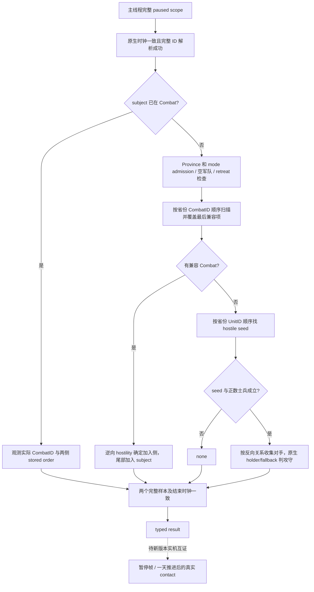

# CK3 1.20.0.2 路线与接触查询迁移

状态：F21 当前省份 `in_combat` actual-contact 分支已为 `fixture-live`，其他 create-new/join-existing 分支按实际 artifact 分别验收。本工作包只读取冻结文件、保存的实机 artifact、编译离线代码和准备文件；由协调者独占已授权实机。旧版本的证据不会自动升级为新版本结论。

绑定对象是 `1.20.0.2 (Crozier)` / Steam build `25588574`，EXE SHA-256 为
`AE1BA6FF060BA603842F6F4A2DED0AF4B7D3666B3DD271F75FB01B0DA8E81B2D`。
机器可读 ABI 在 [ck3_1_20_0_2_routes.json](../../ck3_autonomous_player/native_bridge/research/ck3_1_20_0_2_routes.json)。

原生决策输入与旧版证据分别见 [army-contact-resolution.md](army-contact-resolution.md)、[actual-contact-scope.md](actual-contact-scope.md) 和 [player-counterpolicy.md](player-counterpolicy.md)。本包迁移查询和 ABI，不改变自动玩家策略。

F21 `battle-r3-initial-hold-evidence.json` 已实证 subject `16777588` 位于 `2619` 时，current-province 查询为 `in_combat/post_contact_observation`、CombatID `234881048`，原生 A/D 顺序 `[50331775]/[16777588]` 与独立 battle control 和 transition 一致；相关实际检查见 [战中迁移专题](ck3-1.20.0.2-battle-migration.md)。本场未采 seed 后首次推进前的 create-new 预演，不补写该分支已验。

F22 的 [full-side 证据](../../artifacts/migrations/2026-09-30/post-update-1.20.0.2/live-1.20.0.2/attempt-22/battle-r3-full-side-evidence.json) 保存了两次路线预览：`full-side-preview-2618` 因目标未在当帧发布的 `action_steps` 中，被 Python `_execute_primitive_step` 在发送原生命令之前拒绝；错误文字虽然为 `native DLL does not implement gameplay step`，此处属于 harness 目标选择 RED。clean `production-source-97883fd` 与当前 `_action_steps` 均从敌军当前位置、玩家已有移动目标、对手默认集结点及战争目标展开可选终点，这段 move/preview 循环没有 `in_combat` 过滤。随后 `full-side-preview-published-2609` 在同一日期 `53169960`、CombatID `251658264`、subject `33554804`、side `1/full_side` 下返回 `available/action_ready=true`，原生路线为 `[2618,2615,2609]`，source revision 为 `59`。战中预览本身已通过；路线中间经过 `2618` 不代表它已被发布为可选终点。保留原目标选择合同及失败 attempt，无需修改 Python、C++ 或扩大目标规则。

## 已落地的行为

F22 owner-subset 场还实证了非空承诺路径的 terminal subject 读取：Combat `318767116` 的 player CUnit `50331766` 在 date `53170440` 下单后，actual snapshot 与独立 terminal query 一致返回 target `2609`、route `[2618,2615,2609]`、backlink/active-C null、not blocked。原 Combat 留下另一 owner 的 `117440793` 与敌方 `83886164`，说明目标读取与同省仍活跃的其他战斗成员没有混淆。证据为 `attempt-22/battle-r3-owner-subset-assessment.json`，SHA `66A9A8C510EC6D03F9C4BE2304AD14BEB552D788C199EC9B343F678E835EA650`；三场统一索引 `battle-r3-summary.json` SHA `EF82DEC796C6CD1E81072CD19F31790BBECD89F023A54C29AF1248FB5382BE84`。create-new/join-existing 的预接触分支没有因这份 in-combat/retreat 观测被升级为 live。

`RouteBindings` 和两个 reader 已独立落地到 `ck3_12002_routes.hpp/.cpp`：

- `ReadRouteContactHorizon(bindings, paused_scope, request, result)` 投影当前承诺路径或尚未提交的目标路径，保留已锁定的第一段行军进度，返回逐省份的原生到达日期与一天内的同省份、反向边接触区间。
- `ReadActualContactScope(bindings, paused_scope, request, result)` 完整覆盖没有接触、建立新战斗、加入已有战斗与已经在战斗中的观测路径。它保留原生数组顺序，并选择扫描中最后一个兼容的 CombatID。
- actual contact 的公开合同是 `production_exact_current_province`：请求 `target_province_id` 必须等于所选军队当帧 `current_province_id`，native reader 明确以 `subject_not_at_target` 拒绝未来省份。route horizon 可以预演未来目标；两种查询的 province 参数不能共用移动终点。`create_new/join_existing` 是当前省份此刻的预演，`in_combat` 与 `post_contact_observation` 才是实际已接触。
- 每个 reader 要求调用者提供同一应用主线程上的完整暂停快照；内部对照原生时钟和两个完整样本。bridge 仍负责快照 revision 及查询前后的完整 scope 一致性验证。
- `ReadCommittedRouteTimeline` 复用同一原生路径计时实现，给增援查询提供已经承诺路径的 ETA。空路径返回空数组；非空路径要求省份与到达日期逐项对齐，外层 battle reader 对照实际 stored route 和完整帧。
- 路线预览只构建临时路径并执行原生非删除析构，不提交命令；接触查询只镜像分支和调用只读关系判定，不调用接触、参战、战斗创建或军队修改函数。

## 新版本静态 ABI

| 内容 | 1.20.0.2 RVA 或布局 | 原生证据 |
|---|---|---|
| 接触解析器，仅读分支镜像 | `0x2479180` | 新省份数组、角色关系方向、最后兼容战斗选择、士兵汇总 |
| 对手集合与攻守方解析器，仅读分支镜像 | `0x247A330` | 对手逆向 hostility、城堡占领者与 fallback |
| hostility / 空军队 / 已在战斗 | `0x2C09640` / `0x24E83C0` / `0x24E8360` | 接触解析器调用点及独立函数体 |
| 省份 holder / 城堡攻守判定 / fallback | `0x247D030` / `0x2C09810` / `0x2C164E0` | holder 返回值与建立战斗调用点 |
| 陆地 / 海上 / 当前边速度 | `0x24AA940` / `0x24AAC00` / `0x24AB5C0` | 完整路线与单边计时调用链 |
| 路线 / 单边时间 | `0x24AADA0` / `0x24AB060` | 原生 Q100000 时长与累计进度扣除 |
| 原生精确边计时 | `0x2649320` | medium 与 speed 分支；非法除数返回值必须排除 |
| MovePath constructor / path context / route builder | `0xD1A0B0` / `0x2648060` / `0x2648150` | 新军令计划 `0x24ABBE0` 与其调用链 |
| MoveCommand 非删除析构 | `0x2969620` | path `+0x38`，command 大小 `0x168`，path 大小 `0x130` |
| 已锁定边的 origin 选择 | 新计划 `0x24ABC07..0x24ABD10` 中内联 | progress `0x24AB2F0`、front `0x24AA7D0`、tail `0x24AA820`、阈值 `0x5C699E8` |
| public CUnit / internal CArmy / CArmyRegiment storage | `0x5D1E380` / `0x5D1DE48` / `0x5D1F340` | 完整 generation-bearing ID 查找，stride `0x10` |
| Combat / BattleResult / contact mode globals | `0x5D1DE70` / `0x5D1FFE0` / `0x5CB87F8` | 接触扫描与 entry gate 的 RIP-relative load |
| Province 指针数组 | GameData `+0x140`，count `+0x14C` | `0x24AAED3` 及 move origin 调用链 |
| MapNode adjacency | data `+0x50`，count `+0x5C`，stride `0x30`，target ID `+0x04`，kind `+0x00` | 完整路线与单边计时原生查询 |

必须处理的布局变化：

| 字段 | 旧布局 | 新布局 |
|---|---|---|
| Province UnitID data/count | `+0x748/+0x754` | `+0x740/+0x74C` |
| Province CombatID data/count | `+0x760/+0x76C` | `+0x758/+0x764` |
| Province fort / occupation holder | `+0x858/+0x744` | `+0x850/+0x73C` |
| Province identity magic | `+0x864` | `+0x85C == 0x50726F76` |
| CArmyRegiment identity | 旧 `+0x08` subobject 的第二虚函数 | 新原生代码直接检查 `+0x14 == 0x41725267` 与完整 ID `+0x10` |
| ResolveMoveOrigin | 旧可调用 `0x2248260` | 新原生计划内联；本包实现对应的本地分支镜像 |

CombatSide 的 army data/count `+0x10/+0x1C`、primary character `+0x70`、Combat backlink `+0xB8` 继续存在；backlink 由新 side constructor `0x264CA60` 互证。Combat attacker/defender side 仍在 `+0x20/+0x368`。

暂停状态使用 Jomini `+0x20` 的真实暂停字节；`+0x24` 的 tick cache 不作为暂停条件。离线夹具明确覆盖 `+0x20 == 0`、`+0x24 == 1` 时不能把查询当成 paused 的分支。`0x5D1F340` storage 内的 ArRg 对象原生类型是 `CArmyRegiment`，不是另外的 `CRegiment`；这项名称纠正不改变 magic、完整 ID、type `+0x18` 或 ArmyID `+0x140` 的原生字段语义。



## 离线验证与交接

EXE verifier 已通过 **23 个唯一签名、2 个 vtable prefix、63 个精确指令检查**：

```powershell
py -3.13 ck3_autonomous_player/native_bridge/research/verify_ck3_12002_migration.py --exe artifacts/migrations/2026-09-30/post-update-1.20.0.2/installation/binaries/ck3.exe --module routes
```

`ck3_12002_routes_test.cpp` 经 MSVC `/std:c++20 /W4 /WX` 编译和合成对象测试为 GREEN：时长四舍五入、非法时长 sentinel、已承诺路线不重跑 A*、反向边冲突、锁定首边后绕行、hostile scope、clock drift、完整 generation ID、旧 Province 偏移干扰、无虚表 Regiment、create/join/post-contact 与 last-compatible 顺序均有覆盖。日志与结果位于 `artifacts/migrations/2026-09-30/post-update-1.20.0.2/routes-offline/`。

第一次夹具尝试为 harness RED：mock MovePath 错把第一条 ProvinceInfo 指针写成数组指针，退出码 `0xC0000005`。修正 mock 写入数组地址后通过；这不属于游戏能力 RED。

中央 CMake 需要加入 `src/ck3_12002_routes.cpp`，并为 `ck3_12002_routes_test.cpp` 添加独立离线 executable/test。桥接使用当前 adapter 的完整 `game::Snapshot`，不得把 core prefix 的缺省空战争数组当成完整 scope。

剩余内容必须经过新版本实机：当前存档的 paused scope/revision、陆海混合与已锁定边计时、预接触结果与下一次原生真实 contact/CombatID/两侧成员互证。此前 readiness 保持 `static-ready`。
