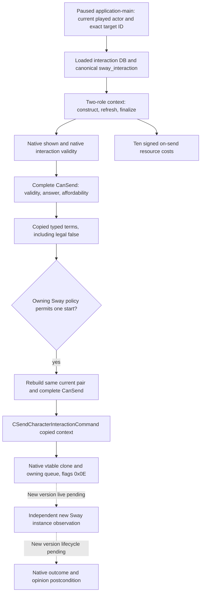

# CK3 1.20.0.2 Sway: complete CanSend and typed command

This package migrates only `sway_interaction` on CK3 **1.20.0.2 Crozier / Steam25588574**, executable SHA-256 `AE1BA6FF060BA603842F6F4A2DED0AF4B7D3666B3DD271F75FB01B0DA8E81B2D` (101039736 bytes). Evidence comes from the frozen executable and its adjacent stock `00_scheme_interactions.txt`. No CK3 process, pipe, desktop, Steam, or live snapshot is accessed.

## Native tree before implementation

The stock interaction resolves `puppet_or_actor`, requires a distinct recipient, evaluates `can_start_scheme = { type = sway target_character = scope:recipient }` and the landless range condition, and auto-accepts. Its accepted effect calls `begin_scheme_basic_effect`; a queued command is therefore not proof of a created instance or a completed Sway cycle. AI target/weight branches remain reference data; this provider acts only for the currently played character. It does not reproduce AI weighting or expand religion research.



## Frozen ABI

| Entry or field | New-build evidence |
| --- | --- |
| Database getter / singleton | `0x89DA60` / `0x5C67538` |
| Loaded enumeration | `0x108CCDB` getter, `0x108CCE9` rows **+0x50**, `0x108CCED` count **+0x5C**; the old +0x68/+0x74 offsets do not apply |
| Definition identity | Constructor `0x31449A0`: ordinal +0x10, hash +0x14, MSVC string +0x18, GDbO +0x38 |
| Definition vtables | primary `0x48C2218`, secondary `0x48C2228` at subobject **+0x2750** |
| Two-role constructor | `0x3076C90`, six Win64 arguments; +0x2D8 actor, +0x2DC recipient, +0x2E0/+0x2E4 secondary roles, +0x2E8 intermediary, +0x2EC added role |
| Refresh / finalize / destroy | `0x3078A60` / `0x3078C90` / `0x30773A0`, reused from the new ContextBindings |
| Shown / interaction validity | `0x30796B0` / `0x307AB70` |
| Complete CanSend | `0x307C040`; native calls `0x307AB70`, `0x307BC80` answer, `0x310B3B0` affordability |
| Ten cost evaluation | `0x310CEE0` on definition +0x40 / context +0x08, Q100000 signed values |
| Send command | `0x2968170`, size 0x368, source context copied to +0x20, primary/secondary vtables `0x448BCE0` / `0x448BCB0` |
| Owning queue | Existing new-build `SubmitCommandCopy`: primary vtable +0x40 native clone, embedded manager `0x5CC1240`, queue `0x37F06F0` |

The runtime definition resolver scans the actual new-build loaded collection by canonical key. It returns only one `sway_interaction` definition with the native object marker and both vtables. No old loaded-lookup RVA or cached definition pointer is reused.

The historical typed precondition's `can_start_scheme` fields retain their **bundled complete CanSend projection**: they are not an independently sampled CanStartScheme denial or native reason. Shown and interaction validity are independently called; a complete false remains available with `native_complete_validator_rejected`. Success/max-success/secrecy previews retain the existing explicit-unavailable status; this command package does not claim to have migrated preview arithmetic.

## Implementation and qualification

Production interface: `BindSwayCommandImage`, `ReadSwayCommandTermsV1`, `SubmitSwayCommandV1` in `ck3_12002_sway_command.hpp/.cpp`. Terms carry the existing private typed precondition and all ten signed costs. Submission accepts only the existing typed `ActiveSchemeSemanticActionV1PrivateCommand` for `sway_interaction` / `sway`, no starter options, current player actor and character target. It re-evaluates the final native terms, verifies both source and copied context identities, and delegates the owning clone/queue to the existing 1.20 command implementation. Caller-owned source and copied contexts are destroyed after synchronous submit. Pending/receipt and formal policy remain owned by the existing consumer.

Qualification: the independent command provider is **static-ready**. `verify_ck3_sway_command_12002.py` passed **14 unique functions / 40 decoded instructions / 4 vtable prefixes / 13 production constants**, including new definition identity, context roles, complete validation, copied context and the owning queue. ABI fixture is `native_bridge/research/ck3_sway_command_12002_abi.json`; the verification result is `Z:/ck3_mod_rewrite/artifacts/g2-offline-2026-10-01/sway/command/abi-result.json`.

The MSVC `/O2 /W4` fixture compiles the actual new Sway provider together with `ck3_12002.cpp`, `ck3_12002_context.cpp` and `ck3_12002_commands.cpp`. It verifies observable CanSend false and signed costs, positive source frame/pair, exact native bindings, one owning clone/queue call, caller-context cleanup, queue rejection, copied roles, current-player identity, actual generation and frame changes, uniquely resolved loaded definition, and independently sampled shown false. Source/test pins and the executable SHA are in `Z:/ck3_mod_rewrite/artifacts/g2-offline-2026-10-01/sway/command/fixture-final/result.json`; this is a production-path offline fixture, not CTest or paused/live evidence. The original fixture attempt is preserved at `.../command/fixture/`: it incorrectly stored the 16-byte canonical key as a 15-byte inline MSVC string, and failed before native context construction. The fixture was corrected to a pointer/capacity-31 string; production provider behavior did not change.

Reproduce the package using the project's Python environment:

```text
tools\.venv\Scripts\python.exe ck3_autonomous_player\native_bridge\research\verify_ck3_sway_command_12002.py --exe artifacts\migrations\2026-09-30\post-update-1.20.0.2\installation\binaries\ck3.exe --output artifacts\g2-offline-2026-10-01\sway\command\abi-result.json
tools\.venv\Scripts\python.exe ck3_autonomous_player\native_bridge\research\run_ck3_12002_sway_command_tests.py --output-dir artifacts\g2-offline-2026-10-01\sway\command\fixture-recheck
```

Shared bridge/mailbox/CMake/Python integration is coordinated separately. Required new-build live work remains a paused native term sample, one policy-approved legal start, independent new Sway instance readback, and the owning pending/next-turn/checkpoint/cold sequence. A completed Sway cycle additionally requires the native success/failure event and target-opinion postcondition; no command ACK grants that result.
