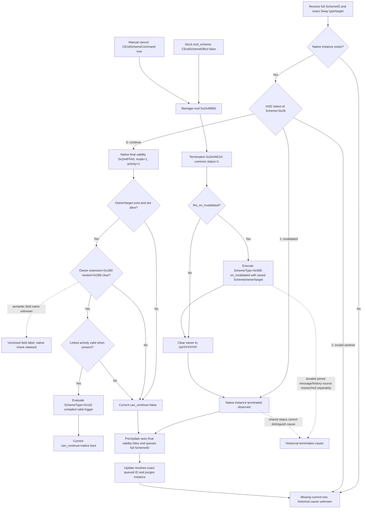

# Sway terminal status and current validity — CK3 1.20.0.2

The source ABI is `static-ready`; this package has no live claim. It closes two
native observations: an exact joined instance's current `status`, and the final
validity result used by the native manager before removal. A `status` of `1`
proves that the native instance has entered termination. The native key is
`invalidated`, but manual cancellation and normal scripted ending both write
that same value. Their durable cause is not established by this field.

The frozen input is `1.20.0.2`, EXE SHA-256
`AE1BA6FF060BA603842F6F4A2DED0AF4B7D3666B3DD271F75FB01B0DA8E81B2D`,
size `101039736`. The frozen installation is
`Z:\ck3_mod_rewrite\artifacts\migrations\2026-09-30\post-update-1.20.0.2\installation`.
This work reads files only. It reuses [active state](ck3-1.20.0.2-sway-state.md),
[phase/material outcome](ck3-1.20.0.2-sway-outcome.md), and
[command](ck3-1.20.0.2-sway-command.md) contracts.

The authoritative [ABI JSON](../../ck3_autonomous_player/native_bridge/research/sway_completion12002_cancel_abi.json)
contains 21 bounded native spans, 101 reviewed instruction anchors, seven
tables, five token registry joins, RTTI/vtable bindings, and the query contract.
The [offline verifier](../../ck3_autonomous_player/native_bridge/research/sway_completion12002_cancel_verify.py)
passed 170 checks against the frozen EXE. Evidence is
`Z:\ck3_mod_rewrite\artifacts\g2-offline-2026-10-01\sway\completion-cancel\source-native-verification.json`.
The [Mermaid source](../../ck3_autonomous_player/native_bridge/research/sway_completion12002_cancel_tree.mmd)
and [machine-readable tree](../../ck3_autonomous_player/native_bridge/research/sway_completion12002_cancel_tree.json)
carry the same boundary.

`CActiveScheme+0x28` is a signed 32-bit `status`. Constructor `0x2A48F40`
initializes it to zero. Serializer `0x2A491F0` reads it with `movsxd`; token
`0xD0` is the native property `status`. The two-entry token table at `0x4779528`
maps `0` to `continue` (`0x2D1F`) and `1` to `invalidated` (`0x2F8D`). Value `2`
uses the native `invalid` sentinel (`0x4FC`); deserializer `0x2A49B50` writes
that value when no enum key matches. It is not a terminal outcome.

| Source | Exact RVA or layout | Native meaning |
| --- | --- | --- |
| Current SchemeID/type/target | Scheme `+0x10`, `+0x20`, `+0x30/+0x34` | Reuse existing full-generation ID resolver and Sway type join |
| Current status | Scheme `+0x28`, `int32_t` | `continue=0`, shared terminal `invalidated=1`, `invalid=2` |
| Observed owner | Scheme `+0x2C`, `uint32_t` | Termination clears it to `0xFFFFFFFF` |
| Final current validity | `0x2A4FFA0` | `bool __fastcall(const CActiveScheme*, int32_t mode, int32_t validate_linked_activity)` |
| Common termination | `0x2A4AE10` | Writes status `1`; `DL` only controls `on_invalidated` callback |
| Callback effect/context | Type `+0x588`; `0x2A51800` | Scheme scope kind `9`, raw full SchemeID payload at token `+8`, owner and target prepared before clearing |
| Removal queue | PreUpdate `0x2A46FA0`, Update `0x2A47790` | Queue pointer `+0x2558`, signed count `+0x2564`, relative to these functions' receiver |
| Actual purge | `0x2A48B30`, continuation `0x2A48CC6` | Destructor, zero `0x358` bytes, invalidate ID, clear slot pointer |

For current validity, pass `RCX=exact Scheme*`, `EDX=1`, `R8D=1`, and read the
boolean from `AL`. These are the arguments at both native PreUpdate call sites
(`0x2A472FE`, `0x2A476AE`). `EDX` is an integer mode, not a reason/output pointer.
Mode `1` evaluates `SchemeType+0x110` with an actor/target context through
`0x372DF30`; other modes skip that compiled validity trigger. `R8D==1`
additionally verifies a linked activity at Scheme `+0x3C` when present. The
function first rejects status `1`, missing/dead owner or target, and a native
owner-extension gate whose semantic field name remains unclosed.

This is an evaluator: it constructs and destroys local trigger context and
reads native state, identities, activity and compiled trigger results. Its
reviewed body does not enqueue commands, end a scheme or purge it. A bridge can
call it in a main-thread paused snapshot after exact ID/type/target resolution
to expose `current.can_continue` as a native final result. `false` is a current
fact, not the historical reason that ended an earlier instance. Individual
reason/output metadata is not provided by this function.

Manual cancellation originates at `CCancelSchemeConfirmation` primary vtable
`0x45551C0`. Slot `7` (`0x13D53F0`) resolves popup full SchemeID `+0x130`; slot
`9` (`0x13D5450`) constructs and queues `CEndSchemeCommand`. Its secondary slot
`1` (`0x299C340`) passes `R8B=1` to manager end `0x2A48680`. By contrast,
`end_scheme` registration `0x5CEBD0` creates the false effect entry; its builder
`0x2D10D90` selects `CEndSchemeEffect<false>` vtable `0x48521B0`, whose slot
`24` (`0x2D11B50`) passes `R8D=0` to the same manager end function. Both reach
the common status `1` store. The true effect family (`0x2D11AF0`) also uses
this store. Native command ACK alone does not establish termination.

The type parser joins native key `on_invalidated` (`0x2A98`) to the compiled
effect at primary type `+0x588`: secondary RTTI offset `0xA60`, parser field
`-0x4D8`. Termination runs that callback only with its boolean true. Stock
`sway_scheme.txt` can send target-dead, existing at-war, and out-of-range toasts.
Those authored predicates explain the callback; evaluating them later does
not establish which reason actually occurred. This reads an existing Sway
branch and does not expand war research. A durable message/history source
must independently prove retained full SchemeID and actual notification key.

The terminated allocation keeps its full ID, target and type until purge;
owner is cleared. A query must expose observed owner separately and join any
previous/request actor through retained evidence rather than label it the
instance's current owner. PreUpdate checks native final validity and appends
the full ID on `false`; Update resolves that exact ID and calls purge. The
status serializer exists, but a fixed number of days, a guaranteed next-frame
window, and cold-load terminal retention are not proven. Purge has no archive
copy in the reviewed path. Therefore a missing row remains a missing current
row, never inferred `cancelled`, `completed` or `invalidated`.

The next delivery is the lifecycle provider's paused fixture for direct full
ID/type/target queries, including owner-cleared status `1`, followed by the
current native validity query. Joined native notification/history evidence is
a separate input for specific completion or cancellation causes. This source
package does not claim a whole Sway OODA loop, durable cancellation receipt,
or live implementation acceptance.
