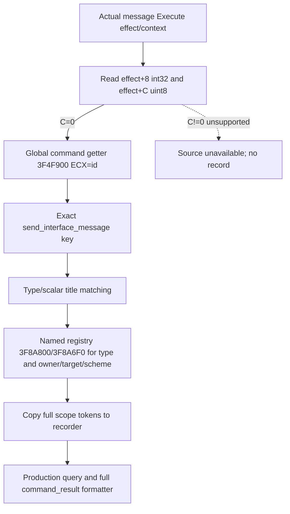

# CK3 1.20.0.2 Sway 隐藏阶段命令 ID 域修复

状态：`static-ready`；后台源修复与 production-path fixture，不含 paused-live 验收。
冻结 EXE SHA-256：`AE1BA6FF060BA603842F6F4A2DED0AF4B7D3666B3DD271F75FB01B0DA8E81B2D`。

生产读取原先把 message Effect `+8` 的 stock command ID 交给 named scope registry。这两张表使用不同 ID 域；同一个整数不能据此得到正确命令名称，会使真实 `send_interface_message` 入口丢失隐藏阶段记录。

原生 `3766370` 在 `37663A5` 按 Effect `+C:uint8` 分流。`+C==0` 时，将 `+8:int32` 作为 ECX 传给 `3F4F900`，返回 MSVC string32 指针；`size+10`、`capacity+18`，capacity<16 使用 inline 字符，否则读 `+0` 字符指针。正式证据复用 [invalidation context ABI 的 stock_command_key](../../research/sway_completion12002_invalidation_context_abi.json) 和 [对应原生专题](ck3-1.20.0.2-sway-completion-invalidation-context.md)，无需重复扫描或重新验旧 ABI。

`SwayExecutionBindings12002.get_global_command_key` 使用独立 typed callback，并由 exact-build binder 绑定 `image_base+3F4F900`。命名作用域和未解析 authored message type 继续使用原 registry。非0 command domain 在本 stock reader 中返回 `sway_execution_dynamic_command_identifier_unsupported`；缺 global getter 返回真实 source unavailable，不回退错域。现有 query schema、四个 transport 接口和 observer installer 保持不变。

独立增量夹具 [command_domain_test.cpp](../../ck3_autonomous_player/native_bridge/src/ck3_12002_sway_completion_execution_command_domain_test.cpp) 把同一个 command ID 在 global 表映射为 `send_interface_message`，在 named 表映射为另一名称，并令 named type/owner ID 的 global 名称也不同。实际生产 Capture 读取夹具拥有的原生布局内存，复制记录后通过 Recorder.Query 和现有 full command_result formatter 输出 good、unresolved-type bad、unsupported 无新增记录三条 wire。callback trace 验证命令仅走 global getter、type/三个 named scopes 走 named resolver；非0 domain、缺 callback 和 global 命令不匹配均不错误分类。

运行器 [run_sway_completion12002_execution_command_domain_fixture.py](../../ck3_autonomous_player/native_bridge/research/run_sway_completion12002_execution_command_domain_fixture.py) 只编译这次必要增量，`/Od`、`/O2` 均使用 `/W4 /WX` 与实际 MSVC string32 布局。证据输出 `artifacts/g2-offline-2026-10-01/sway/completion-command-domain/attempt-001/result.json`；旧17文件 receipt、旧196检查、transport/installer/named queue 矩阵未重跑、未覆盖。两个旧 fixture constructor 仅补独立 typed global getter 赋值，以适配新增生产输入接口；其原矩阵没有重复执行，installer 源未修改。本夹具 attachment 为输入，未安装游戏入口或占用 CK3，实际 owning mailbox/queue 不在本增量范围。原生 source receipt 仍不等于消息入队、意见 material、终态或完整 OODA；这些分别依赖已有独立观测与后续真实 paused-live。
