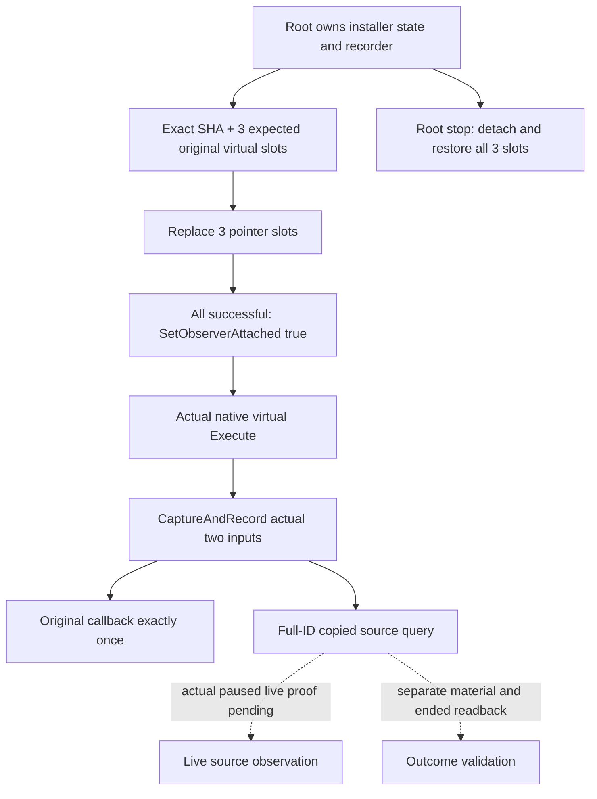

# Sway execution-source observer installation — CK3 1.20.0.2

This domain component installs a read-only source observer in the three exact
native message-effect virtual slots, captures actual executing input, and
calls each original function once with the same two pointer arguments.
The [source contract](ck3-1.20.0.2-sway-completion-history.md) is frozen and is
not changed by this package. Shared bridge startup/stop wiring and actual CK3
installation belong to the root coordinator.

The complete native ABI is `void (*)(const void* effect, const void* context)`
using Windows x64 convention. Native dispatcher `0x3765E70` loads the effect
vtable at `0x3766156`, sets `RDX` to its local EffectContext at `0x3766159`, sets
`RCX` to the effect at `0x376615D`, and calls `[vtable+0xB0]` at `0x3766160`.
It immediately jumps to independent profiling/cleanup and does not consume a
return value. The already-frozen three complete Execute bodies consume only
incoming RCX/RDX; uses of R8/R9 are preceded by local definitions, and stack
reads belong to their local frame/home area and saved registers. There are no
additional incoming parameters or defined return outputs to preserve.

The independent
`native_bridge/research/ck3_sway_completion12002_execution_install_abi.json`
pins this proof to EXE SHA
`AE1BA6FF060BA603842F6F4A2DED0AF4B7D3666B3DD271F75FB01B0DA8E81B2D`
and the bounded dispatcher receipt. Existing complete-function source proof
is reused. No generic code detour or new calling convention is introduced.

Root integration uses persistent members
`SwayExecutionRecorder12002 recorder;`
`SwayCompletionExecutionInstall12002 installer;`, then calls
`InstallSwayCompletionExecution12002(image_base, verified_sha, recorder, installer)`
at the selected observer's startup. Query the same recorder through the
existing owner-thread mailbox. Stop calls
`UninstallSwayCompletionExecution12002(installer)` before teardown. The root's
existing pinned-DLL/state lifetime applies; neither pointer may refer to a
temporary query stack object.

Production slots and original functions are image-base plus these RVAs:

| Vtable slot RVA | Expected original Execute RVA |
| --- | --- |
| `0x4837330` | `0x2CC9440` |
| `0x48374D8` | `0x2CC8490` |
| `0x4837410` | `0x2CC71A0` |

Only these pointer slots change. The helper restores their original page
protection, restores all original pointers on stop, and detaches recorder
availability. Ignored or unavailable captures still forward the native call.
The attachment flag becomes true only after all three actual slot writes
succeed. A failed installation does not grant observation availability.

The explicit fixture API accepts fixture-owned readonly pointer slots and
typed original callbacks. It is separate from production binding; no whole
game image is fabricated or mapped. The fixture invokes installed slots,
verifies actual capture precedes the typed original once, queries hidden
success/failure receipts, verifies passthrough for other commands, and
restores exact pointers and readonly protection. It links the actual decoder,
recorder, serializer and installation helper. The earlier capture/recorder
fixture is reused rather than rerun.

Run `native_bridge/research/run_sway_completion12002_execution_install_fixture.py`
with `--output-dir` pointing to the external artifact directory. It compiles
and runs `/Od` and `/O2`, `/W4 /WX`, release MSVC string layout. Compile/run
logs, serializer wires, and source hashes stay in
`artifacts/g2-offline-2026-10-01/sway/completion-execution-install/`.

Status: **static-ready / fixture GREEN**. `/Od` and `/O2` each pass 26 checks
with `/W4 /WX`; compile/run logs and actual recorder wires are in the artifact
directory above. Installed fixture slots are restored exactly, including
their readonly page protection. The existing 196-check capture fixture is
not rerun. Actual CK3 installation and paused live proof remain pending.
No CK3,
game process, Steam, UI, shared bridge, CMake or Git operation is performed by
this package. Input execution receipts remain separate from enqueue,
material effects, terminal state and pre-attachment history.
