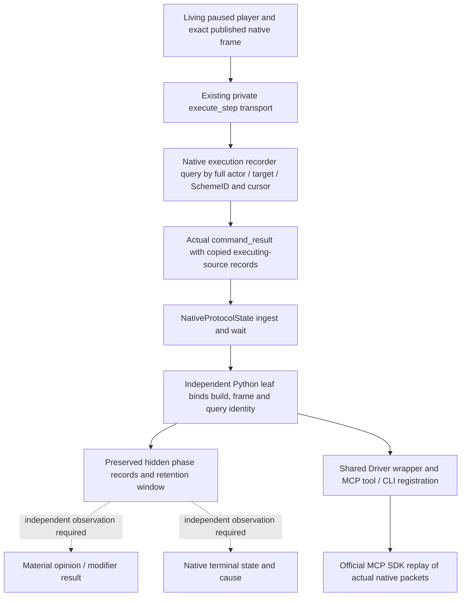

# Readonly Sway executing-source Python query — CK3 1.20.0.2

The independent Python leaf reads copied records of the ordinary hidden Sway
success/failure source branch for an exact actor, target and full SchemeID.
It preserves the production C++ facts after the original execution context has
gone. A success/failure **phase result** identifies the executing source;
it does not prove opinion/modifier effects, message delivery, a completed scheme,
or a terminal cause.

The native input is the frozen eleven-file
[execution-source provider](ck3-1.20.0.2-sway-completion-execution.md), for CK3
`1.20.0.2`, executable SHA-256
`AE1BA6FF060BA603842F6F4A2DED0AF4B7D3666B3DD271F75FB01B0DA8E81B2D`.
The existing 35/37-field completion endpoint and its fixtures remain unchanged.



The leaf is
[`active_scheme_sway_completion_execution_private_transport.py`](../../ck3_autonomous_player/src/xar_autoplayer/bridge/active_scheme_sway_completion_execution_private_transport.py).
Its API is:

```python
query_active_scheme_sway_completion_execution_private_v1(
    driver,
    *,
    expected_revision: int,
    target_character_id: int,
    scheme_instance_id: int,
    after_sequence: int = 0,
    timeout_seconds: float = 30.0,
) -> dict[str, object]
```

`allow_private_active_scheme_sway_completion_execution_query` must be explicitly
true. The current played actor is read from the snapshot. Actor and target are
positive int32 identities, and target must differ from actor. SchemeID preserves
all 32 bits, including its generation; the invalid `0xffffffff` sentinel is
excluded. The cursor is uint64, and zero is a valid first query. The public
`expected_revision` binds the Python snapshot; the existing transport sends that
snapshot's `native_revision` as native `expected_revision` and
`expected_snapshot_revision`.

The actual request selector is `query-sway-completion-execution-v1-private`.
Its response body is `result.sway_completion_execution`, with schema
`xar.ck3.sway-completion-execution.v1`. Native build/version/SHA, query revision
and query date are in the enclosing result. The leaf checks those against the
paused native snapshot and returns them along with `exact_ck3_build`,
`exe_sha256`, `queried_snapshot_id`, `queried_revision` and
`queried_native_revision`.

The record's `date_raw` is the historical execution date; it is preserved and
need not equal the later paused query date. `earliest_sequence` and
`latest_sequence` describe the recorder's session-wide retention window, while
`records` is filtered by full actor/target/SchemeID and `after_sequence`.
`retention_gap` is preserved. The 128-record session does not provide durable
cold history. An attached observer with no matching record returns an available
empty list; that list supplies no outcome or terminal cause. An unattached
observer remains unavailable with its native reason.

| Source branch | Original stock event | Phase result |
| --- | --- | --- |
| `hidden_phase_success_source` | `sway_outcome.0001` | `success` |
| `hidden_phase_failure_source` | `sway_outcome.0002` | `failure` |

Every published record retains `executing_input_observed=true` and
`exact_scope_join_ready=true`. `message_enqueue_observed`,
`material_effect_observed` and `native_terminal_state_observed` remain false.
The leaf copies the records instead of retaining mutable nested packet objects.
It adds no synthetic terminal or causal inference.

The frozen native manifest initially misspelled only `endpoint.body_schema`
with underscores. The native owner corrected the metadata to the actual
serializer's hyphenated schema, changing manifest SHA-256 from
`01af5905c79271fe7ef727bd3ad07048134fbc804726546e5f5e55964b8036e4` to
`b368e9e75127945bf91b637882afaa6236a44b6dbe6d92bd6005b818f95119b9`.
The eleven source pins, native receipts and wire bytes did not change; no
native tests were repeated for that correction.

The tracked
[fixture provenance](../../ck3_autonomous_player/native_bridge/research/fixtures/ck3_12002_sway_completion_execution/provenance.json)
records that manifest, eleven native source pins and exact origin paths/hashes.
Three complete production `command_result` packets and eight bare production
bodies are copied byte for byte. Full packets cover unattached, hidden success
and another generation; bare bodies additionally cover hidden failure,
detachment, cursor filtering and the bounded retention window. Test paused
hello/snapshot context is fixture scaffolding. Replay changes only parsed
`request_id` for correlation; no `result` field or archived byte is rewritten.

The new
[focused leaf tests](../../ck3_autonomous_player/tests/unit/test_ck3_12002_sway_completion_execution_wire.py)
passed once: **4 tests**, including all three full packets through production
`NativeProtocolState.ingest` → `wait_for_command_result` → production leaf.
The eight bare bodies preserve both branches and the sequence window. Receipt:
`Z:/ck3_mod_rewrite/artifacts/g2-offline-2026-10-01/python-sway-execution-next/leaf-result.json`;
log: `leaf-tests.log` in the same directory. Existing completion matrices and
native tests were not rerun.

The
[official SDK case](../../ck3_autonomous_player/tests/unit/test_ck3_12002_sway_completion_execution_sdk.py)
also passed once: **1 test** after the coordinator released the shared route.
The actual three native packets run through real `NativeProtocolState` ingest
and wait, `NativeHeadlessGameplayDriver.query_active_scheme_sway_completion_execution_private_v1`,
the production MCP server and official `mcp.Client`. It verifies the tool is
absent while disabled, the CLI defaults to false and enables with
`--private-active-scheme-sway-completion-execution-query`, and the enabled tool
has a read-only annotation. Native result fields remain unchanged. Receipt:
`Z:/ck3_mod_rewrite/artifacts/g2-offline-2026-10-01/python-sway-execution-next/sdk-result.json`;
log: `sdk-tests.log` in the same directory. The four leaf tests and prior
35/37-field matrices were not repeated after SDK registration.

The readonly Python route is now **static-ready**, with actual native output
replay through the shared Driver/MCP SDK. No CK3 process, real pipe, UI, Steam
or game state was touched. Installed native observation, a natural hidden
branch sample, material readback, terminal evidence and a complete OODA remain
separate root-owned work.
