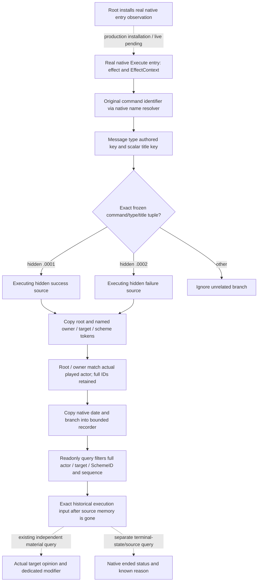

# Hidden Sway execution-source capture — CK3 1.20.0.2

This package reads the actual inputs of a native message-effect execution and
copies a record for a later exact-instance query. It covers the ordinary hidden
Sway success and failure branches, which the current event-window reader cannot
see. A record identifies the hidden branch that is **executing**. Message enqueue,
opinion/modifier material effects and native instance ending are separate
observations.

Exact build: CK3 1.20.0.2 Crozier, executable SHA-256
`AE1BA6FF060BA603842F6F4A2DED0AF4B7D3666B3DD271F75FB01B0DA8E81B2D`.
The implementation input is the frozen
[history/source ABI](../../research/sway_completion12002_history_abi.json) and
[history tree](ck3-1.20.0.2-sway-completion-history.md). The
[phase tree](ck3-1.20.0.2-sway-completion-phase.md) shows why success and failure
can repeat on the same SchemeID. The
[current terminal-state provider](ck3-1.20.0.2-sway-completion-provider.md) and
[material reader](ck3-1.20.0.2-sway-outcome.md) remain independent inputs.



## Actual copied-input reader

[`CaptureSwayCompletionExecution12002`](../../ck3_autonomous_player/native_bridge/include/xar_bridge/ck3_12002_sway_completion_execution.hpp)
accepts the original Windows x64 execution arguments: `RCX` is the effect
definition and `RDX` is `EffectContext*`. Root owns installation of the real
native entry observation at executors `0x2CC9440`, `0x2CC8490` and `0x2CC71A0`.
This domain package does not install a detour, register a synthetic callback,
send a game command, or modify shared worker dispatch.

The reader accepts only the three frozen effect primary vtables
`0x4837280`, `0x4837428`, `0x4837360`. It resolves the loaded `int32` command
identifier at effect `+0x08` by calling native `0x3F8A800()` and then
`0x3F8A6F0(table, identifier)`. The latter returns a native MSVC `std::string*`.
Its original key is copied directly; no localized UI text is used.

Message type state `+0x5C == 2` uses definition pointer `+0x50`, its `ObDG`
marker at `+0x38` and original key at `+0x18`. State `1` instead resolves the
original type identifier at effect `+0x58`. The title wrapper at `+0x60` must
have vtable `0x48BD0B0` and character scope type `4` at `+0x68`. Its object
pointer `+0x70` must identify the frozen scalar-localization vtable
`0x4929F08`; the **authored key** is the MSVC string at that object `+0x30`.
Structured localization expressions do not masquerade as the scalar title.

Only these two tuples are recognized:

| Command | Original type key | Original scalar title key | Source |
| --- | --- | --- | --- |
| `send_interface_message` | `sway_good_message` | `sway_sway_success_message` | `sway_outcome.0001` hidden success branch |
| `send_interface_message` | `sway_bad_message` | `sway_sway_failed_message` | `sway_outcome.0002` hidden failure branch |

Types, titles and command names are compared as complete keys. The type alone,
an icon, a rendered translation or a nearby title prefix is insufficient. This
first package does not implement the completion/invalidation toast tuples from
the broader research ledger.

The native pointer levels are explicit: context `+0x00` contains a pointer to
the root 16-byte generic token; context `+0x18` contains a pointer to the
environmental array object. That array has data pointer `+0`, capacity `+8`,
count `+0xC` and row stride `0x20`. Each row has an identifier at `+0` and
the complete token at `+8`. This layout differs from the event-window saved
scope layout and is not interchangeable with it.

The native resolver identifies rows named exactly `owner`, `target` and
`scheme`. The reader copies all 16 bytes of each token before returning from
the entry observation. Root and owner must be character tokens of type `4`
with the same full ID as the native played actor. Target must also be a
character token; scheme must be type `9`. Their low 32-bit payloads preserve
the **complete generation-bearing IDs**. A later query compares all 32 bits.
It never looks up the ended scheme to recover these original saved IDs.

Native Core supplies the date and actual played actor before and after the
copy. Natural branch execution may be unpaused; the reader does not require
an impossible paused simulation frame for the source callback. A missing
required named scope, duplicate required name or owner/root mismatch yields
no captured source record. Other actors and unrelated message branches are
ignored. Unavailable native reads retain a specific reason.

## Recorder and real query result

[`SwayExecutionRecorder12002`](../../ck3_autonomous_player/native_bridge/include/xar_bridge/ck3_12002_sway_completion_execution.hpp)
stores 128 copied records in order. Each accepted execution gets a monotonic
sequence, native date, exact actor, exact target, full SchemeID, source branch
and the copied raw tokens. Changes to native source memory after capture do not
change a record. Records contain no engine pointers.

Root must call `SetObserverAttached(true)` only after installing the real
observation entry. Merely constructing the recorder or compiling the provider
leaves its query unavailable. `CaptureAndRecordSwayCompletionExecution12002`
combines the actual memory reader with the recorder. Entry capture and query
must use the same native owner thread, as stated by the interface contract.

`Query` filters by full actor/target/SchemeID and `after_sequence`. An attached
observer with no matching record returns an observed empty list, without
inventing a result before attachment. `earliest_sequence`, `latest_sequence`
and `retention_gap` expose the bounded retention window. Records are only for
the current native observer session; this package does not persist or reconstruct
history across DLL/process shutdown or a cold load.

The production serializer returns `xar.ck3.sway-completion-execution.v1` JSON
that can be embedded directly into the existing private completion query.
Each actual record publishes `executing_input_observed=true`,
`exact_scope_join_ready=true`, its known hidden `phase_result`, original stock
event and native date. `message_enqueue_observed`, `material_effect_observed`
and `native_terminal_state_observed` stay false. Root can retain the record
while independently querying the pair's actual opinion/modifier after execution;
the record itself supplies no causal assertion about that measurement.

## Offline and live boundary

The actual-memory fixture passed in **MSVC `/Od` and `/O2`, both `/W4 /WX`**.
Each cell exercised 196 checks and emitted eight actual production JSON wires;
these are checks, not 196 independent game scenarios. It uses the production reader, recorder and serializer
with owned effect definitions, actual MSVC strings returned by typed identifier
callbacks, scalar localization objects, context pointers, environmental rows,
native player/date memory and copied tokens. It does not stub the capture
provider with prefilled records. Both modes use `/MD` and
`_ITERATOR_DEBUG_LEVEL=0`, preserving the game's 32-byte release MSVC string ABI.

The fixture covers resolved and unresolved type inputs, hidden good and bad
tuples, exact full-ID queries with another generation rejected, copied-token
retention after native input memory changes, unrelated actors/keys and missing
saved-scheme scope yielding no record, sequence filtering and the bounded
retention window. It exercises the real Core reader with an unpaused frame.
The eight wire files preserve true execution-input/scope-join flags and false
enqueue/material/terminal flags. The first and only fixture attempt is GREEN;
there is no failed fixture attempt to conceal.

Fixture runner:

```text
tools\.venv\Scripts\python.exe ck3_autonomous_player\native_bridge\research\run_sway_completion12002_execution_fixture.py --output-dir artifacts\g2-offline-2026-10-01\sway\completion-execution\final
```

The result is
`Z:/ck3_mod_rewrite/artifacts/g2-offline-2026-10-01/sway/completion-execution/attempt-0001/result.json`.
Source pins include the formal history ABI SHA-256
`BC14D09613E42A5FE40E0D123AB397D2593C5D43B938D0AE1149F72DB7713F87`.
Validation results and any failed future attempt are retained under
`Z:/ck3_mod_rewrite/artifacts/g2-offline-2026-10-01/sway/completion-execution/`.
This library and copied-record query are **static-ready**. No installed entry
or live status is implied by an offline fixture. Root still needs real
entry installation, hidden natural execution samples, actual MCP transport,
independent material readback, next turn and appropriate cold continuity before
claiming the complete Sway lifecycle.
