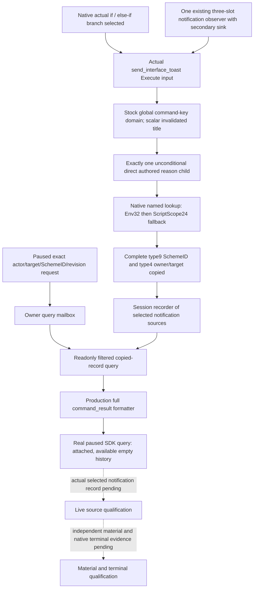

# Sway selected invalidation notification query — CK3 1.20.0.2

This query reads the copied [selected invalidation notification source](ck3-1.20.0.2-sway-invalidation-reason.md),
using the preceding [native scope and authored branch contract](ck3-1.20.0.2-sway-completion-invalidation-context.md).
The exact build is CK3 `1.20.0.2`, EXE SHA-256
`AE1BA6FF060BA603842F6F4A2DED0AF4B7D3666B3DD271F75FB01B0DA8E81B2D`.
The notification-source primitive is `static-ready`. The paused readonly query
transport is now `fixture-live`, returning attached available empty history;
the saved live sample does not contain a selected notification source record.

The selector is `query-sway-completion-invalidation-reason-v1-private`. Its
required integer fields are `expected_revision`, `actor_character_id`,
`target_character_id`, `scheme_instance_id` and `after_sequence`. The revision
is nonzero and matches the published paused snapshot; actor and target are
positive int32 identities, differ, and actor matches the played character.
The complete SchemeID is uint32 including generation bits, excluding the
`FFFFFFFF` sentinel. `after_sequence` is uint64 and accepts zero.

`HandleSwayCompletionInvalidationReasonV1` receives the root-owned
`SwayInvalidationReasonRecorder12002`. The exact owner-thread callback is
`ExecuteSwayCompletionInvalidationReasonMailboxV1`. The actual provider body is
embedded unchanged under `command_result.result.sway_completion_invalidation_reason`
by `SerializeSwayCompletionInvalidationReasonCommandResultV1` after mailbox
completion and ticket reclamation. The query does not run a condition,
generate a notification, attach an observer or create records.

The source distinguishes the authored target-dead and out-of-range
notification branches and retains the third existing stock branch as an
opaque source. It records the actual notification input selected by native
execution. A static object that contains multiple or conditional children is
not classified. It preserves complete inherited Scheme identity even after
the current scope switches to the owner character, using the native named
lookup's ScriptScope24 fallback. Later character state, icons and displayed
text are not used to infer the selected branch.

The input observation does not prove rendering, insertion into message
history, material effect, a native terminal transition or a universal reason
for termination. Native terminal state and transitions come from the separate
[termination execution/post-state query](ck3-1.20.0.2-sway-completion-termination-query.md).
The dedicated modifier measurement remains the independent material source.

This reader installs no function pointer hook. Root integrates it as a second
capture sink in the single existing three-slot notification wrapper, before
that wrapper forwards the original exactly once. Root marks its recorder
attached only when that native observer and sink are installed. A second
installer must not replace the same three slots. The recorder holds 128 copied
records within its observer session; unavailable attachment and available
empty history remain different results.

The reader's final actual-memory fixture passes `/Od` and `/O2`, each with
23 checks under `/W4 /WX`. The focused transport independently invokes actual
parent/child global command lookup, native effective-scope lookup, copied
records, owning envelope and complete production formatter. Each optimization
cell passes three cases and 16 checks; both handler compilation cells pass.
It produces actual dead, range and opaque-source full command results without
repeating the preceding source matrix. The serializer body schema is
`xar.ck3.sway-invalidation-notification-source.v1`.

The focused receipt is
`artifacts/g2-offline-2026-10-01/sway/completion-invalidation-reason-transport/attempt-0001/result.json`,
SHA-256 `8adc7da418544f2ebe9c34216d22fc5a48de2f1d2f6dfe46d67768fad74c5e99`.
The existing three-slot runtime secondary sink and shared named callback
admission/dispatch are integrated. No game process was accessed by the static
packages above.

## Actual paused query transport: 2026-10-01

Root saved the official SDK call in
`artifacts/g2-offline-2026-10-01/targeted-sdk-r6/r6-new-five-law-recovery-20261001T115250Z/015-ck3_query_active_scheme_sway_completion_invalidation_reason_private_v1.json`,
SHA-256 `537d5a1675cb4108583e5fed0e3f42fb802b77a1359efe20cb2541b048f72f32`.
The saved structured result equals the parsed text result, `isError=false`
and `resultType=complete`. This update inspects saved bytes and makes no new SDK
call or game operation.

Saved snapshot `014-ck3_take_snapshot.json` has SHA-256
`60f2300e6fb00bd08578578d4adb1a2547338d655f9b782fd49ec80e5ea41f2f`
and is identical to the snapshot paired with the termination query. It records
`paused=true`, PID `77216`, date `53169336`, actor `29829`, snapshot `native:3`,
SDK revision `2` and native revision `3`. The query supplies target `33433`,
full SchemeID `50331723`, `after_sequence=0` and `expected_revision=2`.
The returned native revision is `3`, consistent with that published frame.

The returned source query has `available=true`, `observer_attached=true`,
`session_records_only=true`, `retention_gap=false`, `earliest_sequence=0`,
`latest_sequence=0` and `records=[]`. Enqueue, render, material, native end-cause
and native terminal flags are all false. This qualifies paused query transport
and attached available empty history. No selected invalidation notification,
authored reason key, native terminal transition, hidden material result or
completed Sway loop is established by this live sample.

The currently integrated native body remains the frozen 19-key body / 19-key
record model of `xar.ck3.sway-invalidation-notification-source.v1`; SDK metadata
is additional to that native body. The optional 22-key record candidate with
status-at-notification fields remains independent and unapplied. Empty records
are not evidence for those additional fields or terminal state.

The saved-packet document verification is
`artifacts/g2-offline-2026-10-01/sway-completion/r6-paused-transport-doc-verification.json`,
SHA-256 `c7236fc9c2aebdce8b170ab85ca97a422461613d260d163b5afee71cf07ad1da`.
Root's next source qualification needs an actual selected notification record;
material effects and native termination keep their independent observations.
