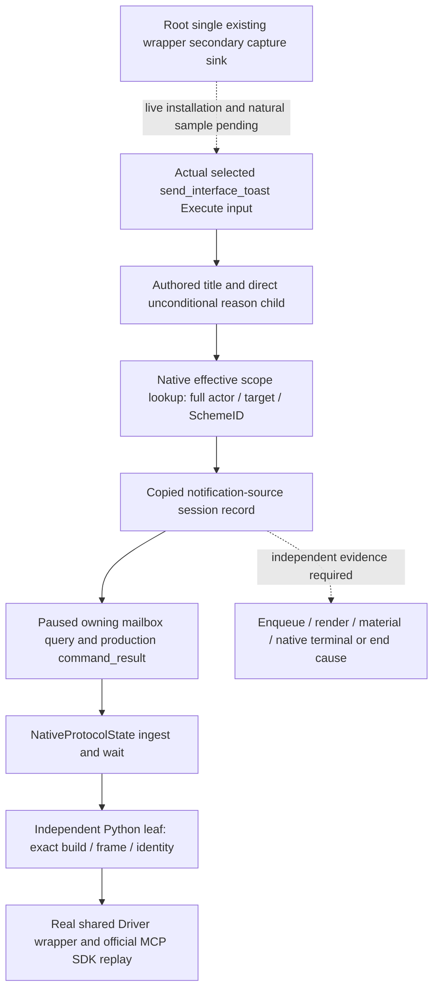

# Readonly selected Sway invalidation notification query — CK3 1.20.0.2

This independent Python query preserves copied records of the actual selected
invalidation notification source, joined by actor, target and full SchemeID.
Its readiness is **static-ready** after actual native packets passed the
production protocol cache, leaf and real shared Driver/MCP official SDK route.
The selected notification input does not establish rendered/history delivery,
material effects, native terminal state or a universal end cause.

The native input is the frozen fourteen-file
[notification source reader](ck3-1.20.0.2-sway-invalidation-reason.md) and
[private owning query](ck3-1.20.0.2-sway-completion-invalidation-query.md).
It binds CK3 `1.20.0.2`, EXE SHA-256
`AE1BA6FF060BA603842F6F4A2DED0AF4B7D3666B3DD271F75FB01B0DA8E81B2D`.
The execution, termination and 35/37-field completion endpoints remain frozen
and separate. Native status at notification belongs to a later independently
qualified increment; this model adds no such fields.



The leaf is
[`active_scheme_sway_completion_invalidation_reason_private_transport.py`](../../ck3_autonomous_player/src/xar_autoplayer/bridge/active_scheme_sway_completion_invalidation_reason_private_transport.py).
Its API is:

```python
query_active_scheme_sway_completion_invalidation_reason_private_v1(
    driver,
    *,
    expected_revision: int,
    target_character_id: int,
    scheme_instance_id: int,
    after_sequence: int = 0,
    timeout_seconds: float = 30.0,
) -> dict[str, object]
```

The independent permission
`allow_private_active_scheme_sway_completion_invalidation_reason_query`
defaults OFF. The native selector is
`query-sway-completion-invalidation-reason-v1-private`; the complete response
body lives under `result.sway_completion_invalidation_reason`, with actual
schema `xar.ck3.sway-invalidation-notification-source.v1`. The normalizer follows
the native nineteen-field body and nineteen-field record. Current played actor
identity comes from the snapshot; target must differ from actor. Actor and
target are positive int32 identities, SchemeID preserves all uint32 generation
bits other than invalid `0xffffffff`, and `after_sequence` accepts uint64
including zero.

The public `expected_revision` binds the paused Python snapshot. The shared
transport sends that snapshot's native revision as `expected_revision` and
`expected_snapshot_revision`. The leaf checks outer native version/SHA,
snapshot revision and query date against that frame. It preserves each record's
historical native date and copies nested records. The returned exact-build and
query provenance identifies the actual paused frame used for the query.

| Selected notification source | Authored reason key |
| --- | --- |
| `target_dead_notification_source` | `sway_invalidated_dead` |
| `out_of_range_notification_source` | `scheme_target_not_in_diplomatic_range` |
| `opaque_existing_stock_notification_source` | `sway_invalidated_war` |

The last stock key remains opaque; it adds no research or policy for that
domain. All records preserve `authored_command=send_interface_toast`,
`authored_title=sway_invalidated_title`, root scope kind `4`, Scheme scope kind
`9`, `selected_notification_branch_observed=true` and
`exact_scope_join_ready=true`. These are copied native execution inputs. Both
body and records keep `message_enqueue_observed`, `render_observed`,
`material_effect_observed`, `native_end_cause_observed` and
`native_terminal_state_observed` false. No terminal/cause, current predicate or
material result is synthesized.

The native reader copies the full inherited/effective Scheme token rather
than resolving a potentially destroyed instance. Multiple selected notification
branches for one SchemeID remain separate sequence records. The recorder retains
128 records within its observer session; earliest/latest sequences describe
that session-wide retention window, while records are filtered by exact
actor/target/SchemeID and cursor. Retention gap and available-empty/unattached
distinctions remain native facts. The route supplies no durable cold archive.

The
[fixture provenance](../../ck3_autonomous_player/native_bridge/research/fixtures/ck3_12002_sway_completion_invalidation_reason/provenance.json)
records fourteen native source pins, the independent context ABI/proof input,
transport receipt and three byte-identical full production `command_result`
outputs. The source delivery manifest is
`Z:/ck3_mod_rewrite/artifacts/g2-offline-2026-10-01/sway-completion/invalidation-query-delivery-result.json`,
SHA-256 `27ea14a8486e9bdf4fc80d40d5bcdde6946905b506d1c123b6aef64162d11182`.
The actual native transport receipt is
`sway/completion-invalidation-reason-transport/attempt-0001/result.json`, SHA-256
`8adc7da418544f2ebe9c34216d22fc5a48de2f1d2f6dfe46d67768fad74c5e99`,
under the same artifact root. Its dead/range/opaque full frames each retain full
SchemeID `33554443`, generation `2`, and cursors `0`, `1`, `2`. The actual native
reader/envelope/formatter proof supplies the inputs; Python does not fabricate
the native result envelopes.

The
[focused leaf tests](../../ck3_autonomous_player/tests/unit/test_ck3_12002_sway_completion_invalidation_reason_wire.py)
passed once: **3 tests**, including all three actual full packets through real
`NativeProtocolState.ingest` → `wait_for_command_result` → the production query
leaf. The
[official SDK test](../../ck3_autonomous_player/tests/unit/test_ck3_12002_sway_completion_invalidation_reason_sdk.py)
passed once: **1 test**, using the real
`NativeHeadlessGameplayDriver.query_active_scheme_sway_completion_invalidation_reason_private_v1`,
production MCP server and official `mcp.Client`. It verifies default OFF, the
CLI flag `--private-active-scheme-sway-completion-invalidation-reason-query`,
tool absence while disabled and the enabled tool's read-only annotation.
Paused hello/snapshot context is fixture scaffolding. Replay changes only the
parsed request ID for correlation; every native result field and archived
fixture byte remains unchanged.

Leaf and SDK receipts/logs are saved under
`Z:/ck3_mod_rewrite/artifacts/g2-offline-2026-10-01/python-sway-invalidation-reason-next/`
as `leaf-result.json`, `leaf-tests.log`, `sdk-result.json` and `sdk-tests.log`.
No older execution/termination/completion or native matrix was repeated.
No CK3 process, real pipe, UI, Steam or game state was touched. Root still owns
the secondary sink in its existing wrapper, exact named callback admission and
dispatch, live qualification of a naturally selected notification, and
independent native terminal/material evidence. Complete OODA remains unqualified.
