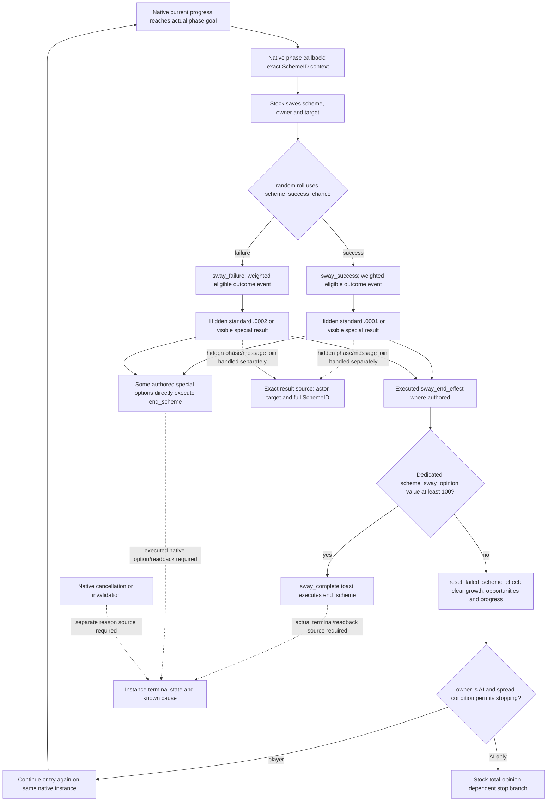

# Sway repeated phases and native roll input — CK3 1.20.0.2

This contract separates a natural **phase** from the end of its native Sway
instance. The new independent input is the native success chance for the
current phase. Neither that chance, a progress reset, nor opinion 100 identifies
an outcome that has already happened. Hidden message and terminal readers remain
separate source contracts.

Exact build: CK3 1.20.0.2 Crozier; frozen executable SHA-256
`AE1BA6FF060BA603842F6F4A2DED0AF4B7D3666B3DD271F75FB01B0DA8E81B2D`.
All observations in this document are file-only, **static-ready**. No game,
process, pipe, desktop, Steam, or userdir was accessed. The
[existing Sway state](ck3-1.20.0.2-sway-state.md) and
[event/material outcome](ck3-1.20.0.2-sway-outcome.md) contracts supply current
instance identity and independent opinion/modifier values; this work does not
replace them or duplicate their production readers.

## Stock phase tree

The seven complete frozen definitions, source paths, line positions and SHA-256
values are preserved in
[the source/native contract](../../ck3_autonomous_player/native_bridge/research/sway_completion12002_phase_abi.json).
`sway_scheme.txt` declares `is_basic = yes`, `base_progress_goal = 365`, stock
minimum success 20 and base maximum success 95. The actual instance goal and
final chance remain native inputs: script modifiers affect both. Sway has
`on_phase_completed`, `on_monthly` and `on_invalidated`; it does **not** declare
an `on_end` callback in this build.



The success on_action contains weights `100` for standard `.0001`, `2` each
for `.1001/.1002/.1003`, and `50` for the Persian Struggle `.1004`. The failure
on_action contains `100` for standard `.0002`, `2` each for `.2001/.2002`.
These are **weights among eligible events**, not unconditional probabilities.
The event eligibility and execution path belong to the
[outcome contract](ck3-1.20.0.2-sway-outcome.md).

`sway_end_effect` tests the target's specific `scheme_sway_opinion` toward the
owner. Below `sway_max_value = 100`, it calls `reset_failed_scheme_effect` if
the saved scheme exists, then presents `sway_continue` when the saved
`scheme_successful` scope exists, otherwise `sway_try_again`. Both player
branches can keep the same instance running. The threshold is evaluated after
the authored branch reaches this effect, not at an arbitrary later sample.
Another script or modifier can therefore establish the same current value
without proving this effect executed.

The stock AI spread branch is explicitly `is_ai = yes`. A vassal who is a
faction member and has total opinion below 100 bypasses that stopping branch.
Otherwise the order is realm priest with opinion at most 50: 10% stop;
opinion below -25: 10%; below 0: 30%; below 35: 50%; remaining cases: end.
This is input research, not a new policy for our player actor. Total opinion is
used by this AI spread branch; the dedicated modifier is used by the completion
threshold. They are separate inputs.

## Exact native phase and reset edges

| Edge | New-build evidence | Consumer meaning |
| --- | --- | --- |
| Advance phase progress | `0x2A4F2B0`, instance `int32 +0x78`, actual goal `int32 +0x350` | Add supplied delta and clamp to `[0, goal]`; below goal, return |
| Phase callback dispatch | `0x2A4F2F4` sets runtime byte `+0x270`; `0x2A4F373` loads type; `0x2A4F377` selects type `+0x498`; `0x2A4F383 → 0x3765780` | Executes the scheme type's phase effect with copied scheme context; effect field constructor at `0x30CFB87` corroborates layout |
| Native phase epilogue | `0x2A4F3F1` clears current progress; `0x2A4F3F4` increments `int32 +0x294` | Progress zero is native phase bookkeeping, with no success/failure classification |
| Opportunity cycle | `0x2A4F404` compares `+0x294` to type `+0x8D0`; `0x2A4F414 → 0x2A51600`; `0x2A4F419` clears the cycle count | Counter resets at each opportunity period; it is not a lifetime phase-success counter |
| Basic Sway opportunity gate | `0x2A5162B` reads type `is_basic +0xA4E`; nonzero jumps to `0x2A517DA` return | Complex-scheme opportunity accounting does not identify Sway outcomes |
| Script reset registration | literal `reset_scheme_progress` at `0x4851D28`; registration `0x5CFA01`; factory `0x2D11740`; effect vtable `0x48529C8 +0xC0 → 0x2D10A20` | Native effect resolves the complete typed SchemeID before clearing fields |
| Script reset writes | `0x2D10A6B`: `int64 +0x288 = 0`; `0x2D10A72`: `int32 +0x298 = 0`; `0x2D10A78`: `int32 +0x78 = 0` | Clears accumulated success growth, opportunities and current progress; does not write a hidden event result/history counter |

The callback object's layout is proven by native execution and construction;
the assignment of its `+0x498` field to the stock `on_phase_completed` name is
the bounded semantic join from its position in the native phase-completion
routine and the stock callback tree. No parser-field symbol is fabricated.
The transient byte `+0x270` is also cleared in native update paths
`0x2A47648` and `0x2A4772C`. A later zero sample loses this execution information.
Neither `+0x270`, `+0x294`, nor progress is a durable phase-result source.

## New success-chance provider input

The stock roll obtains `scheme_success_chance` through this exact chain:

```text
registration 0x5975E1
  → factory thunk 0x2B3EC50 → factory 0x2B3F600
  → script value vtable 0x47CA8C0 +0x100 → evaluator 0x2B3C2D0
  → scope type 9 + full SchemeID database resolution
  → 0x2A4A400(CActiveScheme*, int64_t* out)
```

Typed ABI for the owning-thread reader:

```cpp
using NativeSuccessChance12002 =
    std::int64_t* (__fastcall*)(const void* active_scheme, std::int64_t* out);
// RVA 0x2A4A400; returns the same out pointer.
```

The output is signed fixed-point **percentage points, scale 100000**: native
100% is `0x989680 = 10000000`. The instance constructor at `0x2A49199` assigns
that cap; the native UI branch at `0x13CEA81` independently clamps to the same
100% endpoint. Publish the raw integer and scale instead of rounding away
fractional chance.

`0x2A4A400` returns `min(base + accumulated_growth, maximum)`, with signed
comparison. Its cached branch reads base `+0x338`, growth `+0x288` and maximum
`+0x348`. When the native branch condition requires current calculation, it
calls `0x2A4B2C0` and uses that result's base/max with the same growth. The
provider should call this getter on the exact instance resolved by the existing
new-build source. It must not substitute diplomacy arithmetic, copy old-build
RVAs, or publish only the cached fields as the native final chance.

This input answers how likely the **next** natural phase roll is under the
current state. It supplies no proof that a previous roll succeeded, no count
of completed Sway phases, and no cause for instance ending. The exact hidden
message/event source and terminal source must be joined separately by complete
actor, target and SchemeID. The lifecycle provider owns that implementation.

## Validation and remaining live work

The file-only verifier
[sway_completion12002_phase.py](../../ck3_autonomous_player/native_bridge/research/sway_completion12002_phase.py)
passed **33 decoded instruction anchors, 4 native spans, 2 virtual edges and
7 frozen stock definitions**. The result is
`Z:/ck3_mod_rewrite/artifacts/g2-offline-2026-10-01/sway/completion-phase/contract-result.json`.
The first final verifier execution retained a harness RED: a manually
transcribed call displacement was `0x22E7` instead of decoded `0x21E7`; only the
verifier's expected bytes changed. `attempt-001.json` preserves it. No
production source was changed for that transcription error.

Reproduce with the project Python:

```text
tools\.venv\Scripts\python.exe ck3_autonomous_player\native_bridge\research\sway_completion12002_phase.py --exe artifacts\migrations\2026-09-30\post-update-1.20.0.2\installation\binaries\ck3.exe --game-root artifacts\migrations\2026-09-30\post-update-1.20.0.2\installation\game --output artifacts\g2-offline-2026-10-01\sway\completion-phase\contract-result.json
```

No new live status is granted. The production reader still needs its actual
native callback fixture and paused sample. Natural hidden phase result,
executed repeat/terminal branch, independent material readback, next turn and
cold checkpoint remain the lifecycle acceptance work. A message or terminal
record that cannot preserve its original exact instance is insufficient for
that acceptance.
