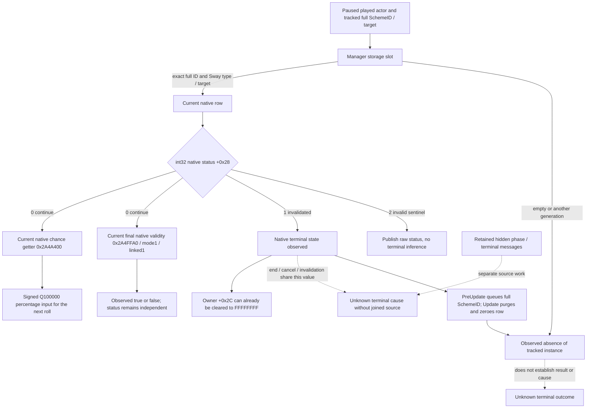

# Current Sway terminal state and roll input — CK3 1.20.0.2

This package is `static-ready`. It adds a readonly query of an exact tracked
Sway instance's native status, including the interval after the native terminal
path clears its owner. It also exposes the native current success-chance input
for a continuing instance and the complete native current `CanContinue`
result. No new-build paused-live result is claimed.

Build: `1.20.0.2 Crozier`; frozen executable SHA-256
`AE1BA6FF060BA603842F6F4A2DED0AF4B7D3666B3DD271F75FB01B0DA8E81B2D`.
The [cancellation source](ck3-1.20.0.2-sway-completion-cancel.md) and
[phase source](ck3-1.20.0.2-sway-completion.md) are implementation inputs. The
[existing Sway state](ck3-1.20.0.2-sway-state.md) supplies the manager, storage,
full-generation SchemeID, native type and target layout. The
[existing material query](ck3-1.20.0.2-sway-outcome.md) remains the source for
actual target opinion and the dedicated Sway/blocker modifiers.

## Native semantics and retention

The current status is a **signed int32**, not a byte flag. Constructor
`0x2A48FCA` writes `0`. The serializer at `0x2A492ED` uses native table
`0x4779528`: `0` is `continue`, `1` is `invalidated`, and `2` is the `invalid`
sentinel. The deserializer at `0x2A49C04` / `0x2A49C17` stores the table index
or sentinel as an int32. The reader preserves these exact names and values.

`0x2A4AE37` compares dword Scheme `+0x28` with `1`; `0x2A4AE41` writes dword
`1`. The terminal path ultimately clears owner `+0x2C` to `FFFFFFFF`, while
the full SchemeID `+0x10` and character target `+0x34` remain until purge.
The ordinary active-owner enumeration misses this owner-cleared interval.
This query directly resolves the tracked storage slot and verifies the full
SchemeID, Sway type and target before publishing that row's native status.
`owner_cleared` is the current raw marker; it does not pretend the previous
owner is still present in native memory. The caller retains the earlier exact
instance/actor/target association, and the current played actor is checked.

The native name `invalidated` is broader than a natural invalidation reason.
`CEndSchemeCommand` secondary execute `0x299C340` passes `bool=1` through
`0x2A48680` to `0x2A4AE10`; the authored `end_scheme` effect at `0x2D11B50`
passes `bool=0` to the same terminal path. Both store status `1`. Only the
`bool=1` path invokes Type `+0x588` `on_invalidated`. Status alone therefore
cannot distinguish manual cancellation, native invalidation, or an authored
success/failure ending. `native_terminal_state_observed` is the actual ended
state; `terminal_cause_observed` stays false for this current-row source.

Manager `PreUpdate` `0x2A46FA0` calls native validity `0x2A4FFA0` with
`mode=1, activity=1`; an unsuccessful result queues the full SchemeID at
update-this `+0x2558`, count `+0x2564`. Manager `Update` `0x2A47790` consumes
the queue and invokes `0x2A48B30`, which clears the storage slot and zeroes
the `0x358` row. The observable terminal interval has no promised number of
days, next-turn retention, or cold-load retention. A purged row produces an
observed absence with `native_terminal_state_observed=false`. A newer
generation in the same slot is also an absence of the tracked full ID.

## Current roll input is separate from result

Native getter `0x2A4A400` has signature
`int64_t* (const CActiveScheme*, int64_t* output)` and returns the caller's
output pointer. It reads the native base/growth/maximum calculation rather
than recomputing from a character attribute. The unit is Q100000 percentage
points: `100%` is `10,000,000`. Native constructor and UI clamp evidence
establish that scale. Signed native values are preserved.

The reader calls this getter only for a continuing row. A terminal row with a
cleared owner has no current roll to expose. The value is the current decision
input; it supplies no evidence of an already executed roll or phase success.
Native reset at `0x2D10A20` clears progress `+0x78` and related growth/phase
fields, while the next phase can continue on the same SchemeID. Progress zero,
total opinion `100`, ACK, and disappearance are not terminal-result sources.

## Interface and file-only verification

The implementation is
[`ReadSwayCompletion12002`](../../ck3_autonomous_player/native_bridge/include/xar_bridge/ck3_12002_sway_completion.hpp).
The request contains `expected_revision`, current actor, target and complete
32-bit SchemeID. The domain transport uses
`query-sway-completion-v1-private` with `result.sway_completion`. It is an
unadvertised readonly query. Its owning mailbox checks the semantic paused
frame, then invokes the actual provider and production full-command formatter.
An unavailable provider preserves the supplied actor/target/SchemeID for
normal SDK result correlation, including early core/source read failure.

The actual production reader, `QueryMailboxEnvelope` executor and serializer
pass MSVC `/Od` and `/O2`, `/W4 /WX`. The domain handler also compiles in both
modes. Fixture-owned memory exercises current `continue`, signed roll input,
status `1` before and after owner clearing, purge absence, slot reuse, sentinel
`2`, disabled bindings, and an early native core read failure. Seven actual
production full-command JSON wires per mode cover the distinct returned
states. The existing Sway reader suites are reused as prior evidence.

Artifacts:
`Z:/ck3_mod_rewrite/artifacts/g2-offline-2026-10-01/sway/completion-provider/final-v3/result.json`.
The initial GREEN attempt is retained. The next attempt added unavailable
correlation, but its disabled-core fixture entered the outer guard; the final
fixture uses an enabled binding with a null current state, reaching the early
`ReadOnce` failure that originally lost the request. This is a fixture-scope
correction, with the real request-preservation code change tested on that path.
No game process, pipe, desktop, Steam or live userdir was accessed.

The new value is a real native terminal-state observation during its retained
window and the actual current roll input. Retained hidden phase/result and
terminal-reason message joins are a separate concrete source package. Root
still needs a paused live current row, a naturally observed terminal window,
message correlation after purge, and appropriate next-turn/cold evidence before
claiming a complete Sway lifecycle.

## Current CanContinue increment

The frozen
[`sway_completion12002_cancel_abi.json`](../../ck3_autonomous_player/native_bridge/research/sway_completion12002_cancel_abi.json)
contract also supplies the complete current validity getter `0x2A4FFA0`:
`bool (const CActiveScheme*, int32_t mode, int32_t validate_linked_activity)`.
Manager PreUpdate passes `mode=1`, `validate_linked_activity=1`; this query uses
those same arguments after its exact full-ID/type/target/owner join. Mode `1`
evaluates the loaded SchemeType `+0x110` compiled valid trigger; linked flag `1`
includes native linked-activity validation. The function constructs and cleans
its local native trigger context, without submitting a command or performing
termination/purge.

`native_can_continue_observed=true` accompanies the actual native bool,
including a legitimate `false`. The serializer returns `null` when this input
was not read. The reader calls the getter only for native status `0`; an
owner-cleared status `1` remains an independently observed terminal state with
no current continuation query. Current validity `false` is not a recorded
historical ending and does not fill `terminal_cause`.

The increment's real production reader and owner-envelope/full-command wires
pass `/Od` and `/O2`, `/W4 /WX`, for `true`, `false` and a terminal row on which
the getter is not called. The runner checks that the three actual JSON values
are respectively `true`, `false`, `null`, with matching observed flags. Artifact:
`Z:/ck3_mod_rewrite/artifacts/g2-offline-2026-10-01/sway/completion-provider/can-continue-increment-001/result.json`.
The previous status/roll matrix and source ABI verifier were reused.

The newly registered named executor also passes a separate actual queue test
in both optimization modes. That fixture runs production `Install`, transfers
`permitted_executor_sway_completion12002` from install environment to runtime,
observes two paused owner pumps, uses real `TrySubmit`, drains the real domain
executor, then performs actual `Wait` and `Reclaim` and emits a production full
command with the observed `false`. It uses fixture-owned TLS/frame/IAT memory
and a synthetic pump profile; it establishes the queue code path, with no live
EXE anchor claim. Artifact:
`Z:/ck3_mod_rewrite/artifacts/g2-offline-2026-10-01/sway/completion-provider/named-queue-002/result.json`.
The initial named-queue attempt failed to compile because the fixture omitted
the existing uninstall timeout argument. That harness RED is retained under
`named-queue-001`; only the fixture call was corrected. No shared queue code
change or repeated old domain matrix was required.
