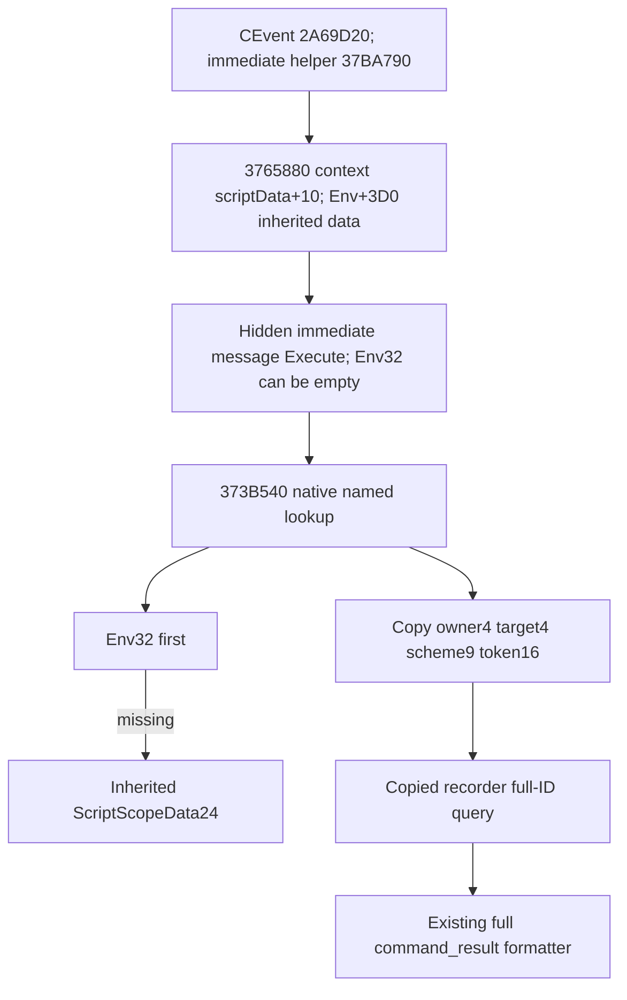

# CK3 1.20.0.2 Sway 隐藏事件的继承作用域读取

本页记录 R5 必要源增量，具体 source/fixture 状态由交付 receipt 标记；没有 paused-live 结论。冻结 EXE SHA-256：`AE1BA6FF060BA603842F6F4A2DED0AF4B7D3666B3DD271F75FB01B0DA8E81B2D`。

隐藏阶段 reader 原先只扫描 Env32 的命名作用域行。实际 CK3 CEvent 调用链 `2A69D20 → 37BA790 → 3765880` 在 message immediate 执行时使用初始为空的 Env32，并把 inherited ScriptScopeData 放在 EffectContext `+10` 和 Env `+3D0`。`2A6A33A` 将 ScriptData 传入 helper；`37BA8D9` 读取 EventData `+210` 的 immediate effect，`37BA8E8` 调 `3765880`。该函数在 `3765902` 先 Execute `3765E70`，`376590F` 再调用 `373B5F0` 保存 Env scopes，故仅扫描 Env32 会漏掉真实 owner、target、完整 SchemeID。这是实际原生 caller 输入，与实例是否还可 resolve 无关；不把 generic `379CEB0` 的另一事件字段外推为 CK3 immediate。

最小 caller 证据复用 `artifacts/g2-offline-2026-10-01/sway/completion-execution-named/hidden-event-game-dispatch.json`（SHA `143489FE3F9514BEE70240C645D56ABF9B7D69F31CE35A8266FB0B6690991722`）、`hidden-event-immediate-helper.json`（SHA `170CF6E0AEE80D06F3C640B93C30DE31F0E558220BC421B1E049F77AB0F0114B`）和 `hidden-event-dispatch.json`（SHA `81171D0D3653336D32CDFC1EC92872F00184BFA68E83490D934B3196B4F2257D`）；没有重新扫描或重跑源 verifier。

原生 [373B540 typed lookup 合同](../../research/sway_completion12002_invalidation_context_abi.json) 已冻结：`Token16* (const Env*, Token16* out, int32 identifier)`；RCX/RDX/R8D 为三个参数，RAX 返回 out。先查 Env32（stride20，row token+8），缺失时查 Env+3D0 指向的 ScriptScopeData24（named data+18、count+24、stride18、row token+8），复制完整16字节，不解析 Scheme 对象。已有失效通知 reader 使用同一查询入口，隐藏阶段 reader 复用其真实 ABI。

新增 `SwayExecutionBindings12002.lookup` 和 `scheme_identifier`、`owner_identifier`、`target_identifier` 指针；exact BindImage 绑定 `373B540`、`5D4BD60`、`5D4BD5C`、`5D4BD58`。命令继续走 R4 的 global getter，未解析 authored message type 继续使用 named registry。生产 capture 通过 native lookup 获得三个 copied tokens，再执行既有 type/full-ID/root/frame join。旧手工夹具全部新字段为空时保留 Env32 输入路径，以免重跑旧矩阵；生产 binder 始终提供 native lookup，不使用该兼容路径代替 inherited scope 查询。

独立 [scope overlay fixture](../../ck3_autonomous_player/native_bridge/src/ck3_12002_sway_completion_execution_scope_overlay_test.cpp) 只执行一个 empty Env32+Script24 输入。生产 Capture 真正调用 typed callback，从三个 stride18 行复制完整 tokens，再清空原存储，以实际 Recorder.Query 和 full formatter 证明记录持有副本。没有运行包含文件中的旧 main，也没有重跑 domain/installer/transport/named queue 矩阵。

[运行器](../../ck3_autonomous_player/native_bridge/research/run_sway_completion12002_execution_scope_overlay_fixture.py) 用 `/Od`、`/O2` 与 `/W4 /WX` 编译该单项，并要求显式 `--caller-proof`，把新的原生 caller proof 与 source SHA 一起冻结在 `artifacts/g2-offline-2026-10-01/sway/completion-scope-overlay/attempt-001/result.json`。fixture callback 是本进程拥有的 native-layout 输入，不声称执行了 CK3 RVA；attachment 也是 fixture 输入。query schema/formatter/installer 未改，执行输入 receipt 仍不等于消息入队、material、终态或完整 OODA，后续由 root 接上真实 paused-live 验收。
