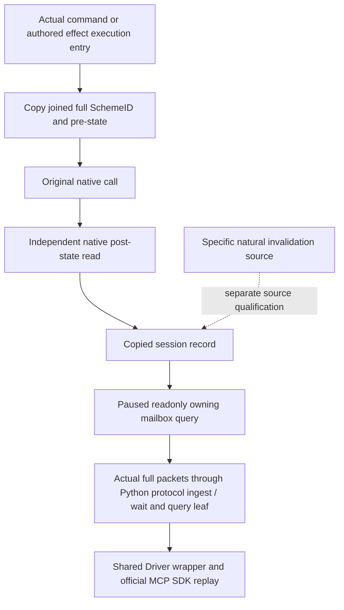

# Readonly Sway termination-source Python query — CK3 1.20.0.2

This independent query consumes the copied native records from the
[termination execution sources](ck3-1.20.0.2-sway-termination-source.md) through
the owning [native termination query](ck3-1.20.0.2-sway-completion-termination-query.md).
Its current readiness is **static-ready**: the new independent leaf and real
shared Driver/MCP SDK route have passed the actual full `command_result`
fixtures through production protocol ingest and wait. The response model
follows these actual native packets. The frozen execution query and existing
35/37-field completion query remain separate.

The native contract binds CK3 `1.20.0.2`, EXE SHA-256
`AE1BA6FF060BA603842F6F4A2DED0AF4B7D3666B3DD271F75FB01B0DA8E81B2D`.
The leaf API is:

```python
query_active_scheme_sway_completion_termination_private_v1(
    driver,
    *,
    expected_revision: int,
    target_character_id: int,
    scheme_instance_id: int,
    after_sequence: int = 0,
    timeout_seconds: float = 30.0,
) -> dict[str, object]
```

The opt-in permission is
`allow_private_active_scheme_sway_completion_termination_query`; the native
selector is `query-sway-completion-termination-v1-private` and the body lives
under `result.sway_completion_termination`. The current player supplies actor
identity. Native requests use positive int32 actor/target identities, a complete
generation-bearing uint32 SchemeID other than `0xffffffff`, and a uint64
`after_sequence` cursor including zero. A public revision binds the paused
Python frame, whose native revision is sent by the existing private transport.
The shared wrapper, MCP tool
`ck3_query_active_scheme_sway_completion_termination_private_v1` and CLI
`--private-active-scheme-sway-completion-termination-query` are owned by the
coordinator.



The response preserves actual pre/post native facts and exact scope joins.
Execution of `CEndSchemeCommand` establishes the command class, not whether a
human sent it. An authored false end effect does not establish a 100-threshold
condition. Missing post-call storage or a reused generation cannot establish a
terminal state. A shared invalidated status and callback input do not classify
a specific termination cause. The actual native output publishes schema
`xar.ck3.sway-completion-termination.v1`; the leaf adds no completion reason.

The
[`active_scheme_sway_completion_termination_private_transport.py`](../../ck3_autonomous_player/src/xar_autoplayer/bridge/active_scheme_sway_completion_termination_private_transport.py)
normalizer consumes the exact 15-field body and 22-field records. It binds the
enclosing `build_version`, `executable_sha256`, `snapshot_revision` and `date_raw`
to the paused native frame, while preserving the record's historical date.
It returns native private/read-only metadata and the shared exact-build/query
provenance. `pre_status` and `pre_owner` are copied facts. Post-read success,
presence, slot reuse, exact join and status observation each retain their own
booleans. `post_status` and `post_owner` retain native nulls when not observed.
Terminal state and terminal transition flags remain as produced; they are not
recomputed from source class, absence or function return.

The three actual complete native packets preserve these distinct outcomes:

| Fixture | Actual source class | Pre / post status | Post join | Observed terminal transition |
| --- | --- | --- | --- | --- |
| `terminal-transition-wire.json` | `authored_end_scheme_false_execute` | `0 / 1` | true | true |
| `original-no-terminal-wire.json` | `authored_end_scheme_true_execute` | `0 / 0` | true | false |
| `absent-post-wire.json` | `end_scheme_command_execute` | `0 / null` | false | false |

All three preserve full SchemeID `33554443`, generation `2`, and current played
actor/target identities. The terminal fixture independently observes native
post-owner `0xffffffff`; the absent fixture keeps both nullable post fields
null. `material_effect_observed` is false and `specific_invalidation_reason`
is null in all three. The existing source does not publish a specific natural
invalidation reason; a later independently qualified reader may supply one.

The native recorder contract retains 128 copied records within the observer
session. Attachment unavailable and an observed available empty result remain
distinct, with no durable cold-history claim. The tracked
[provenance](../../ck3_autonomous_player/native_bridge/research/fixtures/ck3_12002_sway_completion_termination/provenance.json)
records the three byte-identical original full packets and actual native
compilation-input pins. The final fifteen-source native delivery manifest is
`Z:/ck3_mod_rewrite/artifacts/g2-offline-2026-10-01/sway-completion/termination-query-delivery-result.json`,
SHA-256 `d958b657577d777297d694cb7eb468726700646ca661bea8af3c90a50f4649e1`.
The full transport receipt is
`sway/completion-termination-mailbox/attempt-001/result.json`, SHA-256
`b5f068eef1e48383fa6a2525304e802204e2010737374ff2c7dcbb475da6e771`,
under the same artifact root. It covers installed native slot wrappers, the
typed original executed once, copied pre/post recorder, owner envelope and
production full formatter; it does not prove named queue admission or live
installation.

The
[focused new leaf tests](../../ck3_autonomous_player/tests/unit/test_ck3_12002_sway_completion_termination_wire.py)
passed once: **3 tests**, including the actual three packets through production
`NativeProtocolState.ingest` → `wait_for_command_result` → the new leaf. Paused
hello/snapshot frames are explicit fixture scaffolding; replay changes only the
parsed request ID for correlation. The native `result` fields and archived
bytes remain unchanged. Receipt:
`Z:/ck3_mod_rewrite/artifacts/g2-offline-2026-10-01/python-sway-termination-next/leaf-result.json`;
log: `leaf-tests.log` in the same directory.

The
[official SDK test](../../ck3_autonomous_player/tests/unit/test_ck3_12002_sway_completion_termination_sdk.py)
passed once: **1 test** after shared registration READY. All three actual native
packets pass through the real protocol cache, production
`NativeHeadlessGameplayDriver.query_active_scheme_sway_completion_termination_private_v1`,
production MCP server and official `mcp.Client`. The case verifies default OFF,
the CLI flag, tool absence while disabled and read-only annotation while enabled.
It preserves every source/pre/post record field, true/false terminal flags and
absent-post nulls. Receipt:
`Z:/ck3_mod_rewrite/artifacts/g2-offline-2026-10-01/python-sway-termination-next/sdk-result.json`;
log: `sdk-tests.log` in the same directory. The three leaf tests, existing green
execution and 35/37-field matrices and native suites were not repeated.

This SDK evidence is production Python transport with native output replay.
No CK3 process, real pipe, UI, Steam or game state is accessed by this offline
work. Natural specific-reason observation, live installation/dispatch, an actual
paused source/post-state artifact and complete OODA remain root-owned work.
