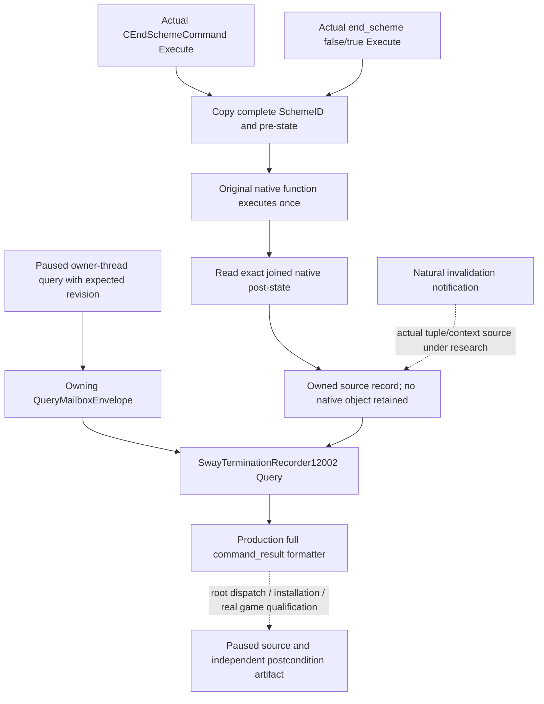

# Sway termination source query — CK3 1.20.0.2

This private readonly query consumes the copied records from the
[actual termination execution sources](ck3-1.20.0.2-sway-termination-source.md).
The source tree and native interface precede this transport. The exact build is
CK3 `1.20.0.2`, EXE SHA-256
`AE1BA6FF060BA603842F6F4A2DED0AF4B7D3666B3DD271F75FB01B0DA8E81B2D`.
Readiness is `static-ready` for this independent executing-source and native
post-state primitive. Real CK3 qualification belongs to root.

The selector is `query-sway-completion-termination-v1-private`. Required integer
fields are `expected_revision`, `actor_character_id`, `target_character_id`,
`scheme_instance_id` and `after_sequence`. The expected revision is nonzero and
must match the published paused snapshot. Actor and target are positive int32
identities, differ from one another, and the actor matches the played character.
The SchemeID is the complete uint32 identity including generation bits;
`FFFFFFFF` is invalid. `after_sequence` is uint64 and accepts zero.

The handler `HandleSwayCompletionTerminationV1` receives the recorder owned by
root alongside the existing adapter, main-thread mailbox and published
snapshot. `ExecuteSwayCompletionTerminationMailboxV1` queries that recorder on
the owner thread. The handler waits for completion and reclaims the actual
mailbox ticket before formatting the result. It cannot attach an observer or
manufacture a source record. Root integrates its exact callback admission and
worker dispatch independently from this source package.

The actual provider body is embedded under
`command_result.result.sway_completion_termination`. The outer envelope carries
protocol version `1`, request identity, accepted/read-only/private metadata,
snapshot revision, native date, exact build and SHA, and backend
`native-headless`. The provider supplies observer attachment, retained sequence
range, retention-gap fact and exact request-filtered records.

Each record separates three facts:

- The actual native execution class and the joined pre-call owner, target,
  full SchemeID and status.
- The independently read post-call instance presence, generation reuse,
  joined status and owner.
- Whether the native terminal state and a transition into that state were
  actually observed.

Execution of a command class does not prove a human sent it. Execution of an
authored end effect does not identify which scripted condition selected that
effect. Missing post-call storage, a reused slot, or a returning original
function does not establish termination. The shared native status name
`invalidated` and the callback's true/false input do not classify a specific
natural invalidation reason. Those interpretations require their own actual
source joins.

The recorder retains 128 copied records within the installed observer session.
Unavailable attachment and an available empty history are distinct results.
Full-generation filtering prevents another instance using the same storage
slot from being joined to the tracked Sway. Root owns the native recorder and
installation state through its existing pinned DLL lifetime; the query does
not establish a durable cold-history archive.

The native installer/reader fixture passes MSVC `/Od` and `/O2`, each with
30 checks under `/W4 /WX`. A separate 14-anchor native proof reuses the prior
frozen source evidence. The focused transport fixture reuses fixture memory
without executing that earlier test main. It invokes the actual installed
slots, typed originals once, before/after capture, recorder, paused owning
envelope and full formatter, producing three actual full command results per
optimization mode. Both handler compilation cells pass `/W4 /WX`.

The three transport cases observe a genuine `0 -> 1` native state transition,
an original that leaves state `0`, and a post-call missing instance. Only the
first case publishes observed terminal state and transition. The full body
schema emitted by the actual serializer is
`xar.ck3.sway-completion-termination.v1`.
The focused receipt is
`artifacts/g2-offline-2026-10-01/sway/completion-termination-mailbox/attempt-001/result.json`,
SHA-256 `b5f068eef1e48383fa6a2525304e802204e2010737374ff2c7dcbb475da6e771`.
New shared named admission/dispatch and real paused live qualification remain
separate work. No game process or pipe was used by these fixtures.
