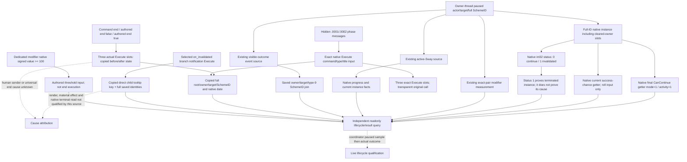

# Sway phase history and lifecycle source — CK3 1.20.0.2

The current migration reads active Sway instances, complete native start terms,
an independent start receipt, visible outcome events, and the exact pair's
opinion and dedicated Sway modifiers. This package adds current native validity,
retained terminal state, hidden phase execution, explicit end execution and
selected invalidation-notification sources. Their distinct observations do not
turn an ACK, an absent SchemeID, phase reset, or total opinion of 100 into a
terminal result.

The executable is the frozen CK3 `1.20.0.2` Crozier build, SHA-256
`AE1BA6FF060BA603842F6F4A2DED0AF4B7D3666B3DD271F75FB01B0DA8E81B2D`.
This package performs only static file research and deterministic fixtures.
Paused live qualification belongs to the coordinating maintainer.

## Existing observations reused

The [active source](ck3-1.20.0.2-sway-state.md) supplies manager-owned full
SchemeIDs, actor/target identities, native progress/goal, and active instance
facts. The [outcome source](ck3-1.20.0.2-sway-outcome.md) supplies visible event
identity, saved owner/target/SchemeID joins and independent decay-aware modifier
measurements. Their completed proof and fixtures are inputs to this work;
neither interface is reimplemented here.

The frozen stock tree establishes that hidden `sway_outcome.0001` and `.0002`
are phase outcomes. `sway_end_effect` can reset progress and continue the same
instance. The authored terminal branch uses the dedicated
`scheme_sway_opinion` modifier's threshold, not total opinion. Native
termination evidence distinguishes phase execution, explicit end execution,
observed terminal state and a selected invalidation notification. Command
execution alone does not identify a human sender or a universal end cause.

## Native source tree before implementation

Four disjoint packages run in parallel:

- [Hidden result history](ck3-1.20.0.2-sway-completion-history.md): actual
  retained native result/message source, complete identities and source join.
- [Cancellation and invalidation](ck3-1.20.0.2-sway-completion-cancel.md): actual
  native path, reason and the lifetime of any retained terminal source.
- [Phase and repeat semantics](ck3-1.20.0.2-sway-completion-phase.md): exact
  authored branches and native inputs that distinguish phase from instance end.
- [Readonly provider](ck3-1.20.0.2-sway-completion-provider.md): implemented only
  after those source trees and exact-build ABI contracts exist.

The cancellation source has closed a directly usable current-instance field.
Native termination writes Scheme `+0x28`, a signed 32-bit enum whose exact table
at `0x4779528` names `0` as `continue` and `1` as `invalidated`. Player cancel
also writes `1`; that enum does not distinguish natural invalidation from
cancellation or an authored end. The native full SchemeID and target survive
until database purge while the owner becomes `FFFFFFFF`. A full-ID reader can
therefore observe a terminated instance that the existing owner-filtered active
reader omits. The new contract publishes the native enum and actual terminated
fact separately from any cause or retained history.

The phase source also closes `0x2A4A400(CActiveScheme*, int64_t* out)`, the current
native success-chance input. Its scale is Q100000 percent: `100%` is `10000000`.
The getter computes the current roll input, not a result already rolled. Its
exact branch and source pins belong to the linked phase topic.

The cancellation source closes the final native current-validity getter
`0x2A4FFA0(const CActiveScheme*, int32_t mode, int32_t linked_activity)`. The
provider calls it only for a joined continuing instance, with `mode=1` and
`linked_activity=1`, matching native manager inputs. A false result is an actual
current CanContinue result; it does not establish a historical termination
cause. The query now publishes `native_can_continue_observed` and nullable
`native_can_continue`. A terminated row leaves the getter uncalled and its
value null.

## Current query contract

The independent selector is `query-sway-completion-v1-private`. Its payload
contains four integers: `expected_revision`, `actor_character_id`,
`target_character_id` and the complete `scheme_instance_id`, including its
generation bits. A successful transport returns the actual provider under
`command_result.result.sway_completion`, with private/read-only metadata and
the selected executable identity. Unavailable source reads preserve the actual
request identity; they do not manufacture a missing instance.

| Observed native source | Published fact | Interpretation |
| --- | --- | --- |
| Matching full-ID Sway row, status `0` | `continue`; current native success-chance input | Current instance and roll input, without a result inference |
| Matching full-ID Sway row, status `1` | `invalidated`; `native_terminal_state_observed = true` | The instance has actually entered the native terminal state; cause remains separate |
| Owner `FFFFFFFF` on that terminated row | `owner_cleared = true`, raw owner marker | The previous owner is no longer stored; a consumer retains its earlier tracked-instance source |
| Matching row, native status `2` or another value | Exact raw value and native key | No invented phase, completion or cancellation result |
| Missing slot or different full generation | Observed absence or `storage_slot_reused` | Absence does not establish termination |
| Unreadable source or changing frame | `available = false` with reason | The query supplies no usable source observation |

The current native row is retained only until the manager purges it. Hidden
phase messages use a separate executing-input source whose actual payload joins
the complete SchemeID. Rendered good/bad text or a target icon alone cannot
supply that join. The observer copies the input before stock rendering loses
the source payload.

That executing-input source is now implemented independently. The
[execution reader and copied recorder](ck3-1.20.0.2-sway-completion-execution.md)
match the exact native command/type/title tuples for hidden phase success and
failure. They copy the full type-4 owner/target and type-9 SchemeID tokens while
the original `EffectContext` still exists. The recorder keeps 128 records in
the current observer session. No icon, displayed text, later opinion value or
progress reset is used to join a record.

The selector `query-sway-completion-execution-v1-private` returns these copied
sources under `command_result.result.sway_completion_execution`. It requires
the same actor, target, full SchemeID and expected snapshot revision, plus
`after_sequence` as a uint64 value; zero selects retained records from the
start. A different SchemeID generation produces available empty history.
An unattached observer produces an explicit unavailable result. An executing
source record independently proves which hidden phase branch entered the
native message effect; it does not prove message enqueue, material effect or
whole-instance termination.

The [native installer](ck3-1.20.0.2-sway-completion-execution-install.md) closes
the actual slot-22 call ABI and replaces only the three exact Execute pointer
slots. Its wrapper copies the input and forwards the original function once.
It marks the recorder attached only after all three slots are installed and
restores original slots on uninstall. Root owns the recorder and install state
through the existing pinned DLL lifetime and integrates startup/stop and exact
private-query callback admission.

Each provider has its own mailbox and full command-result serializer. The
coordinator owns shared dispatch, CMake, Python/MCP registration and real paused
qualification. The source/query components below are **static-ready**; a
complete Sway lifecycle or OODA loop still needs the corresponding actual game
outcomes. Unqualified cause/render/material edges remain dashed.

The hidden executing-source component and installer are now **static-ready**.
The actual reader/recorder/query fixture passes `/Od` and `/O2`, each with
196 checks and eight bare JSON wires. A focused owning-mailbox/full-command
transport fixture adds three actual command results and 11 checks per mode;
the earlier reader matrix was not repeated. The exact slot installer adds
26 checks per mode for attachment, copied source before original execution,
success/failure records, passthrough and restoration. Every cell uses `/W4 /WX`.
The combined 11-file query delivery is
`artifacts/g2-offline-2026-10-01/sway-completion/execution-query-delivery-result.json`,
SHA-256 `b368e9e75127945bf91b637882afaa6236a44b6dbe6d92bd6005b818f95119b9`.
The separate six-file installer delivery is
`artifacts/g2-offline-2026-10-01/sway/completion-execution-install/delivery-result.json`,
SHA-256 `09a8c363f31451edf5de7c57c8a652d8b1cb7c99f205f9af1cbe73589e39f2a9`.
These historical fixtures have not installed an observer in CK3 or qualified a
material, cold-history or complete OODA result. Subsequent source fixes and
independent end/notification queries are qualified by their own increments
below; the old matrices are retained and were not rerun.

The current-instance component is now **static-ready**. Its actual production
reader, owning `QueryMailboxEnvelope` executor and full `command_result`
formatter pass MSVC `/Od` and `/O2`, both with `/W4 /WX`. Each mode produces
seven actual JSON frames covering current roll input, owner-cleared terminal
state, purged absence, reused full generation, native invalid sentinel, disabled
binding, and actual early core-source failure. The worker handler separately
compiles in both modes. The final receipt is
`Z:/ck3_mod_rewrite/artifacts/g2-offline-2026-10-01/sway/completion-provider/final-v3/result.json`,
SHA-256 `e4fd9a51899553d6b8656ca81e4e6a80fdebde857ace7fc29a8bae3fc7af52c5`.

The first source version lost the actual request on an early native-source
failure. The finalized reader copies request identity before reading the core;
the actual failure-path JSON preserves actor, target and full SchemeID.
Earlier attempts remain in the provider artifact directory. No game process,
pipe or desktop was used by this package, and shared dispatch/MCP integration
and real paused qualification are separate coordinator work.

## Native input corrections and threshold decision

The [global-command domain correction](ck3-1.20.0.2-sway-completion-command-domain.md)
separates the stock effect's `+8` command identifier from named-scope identifiers.
For effect `+C == 0`, the actual getter is
`0x3F4F900(int32_t) -> const std::string*`; the dynamic domain is explicitly
unsupported. One fixture with disjoint command and named namespaces passes
17 checks per `/Od` and `/O2` and emits three full command results. Its delivery
receipt is
`artifacts/g2-offline-2026-10-01/sway/completion-command-domain/delivery-result.json`,
SHA-256 `0f257e3e024fd81581e35f5d0215051e01d287197c178ef55fb79ec49f90f5cf`.

The [hidden named-scope source](ck3-1.20.0.2-sway-hidden-named-scope-source.md)
proves the game path `0x2A69D20 -> 0x37BA790 -> 0x3765880`. It executes with
fresh empty Env32 and inherited Script24, before saving the new environment.
The reader now uses the actual lookup `0x373B540`, which searches Env32 and its
Script24 fallback. A new empty-Env32/inherited-Script24 fixture passes seven
checks in each compiler mode and emits one full command result per mode. The
five-file delta receipt is
`artifacts/g2-offline-2026-10-01/sway/completion-scope-overlay/delivery-result.json`,
SHA-256 `0f6fe564806e3622932ef3f56f0488b0ed19d4de4fbd0c308bcbace440c534aa`.
No previous phase/installer/transport matrix was repeated for these fixes.

The [threshold mapping](ck3-1.20.0.2-sway-completion-threshold.md) reuses the
native signed modifier value already published by the exact-pair query.
`has_opinion_modifier` and this query both obtain it through `0x25962B0`;
the stock threshold is `present && value >= 100`, without a Q100000 conversion
or total-opinion clamp. A repeat decision also requires the same paused-frame
actor/target join, a living played character, and an actually observed true
`native_can_continue`. Neither a reached threshold nor a false CanContinue
value proves end execution or a historical cause.

## Executed end and selected invalidation notification

The [termination source](ck3-1.20.0.2-sway-termination-source.md) observes three
actual native Execute paths: end command, authored false end-effect class, and
authored true end-effect class. It copies the full tracked identities before
calling the original once and reads the independent full-ID state afterward.
The source distinguishes an observed `0 -> 1` transition, an unchanged row and
post-call absence. A command class does not prove a human sender; the false
authored variant does not prove that the modifier threshold selected it.

The selector `query-sway-completion-termination-v1-private` returns
`command_result.result.sway_completion_termination`, with the same five request
integers as the execution query. The combined 15-file source/query receipt is
`artifacts/g2-offline-2026-10-01/sway-completion/termination-query-delivery-result.json`,
SHA-256 `d958b657577d777297d694cb7eb468726700646ca661bea8af3c90a50f4649e1`.
The independent `/O2 /W4 /WX` named-queue fixture exercises actual source
installation, copied before/after state, named callback admission, two paused
owner pumps, submit/drain/wait/reclaim and the full formatter. Its 18-check
receipt is
`artifacts/g2-offline-2026-10-01/sway/completion-termination-named/package-result.json`,
SHA-256 `e446a07d060d50cfdc8ca17a8f4865c57759554a123572afedd277f2396b3d08`.

The [invalidation context source](ck3-1.20.0.2-sway-completion-invalidation-context.md)
proves that stock `on_invalidated` executes the selected branch's notification
and its single unconditional direct custom-tooltip child. The
[invalidation reason query](ck3-1.20.0.2-sway-completion-invalidation-query.md)
copies that actual authored key and saved owner/target/full SchemeID even when
the scheme row has already disappeared. The Env32 lookup takes precedence over
inherited Script24 values. Generic, conditional or multiple children do not
become a guessed reason.

The selector `query-sway-completion-invalidation-reason-v1-private` returns
`command_result.result.sway_completion_invalidation_reason`, body schema
`xar.ck3.sway-invalidation-notification-source.v1`. The frozen R6 model has
19 body keys and 19 record keys. It reports a selected notification execution;
it does not report enqueue, rendering, material effects, a universal end cause,
or native terminal state. Its 14-file source/query receipt is
`artifacts/g2-offline-2026-10-01/sway-completion/invalidation-query-delivery-result.json`,
SHA-256 `27ea14a8486e9bdf4fc80d40d5bcdde6946905b506d1c123b6aef64162d11182`.
The three actual full wires cover dead, out-of-range and opaque authored inputs.

The [secondary sink](sway-completion12002-secondary-sink.md) attaches this reader
to the hidden observer's existing three Execute slots. The wrapper copies the
hidden source, calls the typed readonly reason sink, then invokes the original
once. The same tested installer bytes were applied for R6; the original
13-check fixtures in both modes were reused. The source-apply receipt is
`artifacts/g2-offline-2026-10-01/sway/secondary-sink/source-apply-receipt.json`,
SHA-256 `b7b31024b4be9a6e26eb7f0e383963a694db5280c7583078bddcbd54565f8d30`.
The coordinating bridge owns the long-lived bindings/recorder and attaches or
detaches them with the existing install lifetime. A separate optional native
status-at-notification candidate remains outside R6 and does not alter this
frozen schema or its evidence.

One new `/O2 /W4 /WX` fixture passes 21 checks through the actual installed
toast wrapper, readonly reason capture, unchanged original once, the new named
reason callback alone, two paused owner pumps, submit/drain/wait/reclaim and
the full command-result formatter. The receipt is
`artifacts/g2-offline-2026-10-01/sway/completion-invalidation-reason-named/attempt0001/result.json`,
SHA-256 `bf816d83bd4f87a10a47bdfc419723a0efb5ee971183e4db57339d152166c688`.
Its single actual `Release/named-reason-command-result.json` has SHA-256
`3ba971e5be4ade80775cc67b6085551e18f6f43e24142e444fa5d4a366cf8e02`.
The old generic and other query permits remain null in this fixture. It retains
the selected source's authored key and full IDs without adding a render,
terminal or cause inference.

## 2026-10-04：R24新PID原Sway四查询同帧GREEN

The historical `.2` topic filename remains unchanged; this new actual evidence uses exact CK3 **1.20.0.3**, PID32372, Root sourceg51/1c.

- 10月4日R24/newPID32372（Root sourceg51/1c；SDK5447正常closed/exit0）原Sway四项首次同帧全GREEN：completion004、execution006、termination008、invalidation010；各自availabletrue/unavailable_reason空，source **native3/public2/date53241096**。
- 原 **FullID134217986/gen8、actor29829、target34333** 仍 exact_instance_join_ready/instance_present/owner_matches_actor=true，slot_reusedfalse、owner_raw29829且未cleared；native_scheme_storage当前实例保留至native_manager_purge。状态 **raw0/continue**、CanContinue=true、terminal_state_observed=false、terminal_cause_observed=false/causeunknown；native chance4500000/100000=45%（percent），不计完成或收益。
- 三个observer均attachedtrue、records[]、after/earliest/latest0、retention_gapfalse，material_effect_observedfalse；008/010明确session_records_onlytrue，006未发布该字段。010还明确无endcause、message/render观察。只能证明本session接入并读取当前状态，不能写成跨PID durable完成/效果/终结原因历史回放；空ring与gapfalse不证明之前无事件。外部冻结历史artifact继续保留。
- 资格为新PID原实例状态及三个readonly observer的 **production-live primitive**。旧v46最初004实际RED及原因不可恢复的边界保留，不能由新success推断根因或认定errorformat-only补丁修复capability。

本次只读观测新增 **0日／0gameplay动作、Start0／advance0**；Root current累计4032／resumed879／10月4日新增7日由此前正常保存与执行单独记账，本帧不增加或重复计入。这里没有新 phase progress、independent opinion、完成、友谊/好感、净收益或终结信用；冻结历史artifact与旧RED继续保留。

Sealed evidence: `Z:/ck3_mod_rewrite_process_assets/g2-resume-20261003/battle-observation-schedule/sway-v47-newpid-original-four/ROOT-DELIVERY.json` and its canonical append / Oct4 report fields. This documentation merge reuses sealed summaries without rereading raw query captures.

## 2026-10-04：R29 新进程首次原四叶继续态（1.20.0.3）

R29 在既有 Robert29829 普通战役的 `date_raw53251464` 零日暂停点，首次重读原四个 Sway 接口；四叶均为 `available=true`，同 `native/pub revision2`。运行绑定为 PID38372、冻结源 `g61/f3f365c53d3708f520e0142a1b81a484b0c31df3`、CK3 **1.20.0.3**，EXE SHA-256 `94B55397ABB687A3DCD436805A5D885E6BE90FA6C693FEB44A9E3BBEEADE02A6`。此段不推进时间，不增加日数或能力家族计数：总计 **4464**、续接 **1311**、10月4日增量 **439**、自然继承 **0**；G2 **5/8**、NW2 **2/4**，不允许百分比汇报。

- Completion：原 `FullID134217986/gen8/target34333` 仍 `instance_present/exact_instance_join_ready/owner_matches_actor=true`，owner_raw29829、owner_cleared=false、storage_slot_reused=false；原生存储保留规则仍为 `until_native_manager_purge`。当前状态 `raw0/continue`、`CanContinue=true`，成功率 `4500000/100000=45%`（percent），terminal_state/cause 均未观测、cause=`unknown`。
- Execution / termination / invalidation：三个观察器均 attached，`after/earliest/latest_sequence=0/0/0`，`records=[]`、`retention_gap=false`；termination 与 invalidation 显式 `session_records_only=true`。这证明本进程采样点未留存相应通知/终止记录，不能推翻先前进程已冻结的物质收益，也不等同于完整四阶段生命周期已经发生。当前 invalidation 的 enqueue/render/end-cause 与 terminal flags 均未观测。
- 先前 **Start 一次 → 专属 modifier 实际 +25 → 正常日推进 → 新 PID 冷读** 的 beneficial `production-live loop` 结论保留；本次不重新加收益门槛，不把总 opinion27 当成额外 +35，也不把本次 continuation 或空记录冒充新一轮成功。完整四阶段生命周期继续 pending；下一入口仍为普通日推进后的实际状态/通知变化与同一实例追踪。

四份 raw 由单一消费代理各读一次后封存，后续只读缓存。缓存：`Z:/ck3_mod_rewrite_process_assets/g2-resume-20261003/sway-natural-material/r29-original-four-once/FOUR-RAW-CACHED-BODY.json`，SHA-256 `e3e4525802ba519eb4d29efb8d2c5e036958bf3877e1c97c0229748bf1206cec`；关键字段、四叶路径/哈希、专题 patch 与日/周报告字段见同目录 `ROOT-DELIVERY.json`。此包只消费既有暂停证据，未另开 SDK、执行 Sway、占用窗口或重跑测试。

## 2026-10-04：R29 正常推进40日后的停机前原四叶

在 R29 PID38372 / 冻结源 `g61/f3f365c53d3708f520e0142a1b81a484b0c31df3` 的正常推进40日后，Root SDK79664 已正常关闭并保存。本次只消费停机前原四叶，均 `available=true`、同 `native/pub revision169/date_raw53252424`；不读取后续新进程，也不重复消费已采用的 R29 首次四叶。运行仍绑定 CK3 **1.20.0.3** / EXE SHA-256 `94B55397ABB687A3DCD436805A5D885E6BE90FA6C693FEB44A9E3BBEEADE02A6`。

- 原 `FullID134217986/gen8/actor29829/target34333` 仍 present、exact join 与 owner match，owner_raw29829、owner_cleared=false、storage_slot_reused=false；状态仍 `raw0/continue`、`CanContinue=true`，terminal_state/cause 未观测，cause=`unknown`。当前原生成功率 `5500000/100000=55%`（percent）；相较已冻结 R29 首次45%提高10个百分点，原因未由本次四叶观测，不能当作成功、收益或完整生命周期完成。
- Execution / termination / invalidation 三环仍 observer_attached=true、`after/earliest/latest=0/0/0`、`records=[]`、retention_gap=false，material_effect_observed=false；termination/invalidation 仍显式 session_records_only=true，当前 invalidation 无 enqueue/render/end-cause/terminal 观测。本会话未捕获这些记录，不否定历史冻结物质收益，也不证明此前从未有事件。

原 **Start一次 → 专属 modifier 实际+25 → 正常日推进 → 新PID冷读** 的 beneficial `production-live loop` 保留；不以此帧重新加 gate，不把总 opinion27 写成额外+35。完整四阶段生命周期仍 pending，下一入口为继续正常日推进后的实际通知或终态变化。本包增加 **0日 / 0动作**；Root 已单独记账的正常推进总数为 **4504 / resumed1351 / 10月4日+479 / natural0**，G2 **5/8**、NW2 **2/4**，百分比汇报仍关闭。

四份新 raw 各读取一次后仅从缓存交付：`Z:/ck3_mod_rewrite_process_assets/g2-resume-20261003/sway-natural-material/r29-prestop-original-four-once/FOUR-RAW-CACHED-BODY.json`，SHA-256 `e21d84f0f81c05e4936fd7f1f07f5692aabcd39031526e45f23e542874cb09e9`；同目录 `ROOT-DELIVERY.json` 包含四源路径/哈希、关键字段、专题 append patch 和 Oct4/W40 报告字段。此消费包未另开 SDK、读取后续 R30、输入游戏、占用窗口、修改共享树/Git 或重跑测试。

## 2026-10-04：R30 新 PID 首次推进前原四叶

R30 原生 PID120956 / controller69340 / 冻结树 `g62`（Root 源 pin 前缀 `d1`）已正常冷启；SDK59491 的原四叶查询位于任何新日推进之前，且该 SDK 已正常关闭并保存。只消费四份新叶：均 available，当前 `native/pub revision3/date_raw53252424`，绑定 CK3 **1.20.0.3** / EXE SHA-256 `94B55397ABB687A3DCD436805A5D885E6BE90FA6C693FEB44A9E3BBEEADE02A6`。不复读已采用 R29 停机前四叶，也不追随后续普通日推进。

原 `FullID134217986/gen8/actor29829/target34333` 仍 `instance_present=True`、exact join=True、owner match=True，owner_raw29829、owner_cleared=False、storage_slot_reused=False；状态 `raw0/continue`、`CanContinue=True`，terminal_state_observed=False、cause_observed=False/cause=`unknown`。成功率 `5500000/100000=55%`，此概率不增加成功或收益信用。

三观察环的本次实际字段为：

- `execution: available=True, attached=True, after/earliest/latest=0/0/0, records=0, gap=False, session_records_only=not_published`。
- `termination: available=True, attached=True, after/earliest/latest=0/0/0, records=0, gap=False, session_records_only=True`。
- `invalidation: available=True, attached=True, after/earliest/latest=0/0/0, records=0, gap=False, session_records_only=True`。

termination / invalidation 的 session-only 环不能跨 PID 回放历史记录；本次空记录不得否定此前冻结收益，也不代表完整四阶段生命周期已发生。原 **Start一次 → 专属 modifier 实际+25 → 正常日推进 → 新PID冷读** 的 beneficial `production-live loop` 保留；不重 Start、不重新 gate、不把总 opinion27 当额外+35。完整四阶段生命周期仍 pending，后续入口为继续正常日推进中出现的实际通知/终态。

此消费包 **0新日 / 0动作**：采用 Root 本帧总数 **4504 / resumed1351 / 10月4日+479 / natural0**，G2 **5/8**、NW2 **2/4**，百分比汇报关闭。四 raw 各读取一次后封存为 `Z:/ck3_mod_rewrite_process_assets/g2-resume-20261003/sway-natural-material/r30-first-original-four-once/FOUR-RAW-CACHED-BODY.json`，SHA-256 `90f7168612de5cd28ab9d1b93275c31e79521ab62208ded2cc131839c10e8e99`；字段、源哈希、专题 patch 与 Oct4/W40 报告字段见同目录 `ROOT-DELIVERY.json`。未开启 SDK、操作窗口、修改共享树/Git 或重跑测试。

## 2026-10-04：R30 再正常推进35个保存日后的停机前原四叶

R30 SDK1827 已正常关闭并保存；这是首次四叶冷读后又正常推进35个保存日的停机前新帧。Root 最后 normal checkpoint h7369，96372333B / SHA-256 f71dd8fa943c7d9f2d0e6630dbd4f4aac64713622d634d2c3c5ab17333837213；下一份 g63/v58 源与新 PID 仍在准备中，不能把尚未部署的源码当作本帧运行版本。 此包只消费四份新叶，同 `native/pub revision153/date_raw53253264`，CK3 **1.20.0.3** / EXE SHA-256 `94B55397ABB687A3DCD436805A5D885E6BE90FA6C693FEB44A9E3BBEEADE02A6`。运行/保存信息由 Root 提供，本消费包不读取 SDK TOP、保存或其他叶。

原 `FullID134217986/gen8/actor29829/target34333`：instance_present=True、exact_instance_join_ready=True、owner_matches_actor=True、owner_raw29829、owner_cleared=False、storage_slot_reused=False；状态 `raw0/continue`、`CanContinue=True`，terminal_state_observed=False、terminal_cause_observed=False/cause=`unknown`。原生成功率 `5500000/100000=55%`，概率不计作成功、收益或完整生命周期信用。

- `execution: available=True, attached=True, after/earliest/latest=0/0/0, records=0, gap=False, session_records_only=not_published`。
- `termination: available=True, attached=True, after/earliest/latest=0/0/0, records=0, gap=False, session_records_only=True`。
- `invalidation: available=True, attached=True, after/earliest/latest=0/0/0, records=0, gap=False, session_records_only=True`。

termination/invalidation 的 session-only 环不能跨 PID 回放历史；当前环内容不否定已冻结的历史收益，也不能代替四阶段生命周期验收。此前 **Start一次 → 专属 modifier 实际+25 → 正常日推进 → 新PID冷读** 的 beneficial `production-live loop` 保留；不重 Start、不重新加 gate、不把总 opinion27 当额外+35。完整四阶段生命周期仍 pending，后续入口为正常日推进中的实际通知/终态变化。

此包 **0新日 / 0动作**，总计 **4539 / resumed1386 / 10月4日+514 / natural0**；已保存的日数由 Root 单独记账。四 raw 各读一次后封存为 `Z:/ck3_mod_rewrite_process_assets/g2-resume-20261003/sway-natural-material/r30-prestop-original-four-once/FOUR-RAW-CACHED-BODY.json`，SHA-256 `38a24cf844d3636a903c090d7e9bbeb3558940baa4dc66da0ef454406a36392f`。字段、源哈希、专题 append patch 与 Oct4/W40 报告字段见同目录 `ROOT-DELIVERY.json`。未读旧四叶、其他叶或后续新 PID，未开 SDK、输入游戏、占用窗口、改共享树/Git 或重跑测试。

## 2026-10-04：R31 首次推进前原四叶与 R30 停机前缓存比较

R31 新 PID73976、冻结树 g63/source pin 前缀 df6e、environment pin 前缀 ac949d；SDK64082 已正常关闭并保存。此帧是本次冷启后任何新日推进之前的原四叶。latest normal checkpoint 由 Root 单独维护，本包不以其他 raw 或 TOP 补读。 此包只消费四份新叶，同 `native/pub revision2/date_raw53253264`，CK3 **1.20.0.3** / EXE SHA-256 `94B55397ABB687A3DCD436805A5D885E6BE90FA6C693FEB44A9E3BBEEADE02A6`。运行/保存信息由 Root 提供，本消费包不读取 SDK TOP、保存或其他叶。

原 `FullID134217986/gen8/actor29829/target34333`：instance_present=True、exact_instance_join_ready=True、owner_matches_actor=True、owner_raw29829、owner_cleared=False、storage_slot_reused=False；状态 `raw0/continue`、`CanContinue=True`，terminal_state_observed=False、terminal_cause_observed=False/cause=`unknown`。原生成功率 `5500000/100000=55%`，概率不计作成功、收益或完整生命周期信用。

- `execution: available=True, attached=True, after/earliest/latest=0/0/0, records=0, gap=False, session_records_only=not_published`。
- `termination: available=True, attached=True, after/earliest/latest=0/0/0, records=0, gap=False, session_records_only=True`。
- `invalidation: available=True, attached=True, after/earliest/latest=0/0/0, records=0, gap=False, session_records_only=True`。

与已封停机前缓存（不是旧 raw）比较：前帧 date_raw53253264/revision153、本帧 date_raw53253264/revision2；实例/继续态/概率/终态已发布字段 18/18 相同，三个观察环比较结果见 `PRIOR-CACHE-COMPARISON.json`。revision 是进程内观测序号，重启变化不等同于游戏时间回退或新的生命周期。

termination/invalidation 的 session-only 环不能跨 PID 回放历史；当前环内容不否定已冻结的历史收益，也不能代替四阶段生命周期验收。此前 **Start一次 → 专属 modifier 实际+25 → 正常日推进 → 新PID冷读** 的 beneficial `production-live loop` 保留；不重 Start、不重新加 gate、不把总 opinion27 当额外+35。完整四阶段生命周期仍 pending，后续入口为正常日推进中的实际通知/终态变化。

此包 **0新日 / 0动作**，总计 **4539 / resumed1386 / 10月4日+514 / natural0**；已保存的日数由 Root 单独记账。四 raw 各读一次后封存为 `Z:/ck3_mod_rewrite_process_assets/g2-resume-20261003/sway-natural-material/r31-first-original-four-once/FOUR-RAW-CACHED-BODY.json`，SHA-256 `b14900f791d7a869d3ad31e8f16ec8eea5829bf7aca630cde542f8abe561e2a8`。字段、源哈希、专题 append patch 与 Oct4/W40 报告字段见同目录 `ROOT-DELIVERY.json`。未读旧四叶、其他叶或后续新 PID，未开 SDK、输入游戏、占用窗口、改共享树/Git 或重跑测试。
