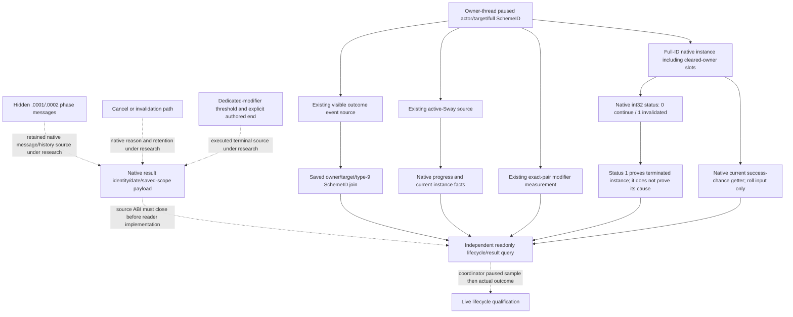

# Sway phase history and lifecycle source — CK3 1.20.0.2

The current migration reads active Sway instances, complete native start terms,
an independent start receipt, visible outcome events, and the exact pair's
opinion and dedicated Sway modifiers. Whole-instance completion still requires
its own native source. This work package supplies that missing source rather
than treating an ACK, an absent SchemeID, phase progress reset, or total opinion
of 100 as a terminal result.

The executable is the frozen CK3 `1.20.0.2` Crozier build, SHA-256
`AE1BA6FF060BA603842F6F4A2DED0AF4B7D3666B3DD271F75FB01B0DA8E81B2D`.
This package performs only static file research and deterministic fixtures.
Paused live qualification belongs to the coordinating maintainer.

## Existing observations reused

The [active source](ck3-1.20.0.2-sway-state.md) supplies manager-owned full
SchemeIDs, actor/target identities, native progress/goal, and active instance
facts. The [outcome source](ck3-1.20.0.2-sway-outcome.md) supplies visible event
identity, saved owner/target/SchemeID joins and independent decay-aware modifier
measurements. Their completed proof and fixtures are inputs to this work;
neither interface is reimplemented here.

The frozen stock tree establishes that hidden `sway_outcome.0001` and `.0002`
are phase outcomes. `sway_end_effect` can reset progress and continue the same
instance. The authored terminal branch uses the dedicated
`scheme_sway_opinion` modifier's threshold, not total opinion. Native
termination evidence must distinguish ordinary phase success/failure, explicit
end, player cancellation and invalidation.

## Native source tree before implementation

Four disjoint packages run in parallel:

- [Hidden result history](ck3-1.20.0.2-sway-completion-history.md): actual
  retained native result/message source, complete identities and source join.
- [Cancellation and invalidation](ck3-1.20.0.2-sway-completion-cancel.md): actual
  native path, reason and the lifetime of any retained terminal source.
- [Phase and repeat semantics](ck3-1.20.0.2-sway-completion-phase.md): exact
  authored branches and native inputs that distinguish phase from instance end.
- [Readonly provider](ck3-1.20.0.2-sway-completion-provider.md): implemented only
  after those source trees and exact-build ABI contracts exist.

The cancellation source has closed a directly usable current-instance field.
Native termination writes Scheme `+0x28`, a signed 32-bit enum whose exact table
at `0x4779528` names `0` as `continue` and `1` as `invalidated`. Player cancel
also writes `1`; that enum does not distinguish natural invalidation from
cancellation or an authored end. The native full SchemeID and target survive
until database purge while the owner becomes `FFFFFFFF`. A full-ID reader can
therefore observe a terminated instance that the existing owner-filtered active
reader omits. The new contract publishes the native enum and actual terminated
fact separately from any cause or retained history.

The phase source also closes `0x2A4A400(CActiveScheme*, int64_t* out)`, the current
native success-chance input. Its scale is Q100000 percent: `100%` is `10000000`.
The getter computes the current roll input, not a result already rolled. Its
exact branch and source pins belong to the linked phase topic.

## Current query contract

The independent selector is `query-sway-completion-v1-private`. Its payload
contains four integers: `expected_revision`, `actor_character_id`,
`target_character_id` and the complete `scheme_instance_id`, including its
generation bits. A successful transport returns the actual provider under
`command_result.result.sway_completion`, with private/read-only metadata and
the selected executable identity. Unavailable source reads preserve the actual
request identity; they do not manufacture a missing instance.

| Observed native source | Published fact | Interpretation |
| --- | --- | --- |
| Matching full-ID Sway row, status `0` | `continue`; current native success-chance input | Current instance and roll input, without a result inference |
| Matching full-ID Sway row, status `1` | `invalidated`; `native_terminal_state_observed = true` | The instance has actually entered the native terminal state; cause remains separate |
| Owner `FFFFFFFF` on that terminated row | `owner_cleared = true`, raw owner marker | The previous owner is no longer stored; a consumer retains its earlier tracked-instance source |
| Matching row, native status `2` or another value | Exact raw value and native key | No invented phase, completion or cancellation result |
| Missing slot or different full generation | Observed absence or `storage_slot_reused` | Absence does not establish termination |
| Unreadable source or changing frame | `available = false` with reason | The query supplies no usable source observation |

The current native row is retained only until the manager purges it. Hidden
phase messages need a separate source whose actual payload can join the complete
SchemeID. Rendered good/bad message text or a target icon alone cannot supply
that join. Where stock rendering discards the source payload, the next source
work is an observer of the actual native event/message execution input before
that discard, with copied identities and exact-build ABI evidence.

The new provider's own mailbox and serializer are separate from shared dispatch,
CMake, Python and MCP integration. The coordinator integrates those surfaces
after the source package is ready. This is work in progress, not `static-ready`
for the complete hidden-phase/cause lifecycle, and has no live acceptance.
Pending source edges remain dashed until their evidence is recorded in the
linked topics.

The current-instance component is now **static-ready**. Its actual production
reader, owning `QueryMailboxEnvelope` executor and full `command_result`
formatter pass MSVC `/Od` and `/O2`, both with `/W4 /WX`. Each mode produces
seven actual JSON frames covering current roll input, owner-cleared terminal
state, purged absence, reused full generation, native invalid sentinel, disabled
binding, and actual early core-source failure. The worker handler separately
compiles in both modes. The final receipt is
`Z:/ck3_mod_rewrite/artifacts/g2-offline-2026-10-01/sway/completion-provider/final-v3/result.json`,
SHA-256 `e4fd9a51899553d6b8656ca81e4e6a80fdebde857ace7fc29a8bae3fc7af52c5`.

The first source version lost the actual request on an early native-source
failure. The finalized reader copies request identity before reading the core;
the actual failure-path JSON preserves actor, target and full SchemeID.
Earlier attempts remain in the provider artifact directory. No game process,
pipe or desktop was used by this package, and shared dispatch/MCP integration
and real paused qualification are separate coordinator work.
