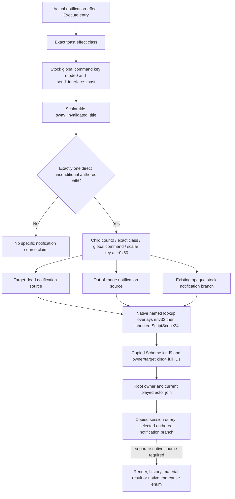

# Sway selected invalidation notification source — CK3 1.20.0.2

This independent reader starts at actual `send_interface_toast` Execute input.
It consumes the exact-build context proof from the `invalidation_context`
research package and reuses the existing notification-effect Execute wrapper
through a future second sink. It provides no installer and changes no frozen
hidden or termination source. Readiness is `static-ready`: its source inputs
and helper fixture passed. No game process is accessed here.

EXE SHA-256:
`AE1BA6FF060BA603842F6F4A2DED0AF4B7D3666B3DD271F75FB01B0DA8E81B2D`.

Native conditional dispatch has already selected the executing toast before
this entry. The three stock invalidation branches each author a separate toast
with one unconditional direct child. The reader does not scan a description
tree recursively or infer a reason from current character predicates. The
existing at-war child is kept opaque; no war research is performed.

Stock command-key IDs at effect `+0x08` with mode byte `+0x0C==0` use native
global key getter `0x3F4F900`. Named scope IDs use their separate native domain.
Native lookup `0x373B540` reads the effective `context+0x18` environment and
falls back to inherited ScriptScopeData, preserving full SchemeID after root
switches to owner and after the live Scheme allocation disappears. The reader
copies the raw Scheme token and does not resolve a destroyed instance.

The exact context inputs are documented by
[the native context study](ck3-1.20.0.2-sway-completion-invalidation-context.md),
[its ABI](../../research/sway_completion12002_invalidation_context_abi.json), and
the source proof under
`Z:\ck3_mod_rewrite\artifacts\g2-offline-2026-10-01\sway\completion-invalidation-context\`.
That package passed 17 anchors, six factory/lookup slots and 707 instructions.
This reader reuses that proof without repeating its verifier.

The independent [reader API](../../ck3_autonomous_player/native_bridge/include/xar_bridge/ck3_12002_sway_completion_invalidation_reason.hpp)
and [implementation](../../ck3_autonomous_player/native_bridge/src/ck3_12002_sway_completion_invalidation_reason.cpp)
call the typed native global-command getter and named token lookup. They require
one direct child and zero nested children, check the child's own stock global
command domain/key, and copy its authored scalar reason key. Recognized branch
keys are `target_dead_notification_source`, `out_of_range_notification_source`,
and `opaque_existing_stock_notification_source`. The latter only preserves the
existing authored key. Multiple notifications for the same SchemeID remain
separate records because the range condition is independent of the prior
dead/opaque condition. A tracked Sway identity can be joined through its prior
or current full SchemeID observation; this raw-token reader makes no new
claim about an already destroyed object's current type or target liveness.

`CaptureAndRecordSwayInvalidationReason12002` belongs inside the existing single
notification Execute wrapper, before unchanged original forwarding. It adds
no new slot hook. The 128-entry `SwayInvalidationReasonRecorder12002` copies all
token and identity values and queries by actor, target, full SchemeID and
sequence. `SerializeSwayInvalidationReason12002` emits bare schema
`xar.ck3.sway-invalidation-notification-source.v1`; the coordinator-owned
selector is `query-sway-completion-invalidation-reason-v1-private`. Native end
cause, terminal state, message enqueue/history, render and material flags all
remain independently false for these notification input records.

The [new fixture](../../ck3_autonomous_player/native_bridge/src/ck3_12002_sway_completion_invalidation_reason_test.cpp)
and [runner](../../ck3_autonomous_player/native_bridge/research/run_sway_completion12002_invalidation_reason_fixture.py)
passed 23 checks each with MSVC `/W4 /WX`, `/Od` and `/O2` in
`Z:\ck3_mod_rewrite\artifacts\g2-offline-2026-10-01\sway\invalidation-reason\attempt-002\`.
The fixture exercises the actual reader and copied recorder with typed callback
seams for the separately proven native getters. It verifies ScriptScope24
Scheme fallback without a live instance, Env32 owner/target precedence, three
selected branch tuples, multiple receipts, copied records after context
mutation, and ignored nested/multiple children or unsupported command domains.
Attempt 001 is retained as the earlier GREEN 22-check version before the final
child command/count inputs were added. The fixture entry gained an embedding
macro after attempt 002 so the focused transport suite can include its actual
helpers without running the previous native matrix; default entry remains
`main`. No hidden, termination or source-proof matrix is rerun by this fixture.

The remaining runtime step is the root's second sink in its one installed
notification Execute wrapper, then a real query/paused artifact. No fixture
record is presented as an observed running-game notification.
