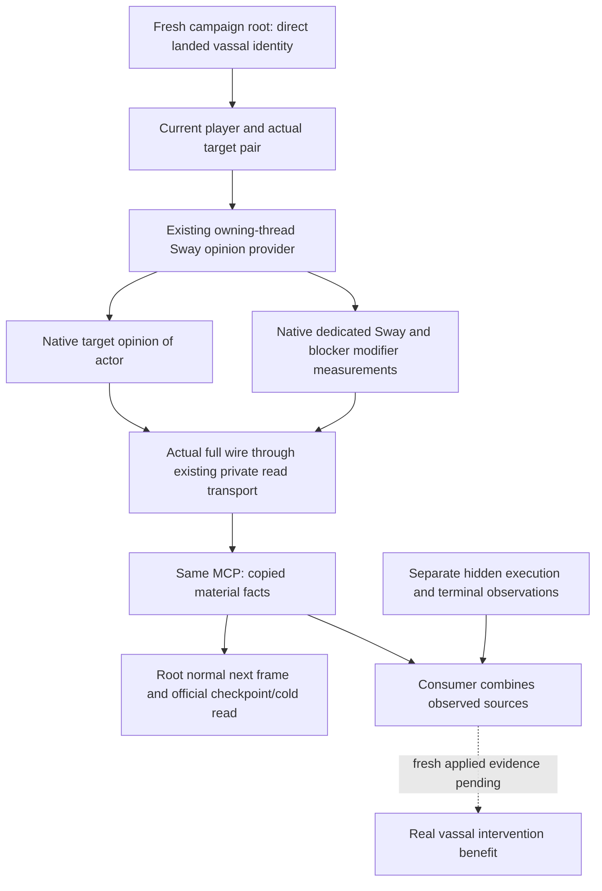

# CK3 1.20.0.2 Sway independent material opinion query

This leaf publishes the already implemented exact-build native
`ReadSwayOutcomeOpinionV1` through the existing private MCP read transport.
Root has now qualified its independent material read as a
**production-live primitive** with a real paused R11 cold packet. It makes no start, retarget, cancel,
event choice or game-time operation and adds no policy or ledger.

The frozen executable is CK3 1.20.0.2 Crozier, SHA-256
`AE1BA6FF060BA603842F6F4A2DED0AF4B7D3666B3DD271F75FB01B0DA8E81B2D`.
The existing [native outcome tree](ck3-1.20.0.2-sway-outcome.md) and
[gift/opinion ABI](ck3-1.20.0.2-gift-opinion.md) are the implementation inputs;
their exact-build ABI was reused without a new reverse-engineering pass.
`BindSwayOutcomeImage` uses the new event-window Core and
`BindGiftOpinionImage12002`; total opinion calls new `0x28BC490(recipient, actor)`.
The two dedicated modifiers are native decay-aware measurements, not authored
effect projections or total-opinion differences.

Root's current R10 campaign-root packet at
`artifacts/g2-offline-2026-10-01/targeted-sdk-r10/r10-core-council-sway-readonly-20261001T151027Z/003-ck3_query_campaign_root_context_v1.json`
is available for actor 29829, date 53169360, native revision 1, and proves that
tracked Sway target 33433 is still a direct landed vassal. Targeting faction
count is zero in that frame. This makes a current Sway material read useful
for the real vassal intervention; historical count zero does not close the
future faction/gift route. The existing Sway start and instance observations
do not establish dedicated modifier benefit or a phase/terminal result.

The existing native selector is `query-sway-outcome-opinion-v1-private`.
Request integers are `expected_revision`, `actor_character_id` and
`target_character_id`. No event instance or SchemeID is required for this
independent pair measurement. The production owning-thread executor is
`ExecuteSwayOutcomeMailboxV1`, with `opinion_only=true`, and the existing
`HandleSwayOutcomeEventV1` emits `result.sway_outcome_opinion`.
Shared dispatch registers only the opinion selector.

The body schema is `xar.ck3.sway-outcome-opinion-v1`, build `1.20.0.2`.
It retains current snapshot revision/date/player/target, `available` and the
native unavailable reason, target→actor opinion, and
`scheme_sway_opinion`/`sway_blocker_opinion` as `{observed,present,value}`.
Present zero stays distinct from an absent modifier and from an unreadable
measurement. `instance_terminal_outcome_observed` and
`cancel_outcome_observed` remain false. A current positive dedicated modifier
is a material fact; attribution to a particular captured phase is separate.

The Python leaf is
`ck3_autonomous_player/src/xar_autoplayer/bridge/active_scheme_sway_outcome_opinion_private_transport.py`.
It reuses `read_private_g2_native_query_v1` and the actual paused hello/frame
binding. Its API is
`query_active_scheme_sway_outcome_opinion_private_v1(driver, expected_revision=..., target_character_id=..., timeout_seconds=...)`.
The public revision maps through the existing transport to native revision;
actor is read from the current player snapshot. The result copies native
measurement values and attaches existing exact-build/query provenance.

Shared registration is the read-only MCP
`ck3_query_active_scheme_sway_outcome_opinion_private_v1`, controlled by
`--private-active-scheme-sway-outcome-opinion-query`, default off. The native
build flag is `XAR_CK3_ENABLE_G2_ACTIVE_SCHEME_SWAY_OUTCOME_OPINION_PRIVATE_QUERY_V1`.
The sole new native owner-executor/provider/full-wire case and the sole new
production SDK case are frozen under
`artifacts/g2-offline-2026-10-01/m4-intervention-live-next/`.
No old matrix is repeated. Root owns fresh live qualification, normal advance,
checkpoint/restore, Git and capability reporting; this source change alone
does not complete M4 or M6 or improve the G2 completed count.

The sole new native `/O2 /W4 /WX` owner/source/full-wire case passed. It uses
only `permitted_executor_sway_outcome_opinion12002`, leaving primary and other
permits null, and exercises actual submission admission, `QueryMailboxEnvelope`,
`ExecuteSwayOutcomeMailboxV1`, the existing opinion provider and the same full
serializer now used by the production handler. The event window is absent;
the two real wire samples preserve present zero and absent measurements.
Receipt: `m4-intervention-live-next/outcome-opinion-native/result.json`, SHA-256
`c2d12961442618f23f39495845c630a024f04c613970a30fc3a0dfa0d4397b38`.
Two earlier harness link attempts failed before fixture execution and are
preserved. Correcting their link dependencies changed no provider behavior.
This is a source-path fixture, not a new paused material measurement.

The two complete native packets are copied byte for byte into
`ck3_autonomous_player/native_bridge/research/fixtures/ck3_12002_sway_outcome_opinion/`.
Its `provenance.json` pins the source, executable and native receipt and records
their non-live boundary. The sole new SDK case consumes those durable packet
bytes through the actual Python transport, Driver and MCP registration; it
changes only parsed request correlation and supplies fixture hello/snapshot
context. It does not hand-fill native result metadata or measurements.

The sole new combined SDK test passed in 4.26 seconds. Both actual full native
packets run through `NativeProtocolState.ingest/cache/wait`, the production
Driver method and official MCP client. It verifies default-off registration,
the read-only annotation, unchanged DTO measurements, present value zero versus
absent null, and false terminal/cancel claims. Receipt:
`artifacts/g2-offline-2026-10-01/python-sway-outcome-opinion-sdk-next/focused-test-20261001T153429Z.json`,
SHA-256 `5d2de8859b32ab0ef722af3f6432c5756d770cd0e5cf3f7d81f9fc1552caf406`.
The fixture and SDK evidence remain unchanged; no previous test matrix was
repeated for live qualification.

At 2026-10-02 00:19:08 Asia/Shanghai (the attempt directory's UTC timestamp),
root's fresh R11 cold query returned `available` for actor 29829 and target
33433, native revision 6, date 53170104. The actual packet is
`artifacts/g2-offline-2026-10-01/targeted-sdk-r11/r11-cold-law-and-sway-material-20261001T161908Z/006-ck3_query_active_scheme_sway_outcome_opinion_private_v1.json`,
SHA-256 `e7629677b0e8656758ff447d409aa140ea346688d3a9fe2b96dfedd85a068503`.
Target opinion of actor is **-18**. Both `scheme_sway_opinion` and
`sway_blocker_opinion` have `observed=true`, `present=false`, `value=null`;
these are readable absent modifiers. Terminal and cancel outcome observations
remain false. This supplies a current material baseline and proves the
production query, but does not prove a Sway benefit or attribute the total
opinion change to the tracked scheme. The same attempt's existing completion
query independently still reports SchemeID 50331723, generation 3, present
and able to continue; those instance facts do not change the modifier result.

Root reports that the first RED and this GREEN attempt used the same CK3 PID
97312, with no source change or restart. The initial attempt
`r11-cold-law-and-sway-material-20261001T160813Z/054-ck3_query_active_scheme_sway_outcome_opinion_private_v1.json`
is preserved. Its saved MCP packet contains only the generic RED message and
no native failure body, so its exact cause remains unclosed. The subsequent
GREEN query ends that investigation; no raw instrumentation or speculative
provider fix was added. Compact baseline and report fields live under
`artifacts/g2-offline-2026-10-01/m4-intervention-live-next/r11-material-live-*.json`.
M4, M6 and the G2 completed count remain unchanged until root records a real
intervention outcome and the required formal loop.

### 2026-10-04 actual positive Sway material, normal continuation and R27 cold

The original Robert29829→34333/full134217986/gen8 once-Start has an actual absent dedicated modifier baseline and independent active-instance receipt; original following consumption and normal save are sealed separately. Root's actual raw53249664/native136 pair read observes **scheme_sway_opinion={observed:true,present:true,value:25}** and total opinion27. A second closed same-PID measurement at raw53249736/native151 retains25 after three real normal days. Old total opinion−8→27 arithmetic+35 is not attributed to Sway.

Root's new-PID cold **R27/PID122268/source39b55512 (`Z:/g58`)** SDK11235 closes GREEN at **raw53249808/native3/public2** on exact CK3 1.20.0.3/SHA94B55397.... Same-SDK independent opinion still measures27 and dedicated25, blocker observed absent/null; actual original full134217986/gen8 remains continuing with fresh target183/355. The four original observers/queries are complete before advance, new-process rings attached/empty/no gap. This is actual cold-after-material persistence, not a fixture or a replayed Start. It closes the narrow **useful Sway intervention action/material/next/cold production-live loop**; precise source-phase attribution and whole-instance terminal state remain separate unqualified claims.

An empty newly attached process ring cannot refute this native positive modifier or replay an earlier PID's phase history. No hidden-success record is added as a prerequisite for the useful intervention loop. If a later natural executing-source record is captured, its exact identity/date/sequence can qualify that specific phase attribution; the currently continuing scheme is not reported as terminal. Original M4/M6/NW whole-package credit is unchanged by this single slice.

Evidence: `Z:/ck3_mod_rewrite_process_assets/g2-resume-20261003/actual-sway-next-material-v52/r27-actual-cold-six-consumption-01/ROOT-DELIVERY.json`, `REPORT-FIELDS-20261004.json` and `../current-contract-boundary/ROOT-DELIVERY.json`. Six Root-authorized Sway leaves are each parsed/hashed once and cached. Old template7388/1791 metadata is historical and is not the actual new runtime identity. This read adds0 days/actions/Start and no schema, gate or tests; ordinary campaign/battle continues independently.
