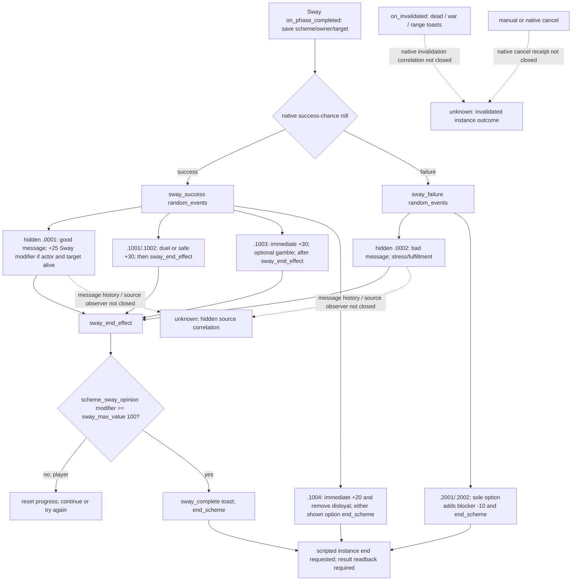

# Sway outcome source and exact instance join — CK3 1.20.0.2

This package observes a current Sway outcome event, its exact actor, target and
saved native SchemeID, and the target's current opinion of the actor. It does
not label an ACK, an absent instance, an opinion delta, or a presented outcome
event as a completed scheme. The source tree below is the implementation input;
the ordinary hidden outcome and cancellation branches remain explicit work.

Build: `1.20.0.2`; frozen executable SHA-256
`AE1BA6FF060BA603842F6F4A2DED0AF4B7D3666B3DD271F75FB01B0DA8E81B2D`.
All work is file-only; no CK3 process, pipe, desktop, Steam or userdir access.
The existing [nonreligious scheme tree](nonreligious-schemes-ai.md) remains the
historical 1.19 input ledger, not an acceptance of this reader on 1.20.

## Stock final branches

The frozen `common/schemes/scheme_types/sway_scheme.txt` records
`base_progress_goal = 365`. `on_phase_completed` saves `scheme`, `target`,
`owner`, rolls against native `scheme_success_chance`, and routes to
`sway_success` or `sway_failure`. This is a **phase result**, not an instance
terminal result.

`sway_end_effect` calls `reset_failed_scheme_effect` below the dedicated
`scheme_sway_opinion` threshold; that effect resets progress and removes three
end buffs. Player success and failure can both continue on the same SchemeID.
The AI-only stop probabilities are stock evidence and are not an entry for our
player automation. A high **total opinion** does not satisfy the threshold;
the trigger checks that specific modifier. The alternative compelled-to-submit
modifier is an authored branch, not an interchangeable threshold input.

`.0001` and `.0002` are `hidden = yes` and send interface messages, so the
current-event-window producer cannot see them. A standard success grants 25
authored modifier points, guarded by actor and target being alive. `.1001/.1002`
safe native option 1 grants 30 `scheme_sway_opinion` points. `.1003` grants 30
in `immediate`; its native option 2 keeps that gain, with `sway_end_effect` in
`after`. A source gain is not a guaranteed total-opinion delta because native
clamping, modifier state, decay and other effects contribute to the total.

`.1004` adds 20 in `immediate`, removes `disloyal`, and ends through either
conditional authored option. `.2001/.2002` add `sway_blocker_opinion = -10` in
their only option and end the instance; `.2002` also adds the vigilant modifier
for five years. The native branch evidence is more specific than a vanished
SchemeID, but the current event is still a pre-selection observation.

No faith/rite/doctrine/tenet producer or policy is added. Conditional stock
side effects remain outside this narrow nonreligious result contract.

## Native and GUI source join

The stock scheme event widget requests
`EventWindowWidget.GetScope.sScheme('scheme')`. The existing 1.20 event-window
reader already copies the canonical event key, root character and named saved
characters. This companion resolves just the named `scheme` payload.

`CJominiScriptScopeObject<CActiveScheme>` primary vtable `0x4753CE0` uses
`0x1B9D650`, which returns generic type **9**. The native consumer at
`0x1B9D670` reads type 9 and the 32-bit SchemeID at token `+0x08`, resolves
through image slot `0x5D1FC58`, storage slots `+0x20`, capacity `+0x2C`, stride
`0x10`, object `+0x08`, and checks the complete ID against Scheme `+0x10`.
Fallback slot `0x5D1FC48` is not accepted as a material instance.

The companion must pair the expected actor/target/SchemeID with the event's
root, `owner`, `target`, and typed `scheme`. It reuses the current-event producer
on the application owner thread. It additionally verifies native scheme owner
`+0x2C`, character target kind `0` at `+0x30`, target ID `+0x34`, instance
vtable `0x47794E8`, type pointer `+0x20`, type vtable `0x48B9F20`, canonical
`sway` key and `ObDG` tag. These fields reuse the companion active-Sway reader's
new-build layout proof. It reads target→actor opinion using the shared
1.20 native getter `0x28BC490(recipient, actor)` and publishes that value as an
independent measurement, with no completion inference.

The [gift opinion proof](ck3-1.20.0.2-gift-opinion.md) supplies the native
`COpinionTrigger<false>` receiver chain and generic modifier lookup, active-group
lookup, exact presence and decay-aware sum. This reader uses those same bindings
for only `scheme_sway_opinion` and `sway_blocker_opinion`. Each measurement has
`observed`, `present` and nullable `value`; a present zero stays distinct from an
absent modifier. The dedicated threshold input is therefore available without
substituting total opinion. `conditional_sway_or_compelled` is an authored
projection whose stock condition selects `scheme_sway_opinion` or
`scheme_sway_and_compelled_to_submit_opinion`; it does not assert which modifier
was applied.

## Offline delivery and live boundary

The production interface is
[`ReadSwayOutcomeEventV1`](../../ck3_autonomous_player/native_bridge/include/xar_bridge/ck3_12002_sway_outcome.hpp)
and the independent
[`HandleSwayOutcomeEventV1`](../../ck3_autonomous_player/native_bridge/include/xar_bridge/ck3_12002_sway_outcome_mailbox.hpp)
owner-thread mailbox helper. The selector is
`query-sway-outcome-event-v1-private`; payload integers are `expected_revision`,
`event_instance_id`, `actor_character_id`, `target_character_id` and
`scheme_instance_id`. The helper returns a complete `command_result` with
`result.sway_outcome_event`. It reuses `QueryMailboxEnvelope` and the selected
new-build adapter; shared bridge dispatch, CMake and Python integration belong
to the coordinating package.

The same helper also accepts `query-sway-outcome-opinion-v1-private` with three
integers: `expected_revision`, `actor_character_id` and `target_character_id`.
Its `result.sway_outcome_opinion` invokes `ReadSwayOutcomeOpinionV1` independently
of the current event and active instance. This is the material readback for a
consumed event's known authored branch. It measures the same exact pair's total
opinion and dedicated modifier presence/value, and never supplies a scheme or
terminal-source join. The consumer must retain the earlier exact event/SchemeID
source and selected native option to associate the measurements.

The result provides `exact_scope_join_ready`, `phase_result_observed`,
`phase_result`, absolute `target_opinion_of_actor`, the two dedicated modifier
measurements, and visible options keyed by **native option index**. Projected
authored points and `end_scheme_effect` / `sway_end_effect` are separate from
observed effects. `instance_terminal_outcome_observed` and
`cancel_outcome_observed` remain false for every presented event.

The [frozen source/native contract](../../ck3_autonomous_player/native_bridge/research/ck3_sway_outcome12002_abi.json)
contains 15 stock blocks and six exact native spans. Three supplemental stock
files (message types, Sway opinion modifiers and event widget) are missing from
the partial frozen game copy and are separately hashed from the installed stock
tree; this origin is recorded rather than implied to be a frozen cohort.
The [file-only verifier](../../ck3_autonomous_player/native_bridge/research/verify_ck3_sway_outcome12002.py)
and [fixture runner](../../ck3_autonomous_player/native_bridge/research/run_ck3_sway_outcome12002_tests.py)
retain their output under
`Z:\ck3_mod_rewrite\artifacts\g2-offline-2026-10-01\sway\outcome\`.
`source-native-verification.json` is GREEN. `fixture/result.json` is GREEN for
MSVC Debug and Release `/W4 /WX`: actual core, events, event-window, gift opinion
and Sway reader sources run on fixture-owned memory and callbacks; the new
domain mailbox compiles in both modes. There is no new-build paused live sample.
The independent fixture also reads a positive Sway modifier and then a negative
blocker with no current event, while preserving the separate absence/value
semantics and false terminal flags.

The first visible value is to recognize a naturally presented Sway outcome
for the tracked instance, choose a known deterministic authored option through
the existing event action path, and preserve the actual phase result across
pending consumption. A terminal consumer must still verify the executed branch
and its material postconditions independently.

Remaining work is concrete: ordinary hidden message/native callback identity;
post-selection dedicated modifier and native terminal-branch readback;
native cancellation/invalidation source and reason; new-build paused event and
opinion samples; event selection, material branch postconditions, next-turn and
cold checkpoint. No new-build live or whole-Sway lifecycle acceptance is claimed.
