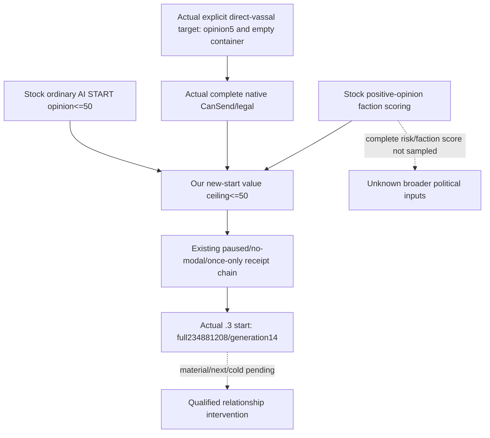

# CK3 1.20.0.2 Sway active state and start receipt

The migration provides an actual paused owning-thread Sway source, complete native start terms, one typed send, and an independent fresh **start** receipt. It is **static-ready**, with no new-version live qualification. The frozen Crozier executable is 101039736 bytes, SHA-256 AE1BA6FF060BA603842F6F4A2DED0AF4B7D3666B3DD271F75FB01B0DA8E81B2D. Existing1.19 primitive/live evidence remains historical.

## Native tree and ABI

The stock game/common/schemes/scheme_types/sway_scheme.txt identifies a basic, non-secret, character-target scheme and stock base goal365. The reader publishes the actual instance goal. It counts all player-owned instances as opaque identities and interprets only Sway metrics, so an unrelated occupied scheme remains visible in the owner count.

| Native edge | Exact new-build evidence |
| --- | --- |
| GameState→GameData | New CoreBindings GameState slot0x5C68C50, state+0xA0 |
| GameData→CSchemeManager | constructor0x2ADC7F8 embeds **+0xA5C0**, vtable0x4779538 |
| Manager→storage | 0x2ADC820/+0x20, constructor call0x2ADC824→0x2A54BD0 |
| TPdxRefDatabase<CActiveScheme> | vtable0x4779828; storage base+8, block table+8, slots+0x20, capacity+0x2C, active count+0x3C |
| Slot / block identity | stride16, object pointer+8; block length1024, instance stride0x358; full SchemeID+0x10 and generation high8 |
| CActiveScheme | vtable0x47794E8, deleting destructor0x2A491C9 size0x358 |
| Type identity | instance+0x20; CSchemeType primary vtable0x48B9F20; MSVC key+0x18 and GDbO marker+0x38 from serializer0x2A491F0 |
| Owner / target | serializer0x2A49367 owner+0x2C; 0x2A493CA target kind+0x30; 0x2A4945C target full ID+0x34 |
| Basic / progress / goal | getters0x2A46720 type+0xA4E; 0x2A46760 instance+0x78; 0x2A46770 instance+0x350 |
| Exposed / frozen | serializer0x2A49746 +0x27C; 0x2A49AD7 +0x2A8 |
| Target's opinion of actor | shared [gift opinion receiver](ck3-1.20.0.2-gift-opinion.md), native0x28BC490, full CharacterIDs and real receiver direction |
| Native start and owning command | [Sway complete CanSend and command](ck3-1.20.0.2-sway-command.md), rebuilt current pair with once-only owning clone/queue |

~~~mermaid
flowchart TD
    F[Actual new adapter: paused actor/date frame] --> M[GameData+A5C0 manager/storage]
    M --> C[Count every own instance: complete ID and generation]
    C --> S[Decode only basic Sway progress/goal and target]
    S --> O[Read target opinion of actor]
    O --> L[Actual shown, validity and complete CanSend]
    L --> Q[Copied query: owner count and active Sway rows]
    Q --> A[Fresh next pump: same container/date/opinion]
    A --> K[Typed Sway command: rebuild terms and owning queue]
    K --> P[submitted_verification_pending]
    P --> R[Fresh instance reread: unique new matching SchemeID]
    R --> I[applied: start postcondition verified]
    I -. new-version live pending .-> T[Next turn/checkpoint/cold and material result]
    T -. hidden standard phase history not exposed .-> E[Instance terminal outcome]
~~~

ReadActiveSwayState12002 uses real CoreBindings and two complete copied container/row reads. It returns no engine pointers. Each instance pointer agrees with its allocated block/slot and complete ID; every live slot agrees with the native active count. Owner container generation hashes every owned full ID, including other opaque scheme types. Generation zero is legal. Basic Sway complex metrics stay not_applicable; other types' metrics stay unavailable.

## Production provider and consumer contract

New domain files are ck3_12002_sway_state.hpp/.cpp, ck3_12002_sway_mailbox.hpp/.cpp, ck3_12002_sway_handler.cpp, and ck3_12002_sway_serializer.cpp. HandleActiveSwayPrivate12002 creates an actual new-adapter QueryMailboxEnvelope, calls ExecuteActiveSwayMailbox12002 in the existing owning mailbox, and keeps the old pending/receipt DTO and ledger semantics. Shared bridge dispatch and CMake are coordinated by integration. No old11906 native binder is carried into this provider.

Query55/formal58 selectors remain unchanged. The new query additionally publishes active_sway_instances, each with scheme_instance_id, scheme_instance_generation, target_character_id, native int32 progress/progress_goal, and bool is_exposed/is_frozen. Progress uses basic phase units, not Q100000. active_scheme_count is the complete player-owned count; matching_sway_active is derived from actual Sway rows. An empty array is a valid native observation. Python binds responses to the selected exact build and preserves the old1.19 shape.

The pure action core admits the new executable SHA **only for sway_interaction**. It uses the existing real callback-based state/precondition comparison and once-only submit. ACK remains submitted_verification_pending; a fresh applied receipt means a unique new matching instance exists. ACK, receipt, opinion changes and instance disappearance never establish phase success or terminal completion. Separate [Sway outcome research](ck3-1.20.0.2-sway-outcome.md) shows that standard hidden success/failure messages can reset and continue the same instance.

## Offline validation and genuine live boundary

verify_ck3_sway_state12002.py passed31 decoded instructions,3 vtable prefixes and5 production bindings against the frozen EXE; result: Z:/ck3_mod_rewrite/artifacts/g2-offline-2026-10-01/sway/state/abi-result.json. The MSVC /O2 /W4 fixture runs actual active source/Core resolver, Sway terms/command provider, action/receipt core and production serializers. It covers negative opinion, one owning clone/queue, ACK without a created instance remaining RED, fresh generation-zero matching instance yielding a start receipt, progress355/goal365, other owned schemes counted without interpreting them, and storage full-ID rejection.

Four real serialized envelopes are emitted in Z:/ck3_mod_rewrite/artifacts/g2-offline-2026-10-01/sway/state/fixture-production-final/. Python copies their exact bytes into tracked research/fixtures and successfully consumes query/formal and actual-row shapes. result.json pins source, headers, included command fixture and executable.

The additional owning-envelope fixture runs **actual QueryMailboxEnvelope and ExecuteActiveSwayMailbox12002** in MSVC /Od and /O2. It supplies a synthetic adapter frame, legitimate mailbox ownership stamp, and owned native source/command bindings. It verifies completed/frame_stable and native terms/opinion, a once-only pending submit, a missing-instance receipt staying RED, and a fresh matching instance yielding a start receipt. Result: Z:/ck3_mod_rewrite/artifacts/g2-offline-2026-10-01/sway/state/mailbox-fixture-final/result.json. Worker dispatch is compiled by central integration separately. The first mailbox-fixture attempt failed because the synthetic adapter omitted four unrelated abstract overrides; that harness compile RED is preserved.

The original state/fixture compile attempt lacked shared worker wrapper dependencies. Production serializers were separated into their own file. Earlier fixture-final/fixture-wire-final folders retain intermediate wire history. The first native action ID lacked the Python production sway- prefix: a harness input mismatch corrected only in the fixture. No production parser was weakened.

Reproduce from the repository with the project Python:

~~~text
tools\.venv\Scripts\python.exe ck3_autonomous_player\native_bridge\research\verify_ck3_sway_state12002.py --exe artifacts\migrations\2026-09-30\post-update-1.20.0.2\installation\binaries\ck3.exe --output artifacts\g2-offline-2026-10-01\sway\state\abi-result.json
tools\.venv\Scripts\python.exe ck3_autonomous_player\native_bridge\research\run_ck3_12002_sway_state_tests.py --output-dir artifacts\g2-offline-2026-10-01\sway\state\fixture-production-final
tools\.venv\Scripts\python.exe ck3_autonomous_player\native_bridge\research\run_ck3_12002_sway_mailbox_tests.py --output-dir artifacts\g2-offline-2026-10-01\sway\state\mailbox-fixture-final
~~~

Remaining live work: paused native state/final terms, one policy-approved start through the new shared route, fresh native start receipt, next-turn/checkpoint/cold continuation, native Sway modifier/opinion readback and phase/end evidence. Current research and deterministic fixtures grant no live status. Hidden phase-message history, cancellation and invalidation outcomes remain explicit native research gaps; they are not filled with inferred terminal booleans.

## 2026-10-02 Steam1.20.0.3 Murchad candidate read

The frozen `.3` executable is SHA-256 `94B55397ABB687A3DCD436805A5D885E6BE90FA6C693FEB44A9E3BBEEADE02A6`. Root's actual paused SDK capture `artifacts/g2-maintainer-2026-10-02/resume-12003/murchad-v8-sway-target-01` reads actor31853 / target39761 at raw53328360 / native35. The target is the unique direct landed vassal and current Steward in the independently captured same-date campaign root. Both target and dedicated material reads succeed: complete native CanSend/legal_now true, owned scheme count0, matching false, no active Sway rows, target opinion5, and observed absent Sway/blocker modifiers. The normal SDK checkpoint is h2020, SHA-256 `9b7775b341a7c82fbdaf928d3ac6c0765fe614e86ab92dd4b0ec2337186e2ddd`.

This is a production-live read primitive and a current empty-slot/legality/material baseline. At the archived runtime50e, `should_submit_sway` in `sway_formal_consumer.py:94-118` selected only opinion below0; this actual positive5 candidate returned `no_positive_opportunity` through that unchanged formal trial. No new start, dedicated benefit, terminal result or M4 credit is claimed for this frame.

The existing managed entry is `--private-active-scheme-sway-target 39761 --allow-private-active-scheme-sway-formal-trial`. If a later concrete policy-approved start is executed, independently read the new actual actor/target/full-ID/generation before attaching the completion/execution/termination/invalidation readers. The external `m4-sway/murchad-independent-post-material-calls.json` prepares only the target and dedicated-material reads. Normal following-turn consumption, archived native phase records, actual positive modifier benefit, current-role readback and ordinary save/cold remain separate evidence. Rogue actor29829's existing50331723/gen3 instance is outside this Murchad window.

## Low positive opinion: native start value before counter-policy

The exact `.3` stock/source ledger is `artifacts/g2-maintainer-2026-10-02/resume-12003/m4-sway/positive-opinion-policy/`: seven source SHA pins match the frozen migration manifest. `common/schemes/scheme_types/_schemes.info:26,28` distinguishes `allow` (can be started) from daily `valid` (keep going). `sway_scheme.txt:44-70` places opinion<=50 OR a faction-member-vassal exception inside an AI-only **start** branch. Player legality remains the actual complete native result. The interaction's AI-only visibility excludes opinion>=100 at `00_scheme_interactions.txt:2335-2338`; its `ai_will_do:2401-2592` adds base10/vassal10 and other contextual additions/factors. Negative opinion is an urgency multiplier, not the complete value boundary, and no `(100-opinion)` linear scaling is authored there. Omitted focus/factors mean the current final AI score is not measured.

Positive vassal opinion contributes to stock faction create/join scoring (`00_faction_modifiers.txt:919-925`; independence `00_factions.txt:119-125,183-189` uses−0.4). An illustrative5→30 changes that isolated term by−10; this is neither an observed gain nor a probability. Opinion>=80 adds a−1000 score deterrent (`00_faction_modifiers.txt:868-873,906-910`), not a universal membership ban or immediate departure. Current zero targeting factions does not erase the ordinary relationship value. The source provides no opinion input to current feudal obligation percentages or Steward Collect Taxes efficiency; this policy claims no increased tax/levy/task output.

The minimal explicit-target counter-policy uses opinion<=50 for a new start, retaining the existing paused identity, no-modal, empty-container, native-legality and once-only receipt/recovery chain. This ceiling does not govern CanContinue, cancel an active instance after opinion rises or authorize a restart. Full native ranking/cadence, focus/personality/trait/claim/opaque-identity factors, faction-member targets above50, special-role branches, complete faction risk and priority against other useful actions remain quality gaps for a broader selector. Root reports the later family result notallied; it does not establish faction identity or a final faction score. The actual new-start primitive is recorded below; dedicated material benefit and normal next/save/cold remain pending under `positive-opinion-policy/research-and-acceptance.md`.

## 2026-10-02 .3 Murchad actual once-start primitive

Root's `m7-murchad/formal-v11-sway-once-01` uses the existing production `consume_sway_private_once` through an explicitly enabled external same-owner helper. The runtime in `execution-plan.json` is `production-source-ad614bfa/ck3_autonomous_player`; this is a production-live private start primitive, not automatic Sway scheduling by `GameplayBridgeService`. PID46800/raw53328600 was paused, with no active event/pending interaction. Actor31853 targeted39761; complete native CanSend/legal was true with an empty owned container and opinion+5. Exactly one typed submit produced receipt action `sway-074e0042e0a14ac6ba970a250ab04f15`; the separate fresh target read confirmed matching active **full234881208/generation14**, progress **0/310**, not frozen/exposed. Receipt and independent row agree. Native CanSend then becomes false with an occupied matching slot; that is not a continuation or capability failure and does not authorize another start.

The actual resolved ledger view in `turn-001/result.json` reports `applied`, `postcondition_verified=true`, and `next_turn_consumed=false`; its pre/post capture epochs are36080/36308. Opinion remains+5, zero game days elapsed, and this capture did not reread the dedicated modifier. It proves a new active instance only, with no phase, terminal or visible relationship gain claimed. Normal SDK checkpoint is **h2041**, SHA `909d730b496b2fa929e37c6b59ecbe4d93eb198814e86de99d3476af21a9c54a`,111633717 bytes; materialization is available for the same actor/date/episode.

External `m4-sway/murchad-v11-start-actual-proof.json` pins the original commands/turn/checkpoint/runtime. `murchad-v11-next-attach-calls.json` binds six existing readers to the actual pair and starts three independent recorder cursors at0 before root advances time. Root must confirm actual execution/termination/invalidation attachment, then retain natural phase/modal outcomes, independent dedicated opinion material, the ordinary following turn and normal save/cold evidence. M4 intervention and M6 completion remain incomplete. Rogue actor29829/full50331723/generation3 remains separate.

Root subsequently ran `murchad-v11-sway-attach-01` once at the same paused date/native9. All six reads are GREEN: current full234881208/generation14 remains0/310 and CanContinue is true; execution/termination/invalidation each return `observer_attached=true`, actor31853/target39761/full234881208, after/earliest/latest_sequence0, empty records and no retention gap. Empty ring top-level schemas do not expose generation; the same-frame target/completion rows supply the generation14 join. Opinion remains5; both dedicated modifiers are observed and absent (`present=false,value=null`), with no phase/terminal/material gain. Latest normal checkpoint for this attachment capture is **h2042**, SHA `7101535e47217eb443a20ba73cbac8e84798a08858220869408126dafcafe3b0`,111633717 bytes. `m4-sway/murchad-v11-attach-actual-assessment.json` pins the six packets and final checkpoint. Root can now advance ordinary gameplay with those recorders attached; this still does not complete the relationship benefit or next/cold loop.

The current cold truth is `murchad-v13-sway-attach-01`: actual new PID8600 uses SDK runtime `production-source-176f0640/ck3_autonomous_player`, exact .3 EXE SHA above, raw53328600/native1. Its six closed SDK packets retain actor31853/target39761/full234881208/generation14, CanContinue=true and progress0, while the actual goal is now340 (archived v11 goal310). The changed goal is not evidence of linear day progress, a restart or a missing instance. All three new-PID recorders are available/attached to that actual actor/target/full-ID; each cursor and earliest/latest sequence is0, records are empty and no gap is reported. Generation14 is joined through the same-frame target/completion rows, not fabricated into the empty ring schema. Opinion stays5 and both dedicated modifiers are observed/absent; there is no new phase, terminal or material benefit. Final normal SDK checkpoint is **h2048**, SHA `252e21445df712cd6bcee38d09dcb0cf5ef3fef356276a457503383d54244518`,111634574 bytes, same date/actor/episode. The one-pass external assessment is `m4-sway/murchad-v13-cold-actual-assessment.json`. This proves persistence of the private start instance and current recorder attachment after cold restore; M4/M6 readiness is unchanged, with actual relationship benefit and ordinary following-turn evidence still pending.

Root's subsequent `m7-murchad/formal-v13-next-01` executed four normal service turns and31 real game days, raw53328600→53329344 (root's Murchad cumulative91 days). In turn001, private Sway returns `already_applied` without resubmission; the original following-turn consumer reports `next_turn_consumed=true`, following native12/date53328600, after `private-query-player-construction-receipt-v1`. This is an actual same-date ordinary service receipt-consumption step, followed by the independently recorded time advance; it is not a Sway relationship effect.

The closed same-PID `murchad-v13-post31-sway-feast-01` six-reader snapshot is raw53329344/native23: full234881208/generation14 remains active, actual progress31/310, native status0/`continue`, CanContinue=true, exact instance join ready, current native success chance81%. The current progress difference is279 units, with no future-day or benefit forecast from the dynamic goal (cold goal340). Three recorders remain available/attached with sequence0, empty rows/no gap. Opinion remains5 and both dedicated modifiers remain observed/absent; no phase, whole-instance terminal or material benefit is credited. Latest checkpoint for this snapshot is **h2065**, SHA `10dcc21d87143aff4d50aea447d61906eeef8a54946100f27f7d8160ff2fc455`,112173468 bytes. `m4-sway/murchad-v13-post31-actual-assessment.json` records the current native rows and exact following-turn/time boundaries. Continue the normal same-PID flow to natural outcomes; the private start and following-turn primitives do not complete M4/M6 or automatic Sway scheduling.

The subsequent v14 first-cold package `murchad-v14-cold-material-01` uses actual PID88444/runtime `production-source-7ebc43e0`, raw53329800/native1. All six Sway readers are GREEN and preserve full234881208/generation14: actual progress50/340, native status0/`continue`, CanContinue=true, exact instance join and current chance81%. Each of the three new-PID rings is available/attached to actor31853/target39761/full234881208 with after/earliest/latest_sequence0, empty records and no gap. Current source-bound target/completion rows supply generation14. The retained campaign-root packet now independently confirms39761 is still a direct landed vassal. Current total opinion is−5 rather than the previous+5; both dedicated modifiers are observed and absent, with no joined phase/material/terminal record, so this total-opinion change is not attributed to Sway. Raw-date difference from the prior snapshot is19 actual days; changing scheme goals still do not establish a remaining-day estimate. Final normal checkpoint is **h2077**, SHA `18a78e68385137b7fe35679aa8ca6a60437da760189f18ea4e084fa92d9d2577`,112139803 bytes. `m4-sway/murchad-v14-cold-actual-assessment.json` records this actual cold truth. Root may handle the current legal pending request and resume ordinary time with recorders attached; do not submit another Sway or promote M4/M6 without actual benefit/terminal evidence.

After root's next41 natural game days, `murchad-v14-post41-sway-01` closed GREEN at actual PID88444/raw53330784/native25. Full234881208/generation14 remains active at91/310, continue/CanContinue=true, exact instance join and current chance81%. Three recorders still match the actual actor/target/full-ID, available/attached with cursor/earliest/latest0, empty rows/no gap. Opinion remains−5 and dedicated Sway/blocker modifiers remain observed absent; no phase, whole-instance terminal or material gain is observed. Current progress difference219 is not a completion-day forecast. This six-reader packet has no new role query; the actual direct-vassal proof remains the earlier53329800 root packet and is not silently projected forward. Formal stop h2097 precedes the actual SDK post-query checkpoint **h2098**, SHA `6e25989a4063486677088b8a777adf7719d43f1387d8356f01099b23704c1f11`,112530518 bytes, same actor/date/episode. The assessment is `m4-sway/murchad-v14-post41-actual-assessment.json`.

Root reports Murchad cumulative151 real days and leaves the natural Feast2001 node unprocessed for normal save/restore while another isolated episode is bootstrapped. That Feast node is not a Sway phase result. Archive these current-PID records before stop; on the next Murchad cold restore, the existing actual-instance `murchad-v11-next-attach-calls.json` reattaches all three new-PID rings from cursor0 before time advance. Continue full234881208/generation14 without another start, use the existing stock modal registry for the saved event, and qualify dedicated benefit/whole-instance terminal from later actual outcomes. No forecast or M4/M6 Sway credit is added by this41-day interval.
