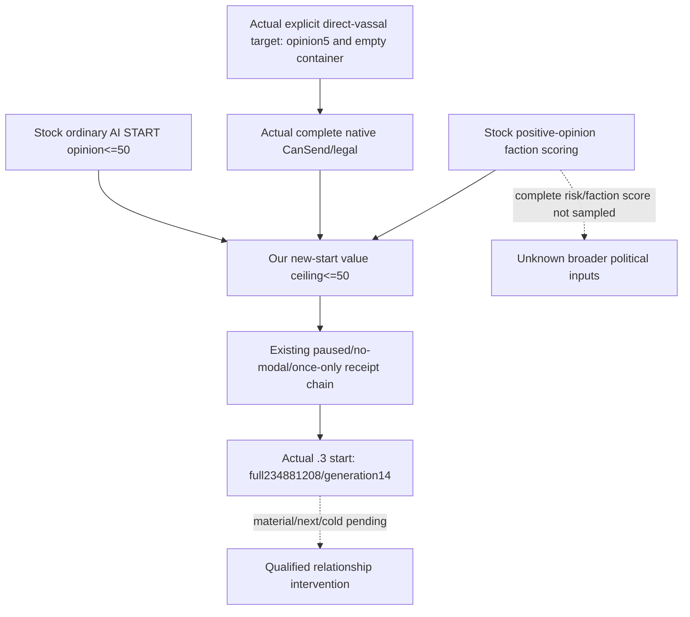

# CK3 1.20.0.2 Sway active state and start receipt

The migration provides an actual paused owning-thread Sway source, complete native start terms, one typed send, and an independent fresh **start** receipt. It is **static-ready**, with no new-version live qualification. The frozen Crozier executable is 101039736 bytes, SHA-256 AE1BA6FF060BA603842F6F4A2DED0AF4B7D3666B3DD271F75FB01B0DA8E81B2D. Existing1.19 primitive/live evidence remains historical.

## Native tree and ABI

The stock game/common/schemes/scheme_types/sway_scheme.txt identifies a basic, non-secret, character-target scheme and stock base goal365. The reader publishes the actual instance goal. It counts all player-owned instances as opaque identities and interprets only Sway metrics, so an unrelated occupied scheme remains visible in the owner count.

| Native edge | Exact new-build evidence |
| --- | --- |
| GameState→GameData | New CoreBindings GameState slot0x5C68C50, state+0xA0 |
| GameData→CSchemeManager | constructor0x2ADC7F8 embeds **+0xA5C0**, vtable0x4779538 |
| Manager→storage | 0x2ADC820/+0x20, constructor call0x2ADC824→0x2A54BD0 |
| TPdxRefDatabase<CActiveScheme> | vtable0x4779828; storage base+8, block table+8, slots+0x20, capacity+0x2C, active count+0x3C |
| Slot / block identity | stride16, object pointer+8; block length1024, instance stride0x358; full SchemeID+0x10 and generation high8 |
| CActiveScheme | vtable0x47794E8, deleting destructor0x2A491C9 size0x358 |
| Type identity | instance+0x20; CSchemeType primary vtable0x48B9F20; MSVC key+0x18 and GDbO marker+0x38 from serializer0x2A491F0 |
| Owner / target | serializer0x2A49367 owner+0x2C; 0x2A493CA target kind+0x30; 0x2A4945C target full ID+0x34 |
| Basic / progress / goal | getters0x2A46720 type+0xA4E; 0x2A46760 instance+0x78; 0x2A46770 instance+0x350 |
| Exposed / frozen | serializer0x2A49746 +0x27C; 0x2A49AD7 +0x2A8 |
| Target's opinion of actor | shared [gift opinion receiver](ck3-1.20.0.2-gift-opinion.md), native0x28BC490, full CharacterIDs and real receiver direction |
| Native start and owning command | [Sway complete CanSend and command](ck3-1.20.0.2-sway-command.md), rebuilt current pair with once-only owning clone/queue |

~~~mermaid
flowchart TD
    F[Actual new adapter: paused actor/date frame] --> M[GameData+A5C0 manager/storage]
    M --> C[Count every own instance: complete ID and generation]
    C --> S[Decode only basic Sway progress/goal and target]
    S --> O[Read target opinion of actor]
    O --> L[Actual shown, validity and complete CanSend]
    L --> Q[Copied query: owner count and active Sway rows]
    Q --> A[Fresh next pump: same container/date/opinion]
    A --> K[Typed Sway command: rebuild terms and owning queue]
    K --> P[submitted_verification_pending]
    P --> R[Fresh instance reread: unique new matching SchemeID]
    R --> I[applied: start postcondition verified]
    I -. new-version live pending .-> T[Next turn/checkpoint/cold and material result]
    T -. hidden standard phase history not exposed .-> E[Instance terminal outcome]
~~~

ReadActiveSwayState12002 uses real CoreBindings and two complete copied container/row reads. It returns no engine pointers. Each instance pointer agrees with its allocated block/slot and complete ID; every live slot agrees with the native active count. Owner container generation hashes every owned full ID, including other opaque scheme types. Generation zero is legal. Basic Sway complex metrics stay not_applicable; other types' metrics stay unavailable.

## Production provider and consumer contract

New domain files are ck3_12002_sway_state.hpp/.cpp, ck3_12002_sway_mailbox.hpp/.cpp, ck3_12002_sway_handler.cpp, and ck3_12002_sway_serializer.cpp. HandleActiveSwayPrivate12002 creates an actual new-adapter QueryMailboxEnvelope, calls ExecuteActiveSwayMailbox12002 in the existing owning mailbox, and keeps the old pending/receipt DTO and ledger semantics. Shared bridge dispatch and CMake are coordinated by integration. No old11906 native binder is carried into this provider.

Query55/formal58 selectors remain unchanged. The new query additionally publishes active_sway_instances, each with scheme_instance_id, scheme_instance_generation, target_character_id, native int32 progress/progress_goal, and bool is_exposed/is_frozen. Progress uses basic phase units, not Q100000. active_scheme_count is the complete player-owned count; matching_sway_active is derived from actual Sway rows. An empty array is a valid native observation. Python binds responses to the selected exact build and preserves the old1.19 shape.

The pure action core admits the new executable SHA **only for sway_interaction**. It uses the existing real callback-based state/precondition comparison and once-only submit. ACK remains submitted_verification_pending; a fresh applied receipt means a unique new matching instance exists. ACK, receipt, opinion changes and instance disappearance never establish phase success or terminal completion. Separate [Sway outcome research](ck3-1.20.0.2-sway-outcome.md) shows that standard hidden success/failure messages can reset and continue the same instance.

## Offline validation and genuine live boundary

verify_ck3_sway_state12002.py passed31 decoded instructions,3 vtable prefixes and5 production bindings against the frozen EXE; result: Z:/ck3_mod_rewrite/artifacts/g2-offline-2026-10-01/sway/state/abi-result.json. The MSVC /O2 /W4 fixture runs actual active source/Core resolver, Sway terms/command provider, action/receipt core and production serializers. It covers negative opinion, one owning clone/queue, ACK without a created instance remaining RED, fresh generation-zero matching instance yielding a start receipt, progress355/goal365, other owned schemes counted without interpreting them, and storage full-ID rejection.

Four real serialized envelopes are emitted in Z:/ck3_mod_rewrite/artifacts/g2-offline-2026-10-01/sway/state/fixture-production-final/. Python copies their exact bytes into tracked research/fixtures and successfully consumes query/formal and actual-row shapes. result.json pins source, headers, included command fixture and executable.

The additional owning-envelope fixture runs **actual QueryMailboxEnvelope and ExecuteActiveSwayMailbox12002** in MSVC /Od and /O2. It supplies a synthetic adapter frame, legitimate mailbox ownership stamp, and owned native source/command bindings. It verifies completed/frame_stable and native terms/opinion, a once-only pending submit, a missing-instance receipt staying RED, and a fresh matching instance yielding a start receipt. Result: Z:/ck3_mod_rewrite/artifacts/g2-offline-2026-10-01/sway/state/mailbox-fixture-final/result.json. Worker dispatch is compiled by central integration separately. The first mailbox-fixture attempt failed because the synthetic adapter omitted four unrelated abstract overrides; that harness compile RED is preserved.

The original state/fixture compile attempt lacked shared worker wrapper dependencies. Production serializers were separated into their own file. Earlier fixture-final/fixture-wire-final folders retain intermediate wire history. The first native action ID lacked the Python production sway- prefix: a harness input mismatch corrected only in the fixture. No production parser was weakened.

Reproduce from the repository with the project Python:

~~~text
tools\.venv\Scripts\python.exe ck3_autonomous_player\native_bridge\research\verify_ck3_sway_state12002.py --exe artifacts\migrations\2026-09-30\post-update-1.20.0.2\installation\binaries\ck3.exe --output artifacts\g2-offline-2026-10-01\sway\state\abi-result.json
tools\.venv\Scripts\python.exe ck3_autonomous_player\native_bridge\research\run_ck3_12002_sway_state_tests.py --output-dir artifacts\g2-offline-2026-10-01\sway\state\fixture-production-final
tools\.venv\Scripts\python.exe ck3_autonomous_player\native_bridge\research\run_ck3_12002_sway_mailbox_tests.py --output-dir artifacts\g2-offline-2026-10-01\sway\state\mailbox-fixture-final
~~~

Remaining live work: paused native state/final terms, one policy-approved start through the new shared route, fresh native start receipt, next-turn/checkpoint/cold continuation, native Sway modifier/opinion readback and phase/end evidence. Current research and deterministic fixtures grant no live status. Hidden phase-message history, cancellation and invalidation outcomes remain explicit native research gaps; they are not filled with inferred terminal booleans.

## 2026-10-02 Steam1.20.0.3 Murchad candidate read

The frozen `.3` executable is SHA-256 `94B55397ABB687A3DCD436805A5D885E6BE90FA6C693FEB44A9E3BBEEADE02A6`. Root's actual paused SDK capture `artifacts/g2-maintainer-2026-10-02/resume-12003/murchad-v8-sway-target-01` reads actor31853 / target39761 at raw53328360 / native35. The target is the unique direct landed vassal and current Steward in the independently captured same-date campaign root. Both target and dedicated material reads succeed: complete native CanSend/legal_now true, owned scheme count0, matching false, no active Sway rows, target opinion5, and observed absent Sway/blocker modifiers. The normal SDK checkpoint is h2020, SHA-256 `9b7775b341a7c82fbdaf928d3ac6c0765fe614e86ab92dd4b0ec2337186e2ddd`.

This is a production-live read primitive and a current empty-slot/legality/material baseline. At the archived runtime50e, `should_submit_sway` in `sway_formal_consumer.py:94-118` selected only opinion below0; this actual positive5 candidate returned `no_positive_opportunity` through that unchanged formal trial. No new start, dedicated benefit, terminal result or M4 credit is claimed for this frame.

The existing managed entry is `--private-active-scheme-sway-target 39761 --allow-private-active-scheme-sway-formal-trial`. If a later concrete policy-approved start is executed, independently read the new actual actor/target/full-ID/generation before attaching the completion/execution/termination/invalidation readers. The external `m4-sway/murchad-independent-post-material-calls.json` prepares only the target and dedicated-material reads. Normal following-turn consumption, archived native phase records, actual positive modifier benefit, current-role readback and ordinary save/cold remain separate evidence. Rogue actor29829's existing50331723/gen3 instance is outside this Murchad window.

## Low positive opinion: native start value before counter-policy

The exact `.3` stock/source ledger is `artifacts/g2-maintainer-2026-10-02/resume-12003/m4-sway/positive-opinion-policy/`: seven source SHA pins match the frozen migration manifest. `common/schemes/scheme_types/_schemes.info:26,28` distinguishes `allow` (can be started) from daily `valid` (keep going). `sway_scheme.txt:44-70` places opinion<=50 OR a faction-member-vassal exception inside an AI-only **start** branch. Player legality remains the actual complete native result. The interaction's AI-only visibility excludes opinion>=100 at `00_scheme_interactions.txt:2335-2338`; its `ai_will_do:2401-2592` adds base10/vassal10 and other contextual additions/factors. Negative opinion is an urgency multiplier, not the complete value boundary, and no `(100-opinion)` linear scaling is authored there. Omitted focus/factors mean the current final AI score is not measured.

Positive vassal opinion contributes to stock faction create/join scoring (`00_faction_modifiers.txt:919-925`; independence `00_factions.txt:119-125,183-189` uses−0.4). An illustrative5→30 changes that isolated term by−10; this is neither an observed gain nor a probability. Opinion>=80 adds a−1000 score deterrent (`00_faction_modifiers.txt:868-873,906-910`), not a universal membership ban or immediate departure. Current zero targeting factions does not erase the ordinary relationship value. The source provides no opinion input to current feudal obligation percentages or Steward Collect Taxes efficiency; this policy claims no increased tax/levy/task output.

The minimal explicit-target counter-policy uses opinion<=50 for a new start, retaining the existing paused identity, no-modal, empty-container, native-legality and once-only receipt/recovery chain. This ceiling does not govern CanContinue, cancel an active instance after opinion rises or authorize a restart. Full native ranking/cadence, focus/personality/trait/claim/opaque-identity factors, faction-member targets above50, special-role branches, complete faction risk and priority against other useful actions remain quality gaps for a broader selector. Root reports the later family result notallied; it does not establish faction identity or a final faction score. The actual new-start primitive is recorded below; dedicated material benefit and normal next/save/cold remain pending under `positive-opinion-policy/research-and-acceptance.md`.

## 2026-10-02 .3 Murchad actual once-start primitive

Root's `m7-murchad/formal-v11-sway-once-01` uses the existing production `consume_sway_private_once` through an explicitly enabled external same-owner helper. The runtime in `execution-plan.json` is `production-source-ad614bfa/ck3_autonomous_player`; this is a production-live private start primitive, not automatic Sway scheduling by `GameplayBridgeService`. PID46800/raw53328600 was paused, with no active event/pending interaction. Actor31853 targeted39761; complete native CanSend/legal was true with an empty owned container and opinion+5. Exactly one typed submit produced receipt action `sway-074e0042e0a14ac6ba970a250ab04f15`; the separate fresh target read confirmed matching active **full234881208/generation14**, progress **0/310**, not frozen/exposed. Receipt and independent row agree. Native CanSend then becomes false with an occupied matching slot; that is not a continuation or capability failure and does not authorize another start.

The actual resolved ledger view in `turn-001/result.json` reports `applied`, `postcondition_verified=true`, and `next_turn_consumed=false`; its pre/post capture epochs are36080/36308. Opinion remains+5, zero game days elapsed, and this capture did not reread the dedicated modifier. It proves a new active instance only, with no phase, terminal or visible relationship gain claimed. Normal SDK checkpoint is **h2041**, SHA `909d730b496b2fa929e37c6b59ecbe4d93eb198814e86de99d3476af21a9c54a`,111633717 bytes; materialization is available for the same actor/date/episode.

External `m4-sway/murchad-v11-start-actual-proof.json` pins the original commands/turn/checkpoint/runtime. `murchad-v11-next-attach-calls.json` binds six existing readers to the actual pair and starts three independent recorder cursors at0 before root advances time. Root must confirm actual execution/termination/invalidation attachment, then retain natural phase/modal outcomes, independent dedicated opinion material, the ordinary following turn and normal save/cold evidence. M4 intervention and M6 completion remain incomplete. Rogue actor29829/full50331723/generation3 remains separate.

Root subsequently ran `murchad-v11-sway-attach-01` once at the same paused date/native9. All six reads are GREEN: current full234881208/generation14 remains0/310 and CanContinue is true; execution/termination/invalidation each return `observer_attached=true`, actor31853/target39761/full234881208, after/earliest/latest_sequence0, empty records and no retention gap. Empty ring top-level schemas do not expose generation; the same-frame target/completion rows supply the generation14 join. Opinion remains5; both dedicated modifiers are observed and absent (`present=false,value=null`), with no phase/terminal/material gain. Latest normal checkpoint for this attachment capture is **h2042**, SHA `7101535e47217eb443a20ba73cbac8e84798a08858220869408126dafcafe3b0`,111633717 bytes. `m4-sway/murchad-v11-attach-actual-assessment.json` pins the six packets and final checkpoint. Root can now advance ordinary gameplay with those recorders attached; this still does not complete the relationship benefit or next/cold loop.

The current cold truth is `murchad-v13-sway-attach-01`: actual new PID8600 uses SDK runtime `production-source-176f0640/ck3_autonomous_player`, exact .3 EXE SHA above, raw53328600/native1. Its six closed SDK packets retain actor31853/target39761/full234881208/generation14, CanContinue=true and progress0, while the actual goal is now340 (archived v11 goal310). The changed goal is not evidence of linear day progress, a restart or a missing instance. All three new-PID recorders are available/attached to that actual actor/target/full-ID; each cursor and earliest/latest sequence is0, records are empty and no gap is reported. Generation14 is joined through the same-frame target/completion rows, not fabricated into the empty ring schema. Opinion stays5 and both dedicated modifiers are observed/absent; there is no new phase, terminal or material benefit. Final normal SDK checkpoint is **h2048**, SHA `252e21445df712cd6bcee38d09dcb0cf5ef3fef356276a457503383d54244518`,111634574 bytes, same date/actor/episode. The one-pass external assessment is `m4-sway/murchad-v13-cold-actual-assessment.json`. This proves persistence of the private start instance and current recorder attachment after cold restore; M4/M6 readiness is unchanged, with actual relationship benefit and ordinary following-turn evidence still pending.

Root's subsequent `m7-murchad/formal-v13-next-01` executed four normal service turns and31 real game days, raw53328600→53329344 (root's Murchad cumulative91 days). In turn001, private Sway returns `already_applied` without resubmission; the original following-turn consumer reports `next_turn_consumed=true`, following native12/date53328600, after `private-query-player-construction-receipt-v1`. This is an actual same-date ordinary service receipt-consumption step, followed by the independently recorded time advance; it is not a Sway relationship effect.

The closed same-PID `murchad-v13-post31-sway-feast-01` six-reader snapshot is raw53329344/native23: full234881208/generation14 remains active, actual progress31/310, native status0/`continue`, CanContinue=true, exact instance join ready, current native success chance81%. The current progress difference is279 units, with no future-day or benefit forecast from the dynamic goal (cold goal340). Three recorders remain available/attached with sequence0, empty rows/no gap. Opinion remains5 and both dedicated modifiers remain observed/absent; no phase, whole-instance terminal or material benefit is credited. Latest checkpoint for this snapshot is **h2065**, SHA `10dcc21d87143aff4d50aea447d61906eeef8a54946100f27f7d8160ff2fc455`,112173468 bytes. `m4-sway/murchad-v13-post31-actual-assessment.json` records the current native rows and exact following-turn/time boundaries. Continue the normal same-PID flow to natural outcomes; the private start and following-turn primitives do not complete M4/M6 or automatic Sway scheduling.

The subsequent v14 first-cold package `murchad-v14-cold-material-01` uses actual PID88444/runtime `production-source-7ebc43e0`, raw53329800/native1. All six Sway readers are GREEN and preserve full234881208/generation14: actual progress50/340, native status0/`continue`, CanContinue=true, exact instance join and current chance81%. Each of the three new-PID rings is available/attached to actor31853/target39761/full234881208 with after/earliest/latest_sequence0, empty records and no gap. Current source-bound target/completion rows supply generation14. The retained campaign-root packet now independently confirms39761 is still a direct landed vassal. Current total opinion is−5 rather than the previous+5; both dedicated modifiers are observed and absent, with no joined phase/material/terminal record, so this total-opinion change is not attributed to Sway. Raw-date difference from the prior snapshot is19 actual days; changing scheme goals still do not establish a remaining-day estimate. Final normal checkpoint is **h2077**, SHA `18a78e68385137b7fe35679aa8ca6a60437da760189f18ea4e084fa92d9d2577`,112139803 bytes. `m4-sway/murchad-v14-cold-actual-assessment.json` records this actual cold truth. Root may handle the current legal pending request and resume ordinary time with recorders attached; do not submit another Sway or promote M4/M6 without actual benefit/terminal evidence.

After root's next41 natural game days, `murchad-v14-post41-sway-01` closed GREEN at actual PID88444/raw53330784/native25. Full234881208/generation14 remains active at91/310, continue/CanContinue=true, exact instance join and current chance81%. Three recorders still match the actual actor/target/full-ID, available/attached with cursor/earliest/latest0, empty rows/no gap. Opinion remains−5 and dedicated Sway/blocker modifiers remain observed absent; no phase, whole-instance terminal or material gain is observed. Current progress difference219 is not a completion-day forecast. This six-reader packet has no new role query; the actual direct-vassal proof remains the earlier53329800 root packet and is not silently projected forward. Formal stop h2097 precedes the actual SDK post-query checkpoint **h2098**, SHA `6e25989a4063486677088b8a777adf7719d43f1387d8356f01099b23704c1f11`,112530518 bytes, same actor/date/episode. The assessment is `m4-sway/murchad-v14-post41-actual-assessment.json`.

Root reports Murchad cumulative151 real days and leaves the natural Feast2001 node unprocessed for normal save/restore while another isolated episode is bootstrapped. That Feast node is not a Sway phase result. Archive these current-PID records before stop; on the next Murchad cold restore, the existing actual-instance `murchad-v11-next-attach-calls.json` reattaches all three new-PID rings from cursor0 before time advance. Continue full234881208/generation14 without another start, use the existing stock modal registry for the saved event, and qualify dedicated benefit/whole-instance terminal from later actual outcomes. No forecast or M4/M6 Sway credit is added by this41-day interval.

## 2026-10-02 .3 Robert current relationship opportunity

Robert actor29829's ordinary campaign episode `native-29829-2bc2d599f7f9` is independent of the Rogue episode with the same actor ID. Current v16 `m4-sway/robert-political-target-actual-01` contains two closed GREEN existing MCP reads at raw53220000/native16. Target34333 is a current direct county-tier vassal (title2147) and Spymaster in the actual campaign-root packet. The target read reports opinion−10, owned active-scheme count0, no matching Sway or active rows, and native final CanSend/legal=true. The separate outcome-opinion query independently reports−10; both `scheme_sway_opinion` and `sway_blocker_opinion` are observed and absent, with null values representing legal absence. This supplies a real explicit-target opportunity for the existing opinion≤50 policy; no new counter-policy or broader target matrix is needed.

The complete current faction query `m4-sway/robert-faction-alerts-actual-01/001-ck3_query_player_faction_alerts_v1.json` reports faction188/`populist_faction` with a legally absent character leader, empty character membership and county members2111/2115. Its stock-danger predicate is true. None of the ten direct vassals is thereby established as a member or leader of this faction, so34333's relationship opportunity is not a claimed mitigation of the populist county faction. It is also not a claimed tax, levy or Council-output improvement. The planned Steward32716→43706 replacement must not preserve32716's old Council role in later joins.

The existing external formal helper explicitly calls `consume_sway_private_once` with target34333; the production service does not automatically schedule Sway. `m4-sway/robert-v16-opportunity-01/ROOT-ONCE-ARGV.json` records the root-owned once entry. The helper takes a fresh snapshot/target read, preserves any existing applied/pending consumer ledger, and returns a newly applied/pending result before time advance. A real new full-ID/generation must come from that action's receipt plus independent native readback before attaching the six existing readers and three process-local recorders. Normal next-turn consumption, save/cold continuity, native phase/whole-instance terminal and independent dedicated modifier benefit remain separate pending evidence. These two current reads alone earn no start, benefit, M4/M6 completion or G2 credit.

Root's subsequent `m4-sway/robert-formal-sway-once-01` uses actual Python source `production-source-d4f377d9` and the existing v16 native runtime. The original once consumer returns `applied`/`postcondition_verified=true` for action `sway-31d5dda86cf74716bf3c8cb546e7ba70`. Its native receipt binds full134217986/generation8, actor29829→target34333, raw53220000. A separate post-action target query at native18/capture346701 independently reports the same full-ID/generation/target, owned active-count1, matching Sway=true, progress0/353, opinion−10, not exposed and not frozen. Post-start final Start CanSend/legal=false is the occupied/current-instance validator result; it is not CanContinue and does not justify another Start. Neither receipt nor target row publishes success chance, so the existing completion reader supplies that field in the next capture rather than importing another episode's rate.

The normal save is **h4041**, SHA `ae7d47c48a81c80ec269b90d542c50506e400552a9e531cd8f2980a5f2b16549`,79403251 bytes, same actor/episode/raw53220000. No game days advance and `next_turn_consumed=false`. This is a **production-live primitive**, with a native receipt, independently observed active instance and ordinary checkpoint; it is not a relationship gain, whole-instance terminal, populist188 mitigation, M4/M6 completion or service-wide Sway scheduling. `m4-sway/robert-v16-started-01/ASSESSMENT.json` preserves the current truth. The root-owned `m4-sway/robert-current-instance-attach-calls.json` binds all six existing readers to actual full134217986/gen8 and first-attaches the independent execution/termination/invalidation recorders from cursor0 before ordinary time advances. Actual attachment, original following-turn consumption, normal save/cold continuity and independent dedicated benefit/terminal evidence remain pending.

The first attachment attempt `m4-sway/robert-current-instance-attach-actual-01` is retained as **harness PARTIAL_RED** under actual Python source `production-source-dd4772c0`: its first target query succeeds at native25 and preserves the same full134217986/gen8/progress0/353/opinion−10. Before the second call sends any native command, the harness fails with `Required registered tool missing: ck3_query_active_scheme_sway_completion_private_v1`. The current plan omitted the four existing independent readonly flags: `--private-active-scheme-sway-completion-query`, `--private-active-scheme-sway-completion-execution-query`, `--private-active-scheme-sway-completion-termination-query` and `--private-active-scheme-sway-completion-invalidation-reason-query`. Current source already maps each flag to its driver attribute and tool registration; this needs only a root plan amendment. No recorder is attached by this partial attempt, no native completion rejection is observed, and no time advances. `m4-sway/robert-v16-attach-permission-repair-01/REMAINING-FIVE-CALLS.json` prepares only the five unexecuted reads after the permission amendment, retaining cursor0 for first attachment without repeating the successful target read or Start.

After root appends those four existing flags, `m4-sway/robert-current-instance-remaining-actual-01` completes only the five remaining queries, all GREEN/closed at raw53220000/native26. The exact-joined completion row preserves full134217986/generation8, owner29829→target34333, native status0/`continue`, instance-present=true, no slot reuse, observed CanContinue=true and actual current success chance **55%** (`5500000/100000`, percent unit). This probability is the current native read, not a promised outcome. All three native schema-v1 execution/termination/invalidation recorders are available and observer-attached to actor29829/target34333/full134217986; each after/earliest/latest sequence is0, records are empty and retention-gap=false. Empty ring headers do not publish generation; the independently joined target25/completion26 rows bind generation8. Independent opinion remains−10 and both dedicated modifiers remain observed absent. **RINGSOK** is therefore actual, with no phase, terminal, benefit or game-day advance; this capture requests no new checkpoint, so the normal saved anchor remains h4041.

`m4-sway/robert-v16-rings-attached-01/ACTUAL-ATTACHMENT.json` and the pure offline `next_query_config.py` preserve recorder versions, the full actual identity and independent cursors. The first normal-day material check prepares only current target/instance/progress plus dedicated opinion (two existing queries). Later record drains occur on an actual native phase/material/terminal signal or before stopping the current game PID; each ring uses its own last observed sequence. A phase/terminal check adds exact completion and independent opinion, without resubmission. A new game PID reattaches completion plus the three process-local rings from cursor0 before advance. No routine six-query sweep is required every turn, and absence of a record at day0 remains absence of an observed outcome. The original following-turn consumer, normal time/material checkpoint/cold and eventual dedicated relationship gain or whole-instance terminal are still pending.

Root then advances one actual normal game day to raw53220024. `m7-robert/actual-next-day-material-01` is a closed mixed **PARTIAL_RED** batch under Python `production-source-c0f53e9b`: the root-context call uses the wrong `expected_native_revision` keyword and fails registered argument validation before native submission, so that domain's law/family reads are not run here. The two Sway material queries and three pre-cold record drains are all GREEN and must not be repeated to repair that other domain. Actual native33 target read preserves actor29829→target34333/full134217986/generation8, owned-count1, matching Sway, progress1/353, not exposed or frozen. Independent opinion remains−10; dedicated Sway/blocker modifiers remain observed absent. All three rings remain available/attached/identity-joined with latest-sequence0, empty records and no gap. Their external cursor receipt is updated to this capture, without game-state writes.

This SDK batch saves normal checkpoint **h4053**, SHA `4ea3cfae9c15a9972a6af30f4a2af8ad2736d04c45f91986db2fd1212975bb03`,79579117 bytes, raw53220024, superseding the preceding day-stop h4052. `m4-sway/robert-first-next-day-01/ASSESSMENT.json` preserves this material. No new completion query is needed in the first-day material check: CanContinue=true/chance55% remain explicitly the prior day0/native26 observation, not a new day1 value. The readonly package contains no original following-turn-consumer result, so one real day alone does not establish `next_turn_consumed`. The failed root call also provides no fresh role proof; the earlier53220000 role join is kept dated. Current evidence has no phase, terminal, dedicated relationship gain or populist188 mitigation, and no remaining-day forecast is made. Root can use the already prepared four-call `m4-sway/robert-v16-rings-attached-01/COLD-REATTACH-CALLS.json` on an actual new game PID before advance, retaining this started instance without another Start.

The actual cold package `m7-robert/actual-cold-material-101084-01` closes the four existing Sway readers GREEN before advance, with original v16 native runtime and Python `production-source-c0f53e9b`. Diagnostics008 proves new PID101084/connection-generation2. At raw53220024/new-process native2, completion exact-joins full134217986/generation8 to owner29829/target34333, instance-present=true, no slot reuse, native status0/`continue`, observed CanContinue=true and a fresh current55% native success chance. The new numeric native epoch is not compared with old PID native33. Three process-local recorders are available/observer-attached to the same actual actor/target/full-ID, each latest sequence0, empty records and no gap; current completion independently supplies generation8. Old-PID pre-stop records were already archived and are not read again. External cursor bookkeeping now explicitly belongs to actual PID101084, with all three cursors0.

This cold completion interface publishes no progress or independent target opinion. The actual1/353/opinion−10/absent dedicated modifiers remain dated prior same-raw-day material from old PID109676/native33, not new cold fields. `m4-sway/robert-cold-101084-01/ASSESSMENT.json` records **RINGSOK** and same-instance cold continuity, with0 cold game days, no new Start, no native terminal or relationship benefit and no populist188/M4/M6/G2 credit. Root can continue the original formal consumer for ordinary next days, preserving full134217986/gen8; actual following-consumer records and later dedicated material/phase/whole-terminal evidence remain independent requirements.

The subsequent actual `m7-robert/actual-cold-following-family-sway-01/turn-001/result.json` supplies the original `private_active_scheme_sway_following_turn` result: status `applied`, same action `sway-31d5dda86cf74716bf3c8cb546e7ba70` and native receipt full134217986/gen8, **next_turn_consumed=true**, following-native6/following-date53220048. Root's proper formal caller uses the original `consume_sway_following_turn` after an executed normal-day delta1; no new Sway submit or raw ledger rewrite occurs. The retained original post-native18/raw53220000 fields are start metadata, while following-native6 belongs to the new PID101084 epoch. This closes the actual original following-consumption dependency and is preserved in `m4-sway/robert-following-consumer-01/FOLLOWING-CONSUMER.json`. The selected field was captured during execution; the batch has now closed as `normal-time-target-reached` with three actual normal-day advances,0 modals and final raw53220096/paused=true. Normal checkpoint **h4065** is saved, SHA `8f3517957d7697a2cbf780f3caedae3ae951a12a52a414378e5738e8ceb186aa`,80076282 bytes. Root's driver artifact is49131360 bytes, SHA `1db0dd4a2eefa90f542cdc7cd5bb84bab493d63daff89ff7dcbd925b9ac1f187`. This closes that durable three-day stage at four days since this Sway start and Robert cumulative3157 days. The marker and elapsed days are neither native phase/whole-instance terminal nor dedicated relationship gain; populist188/M4/M6/G2 credit remains unchanged.

Root's next finite three normal turns add15 real game days, reaching raw53220456/full-save h4075, stage cumulative19 days and Robert cumulative3172 days, still PID101084/original v16. These are the root's actual clock/checkpoint stage facts, not a new Sway-state read. The latest queried progress1/353 and opinion−10/absent modifiers remain explicitly dated53220024 material; neither19/353 progress nor relationship gain is extrapolated. `m4-sway/robert-durable-followup-01/ASSESSMENT.json` records the closed stages and the current observation boundary. Before the planned v19 game-PID switch, root uses `m4-sway/robert-v16-rings-attached-01/PRE-STOP-LATEST-MATERIAL-CALLS.json` once: current target/instance/progress, independent dedicated opinion and the three retained recorders at their individually observed external cursors (currently0). This five-query pre-stop archive has no repeated Start or routine per-turn six-query sweep. Actual latest phase/material/terminal is assessed only from its returned packets, then a real new game PID uses the existing four-call cold attachment from cursor0 before ordinary advance.

That pre-stop capture `m4-sway/actual-before-v19-stop-01` now closes all five queries GREEN under Python `production-source-c0f53e9b`, actual PID101084/raw53220456/native28. The current target row directly observes full134217986/generation8/actor29829→target34333, active-count1/matching Sway, **progress19/353**, not exposed or frozen. This19 is an actual native read rather than day-based extrapolation. Independent opinion remains−10, with both dedicated modifiers observed absent; terminal/cancel outcomes are false. All three retained rings remain available/attached/actual-identity-joined, each latest sequence0, empty records/no gap, and the external cursor book is updated to this exact archive. No native phase, whole-instance terminal or material relationship gain is observed. This five-query bundle deliberately does not repeat completion: CanContinue=true/chance55% remain dated prior cold53220024/native2 observations, not new day19 fields. `m4-sway/robert-before-v19-stop-01/ASSESSMENT.json` supersedes the earlier current-material boundary. Root owns the latest post-query full archive, whose extra readonly history is not inferred from call count, and may normally stop this PID before the actual new-PID four-query reattachment. No repeated Start or populist188/M4/M6/G2 credit is added.

The actual v19 cold four-reader bundle `m7-robert/actual-v19-sway-county-finance-01` is GREEN/RINGSOK at source `production-source-716acfec`, new PID70968/raw53220456/native3 before advance. Completion exact-joins the same full134217986/gen8/owner29829→target34333, present/no slot reuse, continue/CanContinue=true and fresh native55% chance; all three recorders are available/attached/identity-joined with cursor0, empty records/no gap. External cursors now belong to PID70968. Completion still publishes no progress or independent opinion, so19/353/opinion−10/dedicatedabsence remain explicitly the prior same-date warm v16 material rather than new-DLL reads. `m4-sway/robert-v19-cold-70968-01/REPORT-FIELDS.json` preserves0 cold days, no phase/terminal/benefit/newStart and no G2/M4/M6 credit.

The same v19 bundle's actual faction005/root006 have now been interpreted by the political-value owner, pinned in `m4-sway/robert-political-value-v19-actual-01/POLITICAL-READOUT.json` (SHA `fd862e08a7d904c13704f6cf019ea9daa9cceb2693031f8e17eb7b116adb679c`). At raw53220456/native3, the complete current targeting rows contain liberty faction50331692, leader33435/current Marshal/directcounty and character members33435/34333. Target34333 is now an actual faction member as well as current Spymaster/directcounty; it is not the leader. Power32.455 is below threshold80, discontent0/growth−3 per month and stock-danger=false, so this is a watch faction. Current county members/exposures are legally empty; prior populist188 is absent from these complete current rows. This closes a real political association for the already active target without attributing the faction change, member exit, power reduction or opinion benefit to Sway. Keep full134217986/gen8→34333; the new leader33435 does not justify another Start or target redirection. Natural-outcome monitoring in `m4-sway/robert-natural-outcome-monitor-01/EXISTING-OUTCOME-RECIPE.json` reuses the existing stock-bound phase/end/modifier branches and original modal/following consumers, with no ABI/test rerun or new production policy.

### Robert v19 normal batch: fresh target material before advance

The closed `m7-robert/planning-reuse-412-actual-01` batch contains a fresh v19 target query as the first row of `received-command-results.json`, paired with `snapshot-before.json` at `native:5` / raw53220456 / PID70968. Robert29829 in episode `native-29829-2bc2d599f7f9` still owns exactly one matching Sway, full134217986/gen8 targeting34333, with actual progress **19/355**, opinion **−10**, and neither exposure nor freeze. This supplies a new v19 measurement of progress and opinion; the old v16 warm denominator353 must not replace the newly read355. Native start CanSend=false reflects the occupied instance and does not establish a continuation rejection. The target reader does not publish dedicated modifier state, so the previously observed modifier absence remains dated v16 evidence.

The same batch subsequently closed after7 normal game days at paused raw53220624, normal checkpoint/history4081, save SHA256 `ce9c7b4aa8ac70664920696fa9629f58e738b28aa7e8227a7c8ded66bddfec60`, Robert cumulative3179. No post-advance progress measurement is present; **26/355 is not inferred**. The original action remains `already_applied` with its retained, previously consumed following receipt. No new Start, phase/terminal signal, independently measured gain, extra query or G2 completion credit is added. The existing loop keeps the same instance and reuses the next naturally captured fresh target row. Frozen fields: `m4-sway/robert-v19-normal-7d-01/REPORT-FIELDS.json`, SHA256 `c041617c2499de972d0926af0dd38657a2e320e5fd74cd589af532880f3fc4c4`.

### Robert v20 cold restore: existing instance and retained recorders

The closed `m4-sway/robert-v20-cold-actual-01` SDK capture is GREEN on production/native source4ee2e755. Root restored original Robert episode `native-29829-2bc2d599f7f9` at raw53222136/history4113 into minimized PID94488. Actual completion at new native revision3 joins actor29829 → target34333 to the same full134217986/gen8: instance present, exact join ready, no storage-slot reuse, owner matches actor, native status0/continue, CanContinue observed true, and observed native success chance55%. No terminal state or terminal cause is observed.

Execution, termination and invalidation recorders each return available/observer attached with the actual actor/target/fullID, after/latest sequence0, no rows and no retention gap. Completion explicitly binds gen8; recorder headers expose the fullID without a separate generation field. The existing external cursor ingester now tracks PID94488/raw53222136 with all three cursors0; it changed no game state. Empty new-process rings do not establish absence of earlier historical events. Completion supplies no progress or independent opinion: the previously archived v19/native5/raw53220456 target19/355/opinion−10 keeps its source date, and old v16 dedicated-modifier absence is not upgraded to a new v20 observation. Cold attachment adds no phase, benefit or terminal credit. Root's next Python-only sourceb03d34fd retains native/environment4ee and continues the same instance through normal time, without another Start. Fields: `m4-sway/robert-v20-cold-actual-01/REPORT-FIELDS.json`, SHA256 `678e877c0de81499b0573250810b8a10f534fcda4dce054ec514cefaca494f46`.

### 2026-10-03 Robert v20 pre-stop material

At actual capture start00:12:50 Asia/Shanghai, the closed `m4-sway/robert-v20-prestop-actual-01` batch uses Python source6443a516 with native4ee/v20 and PID94488. Five Sway reads at native33/raw53222304 preserve actor29829 →34333, original episode `native-29829-2bc2d599f7f9`, full134217986/gen8, owned count1 and matching active instance. The actual target row publishes progress **96/353**, opinion **−10**, exposure=false and freeze=false. The goal353 is newly measured here; it is not extrapolated from the previously dated19/355 or from elapsed days. The independent opinion reader freshly observes both `scheme_sway_opinion` and `sway_blocker_opinion` as absent with null values, and publishes no observed instance terminal or cancel outcome. Current start CanSend=false reflects the occupied instance. Completion was not repeated: CanContinue=true/chance55% remains the explicitly dated v20 cold/native3/raw53222136 read.

All three retained recorders remain available and attached to the actual actor/target/fullID, each after/latest sequence0, records empty and retention gap=false; execution reports no material or terminal observation. The external cursor ingester records these actual values and the new date without touching game state. The sixth SDK call is a normal save, not another Sway read: checkpoint/history **4140**, size85,752,395 bytes, SHA256 `d620f0998fc712b683c476238e57c995f6e4506ddf86c3c5a7b23e0b2b2da59d`, same original episode/date. No phase, gain or terminal credit is added. Root's next actual new-PID baseline uses the existing cold completion+three-recorder attachment once before normal advance; the started instance is not resubmitted. Fields: `m4-sway/robert-v20-prestop-actual-01/REPORT-FIELDS-20261003.json`, SHA256 `1af11d31fc50e88173f469b4a7225d3619c82a72f226610d02b074dd0e4671ae`.

### 2026-10-03 Robert v21 same-date cold attachment

The closed `m4-sway/robert-v21-cold-actual-01` four-query SDK capture is GREEN on the new native6443/v21 process PID96348 at raw53222304/new native revision3, retaining original Robert episode `native-29829-2bc2d599f7f9`. Actual completion joins actor29829 →34333 to full134217986/gen8: instance present, exact join ready, slot not reused, owner matches actor, status0/continue, observed CanContinue=true and native chance55%. No terminal state or cause is observed. Execution, termination and invalidation recorders are each available and attached to the actual actor/target/fullID, with actual latest sequence0, no records and no retention gap. Their gen8 binding comes from the explicit completion join, not a separately exposed recorder-generation field.

The existing pure archived-packet cursor ingester has switched only external bookkeeping to PID96348/current capture and the actual three0 cursors. This same-date cold attachment advances no day and publishes no progress or independent opinion. The earlier same-day pre-stop PID94488/native33/raw53222304 **96/353/opinion−10/dedicated modifiers absent** remains its own dated warm material, without being relabeled a fresh new-PID reading. Native revisions across processes are separate epochs. No new phase, gain, terminal credit or Start is added; root continues the existing instance through the normal loop. Fields: `m4-sway/robert-v21-cold-actual-01/REPORT-FIELDS-20261003.json`, SHA256 `1ed80e113a803031215152c9a88d7bd1dc84edd346a44dcd94c3593f9c343d5a`.

### 2026-10-03 v21 actual shared-mailbox failure after Family attempt

Two closed normal-turn attempts in `m7-robert/ewan0801-following-normal30-38b4-actual-01` and `-02` advance0 days and complete0 turns on native6443/v21/Python38b/PID96348 at raw53222304. Attempt01 sends the real Sway target query for34333 and receives `ok=false`, `sway executor unavailable`. After root omits that wrapper query, attempt02 sends the public campaign-root query and receives `application-main typed query executor is unavailable or busy`. The first attempt's archived before snapshot already records mailbox installed/submission enabled/owner observed/paused=true, completed and started sequence50, **failure512 and ready=false**. These are native capability failures, not MCP-schema harness errors or target legality results.

Exact native6443 source binds512 to `main_thread_query_failure_executor_exception` in `main_thread_query_mailbox_v1.hpp:132`. The sole setting path in `main_thread_query_mailbox_v1.cpp:1747–1754` catches SEH while invoking the native executor; `:219–222` retains the failure bit. `:1403–1404` rejects later submissions as `infrastructure_failed` (enum5), which `ck3_12002_sway_handler.cpp:81–85` folds to the generic unavailable text before entering the Sway callback. Reclaim retains the bit (`:1578–1600`); readiness requires zero flags (`:1847–1849`). The Sway slot55 registration and allowlist are already present. Python correctly preserves the native error. No independent Sway binding, transport, policy or new gate is needed.

~~~mermaid
flowchart TD
    U[Prior executor leaf: unknown] -. native SEH .-> E[Actual sticky executor_exception512]
    E --> A[TrySubmit rejects: infrastructure_failed5]
    A --> S[Actual Sway target RED; callback not entered]
    A --> R[Actual public campaign-root RED]
    F[ROOT Family Crozier119 fix] -. v22 cold; live validation pending .-> N[New mailbox and existing normal loop]
~~~

Root reports this state arose after Family attempt3 and owns its Crozier119 binding correction plus the combined v22 build/cold recovery. This package establishes the shared SEH failure category; the precise originating callback request and exception instruction remain **unknown** and are not guessed from ordinary `prepared=false`, which alone does not set512. The current paused state was protected by root's existing normal checkpoint at the same date. The original Sway full134217986/gen8→34333 remains started; no Start, phase, benefit or terminal credit is added. Previous cold completion/recordersGREEN cannot by themselves qualify the subsequently blocked target/public query paths. Recovery remains pending actual root validation after the originating native fix. Frozen fields: `m4-sway/robert-v21-target-executor-fault-01/REPORT-FIELDS-20261003.json`, SHA256 `9bd2c9aa4341e81315dff420789107f6e0e686390183cf9a7a0fab7831acd184`.

### 2026-10-03 v22 actual query-executor recovery and existing Sway continuation

The closed mixed SDK capture `m2-events/ewan0801-v22-cold-material-and-sway-01` is GREEN. This owner consumes only004–007, the existing Sway cold four queries, on native/Pythonb594/v22/PID119508 at raw53222304/native4. Completion exactly retains actor29829 →34333/full134217986/gen8: instance present, no slot reuse, owner matches, status0/continue, observed CanContinue=true and native chance55%. Execution, termination and invalidation recorders are available and attached to the actual actor/target/fullID, latest sequence0, empty rows and no gap. The existing external cursor ingester switches only owned bookkeeping to this PID and the actual three0 cursors. No phase, material or terminal credit is added.

Actual executor recovery is independently established by the closed normal batch `m7-robert/ewan0801-following-normal30-b594-v22-actual-01`. Its full archived `snapshot-before.json` directly reports mailbox **failure0/ready=true**, with published/completed sequence12. This is the source of those diagnostic values: the earlier cold seven-call capture's finite semantic snapshot omits mailbox diagnostics. Normal native receipts then show the Sway target request accepted/available and two public campaign-root queries accepted/available at native5. The new target row actually reads **96/355/opinion−10**, same full134217986/gen8, owned count1/matching active and no exposure/freeze, at raw53222304. The measured goal355 differs from old pre-stop353; progress remains96 and is not credited as a gain. Dedicated modifier absence remains the earlier warm PID94488/native33 observation, without a new dedicated opinion query here.

The existing wrapper receives `already_applied` for the original `sway-31d5dda86cf74716bf3c8cb546e7ba70`, then executes normal life advance for3 actual days and saves paused raw53222376/checkpoint4156, size85,706,043 bytes, SHA256 `b138cf4661e1e2509727cc4935dd5fcba686863c5edf974a437e24fbf900dc92`. Its retained postnative18/raw53220000 and followingnative6/raw53220048 receipt fields describe the original Start and following consumption, not a new v22 action or benefit. No post-advance progress99/355 is inferred. Turn2 stops with a natural `existing_consumer_not_ready`, handed to M2; this is separate from the now-cleared executor failure and the whole batch is not relabeled GREEN.

The current target/public query fault is functionally recovered by these real receipts and saved normal advancement, while both original RED attempts remain archived. The exact original SEH instruction remains unknown and future Family default-submit qualification remains its owner's separate actual task. No independent Sway patch, extra query, new Start, benefit/terminal claim or M4/M6 completion is introduced. Fields: `m4-sway/robert-v22-cold-119508-01/REPORT-FIELDS-20261003.json`, SHA256 `8f9ea854d0934c9ee7caf309b6d6c11b6c1e5a6d0e1e674c7d1a593006e761af`.

### 2026-10-03 v23 same-instance cold recorder attachment

The mixed capture `m4-council/role-coverage/religious-relations-value-12003/actual-v23-learning-and-sway-cold-01` is closed GREEN. This owner extracts only the last four Sway calls003–006 on source/native2c435dcb/v23/minimized PID6280, raw53222640/native3, original Robert episode `native-29829-2bc2d599f7f9`. Actual completion preserves actor29829 →34333/full134217986/gen8, present/exact join/no slot reuse/owner match, status0/continue, observed CanContinue=true and native chance55%. The three retained recorders are available and attached to the actual actor/target/fullID, each after/latest sequence0, empty records and no gap. Only external cursors switch to the actual new PID/date/capture. Cold4 publishes no progress or independent opinion, and this cold step advances no day; no new Start, phase, benefit, terminal or M4/M6 credit is added. The first two Clergy calls and prior executor/getter research are not re-analyzed. Fields: `m4-sway/robert-v23-cold-6280-01/REPORT-FIELDS-20261003.json`, SHA256 `b60985e0f3679cbac62e16f627498bd3f68c21ae24fe4c039bf8aa6268c887e1`.

### 2026-10-03 v24 same-instance cold recorder attachment

The mixed capture `m4-council/role-coverage/monthly-piety-observation-12003/actual-v24-monthly-and-sway-cold-01` is closed GREEN. This owner extracts only the last four Sway calls003–006 on source/native6c87/v24/minimized PID38520, raw53222952/native3, original Robert episode `native-29829-2bc2d599f7f9`. Actual completion preserves actor29829 →34333/full134217986/gen8, present/exact join/no slot reuse/owner match, status0/continue, observed CanContinue=true and native chance55%. The three retained recorders are available and attached to the actual actor/target/fullID, each after/latest sequence0, empty records and no gap. Only external cursors switch to the actual new PID/date/capture. Cold4 publishes no progress or independent opinion, and this cold step advances no day; no new Start, phase, benefit, terminal or M4/M6 credit is added. The first two monthly calls and prior executor/getter research are not re-analyzed. Fields: `m4-sway/robert-v24-cold-38520-01/REPORT-FIELDS-20261003.json`, SHA256 `12a52c45ce8f0c9359c156bdb2825470d2056e56306995e0870716988e410b09`.

### 2026-10-03 v24 pre-stop archive joined to v25 cold attachment

The closed `m4-sway/v24-pre-stop-material-before-v25-01` capture is a **same-PID pre-stop archive**, source `production-source-82c03174`/v24/PID38520 at raw53224008/native119. Root reused the four completion/recorder calls here, without a new cold or Start. Normal checkpoint4269 preserves the current same-episode save, size86,842,532 bytes, SHA256 `7bcead23382d7179f62066d2cff542f11f1b25936807de93b16842223da2b518`. The closed `actual-v25-religion-feast-sway-combined-01` Sway calls006–009 are the actual new-process cold reattachment, source `production-source-f9da88f9`/nativef9-v25/PID95636 at the same date/native3.

Both actual completion packets join actor29829 →34333/full134217986/gen8, instance present/exact join/no slot reuse/owner match, status0/continue, observed CanContinue=true and chance55%. Each side's three retained recorders returns available/attached/current fullID, actual latest sequence0, empty rows and no retention gap; no material, terminal state or cause is observed. The pre-stop cursor/ingest receipt is separately archived before external bookkeeping switches to PID95636 and its actual new-process three0 cursors. Native119 and native3 are separate epochs. Both completion packets publish no progress or independent opinion. Root's preserved44 game-clock days are not converted into phase progress or remaining time. No replay, Start, benefit/terminal claim or M4/M6 credit is added; the existing normal policy continues without full-six reads every turn. Fields: `m4-sway/robert-v24-prestop-v25-cold-01/REPORT-FIELDS-20261003.json`, SHA256 `7d6fabd98d82ba641185c1c530ab598cb3089169410b5f19c7267ff697049e42`.

### 2026-10-03 v25 pre-stop joined to v26 cold attachment

The closed `m4-sway/robert-v25-prestop-v26-cold-01/prestop` capture is a **same-PID pre-stop archive**, source `production-source-1b75a2de`/nativef9-v25/PID95636 at raw53225304/native37. Root reused four completion/recorder calls without a new Start. Normal checkpoint4293 preserves actor29829/episode `native-29829-2bc2d599f7f9`, size87,015,203 bytes, SHA256 `e83cda5ffc51bf043d02ed45d0c7b912adc471d51780b21f5db5d8d07b3c409e`. The closed `actual-v26-loan-sway-cold-01` Sway calls001–004 are the actual new-process cold reattachment, source `production-source-1bb3eee9`/native1bb3eee9-v26/PID15592 at the same date/native2. Its loan RED is a separate owner's work; this Sway closure does not label the combined batch GREEN.

Both actual completion packets join actor29829 →34333/full134217986/gen8, instance present/exact join/no slot reuse/owner match, status0/continue, observed CanContinue=true and chance55%. Each side's three retained recorders returns available/attached/current fullID, actual latest sequence0, empty rows and no retention gap; no material, terminal state or cause is observed. The pre-stop cursor/ingest receipt is separately archived before external bookkeeping switches to PID15592 and its actual new-process three0 cursors. Native37 and native2 are separate epochs. Neither completion packet publishes progress or independent opinion; dates and the completed following9 routine label are not converted into phase progress or remaining days. No replay, Start, benefit/terminal claim or M4/M6 credit is added; the existing normal policy continues without full-six reads every turn. Fields: `m4-sway/robert-v25-prestop-v26-cold-01/REPORT-FIELDS-20261003.json`, SHA256 `4d63d6fbdf174aa0838ed4e69a0d00df5b8aabf2bec0593aae5279c0cdede9db`.

### 2026-10-03 v26 pre-stop joined to v27 cold attachment

The closed `m4-sway/robert-v26-prestop-v27-cold-01/prestop` capture is a **same-PID pre-stop archive**, source `production-source-1bb3eee9`/native1bb3eee9-v26/PID15592 at raw53226552/native28. Its four completion/recorder calls preserve the original instance without a Start. Normal checkpoint4309 saves actor29829/episode `native-29829-2bc2d599f7f9`, size87,736,994 bytes, SHA256 `bdae8c8e62b96a03e1f78f8c7d0f73ebdb2e55d932d8ea9a835f1a7936cba40a`. The closed `actual-v27-religion-sway-conversion-cold-01` Sway calls001–004 are the actual new-process cold reattachment, source `production-source-f30579bf`/nativef30579bf-v27/PID64876 at the same date/native3. Other domains in the combined GREEN batch remain their owners' evidence.

Both actual completion packets join actor29829 →34333/full134217986/gen8, instance present/exact join/no slot reuse/owner match, status0/continue, observed CanContinue=true and chance55%. Each side's three retained recorders returns available/attached/current fullID, actual latest sequence0, empty rows and no retention gap; no material, terminal state or cause is observed. The pre-stop cursor/ingest receipt is separately archived before external bookkeeping switches to PID64876 and its actual new-process three0 cursors. Native28 and native3 are separate epochs. Neither completion packet publishes progress or independent opinion, and elapsed game dates do not supply those measurements. No replay, Start, benefit/terminal claim or M4/M6 credit is added; the existing normal policy continues without full-six reads every turn. Fields: `m4-sway/robert-v26-prestop-v27-cold-01/REPORT-FIELDS-20261003.json`, SHA256 `cd313c098ca2f2e8caac34e51da32113a8ef6f48fe6889f57936dc3562846a6e`.

### 2026-10-03 v27 first material after the normal100-day stage

The closed two-query `m4-sway/robert-v27-first-next-material-after-normal100-01` capture is actual `production-source-f30579bf`/nativef30579bf-v27/PID64876 at raw53228952/native83/public2. Actor29829 →34333 retains matching active count1/full134217986/gen8 with newly measured **progress20/goal353**, exposure=false and freeze=false. The completion action guard returns `native_complete_can_send=false`, `native_legal_now=false`, classification `native_complete_validator_rejected`; this target reader does not query CanContinue. The last actual CanContinue=true/chance55% remains dated v27 cold/raw53226552/native3, without being advanced to this frame.

The independent opinion query is available and freshly reads target opinion **−9**. Both `scheme_sway_opinion` and `sway_blocker_opinion` are observed absent/null; no terminal or cancel outcome is observed. This total-opinion reading is not attributed to Sway. Root's completed100 real clock days do not supply phase progress, speed or remaining-day measurements;20/353 is the actual current field, not elapsed-day arithmetic. No new recorders were queried, so their previous cursor observations are not silently refreshed.

The existing [stock final-branch tree](ck3-1.20.0.2-sway-outcome.md) documents phase completion and progress reset with player continuation on the same SchemeID for success or failure branches. That historical source establishes a possible reset path; this packet does not identify an actual branch, hidden event, dedicated gain or whole-instance terminal. No specific speed getter is newly established by these inputs. Normal play continues through the existing instance, with retained observers harvested on actual phase/terminal or pre-stop signals; no repeated Start or full-six per-turn query is added. M4/M6/G2 outcome credit is unchanged. Fields: `m4-sway/robert-v27-first-next-material-after-normal100-01/REPORT-FIELDS-20261003.json`, SHA256 `7c14bea4b1c35f3861df33a8a6ad5ef495d7766da2b74c1eff849075c98eabd5`.

### 2026-10-03 v27 pre-stop observes a hidden failed phase

The closed `m4-sway/robert-v27-prestop-v28-cold-01/prestop` capture is actual `production-source-f30579bf`/nativef30579bf-v27/PID64876 at raw53229840/native100. The original actor29829 →34333/full134217986/gen8 is present/exact/owner-matched, status0/continue with observed CanContinue=true/chance55%. Execution retention now contains **sequence1/date53228472**, `hidden_phase_failure_source`/`sway_outcome.0002`, phase result **failure**, executing input observed and exact scope join ready; actor/target/fullID/gen all match the original instance. Message enqueue, material effect and whole-instance terminal are not observed. Execution after0/earliest1/latest1 has no gap; termination and invalidation remain latest0/empty/no gap.

This is a production-live phase-source observation. The existing [stock final-branch tree](ck3-1.20.0.2-sway-outcome.md) describes hidden failure followed by `sway_end_effect` with possible progress reset and continuation of the same player SchemeID. The current failed source and later continuation are actual; the reset instruction and native timing are not independently observed here. Earlier20/353/opinion−9 and dedicated modifier absence remain explicitly dated raw53228952/native83, not current53229840 fields. The same-episode normal save is checkpoint4367, size88,913,610 bytes, SHA256 `0b4318079f2bda821a957f5128efb6c92ffd452b98fd121901f79e222b0514c4`. Pre-stop external cursors are now execution1/termination0/invalidation0 and separately archived before the future v28 cold; cold is still pending. No Start/replay, gain, terminal or M4/M6/G2 outcome credit is added. Fields: `m4-sway/robert-v27-prestop-v28-cold-01/PRESTOP-REPORT-FIELDS.json`, SHA256 `0e4f9cb6ac6f77e0243ba77aa85053e9eb8f01b7a1c3cd169c6c2c1b31f48950`.

### 2026-10-03 v28 cold preserves the failed-phase archive

The closed `cold` four Sway calls actually reattach the original instance in `production-source-c01b76db`/v28/nativec01b76db/PID24044 at raw53229840/native3. Completion joins actor29829 →34333/full134217986/gen8, present=True/exact join=True/slot reused=False/owner match=True; status0/continue, CanContinue=True, chance55%. Actual retained headers: execution: available=True, attached=True, after/earliest/latest=0/0/0, rows=0, gap=False, material=False; termination: available=True, attached=True, after/earliest/latest=0/0/0, rows=0, gap=False, material=False; invalidation: available=True, attached=True, after/earliest/latest=0/0/0, rows=0, gap=False, material=False.

The earlier v27 execution sequence1/date53228472 hidden failed-phase record remains preserved in the separate pre-stop archive, not dropped or compared numerically with the new process epoch. Both sides join the same raw53229840/full134217986/gen8; the failed phase is not a whole-instance terminal or dedicated gain. Neither completion/ring package rereads progress or independent opinion:20/353/opinion−9 remains dated raw53228952/native83. No Start/replay or outcome credit is added, and the existing sparse normal query policy continues. Joined fields: `m4-sway/robert-v27-prestop-v28-cold-01/REPORT-FIELDS-20261003.json`, SHA256 `c83eef220cf9f97167375c69f5d0ce26a60c31969647082694b071c1c97216bd`.

### 2026-10-03 v28 material after the saved normal101-day stage

The closed GREEN two-query `m4-sway/robert-v28-first-next-material-after-normal101-01` capture uses actual `production-source-c01b76db`/nativec01b76db-v28/PID24044, raw53232264/native44/public2. Its archived native wire supplies the real PID pong and paired Sway request/response frames. Actor29829 →34333 retains matching active count1/full134217986/gen8, now freshly measured **progress158/goal353**, target opinion **−9**, exposure=false and freeze=false. `native_complete_can_send=false`, `native_legal_now=false` and `native_complete_validator_rejected` describe the completion validator, not CanContinue=false. Actual CanContinue=true/chance55% remains dated v28 cold/raw53229840/native3.

The independent opinion query remains available with both `scheme_sway_opinion` and `sway_blocker_opinion` observed absent/null; no whole-instance terminal or cancel outcome is observed. Complete Sway material benefit therefore remains pending. Root's actual normal stage is saved at full/save4389 after101 clock days, Robert cumulative3664/resumed511/day03+416. These stage numbers do not substitute for native phase, reset, progress or benefit measurements. The earlier v27 failed-phase seq1/date53228472 stays in its independent pre-stop archive; this two-query capture adds no new ring/phase/reset observation and does not refresh recorder cursors. The original instance continues under the sparse normal policy, with no Start/replay or M4/M6/G2 credit added. Fields: `m4-sway/robert-v28-first-next-material-after-normal101-01/REPORT-FIELDS-20261003.json`, SHA256 `4511a327f3d9411856b58c920476429b8f02e50cd4a6bab36141373cdc87c92b`.

### 2026-10-03 v28 pre-stop joined to v29 cold attachment

The closed `m4-sway/robert-v28-prestop-v29-cold-01/prestop` four-query archive is actual `production-source-c01b76db`/nativec01b76db-v28/PID24044 at raw53234568/native154, not a new cold. Completion exact-joins the original actor29829 →34333/full134217986/gen8, present/owner-matched/no slot reuse, status0/continue with observed CanContinue=true/chance55%. All three current-PID recorders remain attached/latest0/empty/no gap/no material. Its normal checkpoint is **4462**, size90,534,708 bytes, SHA256 `74eba78a3750500550f07cfbc275532ec7652fea6e52ec6f5cb9470872e522bf`, same episode `native-29829-2bc2d599f7f9`. Root's3760 total/resumed607/day03+512 clock-stage context is not phase progress or gain.

The closed `cold` Sway four-query capture is actual `production-source-d1b5b4c5`/v29/natived1b5b4c5583fa428d9226d4ebe4431e0c8db3579/new PID120436, raw53234568/native3. Same-date actor/target/fullID/gen join=True; completion present=True/exact join=True/slot reused=False/owner match=True, status0/continue, CanContinue=True, chance55%. New-process actual headers: execution: available=True, attached=True, after/earliest/latest=0/0/0, rows=0, gap=False, material=False; termination: available=True, attached=True, after/earliest/latest=0/0/0, rows=0, gap=False, material=False; invalidation: available=True, attached=True, after/earliest/latest=0/0/0, rows=0, gap=False, material=False. External cursors now follow that actual PID, while this pre-stop receipt remains separately saved.

The original v27 executionseq1/date53228472 `sway_outcome.0002` failed-phase record remains in its independent archive; empty newer process rings do not erase it. These pre-stop/cold completion queries contain no progress or independent opinion, so **158/353/opinion−9 remains explicitly dated raw53232264/native44**, with no new phase/reset/gain inferred from dates. The preserved coming-of-age event22 belongs to another domain and is not a Sway terminal. No Start/replay, benefit/whole-terminal or M4/M6/G2 outcome credit is added; keep the existing sparse normal policy. Joined fields: `m4-sway/robert-v28-prestop-v29-cold-01/REPORT-FIELDS-20261003.json`, SHA256 `831dd0718595b6cc61319bfc3933ee43ec0c0a1ac1581dad5d45ff35ad1bbc8d`.

### 2026-10-03 v29 pre-stop joined to v30 cold attachment

The closed `m4-sway/robert-v29-prestop-v30-cold-01/prestop` four-query archive is actual `production-source-d1b5b4c5`/natived1b5b4c5-v29/PID120436 at raw53234568/native5, not a new cold. Completion exact-joins the original actor29829 →34333/full134217986/gen8, present/owner-matched/no slot reuse, status0/continue with observed CanContinue=true/chance55%. All three current-PID recorders remain attached/latest0/empty/no gap/no material. Its normal checkpoint is **4464**, size90,534,727 bytes, SHA256 `102ba9c82e41e26331ddc3ed1a79ac989eda2fc3be7ebb2ffa253ea5e3e3b8ee`, same episode `native-29829-2bc2d599f7f9`. No game-clock day advances in this migration pair; Root's3760 total/resumed607/day03+512 stage context is not phase progress or gain.

The closed `cold` Sway four-query capture is actual `production-source-3223af63`/v30/native3223af636a1b7807064046f1c8e38805c5732731/new PID57484, raw53234568/native3. Same-date actor/target/fullID/gen join=True; completion present=True/exact join=True/slot reused=False/owner match=True, status0/continue, CanContinue=True, chance55%. New-process actual headers: execution: available=True, attached=True, after/earliest/latest=0/0/0, rows=0, gap=False, material=False; termination: available=True, attached=True, after/earliest/latest=0/0/0, rows=0, gap=False, material=False; invalidation: available=True, attached=True, after/earliest/latest=0/0/0, rows=0, gap=False, material=False. External cursors now follow that actual PID, while this pre-stop receipt remains separately saved.

The original v27 executionseq1/date53228472 `sway_outcome.0002` failed-phase record remains in its independent archive; empty newer process rings do not erase it. These pre-stop/cold completion queries contain no progress or independent opinion, so **158/353/opinion−9 remains explicitly dated raw53232264/native44**, with no new phase/reset/gain inferred from dates. The preserved coming-of-age event22 belongs to another domain and is not a Sway terminal. No Start/replay, benefit/whole-terminal or M4/M6/G2 outcome credit is added; keep the existing sparse normal policy. Joined fields: `m4-sway/robert-v29-prestop-v30-cold-01/REPORT-FIELDS-20261003.json`, SHA256 `cf5e329fc5b16ad7bbbbca95cac69caaefb745269ec00d79a433535f08e77f4d`.

### 2026-10-03 v30 material after the saved normal8-day stage

The closed GREEN two-query `m4-sway/robert-v30-first-next-material-after-normal8-01` capture is actual `production-source-3223af63`/native3223af63-v30/PID57484 at raw53234760/native15/public2. Actor29829 →34333 retains matching active count1/full134217986/gen8 with fresh **progress262/goal353**, target opinion **−8**, exposure=false and freeze=false. Completion-validator can-send/legality=false (`native_complete_validator_rejected`) is not a CanContinue=false result. The last actual CanContinue=true/chance55% remains dated v30 cold/raw53234568/native3.

The independent opinion reader is available and observes both `scheme_sway_opinion` and `sway_blocker_opinion` absent/null; terminal/cancel observations remain false. This supplies no useful Sway-specific modifier or completed material gain, and total opinion−8 is not attributed to Sway. Root's normal8-day stage is saved at4472/90,456,351 bytes, cumulative3768/resumed615/day03+520; those clock numbers do not identify a phase/reset, expected remaining time or benefit. No recorder/cursor refresh, new Start or M4/M6/G2 credit is added. The v27 failed phase remains separately archived while the original instance continues. Fields: `m4-sway/robert-v30-first-next-material-after-normal8-01/REPORT-FIELDS-20261003.json`, SHA256 `d7b54cbf5b5b6910ed6dbaa11e2f7456d34ce09b0a32652282462d9d218e7cc7`.

### 2026-10-03 v30 pre-stop joined to v31 cold attachment

The closed `m4-sway/robert-v30-prestop-v31-cold-01/prestop` four-query archive is actual `production-source-3223af63`/v30/native3223af636a1b7807064046f1c8e38805c5732731/PID57484 at raw53235480/native108, not cold. It exact-joins original actor29829 →34333/full134217986/gen8, present/owner-matched/no slot reuse, status0/continue with CanContinue=true/chance55%; all three recorders are attached/latest0/empty/no gap/no material. Normal checkpoint **4534** saves90,867,177 bytes, SHA256 `fedf0860bf8943cae80170faacb9e67f9d4c801fdcbe5656bf2aa6aee54da1ee`, same episode `native-29829-2bc2d599f7f9`. Root's actual stage3798 total/resumed645/day03+550 is game-clock context, not phase progress or gain.

The closed `cold` four Sway calls are actual `production-source-db463118`/v31/nativedb46311827eeffe24f5a093ecc9461e12c828b40/new PID97992, raw53235480/native3. Same-date actor/target/fullID/gen join=True; current completion present=True/exact join=True/slot reused=False/owner match=True, status0/continue, CanContinue=True, chance55%. New-process actual headers: execution: available=True, attached=True, after/earliest/latest=0/0/0, rows=0, gap=False, material=False; termination: available=True, attached=True, after/earliest/latest=0/0/0, rows=0, gap=False, material=False; invalidation: available=True, attached=True, after/earliest/latest=0/0/0, rows=0, gap=False, material=False. External cursors follow this actual PID and the pre-stop receipt remains separately saved.

The original v27 executionseq1/date53228472 `sway_outcome.0002` failed-phase record remains independently archived. Neither this pre-stop nor cold completion/ring package rereads progress or independent opinion: **262/353/opinion−8 remains dated raw53234760/native15**, not advanced to this current frame. No new phase/reset/gain is inferred from dates, and no Start/replay, benefit/whole-terminal or M4/M6/G2 outcome credit is added. Continue the original instance under the sparse normal policy. Joined fields: `m4-sway/robert-v30-prestop-v31-cold-01/REPORT-FIELDS-20261003.json`, SHA256 `9514b151dcc89ba51670cbabfbc605db47202caed76fbef0e35912fcf8104755`.

### 2026-10-03 v31 pre-stop joined to v32 cold attachment

The closed `m4-sway/robert-v31-prestop-v32-cold-01/prestop` four-query archive is actual `production-source-db463118`/v31/nativedb46311827eeffe24f5a093ecc9461e12c828b40/PID97992 at raw53236176/native94, not cold. It exact-joins original actor29829 →34333/full134217986/gen8, present/owner-matched/no slot reuse, status0/continue with CanContinue=true/chance55%; all three recorders are attached/latest0/empty/no gap/no material. Normal checkpoint **4595** saves90,931,077 bytes, SHA256 `60f734e20c9d0b8d50e21d968ea051c297cc435807c02b2fd55e3136a9660176`, same episode `native-29829-2bc2d599f7f9`. Root's actual stage3827 total/resumed674/day03+579 is game-clock context, not phase progress or gain.

The closed `cold` four Sway calls are actual `production-source-8cf176b4`/v32/native8cf176b4/new PID109732, raw53236176/native3. Same-date actor/target/fullID/gen join=True; current completion present=True/exact join=True/slot reused=False/owner match=True, status0/continue, CanContinue=True, chance55%. New-process actual headers: execution: available=True, attached=True, after/earliest/latest=0/0/0, rows=0, gap=False, material=False; termination: available=True, attached=True, after/earliest/latest=0/0/0, rows=0, gap=False, material=False; invalidation: available=True, attached=True, after/earliest/latest=0/0/0, rows=0, gap=False, material=False. External cursors follow this actual PID and the pre-stop receipt remains separately saved.

The original v27 executionseq1/date53228472 `sway_outcome.0002` failed-phase record remains independently archived. Neither this pre-stop nor cold completion/ring package rereads progress or independent opinion: **262/353/opinion−8 remains dated raw53234760/native15**, not advanced to this current frame. No new phase/reset/gain is inferred from dates, and no Start/replay, benefit/whole-terminal or M4/M6/G2 outcome credit is added. Continue the original instance under the sparse normal policy. Joined fields: `m4-sway/robert-v31-prestop-v32-cold-01/REPORT-FIELDS-20261003.json`, SHA256 `e5f7a479e4db40b431853f5ea48621e44a4ba46572049d60a36f986b37c7babc`.

### 2026-10-03 v32 material after the saved normal7-day stage

The closed GREEN two-query `m4-sway/robert-v32-first-next-material-after-normal7-01` capture is actual `production-source-8cf176b4`/native8cf176b4-v32/PID109732 at raw53236344/native27/public2. Actor29829 →34333 retains matching active count1/full134217986/gen8 with fresh **progress328/goal353**, target opinion **−8**, exposure=false and freeze=false. Completion-validator can-send/legality=false (`native_complete_validator_rejected`) is not a CanContinue=false result. The last actual CanContinue=true/chance55% remains dated v32 cold/raw53236176/native3.

The independent opinion reader is available and observes both `scheme_sway_opinion` and `sway_blocker_opinion` absent/null; terminal/cancel observations remain false. This supplies no useful Sway-specific modifier or completed material gain, and total opinion−8 is not attributed to Sway. Root's normal7-day stage is saved at4611, cumulative3834/resumed681/day03+586; those clock numbers do not identify a phase/reset, expected remaining time or benefit. No recorder/cursor refresh, new Start or M4/M6/G2 credit is added. The v27 failed phase remains separately archived while the original instance continues. Fields: `m4-sway/robert-v32-first-next-material-after-normal7-01/REPORT-FIELDS-20261003.json`, SHA256 `dcbee77098075f5f67b22b2ca34777ec92b031cec1c73987c986e294a66bc6b8`.

### 2026-10-04 v46 original-instance readonly completion recovery

- 10月4日独立只读恢复实测 **GREEN**：SDK92861正常closed/exit0，唯一重试原Sway FullID **134217986/gen8**、actor **29829**、target **34333**。instance_present与exact_instance_join_ready均true，slot_reusedfalse、owner29829匹配且未cleared，来源native_scheme_storage、保留至native_manager_purge。
- actual native status **raw0 / continue**，can_continue=true、terminal_state_observed=false；native success chance **4500000/100000 = 45%（percent）**。terminal_cause_observed=false、causeunknown；不能写完成、终结、友谊/好感收益或净收益，readonly state/chance不是material-effect结果。
- actual same paused frame **native5/public2/date53240928**；query exact join与正常保存配对一次文件核对。normal checkpoint **h5510／91443885B／SHA `c3005d3b1305cfb29b1efd8f9ac48eb20e1d8c5dbbccbe8ba6285360827237cc`**，Robert ordinary xar_off、同episode、materializationtrue。新日 **0**，新gameplay动作 **0**，SwayStart **0**、advance **0**，三个原GREEN observer不重查。
- 旧004 RED保留，旧native失败帧/原因仍不可恢复。f4cdcb66为仅错误文本的单文件Python修补；不能因随后GREEN推定其修复了capability、找到了旧原因，或把旧runtime RED改称harness RED。本次只证明独立readonly恢复已GREEN，资格为retained original-instance completion-state **production-live primitive**。

此处仅封存 v46 的独立只读恢复帧：**h5510/raw53240928、历史累计4025、新日0/新gameplay动作0**。Root 随后的 current h5534／累计4032／resumed879／10月4日新增7日由其正常保存与执行记录单独记账，本帧不能刷新为当前状态，也不能重复计入这些天数。旧阶段的 progress、opinion 和 retained observer 记录仍按原日期保留；本次不补推它们的当前值。

冻结输入仅复用 `Z:/ck3_mod_rewrite_process_assets/g2-resume-20261003/battle-observation-schedule/sway-v46-original-readonly-recovery/{ROOT-DELIVERY.json,NATIVE-SWAY-RECOVERY-APPEND.md,OCT4-DAY-WEEK-FIELDS.md}`；此文档追加不重新读取 raw actual、SDK、state 或 history。
