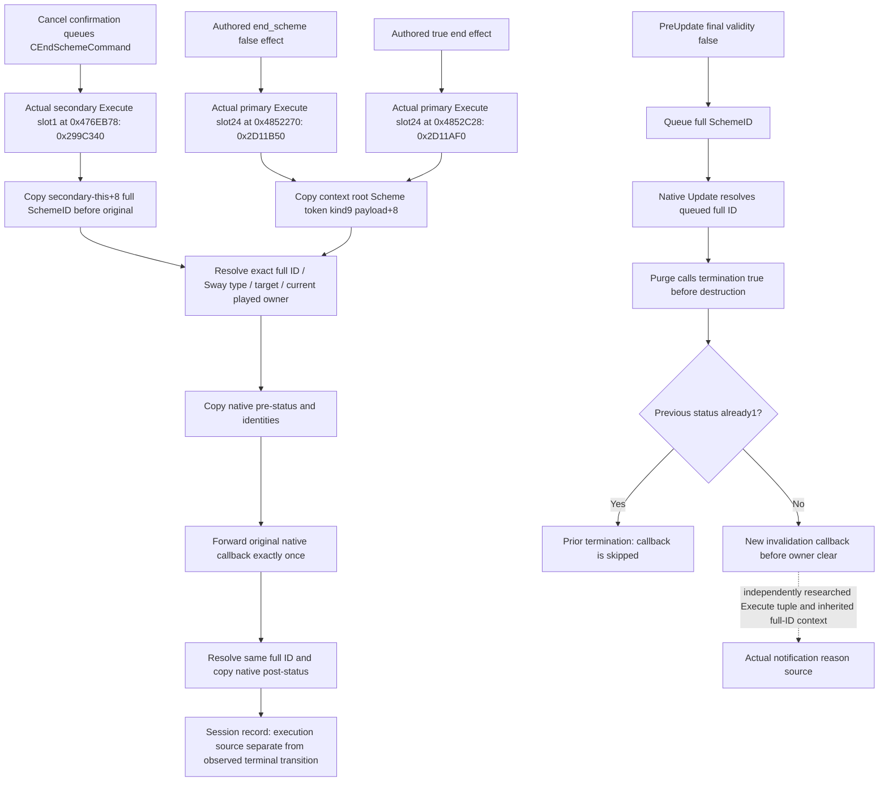

# Sway termination execution sources — CK3 1.20.0.2

This independent increment starts at the actual native execution entries. It
reuses the frozen [terminal/current-validity ABI](ck3-1.20.0.2-sway-completion-cancel.md)
without changing its six files. Readiness is `static-ready`: the new source
pins and copied-observer fixture passed. No CK3 process is accessed here.

Exact EXE SHA-256:
`AE1BA6FF060BA603842F6F4A2DED0AF4B7D3666B3DD271F75FB01B0DA8E81B2D`.

The command observer establishes execution of `CEndSchemeCommand`, the class
used by the manual cancel UI. It does not identify a human as the sender of
every command. The two effect sources identify their actual false/true effect
class. Their shared callback boolean is never used to infer a specific cause.

At the command entry only `RCX` is consumed before native code replaces `RDX`
with the resolved Scheme pointer; the wrapper needs the secondary `this`
pointer and forwards the one used input. Effect entries consume `RCX=effect`
and `RDX=EffectContext`; both root-resolution paths preserve full generation
bits. Source capture precedes the original call, and native terminal state is
read independently after it. Entering a source or returning from an original
does not by itself prove the state changed.

Natural validity failure is queued and purged through `0x2A46FA0` →
`0x2A47790` → `0x2A48B30` → `0x2A4AE10`. A purge may clean up an instance that
already ended; its true boolean cannot classify a fresh natural invalidation.
This increment provides no generic code detour. The separate invalidation
context study will supply actual notification tuple/child-key/context evidence
for specific reasons; a current predicate is not a historical cause.

The [new source ABI](../../ck3_autonomous_player/native_bridge/research/sway_completion12002_termination_abi.json)
pins the three exact execution slots and used input registers. Its
[source verifier](../../ck3_autonomous_player/native_bridge/research/sway_completion12002_termination_source_verify.py)
passed 14 new checks and reused the previous 170-check artifact without
repeating that matrix. The
[independent native API](../../ck3_autonomous_player/native_bridge/include/xar_bridge/ck3_12002_sway_completion_termination.hpp)
and [implementation](../../ck3_autonomous_player/native_bridge/src/ck3_12002_sway_completion_termination.cpp)
provide install/uninstall, pre/post capture, a 128-entry copied session recorder,
an exact actor/target/full-SchemeID query, and a bare JSON serializer. The
coordinator-owned selector is `query-sway-completion-termination-v1-private`;
schema is `xar.ck3.sway-completion-termination.v1`. No transport or shared
registration is edited by this source package.

The [native fixture](../../ck3_autonomous_player/native_bridge/src/ck3_12002_sway_completion_termination_test.cpp)
and [runner](../../ck3_autonomous_player/native_bridge/research/run_sway_completion12002_termination_fixture.py)
passed 30 checks each under MSVC `/Od` and `/O2`, `/W4 /WX`. They exercise the
actual installer on caller-owned readonly pointer slots, typed original
forwarding exactly once, copied pre-ID retention after original input mutation,
independent post-status `0→1`, source execution with post-status still `0`,
missing/reused post instances, generation-zero full ID, and slot restoration.
Evidence is under
`Z:\ck3_mod_rewrite\artifacts\g2-offline-2026-10-01\sway\termination-source\`:
`native-source-verification.json` and `fixture\result.json`.

The three end slots are disjoint from the existing hidden notification-effect
observer's slots. The latter observer remains frozen. A separate actual toast
source may identify which authored invalidation notification branch executed;
that is not a message-history receipt, rendered-notification proof, material
result or native end-cause enum. Natural invalidation observation is not
claimed complete by this three-entry package. Source fixture acceptance is
static evidence and does not claim that this observer has been installed in CK3.
