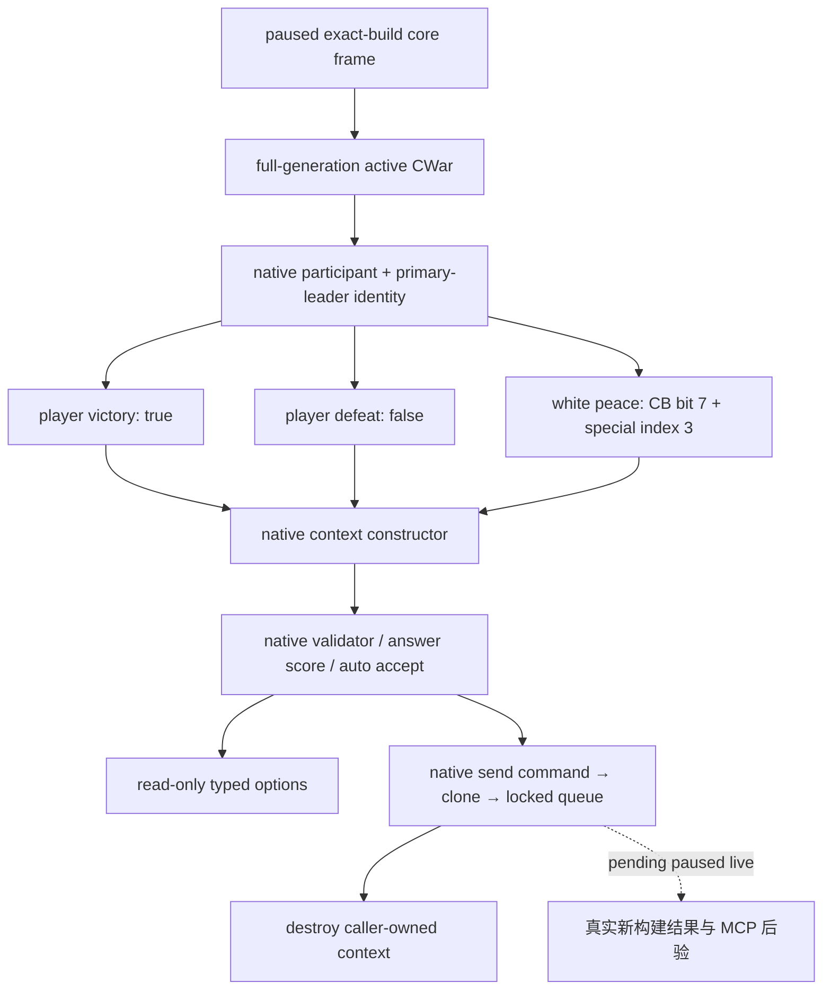

# CK3 1.20.0.2 战争外交迁移

2026-10-01 后台静态施工。冻结 EXE SHA-256：
`AE1BA6FF060BA603842F6F4A2DED0AF4B7D3666B3DD271F75FB01B0DA8E81B2D`。
本文及下列三个子包均为 `static-ready`；尚未调用玩家正在运行的游戏。

宣战枚举与写口见 [宣战迁移](ck3-1.20-declarations-migration.md)，原生战争进入评估见
[war-entry 迁移](war-entry-1.20.0.2-migration.md)，claim terms 见
[claim terms 迁移](ck3-1.20.0.2-claim-terms-migration.md)。
旧构建行为账本仍在 [war-termination.md](war-termination.md)，不能将旧 live 证据当作新构建验收。

## 战争终止的原生调用链

新 `CWarOverviewWindow` RTTI `0x571E260`，完整对象 vtable `0x451A820`。
重建段在 `0x1044E30..0x1044EDB` 分别生成玩家胜利、白和、玩家失败 context。
发送段 `0x10451B0` 先调用 `0x307C040` 验证，再通过 `0x2968170` 构造发送命令，
以 flags `0x0E` 调用 UI wrapper `0x9E16B0`，最后销毁栈上命令的 `+0x20` context。
本包使用已闭合的 native clone/queue 提交函数，保留队列拒绝结果，不把提交成功当作战争已结束。

| 输入 | 新构建 ABI | 已证明的语义 |
|---|---|---|
| 结果 context 构造 | `0xCF57D0(out, war, bool)` | bool 为 `player_victory` |
| 玩家胜利 / 玩家失败 | UI `0x1044E37` / `0x1044ED5` | 两个物理阵营均分别传 true / false |
| 当前玩家 CharacterID | global `0x5DDDC00` | 原生结果构造器直接读取；与 core 玩家记录互证 |
| special interaction 数据库 | getter `0x89DA60`，base `+0x1000` | white peace index 3 对应 `+0x1018` |
| CB white-peace permission | `CCasusBelliType+0x1548` bit 7 | 旧构建 `+0x1718` 已失效 |
| Context default / basic / destroy | `0x3077320` / `0x3076C90` / `0x30773A0` | size `0x338`，special pointer `+0x330` |
| Send command | `0x2968170`，vt `0x448BCE0` / `0x448BCB0` | size `0x368`，内嵌 context `+0x20` |
| 接受度 | `0x307C460(context, out)` | 原生 Q100000 int64，返回 caller-owned out |
| Auto accept | trigger `+0x2290`，scalar `+0x2718` | `0x372DF30(trigger, context+8)` |
| CWar ended | byte `+0x358` | 不能读成指针；邻近非零字节不代表结束 |

结果构造器自行将 player-relative bool 转为 special index：玩家为 primary attacker 时翻转一次，
玩家为 primary defender 时保留；随后 `index=(bool+1)*2`。
因此新 reader 与写口均直接对玩家胜利传 true、投降传 false，不能先根据玩家阵营翻转再调用。
这是新 EXE 的 UI caller 与构造器共同证明的语义，攻防双方都已被合成夹具覆盖。

## 交付与验证

- `include/xar_bridge/ck3_12002_diplomacy.hpp`、`src/ck3_12002_diplomacy.cpp`：
  exact-SHA binder，termination options，enforce demands、surrender、white peace 三个写口。
- `research/ck3_1_20_0_2_diplomacy.json` 与 `verify_ck3_12002_diplomacy.py`：
  13 个唯一 native signature、2 个 vtable prefix、46 条关键指令、11 项源码常量全部通过。
- MSVC 19.51 x64 C++20 `/W4` 合成夹具 GREEN：覆盖双方极性、CB 新 flags、generation、ended byte、
  暂停、原生 validator 拒绝、queue 拒绝以及 context/command clone 生命周期。
  产物为 `artifacts/migrations/2026-09-30/post-update-1.20.0.2/diplomacy-build/ck3_12002_diplomacy_test.exe`。

新模块没有复用旧构建 RVA、旧 context 字段或旧读写函数；语义 DTO 继续使用版本中立的 game contract。
后续验收必须经过新构建 owning-thread mailbox，以真实 paused WarID 对照原生窗口，
再验证终止请求的真实结果。当前未注入 DLL、未读取运行中 CK3、未发送命令或操作窗口。

旧 `war_exit_terms_v2` 因已记录的真实 live 崩溃而保持禁用；本轮没有尝试 loaded-effect preview。
它不属于本包的 `static-ready` 交付，也不会被新 adapter 广告为可用能力。
