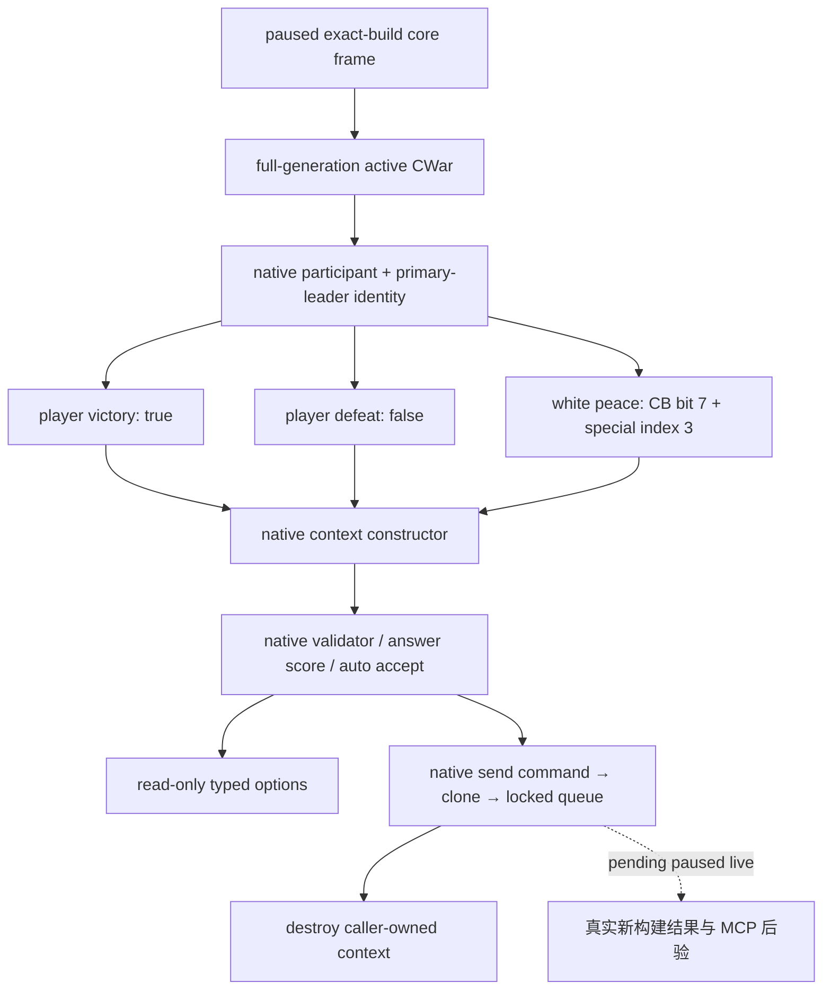

# CK3 1.20.0.2 战争外交迁移

2026-10-01 后台静态施工。冻结 EXE SHA-256：
`AE1BA6FF060BA603842F6F4A2DED0AF4B7D3666B3DD271F75FB01B0DA8E81B2D`。
本文及下列三个子包的静态基线为 `static-ready`。后续 attempt-06 已证明 options 查询达到 `production-live primitive`；完整循环仍 RED，三个终战写口仍待实机验证，见下文。

宣战枚举与写口见 [宣战迁移](ck3-1.20-declarations-migration.md)，原生战争进入评估见
[war-entry 迁移](war-entry-1.20.0.2-migration.md)，claim terms 见
[claim terms 迁移](ck3-1.20.0.2-claim-terms-migration.md)。
旧构建行为账本仍在 [war-termination.md](war-termination.md)，不能将旧 live 证据当作新构建验收。

## 战争终止的原生调用链

新 `CWarOverviewWindow` RTTI `0x571E260`，完整对象 vtable `0x451A820`。
重建段在 `0x1044E30..0x1044EDB` 分别生成玩家胜利、白和、玩家失败 context。
发送段 `0x10451B0` 先调用 `0x307C040` 验证，再通过 `0x2968170` 构造发送命令，
以 flags `0x0E` 调用 UI wrapper `0x9E16B0`，最后销毁栈上命令的 `+0x20` context。
本包使用已闭合的 native clone/queue 提交函数，保留队列拒绝结果，不把提交成功当作战争已结束。

| 输入 | 新构建 ABI | 已证明的语义 |
|---|---|---|
| 结果 context 构造 | `0xCF57D0(out, war, bool)` | bool 为 `player_victory` |
| 玩家胜利 / 玩家失败 | UI `0x1044E37` / `0x1044ED5` | 两个物理阵营均分别传 true / false |
| 当前玩家 CharacterID | global `0x54DBC00` | 结果构造器 `0xCF5801` 与 UI `0x1044E65` 的 RIP 目标一致；与 core 玩家记录互证 |
| special interaction 数据库 | getter `0x89DA60`，base `+0x1000` | white peace index 3 对应 `+0x1018` |
| CB white-peace permission | `CCasusBelliType+0x1548` bit 7 | 旧构建 `+0x1718` 已失效 |
| Context default / basic / destroy | `0x3077320` / `0x3076C90` / `0x30773A0` | size `0x338`，special pointer `+0x330` |
| Send command | `0x2968170`，vt `0x448BCE0` / `0x448BCB0` | size `0x368`，内嵌 context `+0x20` |
| 接受度 | `0x307C460(context, out)` | 原生 Q100000 int64，返回 caller-owned out |
| Auto accept | trigger `+0x2290`，scalar `+0x2718` | `0x372DF30(trigger, context+8)` |
| CWar ended | byte `+0x358` | 不能读成指针；邻近非零字节不代表结束 |

结果构造器自行将 player-relative bool 转为 special index：玩家为 primary attacker 时翻转一次，
玩家为 primary defender 时保留；随后 `index=(bool+1)*2`。
因此新 reader 与写口均直接对玩家胜利传 true、投降传 false，不能先根据玩家阵营翻转再调用。
这是新 EXE 的 UI caller 与构造器共同证明的语义，攻防双方都已被合成夹具覆盖。

## 2026-10-01 实机故障修复：玩家 global 地址抄录错误

协调者的 `live-1.20.0.2/attempt-04/mcp.native-wire.jsonl` 记录真实暂停存档：玩家 `29829`、战争 `16777290`、攻方主将、战争分数 `0`。连续 20 次 `query-war-termination-options-16777290` 均返回 `CK3 war-termination query is unavailable`，不能计为 live 通过。该失败期间 owning-thread mailbox 正常执行了请求，故障进入新版 reader 修复范围。

新版 header 曾把原生玩家 CharacterID global 抄为 `0x5DDDC00`。冻结 EXE 的两条独立指令 `0xCF5801: mov ebx, [rip+0x47E63F9]` 与 `0x1044E65: mov edi, [rip+0x4496D95]`，按各自下一条指令地址计算，实际 RVA 均为 `0x54DBC00`。旧常量使 reader 在构造上下文前比较错误地址中的值与 core 的真实玩家 ID，返回 unavailable；相同前置比较也会阻断三个终战写口。

本次只纠正这个常量，保持原生上下文与提交路径。合成 fixture 增加 binder 计算出的玩家地址断言；ABI verifier 直接将两条真实 RIP 目标与运行时常量关联，复现并阻止同一抄录错误。后续实际查询结果见下节。旧 query v2 与通用宗教域继续保持原有边界。

## attempt-06：查询修复有效，循环仍有真实跨帧失败

新 DLL 在同一生产存档连续三次返回完整 options：日期分别为 `53168880`、`53168904`、`53168928`，战争仍为 `16777290`，玩家仍为 `29829`，战争分数 `0`，CB 为 `claim_cb`（数据库 index `11`）。三次原生结果一致：投降可用且自动接受；白和与强制要求均构造成功但 validator 返回 false，分别为接受度 `-30` 与 `-99`。这些不可用选项是正常合法性观测，整个查询本身可用，不能据此判为 reader 失败。此前 global 常量修复已经取得真实效果。

第四次查询在日期 `53168952` 返回 unavailable，SDK 正确将该错误记为 RED。暂停、玩家 alive、战争、分数、我军身份均保持；没有事件或 pending interaction。失败前后 native snapshot revision `15 → 16` 的唯一数据差异是敌军 `33554657` 的路线长度 `33 → 31`，目标省份 `2602 → 2589`。逐次请求与响应、末帧身份及差异保存在 `live-1.20.0.2/attempt-06/war-options-analysis.json`；原始输入 artifact 未改动。

本轮 R2 实际完成 9 个 auto turn：三组“终战 options 观测 → 接触路线观测 → 原生推进后验”，每组推进 1 天，从 `53168880 → 53168952` 共 3 天（72 小时）。加上此前独立 advance 的 1 天，总日期增量为 `53168856 → 53168952`。第 10 个 turn 在第四次 options 查询失败，未达到请求的 20 turns，不能写 R2 完成。独立任务评估见 [战争外交实机任务评估](ck3-1.20.0.2-war-diplomacy-live-assessment.md)。

当前 semantic worker 的 `EnterQueryMailbox` 与 `FinishQueryMailbox` 都要求重新读取的完整 snapshot 与先前缓存完全相等，失败统一映射为 unavailable。上述真实路线变化可触发这个路径；现有 wire 未记录 native reader 的进入和返回，尚不能断言最后一次具体在哪个 guard 返回。已将实际失败与最小刷新重试入口交给 mailbox/semantic owner，继续修完整循环；本包未为了错误文案改动合法性判定，也未复活旧 query v2。

## 交付与验证

- `include/xar_bridge/ck3_12002_diplomacy.hpp`、`src/ck3_12002_diplomacy.cpp`：
  exact-SHA binder，termination options，enforce demands、surrender、white peace 三个写口。
- `research/ck3_1_20_0_2_diplomacy.json` 与 `verify_ck3_12002_diplomacy.py`：
  13 个唯一 native signature、2 个 vtable prefix、46 条关键指令、11 项源码常量全部通过。
- MSVC 19.51 x64 C++20 `/W4` 合成夹具 GREEN：覆盖双方极性、CB 新 flags、generation、ended byte、
  暂停、原生 validator 拒绝、queue 拒绝以及 context/command clone 生命周期。
  产物为 `artifacts/migrations/2026-09-30/post-update-1.20.0.2/diplomacy-build/ck3_12002_diplomacy_test.exe`。

新模块没有复用旧构建 RVA、旧 context 字段或旧读写函数；语义 DTO 继续使用版本中立的 game contract。
以上记录最初静态交付。协调者后续实机经过新构建 owning-thread mailbox，options 查询证据已记于上文；三个终战写口仍须验证终止请求的真实结果。本工作包代理只操作文件，实际游戏与 DLL 操作均由协调者统一执行。

旧 `war_exit_terms_v2` 因已记录的真实 live 崩溃而保持禁用；本轮没有尝试 loaded-effect preview。
它不属于本包的 `static-ready` 交付，也不会被新 adapter 广告为可用能力。
