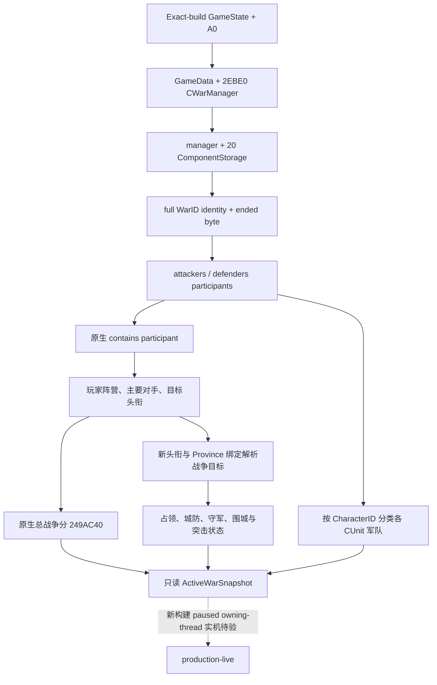

# CK3 1.20.0.2 战争、军队与战争目标观测迁移

本页记录因果律新构建的只读世界观测绑定。证据来自冻结磁盘 EXE 的静态反汇编和自有内存夹具；尚未对正在运行的游戏读内存、注入、输入或重启，也没有新构建实机结论。

构建：`1.20.0.2 (Crozier)`，Steam build `25588574`，EXE SHA-256 `AE1BA6FF060BA603842F6F4A2DED0AF4B7D3666B3DD271F75FB01B0DA8E81B2D`。冻结副本位于 `artifacts/migrations/2026-09-30/post-update-1.20.0.2/installation/binaries/ck3.exe`。

## 战争容器与身份

新 `CGameData` 构造函数在 RVA `0x2ADDF33` 取得 `GameData + 0x2EBE0`，随后在 `0x2ADDF4F` 装入 RTTI 已确认的 `CWarManager` 主 vtable `0x477B400`。`0x2ADDF64` 对 `manager + 0x20` 调用战争存储构造函数 `0x2A83C40`。这与旧版本的 `GameData + 0x29C20` 不兼容。

组件存储仍使用 `slots + 0x20`、容量 `int32 + 0x2C`、每项 `0x10` 字节、对象指针 `slot + 0x08`。新构建原生消费链 `0x2A7E274..0x2A7E298` 同时证明低 24 位索引和 `CWar + 0x08` 完整 generation ID 对比。迁移实现对单项解析和遍历都保留完整 ID 验证。

| CWar 字段 | 新位置 | 静态证据 |
| --- | --- | --- |
| full WarID | `int32 + 0x08` | 构造函数 `0x27FEB5A`、存储解析 `0x2A7E295` |
| 攻方 / 守方容器 | `+ 0x20` / `+ 0x80` | `0x249AE5B` / `0x249AE31` 传给原生参与者查询 |
| 参与者数组 / 容量 / 数量 | 容器 `+ 0x08 / + 0x10 / + 0x14` | `0x2494B7A`、`0x2494B85` 与原生构造/析构 |
| 参与者 CharacterID | `int32 + 0x08` | 原生比较函数 `0x2494B50` |
| 当前 CB 指针 | `+ 0x100` | 构造函数 `0x27FEC8D` |
| 开战日期 | `int32 + 0xE0` | 构造函数 `0x27FEC6B` |
| 目标 TitleID 数组 / 容量 / 数量 | `+ 0x270 / + 0x278 / + 0x27C` | 析构函数 `0x2495057..0x2495083` |
| 主要攻方 / 守方 CharacterID | `int32 + 0x288 / + 0x28C` | 原生双方验证 `0x249AE04` / `0x249AE0D` |
| claimant CharacterID | `int32 + 0x290` | 构造函数 `0x27FECCE` |
| 已结束状态 | **`byte + 0x358`** | `0x249A88B`、`0x2A7E2DB` 等均按单字节比较 |

结束字段应按原生单字节语义读取；旧实现的 `void* + 0x358` 会同时读取后续独立状态，不能直接作为新构建等价实现。新夹具在 `+0x35C` 放入非零值，验证 `+0x358 == 0` 的战争仍可观测；再单独设置 `+0x358` 验证排除已结束战争。

原生参与者判定为 `bool(const void* side, int32 CharacterID)`，RVA `0x2494B60`；原生总战争分为 `int32(const void* war, void* optional_breakdown)`，RVA `0x249AC40`。总分函数内部仍计算攻方相对值并限制在 `[-100, 100]`；迁移读取以玩家阵营换算符号。

## 实现与离线验证

`ck3_autonomous_player/native_bridge/include/xar_bridge/ck3_12002_world.hpp` 和对应源文件提供版本绑定的 `BindWorldImage`、`ResolveWar`、`ReadWarParticipantIds`、`ReadWarTargetTitleIds`、`ReadActiveWars`。`available`、`partial` 和 `unavailable` 区分真实空列表、局部过渡失败和整个读绑定不可用；缺少原生分数函数不会发布伪零分。

战争 ABI 账本为 `ck3_autonomous_player/native_bridge/research/ck3_1_20_0_2_world.json`，包含 9 个唯一签名、3 个 vtable 前缀和 23 个指令级证据。离线夹具覆盖玩家在攻/守双方、盟敌军队归类、目标头衔、完整 generation ID、独立结束字节及容器数量错误。独立 MSVC `/std:c++20 /W4 /WX` 编译与 fixture 已通过，产物位于 `artifacts/migrations/2026-09-30/post-update-1.20.0.2/world-standalone/`。

完整 `ReadWorldSnapshot` 已接线新 `ck3_12002_army` 与 `ck3_12002_province` 模块。组合夹具从真实布局的 GameData、CUnit、CWar、Title、Province 对象图读出玩家军队、路线、阵营、战争目标、城防、守军和没有活动围城的合法状态；也验证地图未就绪时清除先前世界列表。敌方默认集结省使用新原生 `GetCharacterCapital` (`0x28B1CD0`) 与 `ResolveRaiseProvince` (`0x24A51B0`) 两步，保留原生范围参数 `0, -1`，并在输出前校验 Province 身份。

军队专题见 [army-1.20.0.2-migration.md](army-1.20.0.2-migration.md)，战争目标与围城专题见 [ck3-1.20.0.2-province-siege.md](ck3-1.20.0.2-province-siege.md)。三个模块均为 `static-ready`。`ReadWorldSnapshot` 若返回 `partial`，完整快照调用方应保留失败/不完整语义，不能把缺失目标列表称为完整观测。此页不调整战争策略；新构建真实 paused owning-thread 快照仍须实机验收。
