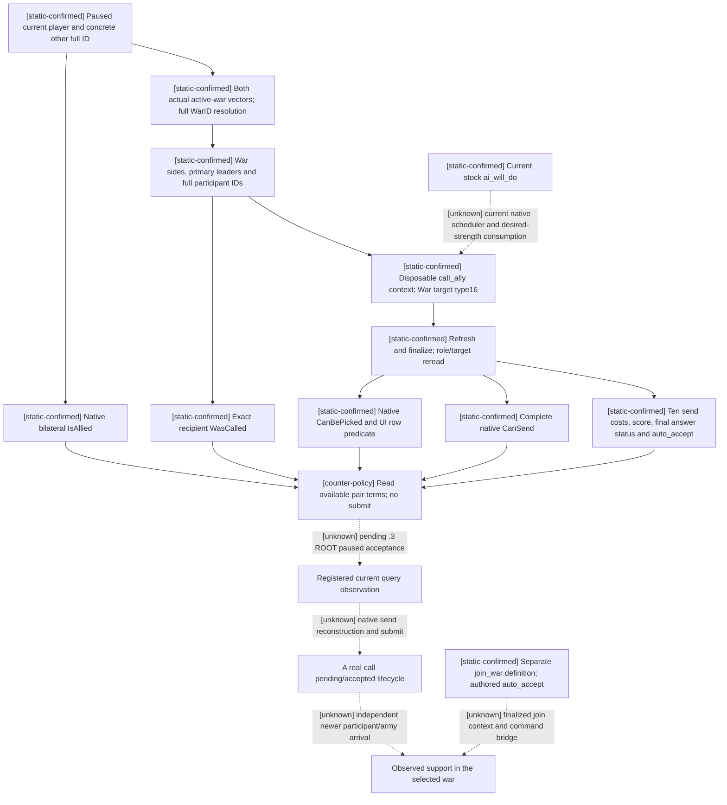

# CK3 1.20.0.3: allied war support and final native eligibility

2026-10-03. This work is **static-ready** and file-only. The current exact build is Crozier 1.20.0.3 / Steam 25652598, executable SHA-256 `94B55397ABB687A3DCD436805A5D885E6BE90FA6C693FEB44A9E3BBEEADE02A6`. Installed stock sources were read at `Z:/SteamLibrary/steamapps/common/Crusader Kings III/game`; the older repository reference was not used as current source. ROOT retains sole game, SDK, pipe, desktop, build uptake and Git ownership.

The owner's 2026-10-03 comprehensive war/combat authorization supersedes the old nonwar-only and war-research-deferred constraints. Permission does not supply a query, command, accepted ally, hired company or army arrival. Historical 1.20.0.2 claims retain their original scope. This addendum researches native rules before the observation patch and supplies no strategy mutation.

## Native tree and evidence

The current `00_alliance.txt` distinguishes `call_ally_interaction` (actor calls a recipient to the actor's selected war) from `join_war_interaction` (actor offers to join a recipient's selected war). Both carry a concrete WarID target and have distinct special-interaction classes. A prospective marriage alliance is not an actual bilateral alliance; an alliance is not a call's final native eligibility; eligibility is not independent world-state participation.

`call_ally_interaction` requires an active war and normally an existing alliance, with separate native/scripted paths for a diarch, liege or suzerain contract, and tribute arrangements. It prefers the house-member call where that definition is actually valid. The selected target must identify a war in which the caller is leader. `CanBePicked` checks liege/vassal constraints, existing participation, relevant diarch restrictions, and suzerain/tributary conflicts. The UI additionally excludes recipients already present on either side or recorded as called. Final CanSend follows refresh/finalize and includes native special validation and affordability; none of these values should be replaced with an allied bool.

The authored AI call score is base 100. Its script explicitly says the native desired-side-strength gate also applies. It zeroes specified calls to a player in debt, offensive calls while the player already defends another war, attacks on the player's heir/spouse, certain delayed recent alliances, and offensive calls when the recipient is allied to both primaries. This research does not close the current-build native scheduler or desired-strength implementation; those edges remain unknown.

Recipient authored acceptance is base 20, with opinion and honor, a +50 defensive-war modifier, relation/culture/language/religious considerations and strong refusal terms such as conqueror, heir/spouse opponent, specified obedience and meaningless conflicts. Auto-accept is separately defined for specific AI family/spouse/heir relations. The native acceptance score is a Q100000 value, not a probability. `join_war_interaction` is authored auto-accept with base 100, but still has extensive native/stock legality and target gates; this does not create a join command in the bridge.

## Current ABI reuse and observation patch

The existing `ck3_1_20_0_3_abi_reuse.json` already marks the alliance-war manifest and family-query manifest PASS. This package reuses those accepted byte regions, global layouts and descriptor translation; it does not rerun an old full audit or weaken the older BindImage SHA check. ROOT's current .3 descriptor still supplies the reviewed .2 ABI identity internally and actual .3 identity externally.

The native call tree uses UI `1398D60` (Character realm `+1C0`, WarID vector `+318`), selected target writer `1398930` (type16 and full WarID), row predicate `1398F30`, `CanBePicked 307A690`, `ContainsParticipant 2494B60`, `WasCalled 2497770`, and final `CanSend 307C040`. Context construction is `3076C90`, refresh `3078A60`, finalize `3078C90`, and destroy `30773A0`. Stable-key resolution and current native IsAllied reuse the historical verified reader. Full war IDs, ended byte `+358`, and participant graph remain the reader's native data inputs.

The newly exposed final-answer leaf reuses the already verified `family_query_abi::kEvaluateAnswerRva=307BC80`, ABI `uint8(context, uint8, uint8, void*, void*)`, sampled using the existing family query's `1,1,null,null` arguments. Raw status 0/1/2 is copied alongside the separate acceptance score and auto-accept bool; the query does not promote it into a guaranteed join. The existing native complete CanSend result remains its own bool. The focused producer fixture explicitly preserves a distinct final answer 2, negative score and independently true/false eligibility values.

The disconnected lane was concrete: CMake unconditionally excluded `ck3_12002_family_obligations_alliance.cpp`, the existing FAMILY mailbox did not call it, the wire emitted `deferred_by_owner`, and Python rejected available alliance rows. The projection restores this optional lane on `ck3_query_family_obligations_private_v1`. Its new `ally_character_id` parameter can be supplied alone, without an unrelated subject/candidate marriage pair. Existing family and break requests continue through their original paths. The native owner envelope binds Robert from the current published frame, calls the actual reader once and retains the existing post-read full-frame validation.

Output separates bilateral relation, both real war collections, sides, primaries, participants, prior call, target picker, UI row eligibility, complete CanSend, score, raw final answer and auto-accept. An available empty collection differs from an unavailable native source. Optional omitted family lanes are `not_requested`. No interaction is queued and no command constructor is called.

The ten signed int64 resource slots are `gold, prestige, piety, renown, influence, herd, treasury, treasury_or_gold, merit, barter_goods`, scale 100000. They are immediate native compiled send costs only. Current `call_ally_interaction_event_effect` separately sets called state and adds the recipient to the caller's actual side; offensive branches include prestige or Mandala piety effects. A zero send vector is not a quote for every accept-time outcome. For Robert's two existing defensive wars, the stock effect's defender branch is `add_defender`; actual target identity and native gates still require a paused query.

## Current episode and remaining support sources

ROOT's closed v34 frame identifies Robert29829, episode `native-29829-2bc2d599f7f9`, raw53236608, defensive WarIDs16777231/opponent30097 and129/opponent32750. Those IDs define the first readback expectations; they do not identify an actual ally. The v34 registered-tool artifact contains the holy-order query but no FAMILY query. No concrete allied recipient was established in this lane. ROOT must obtain a candidate's current full ID from an actual relationship/family/save observation and then read this leaf. Candidate ID discovery is the remaining input dependency; opponent IDs are not substitute allies.

Holy-order support already has a current registered query: `ck3_query_player_holy_order_context_v1(expected_revision)`. Reuse its current collection, native military type, final CanHire, ten costs and independent CanAfford. The accepted v32 historical row order4 had CanHire=false, CanAfford=true, piety quote106 and actual refusal reasons excommunication/already hired. That remains historical primitive evidence, not a fresh v35 quote or hire. Current hire actions and independent employer/army postconditions are not supplied by this patch.

Mercenary support has no registered current raw-quote or hire tool in the inspected source. Current stock specifies a base36-month contract, allowed11..108 months, ordinary range500/same-culture1500 and allowed debt24 months of income; those parameters do not settle an individual quote. The current hired-troop wrapper `CCC4E0` already frozen by the holy-order topic has a separate kind1 branch at `CCC5BC`: it builds the distinct actor/company command-shaped record and invokes a CanExecute slot; it is the next precise final-eligibility search entry. Complete company enumeration, raw quote, final affordability, typed hire/extend commands and employer/army readback remain to implement. Reuse this exact current caller, rather than old1.19 addresses or parsing a formatted cost string.

## Validation and readiness

One optimized MSVC focused run used /O2 /MD /W4 /WX: the actual changed reader's fixture passed, the actual changed serializer emitted an ally-only command_result and passed, and the actual changed mailbox compiled. The emitted native packet then passed through the modified Python driver and registered MCP tool, including available-empty/unavailable, separate negative gates, ten signed costs and malformed-cost/role rejection. A synthetic .3 identity variant checks the normalizer's current identity support; ROOT's already accepted production .3 renderer evidence is reused, not claimed as newly exercised here.

The first Python fixture used `Tool.inputSchema` against installed FastMCP's `input_schema`; the native checks had already passed. That failure is retained as harness RED. Only the fixture attribute changed, and Python alone was rerun GREEN. No CK3 process, SDK, pipe, desktop, full DLL or Git was touched.

Artifacts: `Z:/ck3_mod_rewrite_process_assets/g2-resume-20261003/war-allied-support/ROOT-DELIVERY.json`, `PROJECTION-MANIFEST.json`, `SOURCE-PATCH.diff`, `CURRENT-BUILD-SOURCE-EVIDENCE.json`, `focused-fixture/result.json`, `focused-fixture/attempt01-harness-red.json` and `QUERY-RECIPES.json`. The projection is static-ready pending ROOT's uptake/build and paused observation. It adds no production-live, loop, complete or G2 milestone credit.
