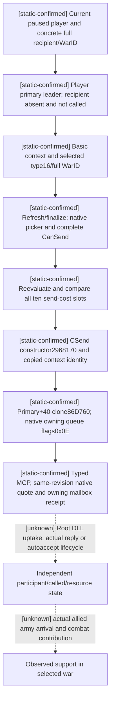

# CK3 1.20.0.3: selected-war call-ally command and independent outcome

2026-10-03. Exact build: Crozier **1.20.0.3 / Steam25652598**, executable SHA-256 `94B55397ABB687A3DCD436805A5D885E6BE90FA6C693FEB44A9E3BBEEADE02A6`. Source baseline: `19b508ae4fa8e3ab09f4e8631fcf0340d69939c2`. The native sender is **static-ready**: the parent package's six focused cases through the actual changed native path passed `/O2 /W4 /WX`. This documentation lane only reads files and generates the research plan; it performs no MCP registration, command submission, SDK attachment or game observation. Root owns canonical adoption, DLL build and actual execution. The subsequent [typed submit transport](ck3-1.20.0.3-call-ally-typed-submit-transport.md) is also static-ready in g36; its existing focused receipts are reused here. War/combat is fully authorized by the owner on 2026-10-03; old nonwar restrictions do not apply.

The existing [allied support tree](ck3-1.20.0.3-allied-war-support.md) establishes native bilateral alliance, actual active-war participants, selected-war eligibility, ten costs and final answer. Its current-ally enumeration follow-up supplies actual candidate full IDs. Those read-only fields do not send a call. At this source baseline, searches of the MCP and mailbox source contain no outgoing `call_ally` tool/command. The sender below closes the native owning-command construction. The later g36 package implements and fixtures outgoing transport plus fresh revision binding; DLL uptake and actual independent outcome remain Root work.

## Native chain and terminology

Current stock `game/common/character_interactions/00_alliance.txt` defines `call_ally_interaction` and a selected WarID; its stock block hash is `dc0afc1701cbc865058d9e1730b71174adc65ed742ab133f9a92cef32caac96b`. Complete legality includes recipient availability, player war leadership, target conflicts and final native CanSend. A positive alliance relation or acceptance score cannot replace these gates. `join_war_interaction` is a separate definition and command path.

| Stage | Exact ABI or source contract | Meaning |
|---|---|---|
| UI selected war | `0x1398930`, target type16 and full WarID | UI wrapper writes `+0x3B8/+0x3C0`; these are not standalone context offsets. |
| Standalone basic context | `0x3076C90`, 0x338-byte storage | Definition and current player/recipient roles; actor `+0x2D8`, recipient `+0x2DC`, target type `+0x2F0`, target fullID `+0x2F8`, special instance `+0x330`. |
| Final target validation | refresh `0x3078A60`, finalize `0x3078C90`, picker `0x307A690`, CanSend `0x307C040` | Reread definition, roles and exact selected type16 target after refresh. |
| Immediate send costs | evaluator `0x310CEE0`; definition `+0x40`, context scope `+8` | Ten signed int64 Q100000 resource slots; reevaluated against the observation used for this request. |
| CSend constructor | `0x2968170`, 0x368-byte command | Copies the finalized interaction context at command `+0x20` using `0x3076B80`; stores intermediary/recipient score payloads at command `+0x358/+0x360`. |
| Command primary/secondary vtables | `0x448BCE0` at `+0`; `0x448BCB0` at `+0x18` | The copied definition, roles, special instance and selected target are checked before queueing. |
| Actual owning clone | primary vtable `+0x40` → `0x86D760` | Native allocator/copy produces owned return storage. |
| Owning queue | command manager `0x5CC1240`, queue function `0x37F06F0`, channel flags `0x0E` | `SubmitCommandCopy` moves the owning pointer into the manager and destroys only residual game-allocated pointers. Its bool is queue acceptance. |
| Disposable context cleanup | `0x30773A0` | Destroy source and command-embedded contexts after the synchronous copy/queue path. |

The original exact-chain capture names its `0x2968220` span **`send_clone`**. That name is incorrect for the owning copy used here: it is the secondary vtable's `+0x08` continuation, and its disassembly calls `0x2967FF0`. The accepted command ABI and current 1.20.0.3 reuse record identify the actual owning clone as **primary vtable `+0x40` → `0x86D760`**. The original evidence bytes and labels are preserved; the collocated source contract records this terminology correction. No new assertion about cloning is derived from `0x2968220`.

## Native sender projection

`SubmitCallAlly` accepts `recipient_character_id`, `war_id` and all ten `expected_send_cost_raw` values. The caller is always the current paused played character. It returns `CommandSubmitResult::{unavailable,rejected,submitted}` and a receipt containing `selected_target_native_legal`, `copied_context_identity_verified`, `send_cost_sampled` and `actual_send_cost_raw[10]`. `send_cost_sampled` becomes true only after the evaluator actually samples the quote; false must serialize as an explicit unobserved/null cost rather than a fabricated zero vector. A sampled all-zero quote remains a legitimate result. Despite its field name, `actual_send_cost_raw` is the immediate reevaluated compiled native quote, never proof of actual payment. These fields report checks and submission; they do not claim acceptance or useful reinforcement.

The owning-thread reader resolves current full recipient/war identities, checks the live recipient and current player frame, requires the player to be the primary leader on the selected side, and excludes existing participants or a recipient already recorded as called. It constructs a disposable `call_ally_interaction` context, assigns type16 plus the exact full WarID, refreshes/finalizes, and applies native picker plus complete CanSend. It reevaluates all immediate send costs and rejects a changed quote before queueing. The projection rereads the current paused frame and checks the native copied context's definition, actor, recipient, full selected target, special-instance presence and auxiliary role IDs `+0x2E0..+0x2EC`.

The unchanged `SubmitCommandCopy` invokes the primary vtable's actual owning clone. It moves ownership out of the clone's return storage before passing a pointer slot to the native manager; the manager consumes that slot on acceptance and rejection. Residual command pointers are destroyed through their native deleting-destructor path. The bridge does not fabricate a heap-owned CK3 command or treat a stack source as game-owned memory.

The native function validates the current actor/date/speed/player identity. The subsequent registered tool `ck3_submit_call_ally_to_war_private_v1(expected_revision, war_id, recipient_character_id)` queries the exact selected FAMILY row, requires current final native CanSend and all ten observed cost slots, verifies the same public paused-frame revision, then sends `submit-call-ally-to-war-v1-private` through the existing owning FAMILY mailbox using the mapped native revision. It reuses `allow_private_family_obligations_query` without a new feature flag or executor allowlist slot. Its native wire/mailbox fixture has nine checks, and its Python driver/service plus registered-MCP fixture has six focused cases; both existing GREEN receipts are reused without rerunning tests. A `receipt_pending`/`accepted=true` response means queue acceptance with `material_result=false`. DLL uptake and actual participant/payment state remain unobserved. Source/ABI consistency and these offline fixtures do not increase production-live or G2 credit.

## Robert execution and outcome recipe

Root continues Robert **29829**, episode **`native-29829-2bc2d599f7f9`**, with defensive WarIDs **16777231**, **129** and **50331736**. They represent three separate calls and outcomes. A call for one war must not be inferred to cover another, and an opponent full ID is not an ally. Root should use the current registered family query's actual ally enumeration, then its recipient-specific war exposure to obtain the selected row, current participants, WasCalled, native picker/row/complete CanSend, ten immediate costs and answer/autoaccept fields. This package does not invent a recipient ID or call all three wars automatically.

For one current legal recipient/war pair, the smallest useful actual loop is:

1. Freeze the pre-action paused snapshot identity and revision; retain exact current player, recipient and selected WarID. Read the actual native row and full immediate cost vector from that frame. Read current player resource balances through the existing native state/query used by Root.
2. Submit the registered typed call once with fresh expected revision, exact recipient/war IDs and all ten observed costs. Retain unavailable/rejected/submitted receipt and native check fields. A rejected or unavailable attempt is retained without reporting a successful call.
3. Query a newer published frame independently. Read the **selected war's actual full participant vector and sides**, and the recipient's **WasCalled** flag. WasCalled does not distinguish pending, accepted or refused states, and no generic outgoing-call pending scanner is published in this source. A called flag by itself does not prove membership. If the native autoaccept/accept lifecycle adds the recipient to Robert's defensive side, record that full ID on the actual defender vector; the absence of membership alone does not prove a decline.
4. Read actual player resource balances and any separate accept-time effects. Compare the ten quoted immediate costs with actual resource deltas in the bounded action window, preserving legitimate zero values. The signed costs are native quote slots, not a guaranteed total transaction bill: stock accept/decline branches can perform additional effects, and any elapsed game ticks introduce ordinary income/upkeep. Record those effects separately rather than attributing all balance movement to this call.
5. Use the actual military observation to identify ally-owned armies, their provinces/routes and later participation. War membership completes the accepted-call outcome; useful reinforcement requires an actual army and relevant arrival/combat state. A queue ACK or an acceptance score alone completes neither.

Stock acceptance routes are distinct: `on_accept` invokes `call_ally_interaction_effect`; `on_auto_accept` triggers `call_ally.0001`; the downstream event/effect adds the recipient to the appropriate war side and records call state. This package reuses the existing allied-support research for that downstream rule and leaves the actual current response branch unresolved. Defensive calls may legitimately have zero immediate send costs. Offensive prestige/Mandala effects and religious accolade rewards belong to their actual branch, not an assumed generic price.

Before Root advances this episode for any delayed response, it must reattach the four existing Sway completion/execution/termination/invalidation recorders; no Sway restart or new bookmark is required. Root retains exclusive SDK, pipe, game/controller and Git ownership and keeps CK3 minimized without taking desktop focus.

## Artifacts and readiness

[The offline research plan](research-plans/call-ally-command-12003/plan.json), [generated graph](research-plans/call-ally-command-12003/graph.md) and [check result](research-plans/call-ally-command-12003/check.json) bind copied exact-chain, current stock, source projection and accepted owning-copy reuse evidence. `tools/native_research_plan.py` checks declarations and file hashes; it does not prove native semantics or grant runtime authorization. The plan is intentionally `offline-only`, with zero live samples.

External originals remain at `Z:/ck3_mod_rewrite_process_assets/g2-resume-20261003/call-ally-native-action/`. The isolated documentation projection is its `docs-package/` subtree. `ROOT-NATIVE-DELIVERY.json` records the native patch SHA `593f8413cc267a67dc024ca35e15ab42aea50a8ce0c7e4c058b8b06d2766ec30` and the focused result SHA `2c4547f89c6460eec0181ea3048c8440b702c258cc3d07df27f729100e4c4479`. The six-case native-only GREEN is reused without rerunning it. The separate transport/MCP fixture is now GREEN/static-ready in g36, and Root must supply new exact DLL uptake and paused action/postcondition evidence. The native sender and typed registered transport are **static-ready**; the actual accepted-call and useful-support branches remain unknown, with no production-live, complete-loop or G2 credit.

The cost-sampled receipt change is the reason for the parent's new six-case focused run. Its previous GREEN is retained under `focused-fixture/attempt01-green`; this docs lane reruns only the changed evidence plan check/render. Prior documentation is preserved externally at `docs-package/attempt01-green`. Root reports current candidate ally FullIDs 34730, 37689 and 38718, each without realm data; those identities are inputs for the fresh final CanSend query, not proof of a legal outgoing call. No final gate or payment is inferred from candidate membership.

At canonical documentation uptake, the copied sender source/interface and existing owning queue retain their original pinned hashes. The source contract also binds the subsequent typed sender leaf hashes and reuses its native/mailbox/registered-MCP result receipts. The source19b508ae absence of an outgoing tool remains a historical baseline, while the seven static-confirmed edges now include typed transport. The two unresolved edges are actual accepted-call outcome and useful army support; no actual eligibility, invitation or payment is invented.
