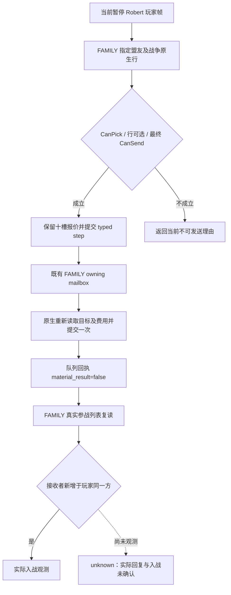

# CK3 1.20.0.3：指定盟友参战的 typed submit 通路

本专题承接[原生 CallAlly 构造与发送树](ck3-1.20.0.3-call-ally-command.md)，绑定 Steam build `25652598` 与 EXE SHA-256 `94B55397ABB687A3DCD436805A5D885E6BE90FA6C693FEB44A9E3BBEEADE02A6`。2026-10-03 战争研究和执行已经获全面授权；本通路在现有 FAMILY 暂停帧 mailbox 与 private permit 中增加独立 typed submit，不新增授权开关。

## 请求、执行与回执

注册工具为 `ck3_submit_call_ally_to_war_private_v1(expected_revision, war_id, recipient_character_id)`。外部工具取得同一暂停玩家帧的 FAMILY 原生战争行，保留选定 full WarID、接收者与十槽原生报价，然后发送 `submit-call-ally-to-war-v1-private`。请求中的 `expected_revision` 经现有 driver 映射为 native revision；发起者始终来自当前存活玩家帧，不接受 actor override。

| 层 | 实际路径 | 结果含义 |
| --- | --- | --- |
| Python | 当前 FAMILY 查询 → 指定战争行 → typed step | 同帧原生合法性与报价输入 |
| 暂停 mailbox | 既有 `ExecuteFamilyObligationsMailbox12002` 的独立提交分支 | 保留原绑定、local player、日期、速度与玩家 FullID |
| 原生 | `SubmitCallAlly` → 真实 context/CSend clone → `SubmitCommandCopy(..., 0x0E)` | 原生命令进入队列 |
| 序列化 | `ck3_12003_call_ally_to_war_private_v1` | `receipt_pending`、`rejected` 或 `unavailable` |
| 后续 FAMILY 查询 | 指定战争的真实参战列表与双方 side | 独立观测盟友是否加入玩家一方 |

回执的 `actual_send_cost_raw` 是发送时重新求值的原生报价。`send_cost_sampled=false` 时该字段为 `null`；`true` 时保留完整十个有符号 raw 槽位，包括合法全零向量。它不证明已经扣款。`accepted=true` 与 `receipt_pending` 只表示命令已排队，`material_result` 始终为 `false`。

后读中 `recipient_was_called=true` 是原生 called-state，不单独代表待答复、接受或参战。实际加入要求接收者 `recipient_side == caller_side`，同时出现在该方真实 participant vector 且不在对方列表；若要归因于本次发送，必须与发送前的未参战状态比较。现有婚姻和白和平等待扫描口不能替代 CallAlly 回复观测。

## 验证与能力边界

静态验证分为三个互补包：原生发送器六个新用例覆盖真实构造、clone、最终合法性/报价与队列；暂停 mailbox、请求 parser 与 serializer 的离线夹具保留原绑定并调用一次明确标记的发送器桩，九项输出检查通过；同一生产序列化 JSON 进入 Python driver、service 与实际注册 MCP 的针对性用例。发送器桩不冒充实际 CK3 命令，所有测试均为 `static-ready`。

暂停通路首轮链接失败来自离线 harness 未提供 `.3` adapter 三个未使用工厂符号；失败保留于 `native-test-projection/build-01`。补齐测试专用 provider 后复用八个已通过 `/O2 /W4 /WX` 的生产对象，仅重编测试，`build-02` 通过。没有重跑既有观察矩阵。

证据根为 `Z:/ck3_mod_rewrite_process_assets/g2-resume-20261003/call-ally-wire-mcp/`；原生发送器证据在相邻 `call-ally-native-action/`。实际 Robert 29829 盟友枚举 `[34730, 37689, 38718]` 由既有 v35 实机产物提供，其 `has_realm_data=false` 不能代替最终 CanSend 判定；测试使用的接收者和费用是明确的离线夹具数据。

当前 FAMILY quote 查询仍要求正值接收者 FullID；原生 typed parser 的 signed int32（除 `-1`）能力不代表该查询已经支持未来的非正值 generation ID。本任务保留该质量差距，不扩展无实证需求的其他 family 入口。组合 DLL、实际可发送目标、真正发送及独立入战/扣款后态仍由 Root 接续验收；本专题不记生产入战闭环完成。
