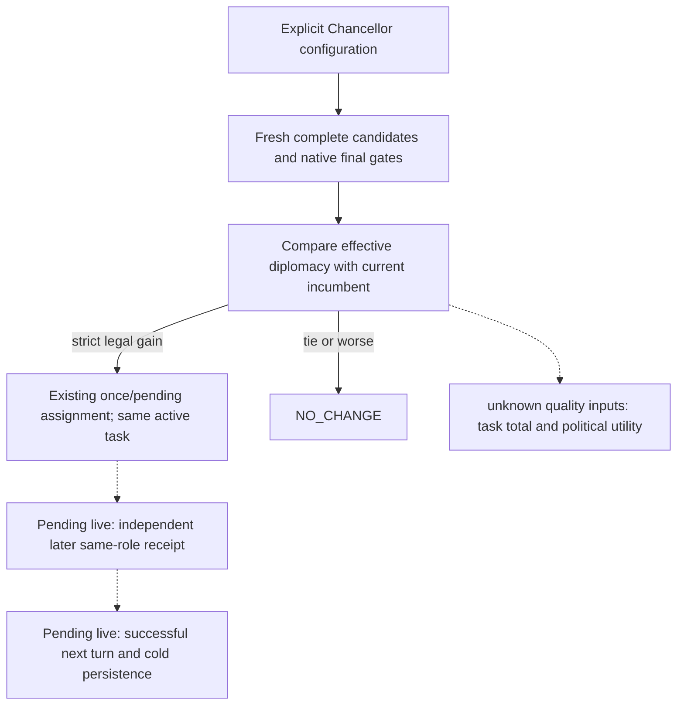
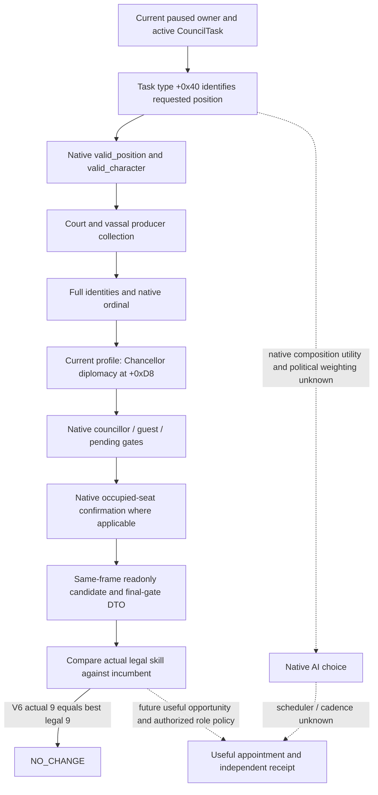

# CK3 1.20.0.3 Chancellor readonly candidate inputs

## Actual V21 cold: the applied Chancellor and task persist

On 2026-10-03 ROOT cold-restored the original Robert campaign with v21
source `6443a516`, new PID `96348`, the same episode, raw date `53222304`,
checkpoint `4140` and full checkpoint `4141`. The small independent
`ewan0801-v21-relation-pre-and-council-cold-01/003-ck3_query_campaign_root_context_v1.json`
is available with actor `29829`, public/native revisions `2/4`, and
`council_ready=true`. Its actual Chancellor is **43696** on
`task_foreign_affairs`, `general`, `infinite`, with null target/current/maximum
and `frozen=false`. Steward `43706` and Spymaster `34333` are retained.

This adds new-PID holder/task persistence to the existing once-only v20
`council-formal-d660e8080ebf4a7a8c18cd1b4401230c` ACK → independent applied
receipt → successful-next-turn consumption proof below. Those closed v20
proofs are reused; this cold frame does not dispatch, reassign or consume
another action. The v20 requested 30-day window still has only its closed
six-day normal-window proof, so this does not complete that window, all
Council roles or M4. v21/PID/checkpoint/episode context comes from ROOT's
cold result; actor/revisions/date/holder/task/readiness come from the typed
query, with those provenance scopes kept separate.

The [bounded cold extract](Z:/ck3_mod_rewrite/artifacts/g2-maintainer-2026-10-02/resume-12003/m4-council/religion-realm-priest-12003/actual-v21-root-primitive-01/ROOT-COUNCIL-COLD-EXTRACT.json)
has SHA `826f8f687174d47386bca91d59f80f7e85f92c243b2c3a2f8bc8d4d140dbf56c`.
The root packet has SHA
`1e762fe611c41887ac5f4da58f3de338b09b181e409e7e6bb2faf5409cd02bb4`;
the 10-03 compact report fields are
`m4-council/chancellor-configured-formal/actual-v21-cold-fields-01/REPORT-FIELDS.json`.
No source changes, new SDK call, test rerun, new assignment or additional
game-day credit were performed by this offline owner.

## Actual V20 occupied replacement: same-PID production-live loop

ROOT's fresh V20 quote and single submission use source/native `4ee2e755`,
PID94488, actor29829 and episode `native-29829-2bc2d599f7f9`. The actual quote
again finds incumbent34867 diplomacy7 and native-final-legal43696 diplomacy13,
a +6 gain, among 14 complete candidates and 11 legal rows. It submits once for
the same active Chancellor task7158 at native13/date53222136:
`council-formal-d660e8080ebf4a7a8c18cd1b4401230c`. The earlier ACK was
verification-pending and remains preserved as such in
`chancellor-configured-formal/actual-v20-pending-fields-01/REPORT-FIELDS.json`.

The original formal service on Python source `b03` resolves that same pending
action as `applied` at native15/date53222136, without another appointment.
An independent campaign-root row observes Chancellor43696 on
`task_foreign_affairs`, type `general`, target null, not frozen and infinite
progress. The following successful `life-advance` turn records this same action
as `next_turn_consumed=true` and advances six days to native19/date53222280,
saving h4130. The consumption observation is at native15/date53222136 before
that clock step; it is not a separate post-clock holder query. The closed
current Council ledger retains pending null, the same applied action and its
true next-consumed flag.

The requested 30-day window stops after six days at a new natural modal13.
The extra `mode consume` call subsequently returns
`NO_APPLIED_ASSIGNMENT_CONSUMED` with no selected step or consumed-plan field
because that modal leaves the seed plan unchanged. This is not a failed Council
assignment and does not undo the original successful turn or ledger evidence;
no assignment or consume rerun is needed.

This proves a narrow **production-live loop in the same PID** for occupied
Chancellor replacement with preserved Foreign Affairs task. It does not prove
the remaining 24 days, cold restoration, numeric task yield, political net
benefit, broad role coverage or complete M4. ROOT's new-PID cold verification
is pending. The single compact projection is
`role-coverage/robert-current-role-opportunities/CHANCELLOR-V20-LIVE-REPORT-FIELDS.json`;
it reuses the already completed bounded source-owner projections under
`chancellor-configured-formal/actual-v20-live-fields-01/` without rereading
raw history or making new calls.

## Explicit occupied-Chancellor counterpolicy: static-ready

The separately owned `m4-council/chancellor-configured-formal` source package
now supports occupied replacement only when the formal caller explicitly
selects `councillor_chancellor`. Default Steward and existing vacant-Chancellor
behavior are preserved, and Spymaster34333 remains retained. The selector
requires a complete current candidate input, native final legality and a
strict effective-diplomacy improvement over the actual incumbent; ties and
worse candidates remain `NO_CHANGE`. The previously observed 7 to 13 (+6)
is its motivating input, not a fixed candidate or a future quote.

The request and two version-owned native guards carry the Chancellor role for
occupied replacement. Assignment preserves the same current native active task,
observed here as `task_foreign_affairs`; it does not switch tasks or forecast
prestige, opinion or diplomatic outcomes. Existing S/C once/pending state,
independent later-frame same-role receipt and following-turn persistence are
reused. Native political utility, powerful-vassal weights, scheduling and
numeric task output remain unadopted quality inputs documented below.

Validation is **static-ready**: one integral configured-role Python case passed
in 0.59 seconds; the strict native focused build and final run are GREEN
(`native/transport-focused-02/FOCUSED-RESULT.json`, SHA-256
`ef2f0fa8485e2e2648e21ec1a001e96cda28b984b2d31ea7cc4b6c69c146c82d`).
Four genuine native fixture wires passed through the existing Python query,
request, ACK and receipt normalizers and configured selector. These are new
source/fixture checks, not actual appointments or live loops; prior successful
tests were reused.

The first native fixture RED remains archived under
`native/transport-focused-01`: its assertion incorrectly required query EXE
metadata in generic ACK/receipt envelopes although the native business checks
had passed. The follow-up changed fixture expectations only. The first external
wire-consumer RED, `python/GENUINE-WIRE-CONSUMPTION-ATTEMPT-01-RED.json`, failed
while unwrapping the existing nested envelope before the production normalizer;
correcting that external reader produced GREEN without production changes for
the failure. Final scope, source pins and all receipts are in that package's
`REPORT-FIELDS.json` and `OWNED-PATHS.json`.

ROOT still owns selective publication/adoption, a fresh actual quote and any
useful appointment, independent holder/task verification, successful following
consumption and new-PID cold restoration. This cutoff adds zero live actions,
game days or G2 credit and does not establish full M4 completion.

## Latest Robert observation and selected minimal strategy input

The GREEN root-owned `m4-council/role-coverage/robert-v19-412-actual-01`
capture on `production-source-41291bf2` independently observes Chancellor
34867, effective diplomacy 7, on `task_foreign_affairs`. Its sole highest
native-final-legal candidate is 43696, diplomacy 13: a real +6 skill difference
among 14 complete native candidates and 11 legal rows. The excluded 33435,
34333 and 43706 are existing councillors. The actual paused frame is actor29829,
episode `native-29829-2bc2d599f7f9`, date53220624, native16/public2, PID70968.
Standalone candidates agree with the producer embedded in the final-gate
packet, and the existing saved comparator ran once GREEN. See the full
[current role observation](ck3-1.20.0.3-council-role-coverage.md).

This is **production-live primitive** readonly input, with no occupied-Chancellor
assignment or task-benefit outcome yet. ROOT selects it for a separately owned
minimal replacement strategy based on the actual named skill, current task and
native final legality. Future planning reads fresh candidates and gates and
does not lock 43696 from this saved frame.

The current 412 registered tools and source do not publish a current-task-value
MCP query. The old v13 execution token was not such a public query; no extra
configuration or fake tool call is required for this loop. The owner prestige
and opinion task modifiers use a named stock scale whose actual current value
has not been observed. Task total output, Court/legacy conditions, actual
powerful-vassal/cares/opinion and firing cost, and full native composition utility
remain unadopted inputs. They are quality gaps for outcome calibration, not new
M4 conditions or blockers to the selected +6 strategy. If a later decision truly
depends on one, expose the smallest relevant native value through the same MCP
before using it. The bounded port-status evidence is retained under
`robert-current-role-opportunities/chancellor/task-value/`.

## Scope and necessity

This bounded extension supplies current ordinary Chancellor candidates, effective diplomacy and native final appointment legality through the two existing private Council queries. It does not change appointment, task selection or the formal Steward policy. The initial h208 source frame had Steward33433 with stewardship15 and a best legal alternative32716 with11, so replacing that Steward would reduce observed quality. Before this extension, campaign-root observed Chancellor34867 on `task_foreign_affairs` but did not supply incumbent diplomacy or alternative candidates. A Chancellor candidate query removes that concrete decision-input gap; it does not assume the incumbent needs replacing.

The native tree is inherited from [Council candidates](ck3-1.20.0.2-council-candidates.md), [final gates](ck3-1.20.0.2-council-gates.md) and [current-role observations](council-and-development.md). This topic adds the Chancellor profile and current exact-build evidence without expanding religion, warfare or government coverage.

## Exact-build input ledger

| Input | Frozen fact |
|---|---|
| Steam CK3 | `1.20.0.3`, build `25652598` |
| EXE SHA-256 | `94B55397ABB687A3DCD436805A5D885E6BE90FA6C693FEB44A9E3BBEEADE02A6` |
| Current role source | V6 `cold-v6-sway-chancellor-01/020-ck3_query_campaign_root_context_v1.json`; actor29829, raw53174952, incumbent34867, task_foreign_affairs |
| Chancellor current diplomacy / alternatives | V6 native candidate/final-gate queries022/024: incumbent34867 diplomacy9, best legal30784 diplomacy9, 11native/8legal; `NO_CHANGE` |
| ABI reuse | `native_bridge/research/ck3_1_20_0_3_abi_reuse.json`; candidate/gate and phase-character spans remain unchanged from reviewed1.20.0.2 |
| New bounded manifest | `native_bridge/research/council_chancellor12003_abi.json` |

Current Steam stock `common/council_positions/00_council_positions.txt:1-2` defines `councillor_chancellor` and `skill = diplomacy`; `:53-58` supplies ordinary nonlandless, nonnomadic position validity; `:107-119` uses the Chancellor or ministry native predicate. Its SHA-256 is `31FA258DFBF35A07E9EE08D1D1DFDCD26712D3974CD65EC74255C284E4DF0A2A`. `common/scripted_triggers/00_councillor_triggers.txt:51-68` holds the ordinary availability/adult/capable/current-role/gender predicates; SHA-256 `350A5E375D73E38CDD659FC3221FE8395AD6650B3FD244E03EE2342AFC9A8F88`. The provider consumes the compiled native results rather than rewriting these predicates in Python.

The existing producer `0x2C47EC0(owner, active_task, GUI_eligibility=true, vector)` derives the position object from `active_task+0x18 -> task_type+0x40`. Both `valid_position 0x31BCED0` and `valid_character 0x31BCF90` are position-parameterized. The exact1.20.0.3 frozen EXE was read directly at `0x28B16B0..0x28B170D`: `0x28B16F8` is still bytes `8B8499D8000000`, `mov eax,[rcx+rbx*4+0xD8]`. Its unchanged span SHA-256 is `B3C592A0D177A07D0BC5D04DD4A94558A539F6F543B73FAF5A748954F0AB42DA`. The reviewed six-skill enum assigns diplomacy0 and stewardship2; this migrated enum plus the current stock profile and unchanged current getter yields effective diplomacy `CCharacter+0xD8`, and preserves stewardship `+0xE0`. This is executable-file evidence and reviewed ABI reuse, not a paused Chancellor observation.

The same native final gates check current councillor (`0x2917560`), guest (`0x1A8F780`), pending interaction (`0x115CA80`/`0x2A307B0`) and occupied-seat confirmation (`0x11604A0`). Confirmation fields `+0x130/+0x134` are incumbent/candidate IDs; the predicate derives the relevant task from the incumbent. Those native booleans remain independent of merely belonging to the candidate collection.

## Native tree and new readonly projection

The collection and final gate paths are already role-parameterized in the native executable. Our new projection selects only the existing ordinary Steward or Chancellor profile. It retains the producer's full identities, ordinal, same-frame incumbent and native final gate reasons. It does not publish an AI utility or task-switch estimate that has not been observed.

## Implementation and validation boundary

The existing private query names gain optional `position_key`, defaulting to `councillor_steward`. Explicit `councillor_chancellor` requests must produce that same position and `diplomacy` in both incumbent and candidate skill fields. Public legacy queries retain their Steward-only default request contract. The native and Python read paths preserve request-to-response role binding. Existing typed assignment and formal consumption remain independently Steward-only.

At the initial ledger write this package is **research**, with zero new live calls, actions, elapsed game days or G2 credits. Focused native/Python fixtures will establish `static-ready`; a root-owned fresh production paused capture must separately establish Chancellor `production-live primitive`. Root should capture current snapshots bracketing the two private queries, current campaign-root holder/task, full metadata and diagnostics. The expected historical holder34867 is only a comparison anchor: any later real holder must come from the new paused frame.

A useful replacement can be considered only when the actual same-frame legal alternative has a strictly higher effective diplomacy than the actual incumbent, or fills a real vacancy. Ties and worse alternatives support `NO_CHANGE`. This readonly package stops before an appointment decision. G2 M4 remains pending until a separately authorized useful action has independent holder/task verification, later formal consumption and the required common gameplay window.

## Bounded validation receipt

2026-10-02 05:06:50 (Asia/Shanghai): Python readonly role/skill normalization, private mailbox forwarding and the two official SDK query wrappers pass **23 focused offline cases** in4.45s. Thirteen new synthetic Chancellor/default-Steward cases exercise role and skill binding; ten existing Steward cases cover legacy request, same-ticket polling, assignment receipt and formal next consumption. The public request default remains Steward-only, and the unmodified action builder/formal consumer reject Chancellor. Receipt and JUnit are under `artifacts/g2-maintainer-2026-10-02/resume-12003/m4-council/chancellor-readonly/python-focused-receipt.json` and `python-focused-01.xml`.

This makes the Python path **static-ready**. Native fixture/build and a new root-owned actual paused Chancellor query remain pending; no new game call, appointment, game day or G2 credit is claimed.

The first focused native build attempt compiled the new leaves but reached **harness LINK RED**: the auto Council fixtures linked only their test object and `xar_ck3_12002_runtime.lib`. That runtime source list does not include the production `council_composition_candidates_public_v1.cpp` and serializer, so neither old nor new projector/serializer symbols were defined in the fixture link inputs. Production DLL and the independent public fixture already list the real source files. Original LINK output is retained under `m4-council/chancellor-build-attempt-01/stdout.log`. This is an observed fixture dependency gap; it is not a paused capability failure or a reason to change the readonly provider or typed action. Root coordinates the minimum real-source fixture linkage and repeats the same five targets.

## Final static-ready result

The five native focused targets are GREEN with /W4 /WX /UNDEBUG and actual production implementation objects, without a shim or CMake source change. Candidate/gates/runtime/public projector results from focused harness03 are reused; transport-only followup05 passes compile/link/test in6.82s after correcting its fixture's changed-date idle-pump sequence. Production query, action and policy required no additional fix. The final native14-file receipt is `artifacts/g2-maintainer-2026-10-02/resume-12003/m4-council/CHANCELLOR-NATIVE-FOCUSED-GREEN.json`, SHA-256 `f28e89da5f564d79f9070f6c3df3883fd9610158dc93122bcea62790209e8b69`. Python23 focused PASS is reused.

Failed build/link and fixture attempts01/02/03/04 remain archived. The resolved transport failure was `private_query_queue_unavailable`: a fixture changed the date and sampled only one paused pump, while the existing mailbox requires two samples of the same date identity. A second real idle pump satisfies that existing contract; no new gate was added.

The complete readonly package reached **static-ready** at this test cutoff. The later root-owned V6 paused result below separately establishes the narrow **production-live primitive**; these fixture results by themselves did not establish live, appointment or G2 M4 credit.

## V6 actual paused result: production-live primitive, NO_CHANGE

Root's single official SDK capture on the immutable `production-source-dcd61a5b` runtime succeeded without game-date advancement. Original packets are in `artifacts/g2-maintainer-2026-10-02/resume-12003/cold-v6-sway-chancellor-01/`:020 independent campaign-root,021 snapshot before candidates,022 candidates,023 snapshot before gates,024 native final gates and025 after snapshot. The same listing `tools.json` records optional `position_key`, default Steward, on both existing private queries.

The saved packet reader passes once on actor29829, episode `native-29829-3f80e147d033`, raw53174952, snapshot `native:2`, native revision2 and public revision3. Candidate collection022 matches the embedded collection024, the public frontend source frame remains3 while the private payload's bound revision remains native2, and snapshots023/025 share the same paused living-player map. Independent root020 observes incumbent34867 on `task_foreign_affairs`, general/infinite, targetnull and frozenfalse. The candidate provider independently reports incumbent diplomacy9.

| Full CharacterID | Effective diplomacy | Native final legality |
|---:|---:|---|
| 30784 | 9 | legal |
| 32440 | 4 | legal |
| 32716 | 8 | legal |
| 33433 | 4 | candidate_already_councillor |
| 33435 | 6 | candidate_already_councillor |
| 33888 | 4 | legal |
| 34333 | 5 | candidate_already_councillor |
| 35637 | 3 | legal |
| 43706 | 4 | legal |
| 43712 | 5 | legal |
| 57582 | 0 | legal |

All11 native rows are retained;8 are legal. The3 excluded rows are already councillors, as reported by the native final gates. The best legal alternative30784 has diplomacy9, equal to current34867's9: gain0 and **NO_CHANGE**. The comparison does not substitute native ordinal or a tie for a proven skill improvement, and does not assume an unobserved political or task benefit.

The two private queries now have real **production-live primitive** evidence for this ordinary active Chancellor. Observed value is effective diplomacy only; native AI composition utility, powerful-vassal/political preference, scheduler, other government profiles and alternative-task utility remain outside the observation and claim. It is not a Chancellor appointment loop, task-change capability or G2 M4 completion. Existing typed mutator and formal consumer remain Steward-only. No Chancellor action package is required by this tied frame; a later observed useful vacancy or strictly higher legal diplomacy is the prerequisite for considering that separate package.

Offline results are `m4-council/chancellor-readonly/ACTUAL-V6-CHANCELLOR-COMPARE.json` and `ACTUAL-V6-CHANCELLOR-MATERIAL.json`, under the same resume12003 archive. The former records exact packet SHA-256 values and validation; the latter preserves every current candidate, final-gate booleans, current Council rows and registered tool schemas. Root performed the live reads; this evidence owner only analyzed saved packets. Zero Council appointments, game days advanced by these reads or added G2 credit.
