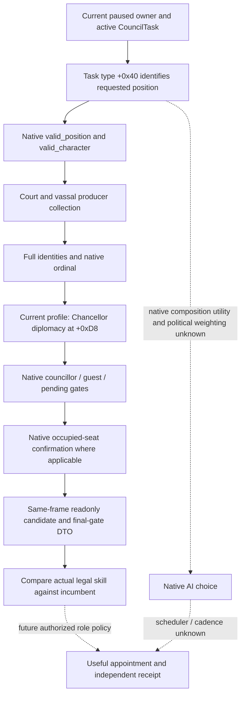

# CK3 1.20.0.3 Chancellor readonly candidate inputs

## Scope and necessity

This bounded extension supplies current ordinary Chancellor candidates, effective diplomacy and native final appointment legality through the two existing private Council queries. It does not change appointment, task selection or the formal Steward policy. The current G2 frame has Steward33433 with stewardship15 and a best legal alternative32716 with11, so replacing that Steward would reduce observed quality. Existing campaign-root observes Chancellor34867 on `task_foreign_affairs`, but cannot report that incumbent's diplomacy or alternative candidates. A Chancellor candidate query removes that concrete decision-input gap; it does not assume the incumbent needs replacing.

The native tree is inherited from [Council candidates](ck3-1.20.0.2-council-candidates.md), [final gates](ck3-1.20.0.2-council-gates.md) and [current-role observations](council-and-development.md). This topic adds the Chancellor profile and current exact-build evidence without expanding religion, warfare or government coverage.

## Exact-build input ledger

| Input | Frozen fact |
|---|---|
| Steam CK3 | `1.20.0.3`, build `25652598` |
| EXE SHA-256 | `94B55397ABB687A3DCD436805A5D885E6BE90FA6C693FEB44A9E3BBEEADE02A6` |
| Current role source | `readonly-c3cd08bc-01/004-ck3_query_campaign_root_context_v1.json`; actor29829, raw53170608, incumbent34867, task_foreign_affairs |
| Chancellor current diplomacy / alternatives | Not yet observed; the new paused query is the required next input |
| ABI reuse | `native_bridge/research/ck3_1_20_0_3_abi_reuse.json`; candidate/gate and phase-character spans remain unchanged from reviewed1.20.0.2 |
| New bounded manifest | `native_bridge/research/council_chancellor12003_abi.json` |

Current Steam stock `common/council_positions/00_council_positions.txt:1-2` defines `councillor_chancellor` and `skill = diplomacy`; `:53-58` supplies ordinary nonlandless, nonnomadic position validity; `:107-119` uses the Chancellor or ministry native predicate. Its SHA-256 is `31FA258DFBF35A07E9EE08D1D1DFDCD26712D3974CD65EC74255C284E4DF0A2A`. `common/scripted_triggers/00_councillor_triggers.txt:51-68` holds the ordinary availability/adult/capable/current-role/gender predicates; SHA-256 `350A5E375D73E38CDD659FC3221FE8395AD6650B3FD244E03EE2342AFC9A8F88`. The provider consumes the compiled native results rather than rewriting these predicates in Python.

The existing producer `0x2C47EC0(owner, active_task, GUI_eligibility=true, vector)` derives the position object from `active_task+0x18 -> task_type+0x40`. Both `valid_position 0x31BCED0` and `valid_character 0x31BCF90` are position-parameterized. The exact1.20.0.3 frozen EXE was read directly at `0x28B16B0..0x28B170D`: `0x28B16F8` is still bytes `8B8499D8000000`, `mov eax,[rcx+rbx*4+0xD8]`. Its unchanged span SHA-256 is `B3C592A0D177A07D0BC5D04DD4A94558A539F6F543B73FAF5A748954F0AB42DA`. The reviewed six-skill enum assigns diplomacy0 and stewardship2; this migrated enum plus the current stock profile and unchanged current getter yields effective diplomacy `CCharacter+0xD8`, and preserves stewardship `+0xE0`. This is executable-file evidence and reviewed ABI reuse, not a paused Chancellor observation.

The same native final gates check current councillor (`0x2917560`), guest (`0x1A8F780`), pending interaction (`0x115CA80`/`0x2A307B0`) and occupied-seat confirmation (`0x11604A0`). Confirmation fields `+0x130/+0x134` are incumbent/candidate IDs; the predicate derives the relevant task from the incumbent. Those native booleans remain independent of merely belonging to the candidate collection.

## Native tree and new readonly projection

The collection and final gate paths are already role-parameterized in the native executable. Our new projection selects only the existing ordinary Steward or Chancellor profile. It retains the producer's full identities, ordinal, same-frame incumbent and native final gate reasons. It does not publish an AI utility or task-switch estimate that has not been observed.

## Implementation and validation boundary

The existing private query names gain optional `position_key`, defaulting to `councillor_steward`. Explicit `councillor_chancellor` requests must produce that same position and `diplomacy` in both incumbent and candidate skill fields. Public legacy queries retain their Steward-only default request contract. The native and Python read paths preserve request-to-response role binding. Existing typed assignment and formal consumption remain independently Steward-only.

At the initial ledger write this package is **research**, with zero new live calls, actions, elapsed game days or G2 credits. Focused native/Python fixtures will establish `static-ready`; a root-owned fresh production paused capture must separately establish Chancellor `production-live primitive`. Root should capture current snapshots bracketing the two private queries, current campaign-root holder/task, full metadata and diagnostics. The expected historical holder34867 is only a comparison anchor: any later real holder must come from the new paused frame.

A useful replacement can be considered only when the actual same-frame legal alternative has a strictly higher effective diplomacy than the actual incumbent, or fills a real vacancy. Ties and worse alternatives support `NO_CHANGE`. This readonly package stops before an appointment decision. G2 M4 remains pending until a separately authorized useful action has independent holder/task verification, later formal consumption and the required common gameplay window.

## Bounded validation receipt

2026-10-02 05:06:50 (Asia/Shanghai): Python readonly role/skill normalization, private mailbox forwarding and the two official SDK query wrappers pass **23 focused offline cases** in4.45s. Thirteen new synthetic Chancellor/default-Steward cases exercise role and skill binding; ten existing Steward cases cover legacy request, same-ticket polling, assignment receipt and formal next consumption. The public request default remains Steward-only, and the unmodified action builder/formal consumer reject Chancellor. Receipt and JUnit are under `artifacts/g2-maintainer-2026-10-02/resume-12003/m4-council/chancellor-readonly/python-focused-receipt.json` and `python-focused-01.xml`.

This makes the Python path **static-ready**. Native fixture/build and a new root-owned actual paused Chancellor query remain pending; no new game call, appointment, game day or G2 credit is claimed.

The first focused native build attempt compiled the new leaves but reached **harness LINK RED**: the auto Council fixtures linked only their test object and `xar_ck3_12002_runtime.lib`. That runtime source list does not include the production `council_composition_candidates_public_v1.cpp` and serializer, so neither old nor new projector/serializer symbols were defined in the fixture link inputs. Production DLL and the independent public fixture already list the real source files. Original LINK output is retained under `m4-council/chancellor-build-attempt-01/stdout.log`. This is an observed fixture dependency gap; it is not a paused capability failure or a reason to change the readonly provider or typed action. Root coordinates the minimum real-source fixture linkage and repeats the same five targets.

## Final static-ready result

The five native focused targets are GREEN with /W4 /WX /UNDEBUG and actual production implementation objects, without a shim or CMake source change. Candidate/gates/runtime/public projector results from focused harness03 are reused; transport-only followup05 passes compile/link/test in6.82s after correcting its fixture's changed-date idle-pump sequence. Production query, action and policy required no additional fix. The final native14-file receipt is `artifacts/g2-maintainer-2026-10-02/resume-12003/m4-council/CHANCELLOR-NATIVE-FOCUSED-GREEN.json`, SHA-256 `f28e89da5f564d79f9070f6c3df3883fd9610158dc93122bcea62790209e8b69`. Python23 focused PASS is reused.

Failed build/link and fixture attempts01/02/03/04 remain archived. The resolved transport failure was `private_query_queue_unavailable`: a fixture changed the date and sampled only one paused pump, while the existing mailbox requires two samples of the same date identity. A second real idle pump satisfies that existing contract; no new gate was added.

The complete readonly package is now **static-ready**. Root must still freeze/build its composite production DLL and capture a new paused Chancellor vector, incumbent diplomacy and native final gates with an independent current holder/task. No Chancellor paused/live, appointment, game day, formal role policy or G2 M4 credit is claimed by these tests.
