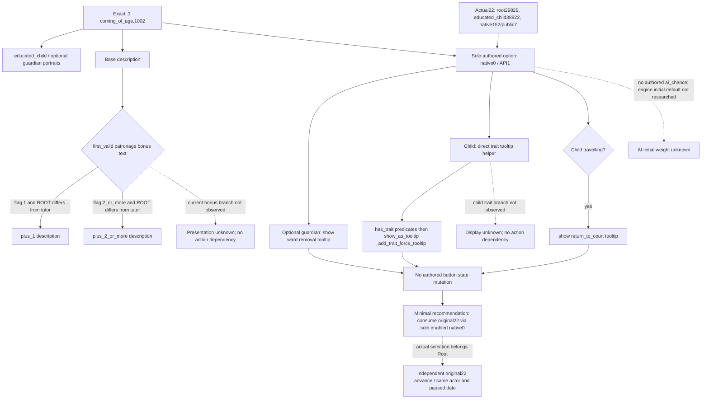
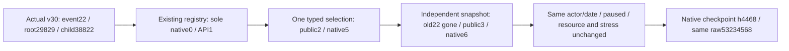

`coming_of_age.1002` 是当前原版成年通知事件。冻结来源为 Steam `1.20.0.3`、build `25652598`、EXE SHA `94B55397ABB687A3DCD436805A5D885E6BE90FA6C693FEB44A9E3BBEEADE02A6`；本包没有重读 PE。

事件位于 `events/education_and_childhood/coming_of_age_events.txt:2368–2412`，完整源文件 SHA 为 `fb2c0e3d52b9f625ebd128195c3bf622d656c49ef1aba91fb13c93569998a4ba`，事件块 SHA 为 `abb8ff82070f20995ae2ec4fb93913b9a3a4cbec8d7bd4b56513f38897acd7f7`。它没有 `immediate`、`after` 或 authored `ai_chance`，仅有 `2399–2411` 的一个选项 `coming_of_age.1001.a`。

直接 helper `common/scripted_effects/00_education_effects.txt:1344–1661` 的所有分支都检查现有 `has_trait`，然后在 `show_as_tooltip` 内使用 `add_trait_force_tooltip`。helper 块 SHA 为 `96e417efe1d06143645057896d8d67835a908947a3ecd4015c755a273f688e9d`；源文件 SHA 为 `b3fd20ed647fbb4f3bd9af337c605788c96b152e0823f2c7a17817aa23a7ca67`。因此教育 trait、解除 ward 和回庭都属于展示内容；选项没有原版脚本状态变化。原事件中也没有可归给当前按钮的 immediate 教育效果。

英文选项为 “They grow up fast.”，简体中文为“他们成长得很快。”。标题、基础描述、两个 patronage 附加描述和选项共五个 key 已从当前中英文 loc 文件冻结；准确行号与文件 SHA 在 `direct-dependency-pins.json`。

当前真实输入由父线程一次提取：event22、key1002、calculated3831002/runtime6272、ROOT29829、educated_child38822/nameID28611、date53234568、native152/public7；唯一 rendered0/native0 shown-enabled。`rows=[]` 和 preview unavailable 本身不能证明没有效果，空状态效果结论来自上面的完整源块和直接 helper。

原生树已冻结后，最小策略是消费这个唯一可用选项。generic material 保持 `None`；独立 post 只验证原实例推进、选项对应和同 actor/date，不能给教育特质新增、关系解除或回庭记功。无需为未知 tooltip 分支增加决策输入门禁。

## 当前 production 修复与边界

Root 的自然推进在 `v28-marriage21-following-normal7-01/turn-004/natural-event/result.json` 留下真实 RED：Robert29829/date53234568、event22、calculated3831002/runtime6272，唯一 educated_child38822、native0/rendered0 shown+enabled；registry_not_registered 阻断剩余正常时间。原 attempt 保留。Root 报告此前恢复94日加本轮实存2日为96，不能把未到达的100日写成complete。

最小 Python leaf 为 `records_coming_age1002_12003.py`，只在既有 .3 registry 入口登记这一个 key。已有 policy 能直接处理当前 root、一个 typed character saved scope 与唯一 native0/API1，不改 policy、不增 callback/flag/DLL。所选 effect profile 的 executed selected effects 和 common after 都为空、generic material=None；课程 trait、监护解除与条件回庭描述在 tooltip 内，不是本次按钮的新结果。初始 native AI 权重未在脚本声明，保留null，不猜引擎缺省数。

仅执行现有 `test_vanilla_event_registry_policy.py` 中一个新增 full-route fixture：当前 .3 raw typed projection→共享 registry→choose_one_life_turn→GameplayBridgeService.select_event_option(API1)→独立 old22gone/sameactor/datepaused。1/1 GREEN，未执行旧suite，没有实际SDK/game/pipe/窗口调用。先期本地 overlay import断言阻止了所有fixture执行；纠正包reload后才第一次运行新case，此harness记录保留。

交付为static-ready，Root正常应用外置patch、发布新的不可变Python runtime后，重新读取当前原event22并正式选择native0/API1一次。真实读回旧instance advance即可；允许新的queued event，不能把ACK、fixture或tooltip教育材料记作M2实机收益。实际普通时间与保存由Root独占执行并计数。

来源与交付索引：`artifacts/g2-maintainer-2026-10-02/resume-12003/m2-events/actual-robert-coming-age1002-blocker-01/`，其中 `source-evidence/REPORT.json` 含脚本/direct helper/CNEN pins，`actual-input-pin.json` 含唯一实际query来源，`PYTHON-DELIVERY.json` 含准确源diff与fixture证据。Root负责commit/push、actual选择/后续自然推进。

## 2026-10-03 原事件22正式消费与保存

Root 的 `v30-coming-age1002-resolve-save-01` 已关闭并报告 exit0，采用发布绑定 `3223af636a1b7807064046f1c8e38805c5732731`、PID57484。实际 hello 为 `ck3-1.20.0.3-msvc-x64`、build match=true、EXE SHA仍为上面的 `94B55397…02A6`。本次 paused query 独立读到同一原 event22、ROOT29829、educated_child38822、唯一 shown-enabled native0/rendered0；当前 calculated3351002/runtime5580、saved nameID26568 是本次加载结果，不能硬钉旧 attempt 的3831002/6272/28611。

`005-ck3_select_event_option.json` 实际只提交一次 native0/API1，expected public revision2；原 selection postcondition=true，native:5/public2→native:6/public3。独立 `001` 与 `006` 快照证明原22从存在变为 active_event=null，同 actor29829、同 episode `native-29829-2bc2d599f7f9`、同 raw53234568，前后均 paused。gold106224284、prestige268938480、piety37057500（均scale100000）、stress0保持不变。

正式 checkpoint 已物化，history4468、size90534535、SHA `99cea560f365f98f61fb87530cbcf5d42b226f0e2510e138e75fbe69c7bfb49d`；保存策略为既有 `native-autosave-command-v1`。packet中的保存SHA与result记录的checkpoint_disk_sha256相同，本工作包只复用已关闭材料，没有访问managed state或重新保存。

本 leaf 升为 **production-live primitive：成年通知正式推进并保存**。result 名称 `event_selected_material_recorded` 不改变真实合同：executed selected effects为空、common after为空、production_material_expectation=null，independent material仍unavailable/metric=null/new_live_milestone_credit=false。教育trait、解除ward、回庭与generic material loop信用均为0；helper的 natural_provenance_verified=false 和 new_live_milestone_credit=false 保持原样。此次选择/保存增加0自然日，先前恢复94加实存2日的96日由Root计数，不冒充100日complete；后续正常窗口由Root继续。

唯一新增actual字段包：`artifacts/g2-maintainer-2026-10-02/resume-12003/m2-events/v30-coming-age1002-resolve-save-01/ACTUAL-CLOSED-SUMMARY.json`、`REPORT-FIELDS.json`、`RELEASE-PINS.json`。其中保留original result、typed query、一次selection、独立before/post snapshot与checkpoint的准确SHA。原registry_not_registered RED保留；本次不重跑fixture/source/helper/旧suite、不改registry/policy/native。
