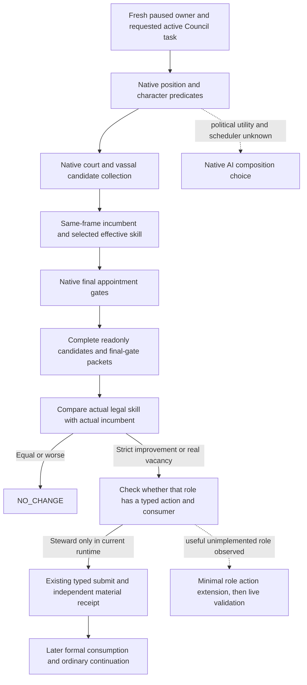

# CK3 1.20.0.3 nonreligious Council role coverage

## Actual decision gap

G2-M4 requires verified construction, a useful legal Council adjustment and a
real vassal/faction intervention in one two-game-year window. The Murchad
Steward vacancy appointment satisfies the original Council adjustment subitem:
the best native-legal candidate 39761, skill 8 versus the alternative 36403's 7,
was submitted once, independently observed as holder on `task_collect_taxes`,
consumed by a later formal turn and verified again in a new PID. The original
contract does not additionally require incumbent replacement. That narrow
appointment loop does not establish broad role coverage or isolated tax income.
After the appointment, the Steward comparison was skill 8 versus the best legal
alternative 7; Spymaster was intrigue 14 versus the best legal alternative 4.
Both comparisons support `NO_CHANGE`.

The root-owned v14 paused capture now observes Murchad's Chancellor as a real
vacancy, with candidate 36403, diplomacy 9, the sole native-final-legal ordinary
assignment. These existing query inputs required no source change or DLL
rebuild. This is an independent useful governance opportunity and does not
block the already satisfied M4 Council subitem. The older Rogue Chancellor
observation, 9 versus 9, belongs to actor 29829 and is not substituted for the
new observation of actor 31853. No Chancellor appointment has been submitted.

## Exact build and inherited native tree

This inventory concerns CK3 `1.20.0.3`, Steam build `25652598`, EXE SHA-256
`94B55397ABB687A3DCD436805A5D885E6BE90FA6C693FEB44A9E3BBEEADE02A6`.
It reuses the closed producer and final-gate inputs documented in
[Council candidates](ck3-1.20.0.2-council-candidates.md),
[Council gates](ck3-1.20.0.2-council-gates.md),
[composition AI](council-composition-ai.md),
[Chancellor inputs](ck3-1.20.0.3-chancellor-candidates.md) and
[Spymaster inputs](ck3-1.20.0.3-spymaster-candidates.md).

The native court/vassal producer resolves the position from the requested active
task. Position validity, character validity, incumbent replacement permission,
existing councillor, guest and pending-interaction checks stay native results.
The effective skill comparator is a useful bounded policy input. It is not the
complete native composition score: political weights, powerful-vassal utility,
scheduling and tie-breaking remain unknown in the inherited AI tree.

## Current production coverage in the v14 runtime

| Role | Effective skill input | Candidate and final-gate query | Typed assign/replace and formal consumer |
| --- | --- | --- | --- |
| Steward | stewardship, Character `+0xE0` | supported; current Murchad evidence | supported; existing vacancy loop |
| Chancellor | diplomacy, Character `+0xD8` | supported; v14 Murchad vacancy and sole legal candidate 36403, skill 9 | outside current Steward-only action coverage |
| Spymaster | intrigue, Character `+0xE4` | supported; current Murchad live primitive and `NO_CHANGE` | outside current Steward-only action coverage |
| Marshal | martial, Character `+0xDC`, reviewed phase-character ABI reuse | no current role profile in Python/native transport | outside current action coverage |

The private MCP tools are
`ck3_query_council_composition_candidates_private_v1` and
`ck3_query_council_final_gates_private_v1`. Both accept
`position_key` and default to `councillor_steward`. Existing Chancellor and
Spymaster profiles reuse the producer, allocator, final gates and mailbox; they
do not define separate appointment routes. `build_assign_councillor_request_v1`,
the native action preflight and the formal consumer retain their Steward-only
contract. A supported readonly role is therefore not a supported typed action.

The current Marshal stock definition uses `skill = martial`; its compiled
candidate predicate includes an additional hostage exclusion and a
shieldmaiden exception. A future bounded Marshal profile must consume those
native results. The accepted `.3` ABI reuse ledger includes the reviewed
`ck3_1_20_0_2_phase_character.json` manifest: the indexed effective getter uses
`+0xD8`, martial is the reviewed enum 1, and `kCharacterMartialOffset` is
`0xDC`. This supplies the bounded Marshal skill input without another PE
verification. A direct `.3` named-enum registration span has not been newly
captured in this package; that is an evidence-strength distinction, not a new
implementation blocker. No Marshal query should be sent to the current
runtime because its role profile is absent.

## Root-owned capture and actual v14 result

The file-only handoff is under
`artifacts/g2-maintainer-2026-10-02/resume-12003/m4-council/role-coverage/`.
`query-coverage/ROOT-CHANCELLOR-READONLY-CALLS.json` supplies fresh revision-bound
calls to the two existing private tools and an independent campaign-root read.
The saved comparison reuses the earlier Chancellor packet reader rather than
introducing another query framework. Root alone owns the live SDK/pipe session,
game, managed state and eventual action.

Root's actual `murchad-v14-cold-material-01` capture used the shorter existing
two-query config and reused its fresh independent campaign-root packet 018.
The selected source is immutable `production-source-7ebc43e0`. All packets bind
actor 31853, episode `native-31853-af642d76cb41`, raw date 53329800, snapshot
`native:1`, native revision 1 and public revision 2. The root is paused with a
living player and map ready. Packets 022 and 024 publish the same complete
candidate collection; 023 and 025 independently bracket the same paused frame.
The existing saved Chancellor reader passed once on those five packets.

| Full CharacterID | Effective diplomacy | Native final ordinary appointment result |
| ---: | ---: | --- |
| 36403 | 9 | legal |
| 36567 | 5 | excluded: `candidate_already_councillor` |
| 39761 | 15 | excluded: `candidate_already_councillor` |

The independent root and the candidate projection both report no Chancellor
incumbent. Incumbent skill and task are legitimately null, so the result is a
vacancy opportunity, not an observed skill gain over an incumbent. The higher
diplomacy 15 candidate is the current Steward and is excluded by the ordinary
final gate; this packet does not establish a reassign/swap route. The sole legal
row 36403 has no guest or pending-interaction blocker. Native AI political
utility and alternate-task value remain unobserved.

The actual comparison and raw packet hashes are preserved in
`m4-council/role-coverage/ACTUAL-MURCHAD-V14-CHANCELLOR-COMPARE.json` under the
resume archive. Root's same SDK capture ends at normal checkpoint h2077,
date 53329800, 112139803 bytes, SHA-256
`18a78e68385137b7fe35679aa8ca6a60437da760189f18ea4e084fa92d9d2577`.
The capture advanced no game time and submitted no Council action. This is
current Murchad Chancellor **production-live primitive** evidence, not an
appointment loop or new milestone completion.

The fresh result must bind the current player, date, incumbent, requested
Chancellor role, diplomacy input, complete candidate collection and native final
gates. Only a strictly better final-legal candidate, or a real vacancy, creates
an observed appointment opportunity. A tie or worse alternative closes the
comparison as `NO_CHANGE`; it must not be turned into a replacement to increase
the milestone count.

The remaining Marshal role observation entry is a bounded profile in the same
two queries. Its effective skill input is already covered by the reviewed
current-build reuse ledger, and a future implementation would not require
another broad ABI verification, new producer or public tool. Root has deferred
that implementation in this package. It is not a prerequisite for M4 credit.
Only an actually observed useful Chancellor alternative justifies considering
a separate minimal typed assign/replace and original-consumer extension,
followed by independent holder/task, later formal consumption and checkpoint.

## Bounded Chancellor action source delivery

The real vacancy above justified extending the original private Council path.
The delivered source is **static-ready** for ordinary Chancellor vacancy
assignment, its independent material receipt and original next/cold consumption.
Root integrated the 14 existing source/test patches; the newly frozen DLL and
actual Chancellor action remain separate verification steps. The v14 runtime
table above describes the actual runtime used for the readonly capture.

Five native production files now retain the selected position in request
preparation, both fresh pre-submit frames, queued request and ACK-bound later
receipt. The reviewed helper `0x115AAA0` already takes candidate full CharacterID
and actual task full ID; its final native command predicates, producer, final
gates and generic material receipt verifier are reused. Legacy default Steward
assignment and occupied replacement remain unchanged. The new Chancellor route
is vacant assignment only. No swap, existing-councillor reassignment, recruitment,
Marshal action, new flag, wire schema or shared bridge/CMake routing is added.

Three Python production files bind the real observed role and diplomacy to the
existing request and policy. The ordinary consumer keeps Steward first; only no
Steward action plus a fresh independent root-confirmed Chancellor vacancy leads
to a fresh Chancellor final-gate query. It derives an old pending/applied role
from the original ACK/source packet and verifies that role's actual holder/task.
The single pending/latest applied ledger schema is unchanged. Future submission
uses current native prechecks and does not pin candidate 36403 or diplomacy 9.

The native transport retains one last Council quote. Reading applied Chancellor
persistence after selecting a Steward action would replace that selected quote.
The consumer therefore reads an applied Chancellor first, then queries Steward
for its current decision. This preserves the original action's actual cached
role without a new cache or ledger. A focused production consumer case verifies
that a later useful Steward replacement still submits with the Steward quote.

The three existing native fixtures pass strict `/W4 /WX /UNDEBUG`, including
the actual producer/gates/task-selected action and later receipt chain; the
runtime fixture reports 36 checks. Python has 25 distinct functional cases
passing. The initial 24 cases are reused; after the necessary quote-order change,
only the two changed Chancellor chains and the one added cache-order case were
tested. Original genuine C++ gates/ACK/receipt bytes pass the production Python
normalizer, selector and request/receipt contract once. A Steward-only change
leaves the Chancellor wire receipt `postcondition_failed`; helper ACK alone does
not qualify as applied material.

The first Python collection attempt lacked the scratch tools import path and
ran no tests. The first transport fixture additionally expected an EXE hash in
the unchanged ACK envelope, which has no such field. Both harness RED attempts
are preserved; only the affected checks were corrected and rerun. Production
schemas were not changed to satisfy those fixture expectations.

Pinned patches, individual test receipts, genuine wires and the builder's thin
`CHANCELLOR-OWNER-INPUTS.json` are under
`m4-council/role-coverage/chancellor-assignment/` in the resume archive. The next
actual verification is fresh native candidate/gates/root, once ordinary assign,
independent Chancellor holder/task, original following-turn consumption and
normal checkpoint/cold restoration. Until then, no Chancellor live action loop,
native AI political score, isolated task benefit or new G2 credit is claimed.

## Qualification boundary

The initial role inventory was file-only research. Root's separately captured
v14 packets add the narrow actual Murchad Chancellor readonly primitive, while
the later offline source tests establish the bounded action's `static-ready`
status. The source/evidence owners ran no game/SDK operation, Council appointment
or game-date advancement. This package adds no G2 credit. It neither changes
the separate Develop County material project nor expands religious seats,
warfare, native AI scoring or safety auditing.
