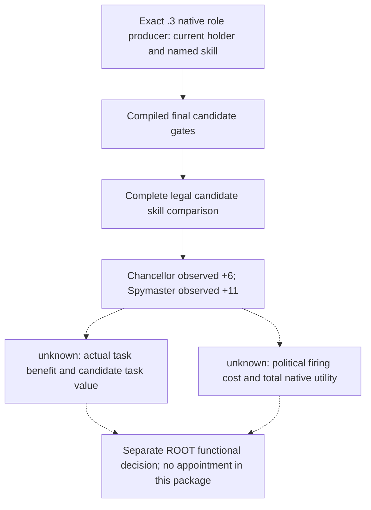
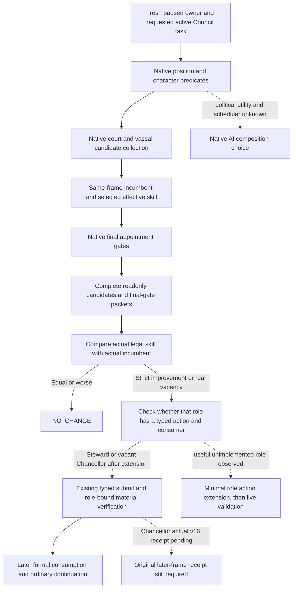

# CK3 1.20.0.3 nonreligious Council role coverage

## Latest V21 cold holder and task persistence: 2026-10-03

ROOT's official V21 cold restore preserves the original Robert goal and six
ledgers in new PID96348. The existing closed small typed root packet
`m2-events/ewan0801-v21-relation-pre-and-council-cold-01/003-ck3_query_campaign_root_context_v1.json`
independently observes paused actor/owner29829 at native4, public revision2 and
raw date53222304. Chancellor holder43696 remains on `task_foreign_affairs`,
type `general`, null target, frozen false and infinite progress. Steward43706
and Spymaster34333 remain on collect-taxes and disrupt-schemes respectively.
The original 7→13 improvement is the earlier actual skill observation; this
root packet observes the replacement holder and task, without remeasuring skill.

ROOT's official preserved-ledger proof and the original once action with its
applied/next-consumed receipt are reused instead of reopening the V20 loop;
the Council owner maintains their compact joint fields. Together they close cold verification of the narrow
Chancellor **production-live loop**. This file contributes no new assignment,
consumer turn, game day, full-role or M4 completion claim. The remaining
requested30-day window is still pending. The earlier same-PID/cold-pending
section below retains its historical phase boundary.

## Actual V20 Chancellor same-PID loop, cold pending

ROOT now closes the explicitly configured occupied-Chancellor loop in PID94488:
the fresh source/native `4ee2e755` quote again observes34867 diplomacy7 versus
native-final-legal43696 diplomacy13, then submits once for active task7158.
Action `council-formal-d660e8080ebf4a7a8c18cd1b4401230c` is independently
`applied` by the original Python `b03` formal service at native15/date53222136,
with holder43696 and preserved `task_foreign_affairs`/general/null target/not
frozen/infinite progress. Its next successful ordinary turn consumes that same
receipt before advancing six days to raw53222280/saveh4130. The current ledger
has pending null, the same applied action and `next_turn_consumed=true`.

This is a narrow same-PID **production-live loop**, not a new full-role or M4
completion claim. Natural modal13 stops the requested30-day window after6 days;
the subsequent modal-early-return `mode consume` has no selected step or consumed
plan field, so its `NO_APPLIED_ASSIGNMENT_CONSUMED` result neither adds nor
retracts proof. It is not RED and requires no repeat assignment or extra consume.
Cold verification and the remaining window are still pending. The exact
original projections and task/consumption timing are linked in the
[Chancellor actual loop](ck3-1.20.0.3-chancellor-candidates.md) and compact
`robert-current-role-opportunities/CHANCELLOR-V20-LIVE-REPORT-FIELDS.json`.
Steward43706 and retained Spymaster34333 receive no new action credit here.

## Latest configured occupied-Chancellor source package: static-ready

The real Robert +6 diplomacy observation now has an explicitly configured
occupied-Chancellor formal source path. Default Steward and vacant-Chancellor
behavior remain preserved, Spymaster34333 stays retained, and current
`task_foreign_affairs` is kept through the same native active-task binding.
Only a fresh native-final-legal strictly better diplomacy candidate qualifies;
ties or worse remain `NO_CHANGE`. Existing once/pending assignment, independent
later same-role receipt and following-turn persistence are reused. See the
[counterpolicy boundary and retained failures](ck3-1.20.0.3-chancellor-candidates.md).

The source owner reports one new integral Python PASS (0.59 seconds), the
strict native focused final GREEN and four genuine native fixture wires
consumed by existing Python normalizers. The first native fixture expected
metadata absent from generic ACK/receipt envelopes, and the first external
reader mis-unwrapped an existing nested envelope; both RED attempts remain
archived and were corrected only in their fixture/reader. New production source
is **static-ready**, with no new flags, tools or ABI changes. No new appointment,
task material effect, next/cold loop, game day or G2 credit is claimed here.
The source owner's `m4-council/chancellor-configured-formal/REPORT-FIELDS.json`
and `OWNED-PATHS.json` retain exact pins and necessary receipts; ROOT's fresh
runtime quote/action/receipt/next/cold stages are still pending.

## Latest Robert Chancellor and Spymaster observation: 2026-10-02 21:46 China time

The root-owned `m4-council/role-coverage/robert-v19-412-actual-01`
capture is GREEN on immutable `production-source-41291bf2`, actual PID 70968,
actor 29829 and episode `native-29829-2bc2d599f7f9`. Its shared paused bracket
stays at `native:16`, public revision 2 and date 53220624. These are actual
source-frame values; earlier preparation context does not supply quote revisions.
The seven-call role batch reuses the existing independent campaign-root query,
parameterized composition producer and four final gates. The eighth recorded
call belongs to a separate Feast guest baseline; the same-owner construction
companion is also outside this role comparison.

| Role | Actual incumbent and effective skill | Best native-final-legal candidate | Skill difference | Complete native / final-legal counts | Actual incumbent task |
| --- | --- | --- | --- | --- | --- |
| Chancellor | 34867, diplomacy 7 | 43696, diplomacy 13, sole highest candidate | +6 | 14 / 11 | `task_foreign_affairs` |
| Spymaster | 34333, intrigue 12 | 32440, intrigue 23, sole highest candidate | +11 | 17 / 14 | `task_disrupt_schemes` |

Both independent task rows are `general`, target null, not frozen, with infinite
progress. Each role's complete standalone collection agrees with the producer
embedded in its final-gate packet. The Chancellor excludes 33435, 34333 and
43706; the Spymaster excludes 33435, 34867 and 43706. Every exclusion is the
native `candidate_already_councillor` result, and the saved comparisons retain
all candidate identities, ordinals, native gate rows, legal rankings and top ties.
Existing saved comparators ran once for each role and returned GREEN. The only
reader adaptation is a two-line unwrap of the capture's `internal_semantic_frame`
container in the external saved-packet helper; production source and comparison
rules are unchanged.

These results are **production-live primitive** role observations and real
effective-skill opportunities. They do not quantify `task_foreign_affairs`
output, scheme prevention, native composition utility or the political cost of
firing either incumbent. The earlier v19 observation of 34333 as a liberty
faction member and active Sway target remains ASOF background, even though this
fresh role frame independently observes the same holder. It does not prove
current faction/opinion values or a material political gain from replacement.

The real positive differences supply useful named-skill input for a separately
scoped functional decision. The existing typed
Chancellor route supports a vacancy; occupied Chancellor replacement and
Spymaster assignment are not claimed by this capture. Future action planning
must use fresh native candidates and gates rather than locking 43696 or 32440
from this frame. Steward 43706 and its already closed collect-taxes loop remain
unchanged. This package adds no assignment, game day, G2 milestone or full-role
completion claim, and does not add an M4 completion condition.

After this observation, ROOT chose Chancellor's +6 as the next minimal functional
extension. The current 412 tools and source do not publish a current-task-value
MCP query; the old v13 execution token was mistaken for a public query. No
extra query configuration was created, and full task-value numbers are not a
prerequisite for the observed skill/current-task/final-gate strategy. Task total
output and political utility remain recorded quality gaps for later outcome
calibration. The separate Council source owner retains implementation. ROOT defers
Spymaster replacement because incumbent 34333 is the existing Sway target and
liberty member; its +11 remains an observed skill opportunity rather than a
replacement plan. The role task-value and political-input work stays narrow and
does not expand to other roles or generic political scoring.

The current role reports and pinned full comparisons are preserved under
`m4-council/role-coverage/robert-current-role-opportunities/`:
`chancellor/REPORT-FIELDS-ACTUAL.json` and
`spymaster/REPORT-FIELDS-ACTUAL.json`. The joint report, current source pins and
the external reader compatibility pin are in `ACTUAL-JOINT-REPORT-FIELDS.json`.

## Actual decision gap

G2-M4 requires verified construction, a useful legal Council adjustment and a
real vassal/faction intervention in one two-game-year window. The Murchad
Steward vacancy appointment satisfies the original Council adjustment subitem:
the best native-legal candidate 39761, skill 8 versus the alternative 36403's 7,
was submitted once, independently observed as holder on `task_collect_taxes`,
consumed by a later formal turn and verified again in a new PID. The original
contract does not additionally require incumbent replacement. That narrow
appointment loop does not establish broad role coverage or isolated tax income.
After the appointment, the Steward comparison was skill 8 versus the best legal
alternative 7; Spymaster was intrigue 14 versus the best legal alternative 4.
Both comparisons support `NO_CHANGE`.

The root-owned v14 paused capture now observes Murchad's Chancellor as a real
vacancy, with candidate 36403, diplomacy 9, the sole native-final-legal ordinary
assignment. These existing query inputs required no source change or DLL
rebuild. This is an independent useful governance opportunity and does not
block the already satisfied M4 Council subitem. The older Rogue Chancellor
observation, 9 versus 9, belongs to actor 29829 and is not substituted for the
new observation of actor 31853. That v14 capture submitted no Chancellor
appointment. The later actual v16 submission and its pending verification
boundary are recorded below.

## Exact build and inherited native tree

This inventory concerns CK3 `1.20.0.3`, Steam build `25652598`, EXE SHA-256
`94B55397ABB687A3DCD436805A5D885E6BE90FA6C693FEB44A9E3BBEEADE02A6`.
It reuses the closed producer and final-gate inputs documented in
[Council candidates](ck3-1.20.0.2-council-candidates.md),
[Council gates](ck3-1.20.0.2-council-gates.md),
[composition AI](council-composition-ai.md),
[Chancellor inputs](ck3-1.20.0.3-chancellor-candidates.md) and
[Spymaster inputs](ck3-1.20.0.3-spymaster-candidates.md).

The native court/vassal producer resolves the position from the requested active
task. Position validity, character validity, incumbent replacement permission,
existing councillor, guest and pending-interaction checks stay native results.
The effective skill comparator is a useful bounded policy input. It is not the
complete native composition score: political weights, powerful-vassal utility,
scheduling and tie-breaking remain unknown in the inherited AI tree.

## Current production coverage in the v14 runtime

| Role | Effective skill input | Candidate and final-gate query | Typed assign/replace and formal consumer |
| --- | --- | --- | --- |
| Steward | stewardship, Character `+0xE0` | supported; current Murchad evidence | supported; existing vacancy loop |
| Chancellor | diplomacy, Character `+0xD8` | supported; v14 Murchad vacancy and sole legal candidate 36403, skill 9 | outside current Steward-only action coverage |
| Spymaster | intrigue, Character `+0xE4` | supported; current Murchad live primitive and `NO_CHANGE` | outside current Steward-only action coverage |
| Marshal | martial, Character `+0xDC`, reviewed phase-character ABI reuse | no current role profile in Python/native transport | outside current action coverage |

The private MCP tools are
`ck3_query_council_composition_candidates_private_v1` and
`ck3_query_council_final_gates_private_v1`. Both accept
`position_key` and default to `councillor_steward`. Existing Chancellor and
Spymaster profiles reuse the producer, allocator, final gates and mailbox; they
do not define separate appointment routes. `build_assign_councillor_request_v1`,
the native action preflight and the formal consumer retain their Steward-only
contract. A supported readonly role is therefore not a supported typed action.

The current Marshal stock definition uses `skill = martial`; its compiled
candidate predicate includes an additional hostage exclusion and a
shieldmaiden exception. A future bounded Marshal profile must consume those
native results. The accepted `.3` ABI reuse ledger includes the reviewed
`ck3_1_20_0_2_phase_character.json` manifest: the indexed effective getter uses
`+0xD8`, martial is the reviewed enum 1, and `kCharacterMartialOffset` is
`0xDC`. This supplies the bounded Marshal skill input without another PE
verification. A direct `.3` named-enum registration span has not been newly
captured in this package; that is an evidence-strength distinction, not a new
implementation blocker. No Marshal query should be sent to the current
runtime because its role profile is absent.

## Root-owned capture and actual v14 result

The file-only handoff is under
`artifacts/g2-maintainer-2026-10-02/resume-12003/m4-council/role-coverage/`.
`query-coverage/ROOT-CHANCELLOR-READONLY-CALLS.json` supplies fresh revision-bound
calls to the two existing private tools and an independent campaign-root read.
The saved comparison reuses the earlier Chancellor packet reader rather than
introducing another query framework. Root alone owns the live SDK/pipe session,
game, managed state and eventual action.

Root's actual `murchad-v14-cold-material-01` capture used the shorter existing
two-query config and reused its fresh independent campaign-root packet 018.
The selected source is immutable `production-source-7ebc43e0`. All packets bind
actor 31853, episode `native-31853-af642d76cb41`, raw date 53329800, snapshot
`native:1`, native revision 1 and public revision 2. The root is paused with a
living player and map ready. Packets 022 and 024 publish the same complete
candidate collection; 023 and 025 independently bracket the same paused frame.
The existing saved Chancellor reader passed once on those five packets.

| Full CharacterID | Effective diplomacy | Native final ordinary appointment result |
| ---: | ---: | --- |
| 36403 | 9 | legal |
| 36567 | 5 | excluded: `candidate_already_councillor` |
| 39761 | 15 | excluded: `candidate_already_councillor` |

The independent root and the candidate projection both report no Chancellor
incumbent. Incumbent skill and task are legitimately null, so the result is a
vacancy opportunity, not an observed skill gain over an incumbent. The higher
diplomacy 15 candidate is the current Steward and is excluded by the ordinary
final gate; this packet does not establish a reassign/swap route. The sole legal
row 36403 has no guest or pending-interaction blocker. Native AI political
utility and alternate-task value remain unobserved.

The actual comparison and raw packet hashes are preserved in
`m4-council/role-coverage/ACTUAL-MURCHAD-V14-CHANCELLOR-COMPARE.json` under the
resume archive. Root's same SDK capture ends at normal checkpoint h2077,
date 53329800, 112139803 bytes, SHA-256
`18a78e68385137b7fe35679aa8ca6a60437da760189f18ea4e084fa92d9d2577`.
The capture advanced no game time and submitted no Council action. This is
current Murchad Chancellor **production-live primitive** evidence, not an
appointment loop or new milestone completion.

The fresh result must bind the current player, date, incumbent, requested
Chancellor role, diplomacy input, complete candidate collection and native final
gates. Only a strictly better final-legal candidate, or a real vacancy, creates
an observed appointment opportunity. A tie or worse alternative closes the
comparison as `NO_CHANGE`; it must not be turned into a replacement to increase
the milestone count.

The remaining Marshal role observation entry is a bounded profile in the same
two queries. Its effective skill input is already covered by the reviewed
current-build reuse ledger, and a future implementation would not require
another broad ABI verification, new producer or public tool. Root has deferred
that implementation in this package. It is not a prerequisite for M4 credit.
Only an actually observed useful Chancellor alternative justifies considering
a separate minimal typed assign/replace and original-consumer extension,
followed by independent holder/task, later formal consumption and checkpoint.

## Bounded Chancellor action source delivery

The real vacancy above justified extending the original private Council path.
At delivery, the source was **static-ready** for ordinary Chancellor vacancy
assignment, its independent material receipt and original next/cold consumption.
Root integrated the 14 existing source/test patches and later adopted the v16
DLL. The actual v16 submission below does not yet establish its material or
next/cold consumption. The v14 runtime table above describes the runtime used
for the readonly capture.

Five native production files now retain the selected position in request
preparation, both fresh pre-submit frames, queued request and ACK-bound later
receipt. The reviewed helper `0x115AAA0` already takes candidate full CharacterID
and actual task full ID; its final native command predicates, producer, final
gates and generic material receipt verifier are reused. Legacy default Steward
assignment and occupied replacement remain unchanged. The new Chancellor route
is vacant assignment only. No swap, existing-councillor reassignment, recruitment,
Marshal action, new flag, wire schema or shared bridge/CMake routing is added.

Three Python production files bind the real observed role and diplomacy to the
existing request and policy. The ordinary consumer keeps Steward first; only no
Steward action plus a fresh independent root-confirmed Chancellor vacancy leads
to a fresh Chancellor final-gate query. It derives an old pending/applied role
from the original ACK/source packet and verifies that role's actual holder/task.
The single pending/latest applied ledger schema is unchanged. Future submission
uses current native prechecks and does not pin candidate 36403 or diplomacy 9.

The native transport retains one last Council quote. Reading applied Chancellor
persistence after selecting a Steward action would replace that selected quote.
The consumer therefore reads an applied Chancellor first, then queries Steward
for its current decision. This preserves the original action's actual cached
role without a new cache or ledger. A focused production consumer case verifies
that a later useful Steward replacement still submits with the Steward quote.

The three existing native fixtures pass strict `/W4 /WX /UNDEBUG`, including
the actual producer/gates/task-selected action and later receipt chain; the
runtime fixture reports 36 checks. Python has 25 distinct functional cases
passing. The initial 24 cases are reused; after the necessary quote-order change,
only the two changed Chancellor chains and the one added cache-order case were
tested. Original genuine C++ gates/ACK/receipt bytes pass the production Python
normalizer, selector and request/receipt contract once. A Steward-only change
leaves the Chancellor wire receipt `postcondition_failed`; helper ACK alone does
not qualify as applied material.

The first Python collection attempt lacked the scratch tools import path and
ran no tests. The first transport fixture additionally expected an EXE hash in
the unchanged ACK envelope, which has no such field. Both harness RED attempts
are preserved; only the affected checks were corrected and rerun. Production
schemas were not changed to satisfy those fixture expectations.

Pinned patches, individual test receipts, genuine wires and the builder's thin
`CHANCELLOR-OWNER-INPUTS.json` are under
`m4-council/role-coverage/chancellor-assignment/` in the resume archive. The next
actual verification uses fresh native candidate/gates/root, once ordinary assign,
independent Chancellor holder/task, original following-turn consumption and
normal checkpoint/cold restoration. The first actual v16 attempt below closes
the fresh query and once-submit portion. It does not establish the later
material/consumption portion, native AI political score, isolated task benefit
or new G2 credit.

## Actual v16 formal submission remains receipt-pending

Root's closed `m7-murchad/formal-v16-background-next-01` archive uses immutable
`production-source-d4f377d9` and the adopted v16 DLL. The original production
service consumed its registered natural modal at turn 1 and continued to the
ordinary Council path. At turn 2, the fresh paused Chancellor quote is snapshot
`native:6`, raw date 53330784, actor 31853 and the same Murchad episode. Its
complete three-row native collection again observes a genuine vacancy and
chooses 36403, diplomacy 9, as the sole final-legal candidate. Rows 36567 and
39761 remain excluded as existing councillors. These values come from this new
quote; the old v14 candidate and skill were not selection constants.

The captured command archive records exactly one matching ACK for
`council-formal-6785b8845870418c970feeadda000a8d`, position
`councillor_chancellor`, actual task ID 9760, candidate 36403 and route
`assign_vacant`. The original consumer retains `stage = receipt_pending`.
The ACK reports that the native helper was invoked and verification is pending;
it does not observe queue acceptance or prove the resulting holder/task.

Turn 3 preserves that same pending action. Because its starting native frame 6
is still the ACK's pre-frame, the ordinary service chooses `life-advance` and
advances two game days to raw date 53330832, native frame 9. A new four-option
natural modal then stops turn 4 with `existing_consumer_not_ready`. The current
captured command archive contains zero matching Chancellor material receipts,
and none of this attempt's original plans consumes a Chancellor applied
receipt. Turn 2's `council_receipt_consumed` belongs to the earlier Steward
39761 appointment and cannot serve as Chancellor proof.

Root still saves the normal checkpoint h2121 at date 53330832, 112436214 bytes,
SHA-256 `1fd5168dd61a373849b93d46fc8c27093d88ebaf382c3f93923ad3fe1b2be74c`.
No cold restoration of that checkpoint has occurred in this package. This is
actual typed Chancellor submission on top of the existing readonly
**production-live primitive**, with material verification and original next
consumption pending. It is not a Chancellor **production-live loop** or
capability RED. The next action is to resume the new natural modal through its
original consumer, then let the existing later-frame Council receipt path run;
the pending appointment should not be submitted a second time.

The once-run offline projection, original input hashes and interpreted boundary
are preserved in `m4-council/role-coverage/ACTUAL-FORMAL-V16-CHANCELLOR-PROJECTION.json`,
`ACTUAL-FORMAL-V16-CHANCELLOR-ASSESSMENT.json` and
`ACTUAL-V16-REPORT-FIELDS.json` under the resume archive. This owner made no
game/SDK/state calls and reran no fixtures, tests, CI or ABI verification.

## Robert v16 original formal attempt stopped before Council dispatch

Robert's current v16 actor 29829 and episode `native-29829-2bc2d599f7f9`
are a separate campaign from the Murchad observations above. The independent
current root packet 004 under `m7-robert/actual-v16-multidomain-01/capture-01`
observes Steward incumbent 32716 on `task_collect_taxes`, task type `general`,
target null, not frozen and infinite progress. That baseline is preserved with
its original frame and file pin in
`m4-council/role-coverage/robert-v16/native-receipt-fields.json`. The current
legal skill-improvement observation is input to a possible replacement; it
does not establish dispatch or a new holder.

Root's closed `m4-council/robert-formal-once-01` attempt uses immutable
`production-source-d4f377d9`. The original formal service returns `blocked`
with phase `ordinary_nonwar_opportunity` and `selected_step = null` before
entering the Council planner/consumer. Its captured turn has no submitted
plan, Council decision, pending action or applied-receipt consumption. Both
before and after snapshots remain `native:7`, raw date 53220000; no game day
or Council action is recorded by this attempt. Preparing a legal candidate or
enabling the existing query/action permissions does not change that result.

The normal checkpoint is still saved at h4037, date 53220000, 79401509 bytes,
SHA-256 `fecd8041c5c2b5dcbef36cdd4a9b4a601e3aa649c19967ad43af1598beccd084`.
The once-run reader and original hashes are retained in
`m4-council/role-coverage/robert-v16/ACTUAL-FORMAL-ONCE-01-PROJECTION.json`
and `ACTUAL-FORMAL-ONCE-01-REPORT-FIELDS.json`. This is a real production
formal-routing stop before native Council capability was exercised. It adds no
Robert role material, next-consumption proof or cold-restored material. The
main Council owner handles the empty-step diagnosis and existing-consumer
wiring; this original formal attempt is not repeated. A later direct-consumer
attempt must retain its own action, actor, role and receipt chain. Murchad's
vacancy credit cannot be used as Robert's replacement evidence.

## Robert v16 once replacement submission is pending its receipt

Root's new closed `m4-council/robert-direct-council-submit-01` archive attaches
to the same Robert campaign and reuses the original frozen production Council
planner, typed action and ledger through the existing-consumer helper. Its
fresh query is `native:14`, date 53220000, with a complete 14-row collection
and 11 final-legal replacement candidates. The real current decision chooses
43706, stewardship 14, over incumbent 32716, stewardship 11: effective skill
gain 3. This is the new submission's own quote; the earlier candidate capture
at native frame 3 remains a separate input observation.

Exactly one original typed submission records ACK action
`council-formal-4c1b14d305234ba0ad2d0fd12ea7dc08`, role
`councillor_steward`, active task ID 7159, route `replace_incumbent`, previous
holder 32716 and candidate 43706. Its pre-frame is `native:14` and its original
ledger stage is `receipt_pending`. The ACK reports helper invocation and
pending verification; it does not observe queue acceptance or material
completion. The archive status is `PENDING_INDEPENDENT_LATER_FRAME`.

The saved fresh independent root packet 002 is before submission and still
observes holder 32716 on `task_collect_taxes`. Packet 006 observes the same
native frame 14 without an applied receipt; packet 007 retains pending with
`applied = null`. The after snapshot 009 is native frame 15 but contains no
independent Council holder/task row. Therefore this closed attempt establishes
no new post holder/task, typed applied receipt or original next-consumption
proof. It advances zero game days and executes no ordinary turn. The normal
checkpoint is nevertheless saved at h4040, date 53220000, 79402967 bytes,
SHA-256 `65ea8d98cdc14fa8d50ca2a83fe91f7ca28cf9135c24fd146b09e1e7e53c8389`.
Cold restoration of new role material has not occurred.

Root will continue after the separate old research-scope hold is resolved,
using a successful ordinary one-day advance and then the same original pending
receipt path. For the existing helper, pending receipt resolution uses
`--mode submit`: the preserved ledger pending makes the production planner
select its receipt step, and the helper resumes that pending action without
submitting again. `--mode consume` only reads original
`plan.council_receipt_consumed`; it follows an applied independent receipt and
a genuinely successful following ordinary turn. A consumed-plan flag alone
does not prove that turn succeeded, task value or isolated tax income. Actor,
episode and action remain bound to this actual tuple; subsequent revisions
come from fresh frames and are not fixed to this attempt's values.

The current tuple, corrected helper stages, original pins and honest pending
boundary are preserved in
`m4-council/role-coverage/robert-v16/ACTUAL-DIRECT-01-REPORT-FIELDS.json`.
The independent file-only branches retain their native material and Python
pending projections in the same directory. They made no game/SDK/state calls,
repeated no fixtures or formal attempts and claimed no new Robert material,
next/cold loop or milestone credit from this submission ACK.

## Robert original formal service independently verifies the replacement

The later closed
`robert-mainline-date-hold-fix-01/actual-normal-turn-01` archive uses immutable
`production-source-dd4772c0` with native actual16. The restored ordinary formal
service selects `private-query-assign-councillor-receipt-v1` for the same pending
action and executes it as `applied`; no direct helper or new assignment is
needed for this receipt. Its raw native receipt binds owner 29829, episode
`native-29829-2bc2d599f7f9`, Steward holder 43706 and the original action
`council-formal-4c1b14d305234ba0ad2d0fd12ea7dc08`. The post-frame is
`native:22`, date 53220000, with identity round trip and
`postcondition_verified = true`.

A separate native campaign-root result independently observes holder 43706 on
`task_collect_taxes`, type `general`, target null, not frozen and infinite
progress. The service's `independent_position` records the same row. The actual
replacement therefore preserves the observed task while changing the holder
from 32716 to 43706; the pre-query observed effective stewardship improvement
was 11 to 14. No isolated tax-income effect is inferred.

This formal turn advances zero game days and records
`next_turn_consumed = false` on the newly applied action. Root saves h4045 at
date 53220000, 79403251 bytes, SHA-256
`2e3e9cd25d02b0df90dddaf1d6e5c25cd4a3c5c76bea8792f7aa63f311c83819`.
It establishes actual independent Robert replacement
**production-live primitive** material. A subsequent successful ordinary turn
must consume this same applied receipt and advance time, followed by a new-PID
checkpoint restoration before a persisted loop is claimed. Those steps have
not occurred in this receipt archive.

The original input pins, once-run projection and current material boundary are
preserved in `m4-council/role-coverage/robert-v16/ACTUAL-RECEIPT-01-PROJECTION.json`
and `ACTUAL-RECEIPT-01-REPORT-FIELDS.json`, with separate native post-task and
Python consumer field artifacts in the same directory. This new receipt
supersedes the direct attempt's pending state without rewriting that earlier
attempt's evidence. The source/evidence owners still made no game/SDK/state
calls and repeated no tests or attempts.

## Robert original following turn consumes the receipt and advances one day

The next closed
`robert-mainline-date-hold-fix-01/actual-normal-clock-execution-01` archive
records the same original action as consumed in its full submitted formal
plan. `council_receipt_consumed.next_turn_consumed` is true at `native:27`,
date 53220000, with holder 43706 and the preserved collect-taxes task. The
previous material receipt is still `native:22`, and the actor, episode and
action remain the Robert tuple above. At Root's explicit authorization, the
current `state/private-council-formal-v1.json` was read once without modification:
it has pending null and that same applied action/consumption. Its original
11131 bytes and SHA-256
`8a5032497458d634164393ff1da5f718d3d5398d644328ba8be7a0b3aed0b2fa`
are retained in the current-ledger artifact.

After recording consumption, the original formal service selects and executes
`life-advance`, advancing exactly one game day from 53220000 to 53220024.
The returned status is `normal-time-target-reached`; no new Council assignment
is submitted. The saved normal checkpoint is h4052/full4052, 79579117 bytes,
SHA-256 `1610b9b4c00d258566fb51744b604240362e50ea38b31c9171dae02fbfd7c167`.
This actual clock execution establishes time advancement independently of the
consumer flag. The flag's holder/task observation is from before that clock
operation and is not used as a day-after root observation.

Root's existing closed `m7-robert/actual-next-day-root-law-family-02` package
supplies the separate day-after native root and initial/final paused bracket.
At `native:35`, public revision 2, date 53220024, it independently observes
Robert actor/owner 29829 and the same episode with Steward 43706 on
`task_collect_taxes`, type `general`, target null, not frozen and infinite null
progress. These task values match the consumed position. The prepared worker
snapshot/root/bracket config is not executed because this existing fresh
capture already supplies the needed observation. No candidate or assignment
is repeated for that confirmation.

Robert's occupied-Steward replacement now has an original same-PID
**production-live loop**: actual legal improvement, once typed submission,
independent same-role applied material, original following-turn consumption,
successful ordinary one-day advance and day-after holder/task persistence.
At that phase, new-PID checkpoint restoration remained pending; the loop was
not yet described as cold-restored. This does not establish broad Council AI or isolated tax
income, and it does not substitute Murchad evidence for Robert's action chain.

The current phase is retained under
`m4-council/role-coverage/robert-v16/ACTUAL-NORMAL-01-REPORT-FIELDS.json`,
`ACTUAL-NORMAL-01-CURRENT-LEDGER.json` and
`ACTUAL-NORMAL-01-DAY-AFTER-ROOT.json`, with original bytes and pins. The new
formal archive was projected once; the workers repeated no test/fixture/CI/ABI
checks, made no game/SDK calls and wrote no managed state.

## Robert narrow replacement loop survives an actual new-PID restoration

Root's official closed cold-goal proof under
`m7-robert/current-v16-native-c0f53e9b-cold-01/latest-final-checkpoint-bound/actual-cold-goal-01`
uses immutable `production-source-c0f53e9b`. It preserves the saved campaign
goal, actor 29829 and episode `native-29829-2bc2d599f7f9`, and records the actual
process transition from PID 109676 to PID 101084. The latest restored save is
h4053, date 53220024, 79579117 bytes, SHA-256
`4ea3cfae9c15a9972a6af30f4a2af8ad2736d04c45f91986db2fd1212975bb03`.
This is distinct from the earlier h4052 normal-clock save above. Existing
official restoration preserves the saved history prefix and records restore
at full history 4054; no worker reconstructs or edits that history.

The official cold export for `private-council-formal-v1.json` contains its pin,
not a second ledger body. Its SHA-256 is exactly the previously frozen original
11131-byte Council ledger hash `8a5032497458d634164393ff1da5f718d3d5398d644328ba8be7a0b3aed0b2fa`.
Those frozen bytes bind original action
`council-formal-4c1b14d305234ba0ad2d0fd12ea7dc08`, pending null, applied
replacement and `next_turn_consumed = true`. The original consumption remains
native frame 27 at date 53220000. The cold baseline skips the next plan and
executes no gameplay step, so this retained consumption is not a newly executed
cold consumer turn. No worker rereads live managed state for this cold proof.

The separate closed `m7-robert/actual-cold-material-101084-01` packet 005 and
existing paused initial/final bracket provide fresh saved-date native state.
At `native:2`, public revision 2, date 53220024, they independently observe the
same Robert actor/episode with Steward 43706 and unchanged
`task_collect_taxes`, general type, null target, frozen false and infinite null
progress. Packet 008 diagnostics records bridge/hello PID 101084, ready game
adapter and matching CK3 1.20.0.3 build. Its minimal hello does not publish a DLL
compilation-source hash; the captured SDK source and Root's adopted actual16
binary remain separate provenance inputs. No extra ABI verification is inferred
or requested from that metadata.

The original actual once submission, independent applied receipt, original
following-turn consumption, successful one-day advance, day-after root and
new-PID saved-date root now form the narrow Robert occupied-Steward
**production-live loop with cold verification**. The cold attempt advances
zero new game days and submits no new appointment. This verifies role/task and
ledger persistence; it does not complete other Council roles, native political
AI, whole M4 or the campaign.

The joint existing-source projection is
`m4-council/role-coverage/robert-v16/ACTUAL-COLD-01-REPORT-FIELDS.json`, with
`ACTUAL-COLD-01-NATIVE-MATERIAL.json` and
`ACTUAL-COLD-01-PYTHON-CONSUMER.json` retaining their original packet/official-pin
sources. All earlier blocked, pending, applied and normal attempts remain
intact. The cold evidence work is file-only: no game/SDK/state/Git operation,
candidate/assignment repetition or test/fixture/CI/ABI rerun.

## Qualification boundary

The initial role inventory was file-only research. Root's separately captured
v14 packets add the narrow actual Murchad Chancellor readonly primitive, while
the later offline source tests establish the bounded action's `static-ready`
status. Root's actual v16 formal attempt adds the once submitted Chancellor ACK,
two days of ordinary continuation and a normal checkpoint, while its material
receipt and next/cold consumption remain pending. The source/evidence owners
ran no game/SDK operation, Council appointment or game-date advancement.
This package adds no G2 credit. It neither changes
the separate Develop County material project nor expands religious seats,
warfare, native AI scoring or safety auditing.
