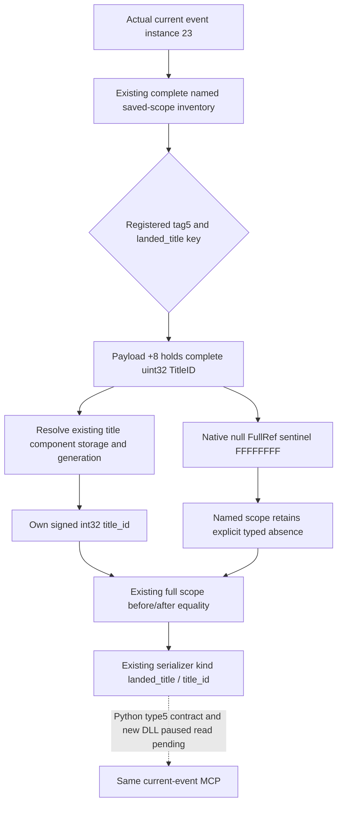

# CK3 1.20.0.3 event saved-scope landed-title identity

2026-10-03, this is the bounded type 5 extension for the actual Robert event `faction_demand.1001`, instance 23, raw date 53236608. The current v32 paused context has three named `landed_title` scopes: `peasant_county`, `target_title`, and `new_title`. Their registered type/name inventory is available, but typed identity is `generic_scope_payload_identity_not_closed`; without the TitleIDs the event consumer cannot identify the actual realm outcome. This work does not select an option or equate faction members with all titles transferred by the stock revolt effect.

The source baseline is immutable `production-source-8cf176b4`; exact CK3 is 1.20.0.3 / Steam 25652598 / EXE SHA-256 `94B55397ABB687A3DCD436805A5D885E6BE90FA6C693FEB44A9E3BBEEADE02A6`. Existing broad .3 ABI migration proof is reused. The new bounded evidence is in `artifacts/g2-maintainer-2026-10-02/resume-12003/m2-events/event-scope-title-v32-native-01/abi/EVENT-SCOPE-TITLE-ABI.json`, SHA-256 `2b403a58eb85d75d42d5db6f67111b9970bbe06355abf6c5c841054827115bbd`.

## Native representation and existing-reader extension

Type 5 registration at RVA `0x43FCB0` binds the actual resolver. Its native existence leaf `0x225E200` reads the full 32-bit TitleID from GenericValue token `+0x08`; this is not a Title pointer. The producer at `0x1CEDF2A` loads `Title+0x10` into `EAX`, which zero-extends into `RAX`; `0x1CEDF36` stores the payload qword, and `0x1CEDF3B` stores tag 5. The landed-title storage slot is `0x5D1DAF8`, fallback `0x5D1DAE0`, component slots `+0x20`, capacity `+0x2C`, stride `0x10`, object `+0x08`. The object identity is `Title+0x10`, compared with all 32 generation bits. Character identity uses a different object offset `+0x18`; its positive-ID check is not part of this title resolver. The native title resolver ignores the token subtype, which stays in the DTO as observed.

The external five-leaf patch adds title storage/fallback to the existing `EventWindowBindings` only for the admitted .3 binder. `ReadEventScopeToken` gains a tag 5 branch that resolves the complete ID into the existing DTO; it does not add a capability, query, or policy gate. The shared DTO adds optional `title_id` after the original aggregate-initializer fields. The existing serializer emits `{"status":"available","kind":"landed_title","title_id":...}` for resolved material. A genuine named null FullRef retains `{"status":"unavailable","reason":"landed_title_scope_is_null"}` and does not invent ID zero. Existing character type 4, saved-null-character, unknown generic scopes, presentation fields, and scope before/after comparison remain on their original paths. The .2 binder leaves title bindings null, preserving its generic opaque payload behavior. The legacy 1.19 serializer is untouched.

## Validation and readiness

The one focused production-path case runs the real `ReadEventWindowContextV1` and the real .3-family serializer using fixture-owned native layout. It includes three title saved scopes with full generation IDs, the original character root, a named null title, and the existing saved-null-character branch. Strict `/O2 /W4 /WX` compilation and execution are **GREEN**: compile 3.279 seconds, run 0.124 seconds; receipt `event-scope-title-v32-native-01/focused-build-02/RESULT.json`. These synthetic IDs are test inputs, not observations of the current event.

The preceding compiler setup failure never invoked `cl`; its summary is retained in `focused-build-00/HARNESS-RED.md`. The first strict compile then exposed a fixture-wrapper link dependency on unrelated build-identity functions; its `compile.log` and `RESULT.json` remain in `focused-build-01`. The final focused wrapper uses the same original Fixture and only the new case, avoiding the unrun legacy suite's links. No broad ABI or old fixture matrix was repeated.

Status is **static-ready**, with no new paused-live title payload, event action, game day, or G2 credit. The user requested a gentle vacation closeout before combined deployment; the package is frozen for handover. The next integration needs surgical merging with the separately owned type 25 faction branch, followed by the existing Python `event_window_context_contract.py::_event_scope` type 5 consumer branch. That parser currently admits only character identities and generic unavailable payloads. It must preserve the signed FullRef, exact `landed_title`/`title_id` shape, and named null-title absence; this Python change is not implemented in this package. New DLL deployment and actual paused current-event verification are also pending. The event's complete effects and transfer set remain separate observations; `semantic_decision_ready` is not upgraded by this identity slice.

收尾采用说明：本页新增代码如有，仅封存为外置补丁，尚未应用到生产 v32；实际读取以本文标注的 artifact/date 为准。接续入口：[度假交接](../handover/2026-10-03-g2-religion-v32-maintainer-vacation-handoff.md)。

## 2026-10-03T11:38 接续源码采用

逐hunk采用7文件：同一原事件查询返回完整title_id/faction_id，旧aggregate前三字段保留，Python支持signed FullRef、合法零和命名null reason。新增联合生产reader→serializer→真实family renderer→Python四fixture帧GREEN，严格/O2 /W4 /WX；复用旧GREEN，三次harness RED保留。semantic_decision_ready仍false；当前事件23真实身份与完整割让范围待部署采样。

实际记录：`2026-10-03T11:38:52+08:00`。源码已采用；严格组合DLL和Robert暂停实读仍待完成，不能记为live或增加日数/动作/收益/G2信用。ROOT负责正常commit/push。

交付回执：[event-scopes](Z:/ck3_mod_rewrite_process_assets/g2-resume-20261003/event-scopes/ROOT-DELIVERY.json)。

## 2026-10-03T12:22 新 PID paused 实读

本专题对应的新只读叶与真实缺口见[统一实读记录](g2-v33-paused-religion-and-event-observations-12003.md)，回链actor/date/native/public revisions和原capture。仅记录primitive，不增加动作、日数或完整OODA；历史fixture与封存状态保留原时点。
