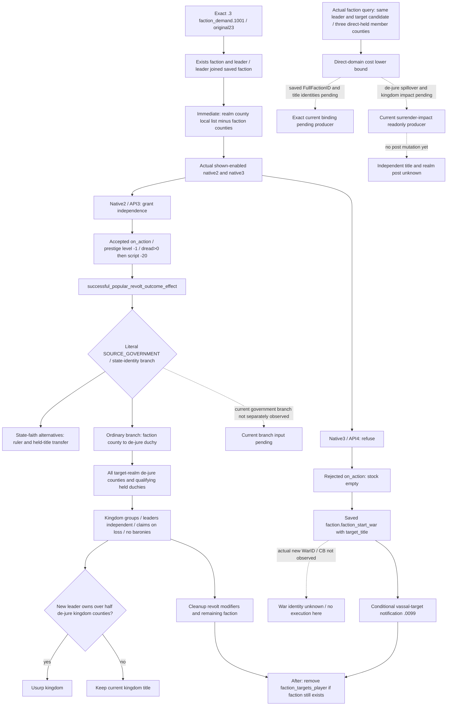
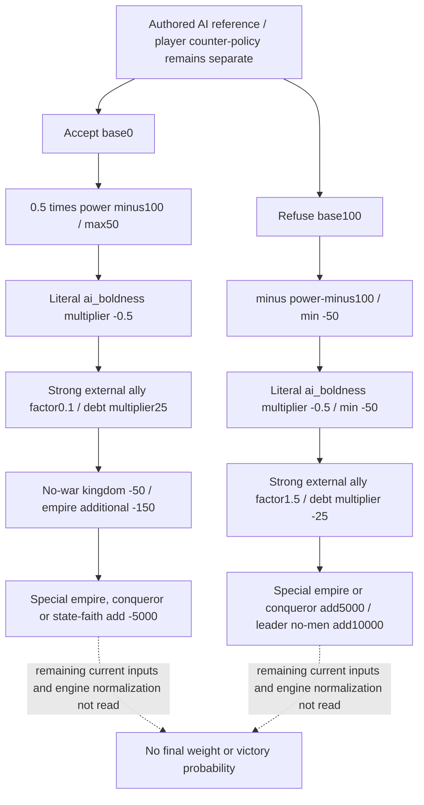

`faction_demand.1001` 当前是 Robert 原 episode 的自然停时阻点。此专题只处理已呈现的 native2／native3，冻结 Steam `1.20.0.3`、build `25652598`、EXE SHA `94B55397ABB687A3DCD436805A5D885E6BE90FA6C693FEB44A9E3BBEEADE02A6`；没有重读 PE、启用 WAR flags 或运行游戏动作。

Root 的唯一实际 typed query 来自 `actual-v32-normal11-next-natural-event-01/002-ck3_query_current_event_window_context_v1.json`，SHA `75de32277dc9f704ddfdec3b61991c9807b3e9ea295292cbba6dc0b31e6e9526`。它在 PID109732、native64/public2、raw53236608 读到原 event23，calculated4061001/runtime5943、ROOT29829、faction_target29829、peasant_leader=faction_leader70766。七个 saved scopes 中 faction 为 type25；peasant_county、target_title、new_title 为 type5，四个 payload 身份在本次旧口仍 unavailable。name identifier68不是full FactionID，不能拿它绑定派系。

两个可见选项都 shown=true、enabled=true：rendered0→native2「行吧，想要安抚这些愤怒的刁民也没用！」、rendered1→native3「想要自由？去阴间要去吧！」。正式编号沿 native authored index：native2 对应 API3，native3 对应 API4；不能把 rendered0直接当作 API1。indicator rows为空、effect_preview unavailable不能代替完整效果研究。

事件块 `events/factions/faction_demands.txt:846–1428` 已完整冻结，whole SHA `eb17720ca9d48acfb8cc24e5f61edc62fd2d4d2d599561c92854fc762104eccd`，block SHA `007fb21da53133ca77d219d17ed54a2b2422eaaaa51ee605bfe67dc1bfe9603d`。四个 authored slots 中当前只呈现2／3；未呈现0／1的转换分支不在本次策略研究范围。

`immediate:891–898` 构建局部 remaining_counties_list，并从中移除 faction counties；它本身不转移头衔、不宣战、不改变压力。native2 在1190调用 accepted on_action，1192降低一级 **prestige level**，1193–1198仅当 dread>0时使用 `medium_dread_loss=-20`；这不是raw prestige points固定扣款，dread净差亦须实读。随后1200–1204以 leader70766、opaque target_title、SOURCE_GOVERNMENT=ROOT调用授地 helper。1206–1215的landless提示只是tooltip，而且此前的remaining列表没有替代helper内de-jure扩张的真实结果。

`common/scripted_effects/00_faction_effects.txt:290–755` 的 direct helper whole SHA `c7f853b9c8cf836cfc6b635c58bfa3c31a686528e99f5628e320a1d97a5efc70`，block SHA `4a96a2c0cee434ef998083679b7edc82905e362a61849527d68a3d279fe96f80`。308–398两种 state-faith 条件分支可能更换统治者和全部符合条件的已持有县级以上头衔；当前branch不能仅从游戏名称、旧政府记忆或选项标题猜定。本次不扩展通用宗教研究。

普通分支399–419，对每个 faction county，若其holder.top_liege=ROOT，把同de-jure duchy下所有处于ROOT realm的de-jure counties纳入seized集合，也可能加入该duchy本身。420–455仅在leader已经与target交战时额外纳入被占领的匹配culture／faith县及其他攻击方；“该faction未在war”不能替代任意leader-war最终predicate。实际独立与头衔转移位于543–625，按kingdom分组、可创建后续leader，`add_claim_on_loss=yes`、`take_baronies=no`。627–650若新leader控制其kingdom超过50%的法理县，可进一步转移kingdom；不能把所有结果压缩成“只割三个成员县”。之后cleanup销毁 uprising titles／变量／派系，某些government、新leader财产与struggle后果是明确的条件或符号helper，并非保证发生。

native3的1337先调用 stock空 `on_faction_demand_rejected`，1339–1343调用 `scope:faction.faction_start_war={title=scope:target_title}`；这会请求原版派系战争。caller未声明exact CB字符串或war flags，不能凭名字猜出本次WarID／CB。1347–1358只有在popular_faction_vassal_targets非空时给该集合触发 `.0099`，并不替未来收件人选择阵营。两项实际option以及已冻结direct blocks均无显式stress／stress_and_fulfillment效果；未呈现native0的压力效果不能套到native2。

accepted hook `common/on_action/faction_on_actions.txt:6–99` 只有条件性的dissolution／claimant计数、PersianCaliph catalyst、qualifying landless member contract完成；不能仅凭接受此populist要求就把它们都记为Robert收益。after1415–1427仅在faction仍存在且有faction_targets_player时移除变量，并不是结束战争。

全部ai_chance modifiers按原版顺序保存在 `native-ai/REPORT.json` 与 `trigger-ai-source-slices.json`。native2 base0，native3 base100。拒绝分支注释说brave bonus，但原文multiplier仍为−0.5；保留原文，不凭注释改符号。Power、boldness、外部强盟友、debt、当前war/tier、特殊帝国／conqueror／state-faith、leader no-men均可能参与。当前candidate power158.154若精确绑定本event，其power-only接受项为+29.077、拒绝项为−50；这不是最终权重、概率或胜率。threshold75和discontent100不直接出现在这两个option AI块中。

Root已经一次执行现成 `ck3_query_player_faction_alerts_v1(expected_revision=<fresh public revision>)`。独占DTO owner的compact给出候选populist33554465、leader／member70766、target29829、未war；county2102／2111／2115的holder均29829，capital2635／2638／2640。它和当前event人物一致，可做当前候选影响分析；本次saved faction payload仍未读到33554465，不能声称已完成exact绑定。现行公共DTO没有de_jure_duchy、same-duchy ROOT realm县全集或kingdom-count字段，三个成员县是direct-domain损失下界，不能当全部转移上界。

只读依赖已经具体分工：type25 owner补真实saved FullFactionID；type5 owner补peasant_county／target_title／new_title真实TitleID；`g2_m4_construction`围绕当前3county与此direct helper补最小surrender-impact来源，读相关de-jure扩张集合、holder／top-liege、heldduchy、kingdom归属和当前主头衔／剩余domain影响。不是泛研究战争胜率，也不要求补齐全部原版AI特征才能处理当前事件。所有新query必须由Root正常freeze／cold并只运行必要当帧读取。

证据包为 `artifacts/g2-maintainer-2026-10-02/resume-12003/m2-events/actual-v32-faction-demand1001-blocker-01/`；`source-effects/REPORT.json`／原文buffers涵盖完整当前叶与直接后果，`native-ai/REPORT.json`涵盖两项权重及输入边界，`actual-typed-context.json`由parent一次提取。此树先冻结，再形成本次counter-policy材料。本专题当前是research/source-ready，不授实际选项、割让、开战或M2材料信用；原停时失败attempt继续保留。

收尾采用说明：本页新增代码如有，仅封存为外置补丁，尚未应用到生产 v32；实际读取以本文标注的 artifact/date 为准。接续入口：[度假交接](../handover/2026-10-03-g2-religion-v32-maintainer-vacation-handoff.md)。

## 2026-10-03T11:50 接续源码采用

现ck3_query_player_faction_alerts_v1增populist row的surrender_impact，同帧读取state_faith最终mask、leader-target active-war、完整玩家subrealm县集、动态法理父链、成员公国内所有玩家realm县及直接county/duchy损失与剩余domain。原生树/ABI先落盘，生产reader→serializer→Python六帧/W4 /WX /O2 GREEN；两次harness RED保留。county_loss_complete只在state_faith=false且pair-war=false成立，future kingdom receiver/capital、特殊统治者转移、war占领扩张保持具体未闭合边界。

实际记录：`2026-10-03T11:50:36+08:00`。源码已采用；严格组合DLL和Robert暂停实读仍待完成，不能记为live或增加日数/动作/收益/G2信用。ROOT负责正常commit/push。

交付回执：[faction-extent](Z:/ck3_mod_rewrite_process_assets/g2-resume-20261003/faction-extent/ROOT-DELIVERY.json)。
