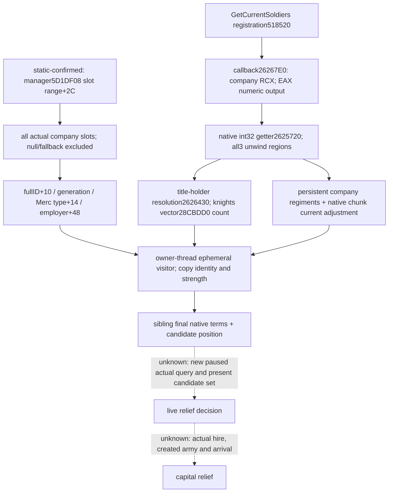

# CK3 1.20.0.3 mercenary candidates and present soldiers

2026-10-03. File-only native research and a future readonly player-context input.
The real tactical request is relief of Robert's threatened capital: the parent
reported siege 95.169% / ETA18 days, while Robert's army was87 days away; the
fresh military holy order was ineligible. These are the parent's prior frame,
not new observations made by this lane. No game, SDK, pipe or window operation
is performed. No mercenary availability, price, hire or arrival is yet live.

Exact executable: **1.20.0.3 / Steam25652598**, SHA-256
`94B55397ABB687A3DCD436805A5D885E6BE90FA6C693FEB44A9E3BBEEADE02A6`.
The accepted installed-build freeze and its hash are reused. The prior native
finance/hire tree and byte-pinned validator are reused from
`war-finance/NATIVE-RECIPE.json`; this lane does not rescan/hash the whole EXE.
New bounded spans and their byte hashes are in this package's `native/`.

## Candidate identity and lifetime

The world mercenary manager slot is RVA`5D1DF08`, with fallback at`5D1DEF8`.
`HiredTroopItem.GetMercenaryCompany` kind1 getter`CCC020..CCC064` resolves a
full reference by `full_id & 0xFFFFFF` against manager+`2C`, with entries pointer
at+`20`, stride16, object pointer at+8. It verifies the complete object's+`10`
ID before returning the object; a missing/stale full reference returns fallback.
Its68-byte getter SHA is
`e12b610c13dbbe41c200df3575917a1d99a1b848236c61f64426d9f8a8bd08fc`.

The new headless reader inspects every slot in this range, skips null/fallback
objects and copies the actual full ID. **+2C is a slot bound, not the active
company count**. No geographic or hire-status filter is applied at enumeration.
ID0 is legal; `0xFFFFFFFF` is the missing sentinel. Native final command validator
`29942E0..29943BA` additionally confirms type+`14` is`0x4D657263` (`Merc`) and
full ID is not−1; reused SHA
`0aa88ca50c35479da2e426969aa0551be983b0d9c48fa25f0921581259d0218e`.
The native final-hire leaf`26242D0..26247CD` tests company+`48` for employer−1.
`HiredTroopItem.GetHiredBy` registration`8E692..8E72A` passes callback`CCF940`,
which calls`CCC2A0` and resolves the copied full character reference. The kind1
branch`CCC43E..CCC489` resolves the same company full ID and returns company+`48`
into its output pointer; slice75-byte SHA
`af4de7cb220f07efe67690b9e794a9368ce54c0b1ee30ecb6060fbdbfac10f46`.
This establishes the copied employer full reference independently from CanHire.
Missing employer is null; an actual full employer reference is retained as-is.
Neither sentinel nor unavailable getter is reported as zero soldiers.

A company pointer is passed only during the current owner-thread visitor call
so sibling final-terms and position readers can sample the same object. All
returned rows copy values. No company pointer is retained in the DTO or across
frames; a later query enumerates the manager again, with generation/full-ID
checks. Parent owns current played-character, paused-frame and revision binding.

## Current soldiers: actual registration, helper and consumer

`MercenaryCompany.GetCurrentSoldiers` registration
`518520..51869B` copies literal`44E15F8` then passes callback`26267E0` at
`518610` into registry`2628C80`. Registration379-byte SHA:
`6f4a3f0ccb36668e324d8ec9ab258c92356dc1b13724e2b8f0875d40d4dce494`.
The callback`26267E0..2626818` passes company in RCX to`2625720`, copies EAX
as signed int32 and sends it to numeric consumer`879A50`; callback56-byte SHA:
`03e76d25df8602dbb9b35ea4cfe4af9da0447013ce6599a218b92c666a0261e3`.

Getter`2625720..2625802` has **three contiguous unwind regions**, not one57-byte
complete function. They are`2625720..2625759`, `2625759..26257F5`, and
`26257F5..2625802`; the contiguous226 bytes have SHA
`0ce3e2273e24c645d754e0d1e0c7ae595656814532f614ad295796cf45a48cac`.
ABI is **`int32_t current_soldiers(void *company)`**, return EAX, native integer
soldiers / scale1. It does not return Q100000 or an output pointer.

The getter calls`2626430` to resolve company title+`2C` through the title DB and
its holder full reference+`128` through the character DB; it calls existing
`28CBDD0` and reads its returned vector count+`0C` (the holder's knights).
It then iterates company+`30` /+`3C` persistent regiment references and adds each
record's native current total: record+`128` with all seven24-byte chunk current
adjustments, including the native kind3/no-current special branch. The component
**calls the getter directly**; it does not reconstruct that calculation or use
the obsolete HolyOrder`261AD10` getter. A valid zero is an available zero.

This input is **research** before its focused fixture, **static-ready** after
that fixture. Existing native AI funding/candidate chooser unknown branches stay
in the finance/hire tree. Enumeration and soldiers do not imply an eligible
hire, an affordable company, a timely arrival or a winning engagement.

## Focused implementation result

The new candidate component is **static-ready**. The offline production
reader and visitor passed18 explicit Require checks under MSVC /O2
/DNDEBUG /W4 /WX, using the actual226-byte getter instructions with only
two external calls and two global pointer loads relocated to fixture
objects. It copied two companies (native soldiers1274 and valid0), kept
the employed company and full generation ID, and distinguished missing
strength and absent manager from legal zero and an available empty list.
No older fixture was repeated. Runtime market query/hire credit remains0.

Evidence: `Z:/ck3_mod_rewrite_process_assets/g2-resume-20261003/war-mercenary-reinforcement-v45/candidates/focused/attempt-02/RESULT.json`
and `run.log` (18 checks). Attempt01 was a **harness RED**, compile2 due
to signed comparison literal in the fixture under /WX; production TU
compiled. Attempt02 changed only the unsigned fixture literal, preserved
the original RED, and finished GREEN in2.984 seconds. This was not a
game/native capability failure. Parent owns combined integration,
revision/played-character binding, final terms and position, publication
and the first new paused actual market query.
