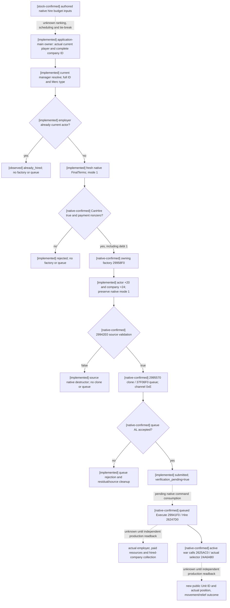

# CK3 1.20.0.3: normal mercenary Hire action and submission semantics

2026-10-04. Exact Crozier **1.20.0.3 / Steam 25652598**, EXE SHA-256
`94B55397ABB687A3DCD436805A5D885E6BE90FA6C693FEB44A9E3BBEEADE02A6`.
The action core is **static-ready**, implemented outside the frozen `Z:/g49`
source tree. Its single provider-and-wire fixture passed 4 scenarios and 65
explicit checks. The result is linked in external `ROOT-DELIVERY.json`. This document does
not credit an actual game hire, payment, army creation or reinforcement.

The native research prerequisite is already closed in
[finance/hire](ck3-1.20.0.3-war-finance-and-hire.md),
[mercenary spawn selection](mercenary-hire-spawn-selection-12003.md) and
[current company resolution](ck3-1.20.0.3-mercenary-hire-company-resolution.md).
The actual Robert relief decision supplies the need for this action. Full
native AI company ranking, scheduler and budget tie-break remain unknown; the
minimal player action uses a selected company complete ID and native final
validation. The action contains no cash reserve policy or additional authority
flag. Native permitted debt is a valid normal Hire path.

## Native UI wrapper and chosen callable chain

The genuine UI callback `CCC670..CCC8F1` accepts a `HiredTroopItem` pointer:
`void(const HiredTroopItem*)`, with the observed first two uint32 fields
`kind` at +0 and company complete ID at +4. Kind 1 is mercenary Hire. Its actor
comes from the native current-player global rather than a second argument.
The callback constructs a normal command inline and submits it, but discards
the queue AL return. Its later `24A6AB0` / `AF3E30` branch also positions the
camera. Therefore it exposes no usable submission result and is unsuitable
for the requested minimized application flow. The independent action follows
the same normal command and queue chain using the owning native factory.

| Entry / slot | Exact Win64 callable ABI and semantics |
| --- | --- |
| `29958F0` | `void*()`; game allocator creates owning default `CHireMercenaryCompanyCommand`, 0x30 bytes |
| default command +0 / +0x18 | primary vtable `476DAF8`, secondary vtable `476DB90` |
| default metadata | +8 byte 0, +0x0C qword 0, +0x14 dword 0; caller preserves these fields |
| payload +0x20 / +0x24 | actor int32 complete ID and company uint32 complete ID; default factory initializes both to -1 |
| payload +0x28 | normal mode uint32 1 supplied by the factory; caller preserves it |
| `29942E0` / primary +0x30 | `bool(const void* source, void* native_reason)`; resolves both complete IDs, checks actor land-state/company type and calls final `26242D0` |
| `2995570` / primary +0x40 | `void**(const void* source, void** return_storage)`; game-allocated clone written to owning return storage, returns its address |
| `37F06F0` | `bool(void* manager, void** owned_command, uint32 channel_flags)`; embedded manager is image + `5CC1240`, normal Hire channel is `0x0E` |
| `9D1560` / primary +0 | deleting destructor `void*(void* owned, uint32 flags)`; flags 1 frees game-allocated owning source/clone |
| `29941F0` / secondary +8 | actual Execute thunk receives source +0x18, resolves IDs, obtains current duration and calls `26247D0` |
| `26247D0` | native actual Hire consumer; employer, duration, resource payment and active-war auto-raise are game-state changes here |

The default factory's complete 73-byte native body, not a guessed inline
constructor, closes construction. The UI wrapper establishes channel 14. The
accepted shared `ck3_12002::SubmitCommandCopy` implements the exact reviewed .3
clone/owned-queue ABI and residual cleanup. The .3 outer binder first checks
the exact EXE SHA; its internal shared adapter identity denotes the previously
reviewed unchanged layout, not permission to use an unrecognized executable.

The source remains caller-owned until its native deleting destructor runs.
`SubmitCommandCopy` obtains a distinct native clone, moves the returned owning
pointer into the native queue argument, and deletes any residual queue/return
storage pointer on either queue acceptance or rejection. The source destructor
runs on every path after factory creation. A rejected final native validator
creates no clone and submits no command. The selected command is not executed
directly by the provider; the game consumes it through its normal queue.

The validation call uses a null reason sink, which the exact native body
explicitly supports as its boolean short-circuit path. Fresh final terms are
separately sampled with the already implemented owned native reason objects,
so explanatory strings are copied without inventing a command reason ABI.

## Fresh native inputs before submission

The application-main mailbox supplies its actual current played-character
pointer and complete actor ID. The action accepts a company complete ID,
then calls the current manager's
`ResolveMercenaryCompany12003(CandidateBindings, uint32 full_id)`.
This borrowed pointer lasts only through the current owner-thread action. The
query's old pointer is never passed into the action. The resolver checks the
complete ID and `Merc` tag and does not call troop-strength getters or scan
the market.

Before creating the command, the core observes Company +0x48 employer. If the
actual employer is already the current actor, it reports `already_hired`
without queuing. Otherwise it refreshes the existing FinalTerms reader in
normal mode 1, retaining copied CanHire, payment status, all ten resource costs,
CanAfford, duration and native reason strings. Required native CanHire/payment
read failures report unavailable; CanHire false or payment 0 report rejected.
Payment 1 remains allowed even when CanAfford is false. No reserve threshold,
gold-only policy, selected-company constant or fixed game date is introduced.
The native command validator then re-resolves current actor/company itself
before the single normal queue submission.

Queue AL is submission acceptance only. It cannot prove employer change,
payment, successful army allocation, actual position, battle entry or relief.
The core sets `verification_pending=true` only when the shared native queue
returns accepted. It publishes no guessed Army ID or paid amount. Company
complete ID remains distinct from the later native Army and public Unit IDs.
An independent current-company/resource/army query must establish material
postconditions after the game consumes the command. The current selector read
is the native intended spawn input, not allocation success.

## Source and evidence handoff

New provider files are `ck3_12003_mercenary_hire_action.hpp/.cpp`, independent
of `bridge.hpp`. Existing FinalTerms, company manager resolver and shared
commands are reused. The frozen source is `Z:/g49`; source preimage bytes and
SHA-256 values are copied/pinned in `PREIMAGE-PINS.json`. Exact native span
identities are reused from the preceding `position-action/NATIVE-ABI.json` and
`war-finance/NATIVE-RECIPE.json`, with the selected entries written to this
package's `NATIVE-ABI.json`. No whole executable scan or rehash is needed.

External package:
`Z:/ck3_mod_rewrite_process_assets/g2-resume-20261003/war-mercenary-hire-v46/provider-abi/`.
The sole new meaningful provider-and-real-serializer fixture is external under
the sibling `integration-fixture` package and uses declared native function
inputs. It compiled the actual provider, resolver, wire, test and shared
clone/queue ownership implementation with `/O2 /DNDEBUG /W4 /WX /permissive-`,
reusing the accepted FinalTerms object. Initial compilation passed but the
first link lacked the existing `ReadCoreSnapshot` dependency: the harness RED
attempt is preserved at `focused-native-01/RESULT.json`. The second attempt
added only the existing core object and reused all five original objects plus
FinalTerms. No provider or wire recompile and no old test run was needed.

`focused-native-02/RESULT.json` is GREEN: 4 scenarios and 65 explicit checks
cover native debt 1 with CanAfford false through accepted clone/queue, payment
0 with no factory/queue, CanHire false with no factory/queue, and a rejected
native command validator with owning source cleanup and no clone/queue. The
accepted path verifies actual IDs, factory mode and metadata, null command
reason sink, channel 14 and balanced native source/clone destruction. The real
serializer publishes submitted/pending without claimed material hire. This is
an offline function fixture, not a native game call. ROOT alone integrates the
full DLL/MCP and submits the selected action, then reads actual game state.
