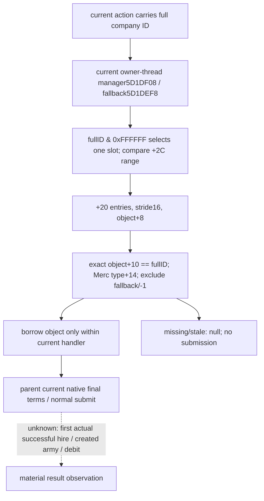

# CK3 1.20.0.3: current-company resolution at normal hire submission

2026-10-04. The project owner authorized the minimal normal mercenary-hire
action. This lane supplies only current-company resolution. Parent reported a
fresh market with559 rows /33 hireable companies and a relief candidate with2531
soldiers,811gold, native payment status2 and spawn2618. Those are parent-owned
actual observations, not new market reads made by this lane.

Exact build: **CK3 1.20.0.3 / Steam25652598**, EXE SHA-256
`94B55397ABB687A3DCD436805A5D885E6BE90FA6C693FEB44A9E3BBEEADE02A6`.
Use current `Z:/g49` only as a readonly production preimage. Existing complete
candidate, identity and getter evidence is reused from
`Z:/ck3_mod_rewrite_process_assets/g2-resume-20261003/war-mercenary-reinforcement-v45/candidates/ABI-LEDGER.json`
and `war-finance/NATIVE-RECIPE.json`. No EXE rescan, new broad reverse pass or
old matrix is required to resolve a selected live company.

## Native full-reference resolution

`HiredTroopItem.GetMercenaryCompany` kind1 getter`CCC020..CCC064` is68 bytes,
SHA `e12b610c13dbbe41c200df3575917a1d99a1b848236c61f64426d9f8a8bd08fc`.
It loads world manager`5D1DF08`, uses only `full_id & 0xFFFFFF` as the slot
index, compares index against manager+`2C`, then reads manager+`20` entry
stride16/object+8. It requires **object+`10` equal to the entire full ID**,
including generation bits; failure returns native fallback`5D1DEF8`.
The native normal-hire validator`29942E0..29943BA` additionally requires
object+`14` type`0x4D657263` (`Merc`) and object+`10` not−1 before invoking the
final hire gate. Validator218-byte SHA:
`0aa88ca50c35479da2e426969aa0551be983b0d9c48fa25f0921581259d0218e`.

The new resolver mirrors these observed identity steps and returns null for
missing/out-of-range/empty/fallback/stale-generation/wrong-type inputs. Company
ID0 is legal. It reads one selected slot and never calls current-soldier getter
`2625720`, the all-company visitor or any price/final-gate leaf. It leaves final
hire eligibility, actor binding, quote, payment and normal command submission
to the authorized parent components. It does not filter on employer, geography
or policy; those are current native final-term inputs.

## Borrowed lifetime contract

`void *ResolveMercenaryCompany12003(const CandidateBindings&, uint32_t full_id)
noexcept` resolves against the live manager at each invocation. Its result is a
temporary borrowed input **inside the current owner-thread handler** for the
immediate current validation/normal-submit call. The executor carries the full
ID into that handler, not a previously sampled pointer. No company pointer is
stored in action DTO, WAL, mailbox or asynchronous command data. A later handler
must resolve the full ID again; same-slot reuse with a different generation
cannot match the earlier ID. This is native object-lifetime correctness for the
requested action, not a new authorization or safety policy.

The existing native AI finance/mercenary chooser tree remains the policy input
ledger; this resolver makes no chooser/ranking inference or new native AI
input claim. Readiness begins at research and becomes static-ready after one
new generation/reuse/missing-company fixture. No new SDK/game/window/pipe,
calendar day, hire, gold debit or soldier credit is claimed by this lane.

## Focused result

Resolver is **static-ready** after the single new12-Require production-reader
fixture, built /O2 /DNDEBUG /W4 /WX and completed GREEN in3.066s. Real manager
objects cover legal ID0, full generation match, same-slot generation reuse,
missing and out-of-range companies, fallback, wrong type and absent manager.
The current-soldier getter call counter remains0. Existing market/candidate
fixtures were not repeated. No new authorization restriction or gameplay
claim accompanies the null result for an unavailable selected object.

Evidence: `Z:/ck3_mod_rewrite_process_assets/g2-resume-20261003/war-mercenary-hire-v46/company-resolution/focused/attempt-01/RESULT.json`
and `run.log`. The focused binary used /MT. The action integration fixture
recompiles this production TU with its consistent /MD runtime and reuses the
12-check result; it does not repeat generation scenarios or mix runtime
libraries. Parent combines the new current resolution with normal Submit
and material result observation; ROOT owns commit/push and paused actual.
