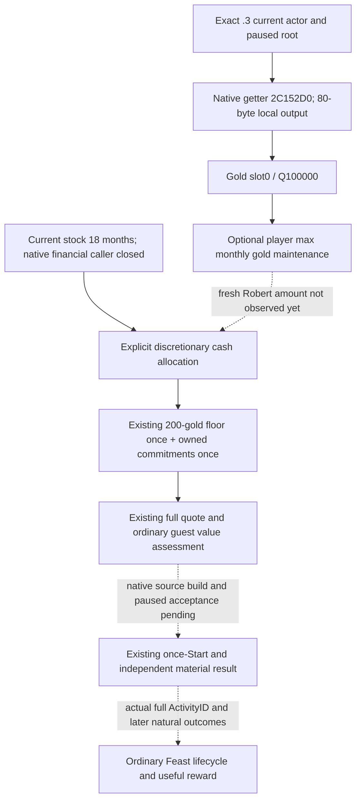

# CK3 1.20.0.3：罗贝尔 Feast 财务观测与预算接线

本专题解决原普通罗贝尔存档的实际 `war_cash_reserve_unobserved`：当前已观测的原生宾客资格、100金报价与 CanStart 均通过，预算 producer 却固定输出 null。先闭合正常财务 getter，再把真实同帧维护量接入已有预算。金额是我方明确的自主消费预算额度，不是完整战争费用预测。本包的冻结 WAR_CASH 配置为 OFF，未增加军事动作、战争策略或独立 MCP。2026-10-03 项目所有者已全面授权战争与战斗研究、实现、策略和实机验收，撤销旧仅非战争、战争暂停及战争开关必须 OFF 的授权限制；这些冻结配置和零动作记录保留为历史事实。readiness 不因授权升级；唯一原普通罗贝尔 `29829` campaign、原生 AI 研究优先、exact-build 绑定和最小化/noFocus 继续有效，实机由 ROOT 单一 owner 操作。

## 实际触发与资格

保留的 Stage5 paused artifact 为 actor **29829**、episode **`native-29829-2bc2d599f7f9`**、PID109676、native11/public2、raw53220000。金币1206.59426、原报价100金、既有现金底线200金、active-war1；普通 close-family guest37265 的原生成员、positive join93与到场日期已观测。唯一预算 hold 是 `war_cash_reserve_unobserved`，没有 Start、扣款或新 ActivityID。

原始大包的已提取 [actual-stage5.json](Z:/ck3_mod_rewrite/artifacts/g2-maintainer-2026-10-02/resume-12003/m6-feast/robert-feast/actual-v16-hosted-review-01/actual-stage5.json) 与[原财务缺口报告](Z:/ck3_mod_rewrite/artifacts/g2-maintainer-2026-10-02/resume-12003/m6-feast/robert-feast/actual-v16-hosted-review-01/war-reserve-existing-flow/REPORT.json)直接复用。该实际 packet 的报价不代表未来帧报价。最初 live runtime 是 frozen `d4f377d97b7a4f97ac85151610adbc4d4df818f8` / v16；它还没有本文新财务字段。

本次最高资格为 **static-ready component source**。Python 已采用，native reader/DTO/serializer 的实际 source 回执已产生；组合构建与新 paused 数值分别按各 owner 的真实回执记录，不因本页、ACK 或 synthetic 金额升级为 live；G2 与 M6 完成数没有增加。普通 Feast 主线与历史资格见[Feast 原生专题](ck3-1.20.0.2-feast-guest-rule.md)。

## 先于预算的 exact-build 原生输入树

冻结 CK3 **1.20.0.3 / Steam25652598**，EXE SHA-256 **`94B55397ABB687A3DCD436805A5D885E6BE90FA6C693FEB44A9E3BBEEADE02A6`**。旧已落盘[财务调用树](war-film-declaration-inputs-2026-09-23.md)只作为定位与语义入口，旧 RVA 不移植到新构建。

最新 EXE 的 getter **`0x2C152D0..0x2C1560C`** 有0x33C字节 unwind 边界，函数 SHA-256 `a12c37566103ee098e2e53fca595d8ea0084757469671890782aabdbbc62a4e2`。RCX 为 caller-owned **80字节**输出，RDX 为当前 resolved Character，入口不消费外部 R8/R9，返回 RAX 为输出地址。函数清零并累积十个 int64 slots；只发布 **slot0金币/Q100000**。`+0x30` 国库是独立资源，不能转换成金币。

当前财务 caller **`0x19EA9C0..0x19EADA5`** 在 **`0x19EAA0A`** 调用该 getter，以80字节栈缓冲和当前 actor 传参；随后消费 `+0x00/+0x30`，乘配置槽 **`0x5C687BC`**。最新 Steam stock `game/common/defines/ai/00_ai.txt:178–182` 的 `MONTHS_OF_MAINTENANCE_IN_WAR_CHEST` 仍为 **18**；该定义称为 maximum maintenance 的储备输入。完整函数、调用点与当前 stock pin 见[财务原生报告](Z:/ck3_mod_rewrite/artifacts/g2-maintainer-2026-10-02/resume-12003/m6-feast/robert-budget-finance-01/native-finance/REPORT.json)和[输入冻结](Z:/ck3_mod_rewrite/artifacts/g2-maintainer-2026-10-02/resume-12003/m6-feast/robert-budget-finance-01/NATIVE-BUDGET-INPUTS.json)。这里闭合当前原生财务输入调用，不新增战争决策树研究。



GUI `GetGoldExpensesBreakdown` 与 cached military getter 会走 GUI 刷新/写缓存链，未采用。正常 root 原有 monthly net-income getter不能代替维护费；本项直接给同一正常 campaign-root MCP 补必要只读财务字段。原战争费用查询虽然存在，该历史包的 compile flag 为 OFF，亦没有完整 future reserve producer；它不是本项需要启用的依赖。

## 生产字段与额度语义

`campaign_root_context_v1` 增加可选 `player_max_monthly_gold_maintenance_v1`：

```json
{
  "status": "available",
  "value": {"raw": 0, "scale": 100000},
  "unavailable_reason": null
}
```

示例零值只说明 schema；没有把零填进实际罗贝尔预算。真实观测零合法；失败保持 `status=unavailable/value=null`，原因是 `getter_unavailable`、`getter_failed` 或 `amount_invalid`。旧 root 没有新字段仍可读取，optional 不提高 core root readiness。外层 root unavailable 时新 key 可为 null。reader 沿用现有 resolved actor、SEH 与同帧流程。

已采用的 [Python root contract](../../ck3_autonomous_player/src/xar_autoplayer/bridge/campaign_root_context_contract.py) 与已验证候选逐字节相同；新增 normal optional row，没有改 NativeDriver/service。已有四项契约检查复用，具体源前后 SHA 见[采用回执](Z:/ck3_mod_rewrite/artifacts/g2-maintainer-2026-10-02/resume-12003/m6-feast/robert-budget-finance-01/production-python/root-contract/REPORT.json)。

预算接在现有 [observe_feast_start_budget_v1](../../ck3_autonomous_player/src/xar_autoplayer/activity_feast_stage5_budget_v1.py)，可传入 **当次** `campaign_root`。它保持原暂停帧、actor、pending interaction 与四个 spending ledger 的判断；未解决的 pending 保持原 hold，原200金底线与现有承诺各计一次。若当前 root 的 actor/date/native revision 与 Start budget 一致，且新字段 available，明示政策 `robert-feast-discretionary-maintenance-allocation-v1` 采用：

```text
war_cash_reserve_raw = 18 * actual_same_frame_max_monthly_gold_maintenance_raw
```

金额是自主消费前保留的 **财务额度**。它不声称未来所有军费、补员、上船费、损失或未知事件的上界，不提供 M5 完整战争现金资格，也不额外计入 M5 minimum floor。采用原生财务系数做玩家当前自主消费政策的质量差已明确：原生参考 caller 是宣战前储备计算，不能说现役防守战争原生 AI 必然采用相同规则。后续以实际 outcome 校准，同帧 getter 缺失仍保留原 missing hold。

保留实际 quote 的算术阈值为月维护量 raw **5,036,634**（50.36634金）；该值仅来自 `(120659426−10000000−20000000)//18`，不是维护量观测。实际数值与更新报价由 ROOT 新受管 paused frame 读取后再评估。

## 同帧实际入口与剩余动作

ROOT 的既有 Feast phase helper `m6-feast/murchad-feast/murchad_feast.py` 被 Robert wrapper 委托调用。它的 `stage5-fresh/start-fresh` 中，先取当前 snapshot，再调用现有 `service.query_campaign_root_context_v1(expected_revision=fresh['revision'])`；随后重新取 current snapshot，调用原 `query_activity_feast_stage5_start_inputs_private_v1`。将该回复的 `campaign_root_context` 传给预算 provider，再使用原 `assess_feast_start_private_v1`，仅现有 `start-fresh` 通过时调用原 once-Start consumer。旧 native3 root 不能代替当前 native11 或未来新帧的财务输入。精确源码入口与外置调用点 patch 见本项 production receipt；ROOT 所有客户端调用始终串行。

Native owner 负责 normal financial reader/DTO/serializer/exact .3 branch 与组合构建；ROOT 在原罗贝尔普通存档、新冻结 runtime、最小化后台执行 paused acceptance。若 Start 成功，继续使用原独立扣款/HostedPost/完整 ActivityID 与 next-turn/cold lifecycle，不重发 Start。实际 attendance、terminal、奖励归因和完整 M6 仍须真实结果。

本项未操作游戏、SDK、pipe、窗口或存档。统一报告由 ROOT 合并，normal commit/push 由 ROOT 执行。

## 本次已执行的必要验证

Python root 契约源码 SHA-256 `bd91e668ecf11028726aebb92e705e0a3b4853b500f810991c584af53b7c9b91`、预算 provider `c90a5523b592a59453286d780604873d272473eec6e88ebfc124f086084c7e01`。四项契约检查和四项 scratch adapter/consumer 检查直接复用；不重新执行旧检查。

唯一新增 Python 生产路径验证依次导入 canonical normalizer → canonical budget provider → 原 `assess_feast_start_private_v1`。closed Robert quote 配合明确 **synthetic** 的20金最大月维护量和不访问真实 state 的 mocked pending readers，得到360金额度＋原200金底线，原报价100金在预算内；原 submit reserve 560金。该检查只证明被修改的真实生产接线生效，不是罗贝尔实际维护量或实际 paid Start。[生产路径报告](Z:/ck3_mod_rewrite/artifacts/g2-maintainer-2026-10-02/resume-12003/m6-feast/robert-budget-finance-01/production-python/PRODUCTION-PATH-CHECK.json) SHA-256 `4459ab91feb22075916b1276e9dbcc41ca05a1ecaafd94398143453c64d47035`，cases1/GREEN。

native owner 的实际 C++ serializer `/W4 /WX /O2` → canonical Python 一次消费7个 JSON frames，覆盖旧 optional absent、显式零、超 int32 的 int64、三种 unavailable reason 和外层 unavailable/null。[DTO/serializer 报告](Z:/ck3_mod_rewrite/artifacts/g2-maintainer-2026-10-02/resume-12003/m6-feast/robert-budget-finance-01/dto-serializer/result.json)为 GREEN；此处是 offline wire 验证，没有游戏/SDK paused 值。三项 reader leaf 的 source 回执见[FINANCE-LEAF-DELIVERY.json](Z:/ck3_mod_rewrite/artifacts/g2-maintainer-2026-10-02/resume-12003/m6-feast/robert-budget-finance-01/native-integration/FINANCE-LEAF-DELIVERY.json)，SHA-256 `f055c18cad3100a33da4ce83f678a7ec23fb89ab951473809fc001dfff67632a`。组合 native freeze/build 与罗贝尔实际财务观测仍由 ROOT 继续执行。

随后 native owner 获 ROOT 授权对真实 `ck3_12002_nonwar_metrics.cpp` 做唯一一次 `/O2 /W4 /WX /UNDEBUG` focused reader 验证，compile/link/run 首次全部 exit0。外置 callback 写满80字节并验证 slot0、正/零/负/null/failure 与 optional 不阻断原 required metrics；没有新 ABI、DTO 或游戏读取。[RESULT.json](Z:/ck3_mod_rewrite/artifacts/g2-maintainer-2026-10-02/resume-12003/m6-feast/robert-budget-finance-01/native-integration/finance-focused-01/RESULT.json) SHA-256 `a8475d64904a34419ccd4ebe947dcadd6c279f1cc079f0cb0f46d7ea6090aacd`。reader primitive 现在为 static-ready，实际维护金额仍未填写。

## 2026-10-02：v19 实际暂停财务观测

本节记录上述源码收口之后的窄实机增量；此前 `static-ready`、数值未观测的描述保留为历史截点。ROOT 的 v19 / public source `716acfec` 实际 registered batch 为 GREEN，在新 PID **70968**、原普通罗贝尔 actor **29829**／episode **`native-29829-2bc2d599f7f9`**、native3、raw**53220456** 的 paused frame 上，现有 `ck3_query_campaign_root_context_v1` 真正返回 `player_max_monthly_gold_maintenance_v1.status=available`。最大月维护量现已成为 **production-live primitive：真实暂停帧只读观测**；完整预算、Start 或 Feast loop 没有因此完成。

| 输入或额度 | Q100000 raw | 金币值 | 来源 |
| --- | ---: | ---: | --- |
| 最大月金币维护量 | 588600 | 5.88600 | 当前 v19 原生 optional row 实际 available |
| 明示18个月消费额度 | 10594800 | 105.94800 | 当次真实维护量 ×18；我方财务政策 |
| 既有金币底线 | 20000000 | 200.00000 | 原 frozen716 provider 的政策常量，各计一次 |
| 财务额度＋底线 | 30594800 | 305.94800 | 尚未加入 fresh 报价与当前 owned commitments |

实际入口是 [006-ck3_query_campaign_root_context_v1.json](Z:/ck3_mod_rewrite/artifacts/g2-maintainer-2026-10-02/resume-12003/m7-robert/actual-v19-sway-county-finance-01/006-ck3_query_campaign_root_context_v1.json)。财务 owner 只读一次该查询与 batch result，已产出 [ACTUAL-V19-FINANCE-READOUT.json](Z:/ck3_mod_rewrite/artifacts/g2-maintainer-2026-10-02/resume-12003/m6-feast/robert-budget-finance-01/actual-v19-readiness-01/ACTUAL-V19-FINANCE-READOUT.json)，SHA-256 `4bc34c7e90bd0c322142cd064b2711dee12df050d382a368cb3588da5bca8c11`；[报告字段](Z:/ck3_mod_rewrite/artifacts/g2-maintainer-2026-10-02/resume-12003/m6-feast/robert-budget-finance-01/actual-v19-readiness-01/ACTUAL-REPORT-FIELDS.json) SHA-256 `30ace2f2d84a8cade104c44ccd822ae9fead1d3a1d8979f75e431a7e22cec82a`已交 ROOT 与计划 owner。

本次 root DTO 和 finite snapshot projection 都没有钱包字段，因此 **current gold=null／未在该 packet 观测**，没有借用旧1206.59426金。Stage5 尚无 fresh 报价，现有 provider／当前 spending ledgers 也未在该 packet 调用；**pending／reserved 未知，不能填0**。305.94800金只是实际财务额度与既有底线的和，不能据此声明 `Start ready`。下一步使用已有同帧 financial root → fresh Stage5 balances／quote → 原 budget provider，取得当前金额与承诺后各计一次，才评估原 once-Start 路径。

这次实机闭合的是财务输入观测缺口。105.94800金是明确自主消费额度，仍不是未来全部军费上界；当次冻结构建的 WAR_CASH／PREWAR 实际为 OFF，不声明 `warReady`。没有新 paid Start、扣款、ActivityID、attendance、terminal、M6 完成或 G2 完成数增量。本次知识同步直接复用该 readout，未重读实际材料、重复测试或操作 SDK／游戏／状态／Git。
