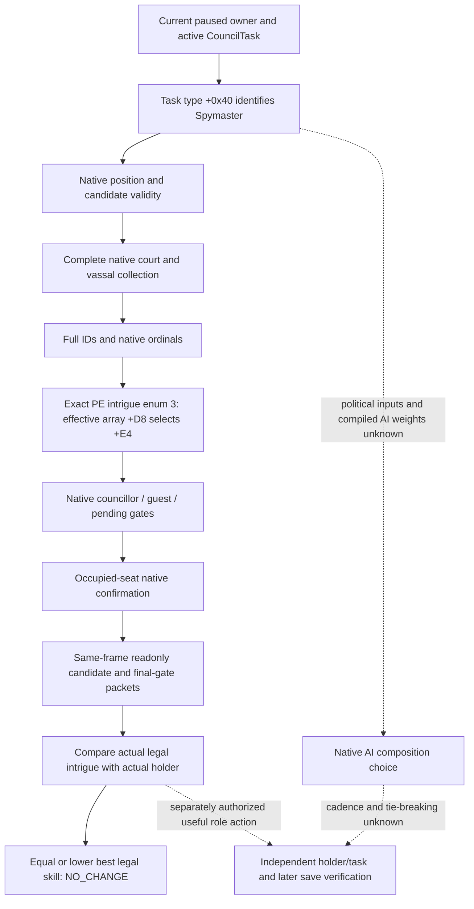

# CK3 1.20.0.3 Spymaster readonly candidate inputs

## Scope and actual need

The initial verified Council observations supported `NO_CHANGE`: Steward 33433 had stewardship 15 versus the best legal alternative's 11; Chancellor 34867 had diplomacy 9 versus the best legal alternative 30784's 9. The V6 root exposed Spymaster holder 34333 on `task_disrupt_schemes`, but published neither that holder's effective intrigue nor the complete legal alternatives. Those identities are historical paused anchors. The readonly profile closes this specific comparison gap without assuming that an incumbent is weak or that any appointment is warranted.

The current bounded query is **production-live primitive**: the actual v8 Murchad paused frame observes Spymaster36567 intrigue14 versus best native-final-legal36403 intrigue4, therefore `NO_CHANGE`. The fresh holder is independently read from campaign root; the historical34333 anchor is not reused as current identity. The actual capture and its narrow limits are recorded below.

This package adds `councillor_spymaster` to the same two private Council queries' `position_key`. It reuses the existing role-parameterized producer and final gates. Default Steward requests, typed assignment, task changes and the formal Steward policy remain unchanged. It does not expand other roles, religion, warfare, government coverage or political scoring.

The inherited native tree and reviewed inputs are [Council candidates](ck3-1.20.0.2-council-candidates.md), [final gates](ck3-1.20.0.2-council-gates.md), [composition AI boundary](council-composition-ai.md) and [the generalized Chancellor projection](ck3-1.20.0.3-chancellor-candidates.md). The hidden native composition score, political weights, scheduling and tie-breaking remain unknown. This package publishes effective intrigue and native final legality; it does not publish a native AI recommendation.

## Exact-build input ledger

| Input | Frozen fact |
|---|---|
| Steam CK3 | `1.20.0.3`, build `25652598` |
| EXE SHA-256 | `94B55397ABB687A3DCD436805A5D885E6BE90FA6C693FEB44A9E3BBEEADE02A6` |
| Source base | `dcd61a5b7d6b94536cab3b0272e220d8f211b1b9`, isolated `g2spy12003` |
| Historical independent holder anchor | V6 `cold-v6-sway-chancellor-01/020` root: holder 34333, `task_disrupt_schemes`; no intrigue observation |
| Current independent holder | V8 `murchad-v8-peaceful-readonly-01/004` root: holder36567, `task_disrupt_schemes`, actor31853 |
| Current legal intrigue comparison | Date53328360/native28/public2: incumbent14 versus best final-legal4, gain−10, `NO_CHANGE` |
| Role producer / final gates | Existing parameterized paths, reviewed `.3` ABI reuse |
| Intrigue enum and effective slot | Direct current-PE named enum registration proves intrigue `3`; indexed effective getter proves `+0xD8 + 4*3 = +0xE4` |
| Bounded manifest | `native_bridge/research/council_spymaster12003_abi.json` |

The existing producer `0x2C47EC0(owner, active_task, GUI_eligibility=true, vector)` resolves the requested position through `active_task+0x18 -> task_type+0x40`. Native `valid_position 0x31BCED0` and `valid_character 0x31BCF90` take that position. The same final gates consume native councillor, guest, pending-interaction and occupied-seat confirmation booleans; these results remain independent of collection membership. The missing role profile must not replace any of these predicates with Python guesses.

The current frozen PE's canonical `intrigue` literal is at `0x44EE7D8`, bytes `696E74726967756500`. The exact registration span `[0xDA98E0,0xDA98F7)` stores enum byte 3, loads that name and inserts the pair through `0xDBB7C0`; bytes `C64538034C8D4538488D15E94E7403498BCEE8C91E0100`, SHA-256 `B171D90E6D1125A535C42F02BA63827DE7FCEE41B5EED973F4411D16C7BCF1DC`. This directly freezes the name-to-index binding rather than assuming the old enum.

The current effective getter span `[0x28B16B0,0x28B170D)` has SHA-256 `B3C592A0D177A07D0BC5D04DD4A94558A539F6F543B73FAF5A748954F0AB42DA`. At `0x28B16F8`, bytes `8B8499D8000000` implement `mov eax,[rcx+rbx*4+0xD8]`; the valid-index branch bounds the index below 6. Intrigue 3 therefore selects `CCharacter+0xE4`. Council's comparator uses this same getter for both characters with the same selected enum: span `[0x115C4BF,0x115C4D2)`, SHA-256 `366DD296C1255119AABBA01F1CDBB4AFC890D43A9A95C3AE0ED0B75741A5E22D`. This proves the narrow effective-skill input, not the complete AI composition utility.

Current stock `common/council_positions/00_council_positions.txt:417-418` defines Spymaster with `skill = intrigue`; `:481-483` excludes landless-adventurer positions, and `:519-531` applies the native ministry or ordinary Spymaster character rule. Its SHA-256 is `31FA258DFBF35A07E9EE08D1D1DFDCD26712D3974CD65EC74255C284E4DF0A2A`. `common/scripted_triggers/00_councillor_triggers.txt:115-128` supplies the existing Spymaster validity rule, SHA-256 `350A5E375D73E38CDD659FC3221FE8395AD6650B3FD244E03EE2342AFC9A8F88`. The bridge consumes the compiled final validity result, including any existing special exclusions; it does not implement or investigate a separate religion or government tree.

The full direct PE spans and frozen stock snippets are in `artifacts/g2-maintainer-2026-10-02/resume-12003/m4-council/spymaster-readonly/SPY-PE-EVIDENCE.json`, SHA-256 `B3883FFFBAE14489A5A9F64DA5F93AFD60A9E3A6FB2759D884B2EFA581BCA1C0`. A preliminary locator for `GetIntrigueSkill` was excluded: those callbacks expose a CharacterListFilter Skill object, not this effective Character getter. That material is retained without assigning it capability credit. This closed the bounded research input ledger before source implementation; focused static results and the later actual paused observation are recorded separately below.

## Native tree and readonly projection

## Validation and later action boundary

The focused production fixture must use distinct effective stewardship, diplomacy and intrigue values. It must prove that both candidate and incumbent intrigue come from the Spymaster profile, requested/returned role identities match, native final gate rows preserve the complete collection, and the actual production codecs emit the Spymaster role and intrigue. Python must consume those native-emitted rows and exercise the two existing SDK tools, while retaining default Steward and Chancellor behavior and Steward-only typed actions/formal consumption.

`open_kaishek` prevalidation is not applicable to this package's new observation: CK3's compiled candidate producer, native role predicates, effective Character skill slots and private mailbox cannot be evaluated by the script parser or finite runtime. Narrow authored stock declarations are inputs to the native contract, not a substitute native candidate simulator. Deterministic native fixtures and Python SDK normalization are the appropriate offline subset; paused material remains root-owned.

A later actual paused capture must include a fresh independent root holder/task and snapshots bracketing the two queries, exact-build identity, a complete Spymaster candidate vector, incumbent intrigue and all final legality rows. A real vacancy or a strictly higher effective intrigue among native-final-legal candidates is an observed skill opportunity. A tie or weaker alternative remains `NO_CHANGE`. An opportunity is not an appointment decision: current opinion, politics and native AI utility are outside this skill-only observation, and the current mutator/formal consumer remain Steward-only.

Source and fixture work added zero live calls, appointments, game days, formal role-loop or G2 M4 credits. Focused fixture success establishes `static-ready`; only root's fresh actual paused packets establish the Spymaster `production-live primitive`. The later actual queries still add zero Spymaster actions or formal role-loop credit.

## Focused static-ready result

All five focused native targets pass with /W4 /WX /UNDEBUG, using freshly compiled isolated production dependencies and the actual current-build identity renderer. The production change is only the inline readonly Spymaster profile; producer, final gates, runtime, transport, mutator and build system remain unchanged. Native receipt: `Z:\ck3_mod_rewrite\artifacts\g2-maintainer-2026-10-02\resume-12003\m4-council\spymaster-readonly\spymaster-focused-attempt-04\FOCUSED-RESULT.json`, SHA-256 `d297912890e34a39fb405902ed71e741b7d485686dd42b5611860c15829af315`.

Retained harness RED attempts comprise a wrong pure-projector Ninja target before compilation, two missing existing family implementation link dependencies for the current adapter, and an absent external WriteWire output directory. Corrections changed no source, flags or CMake. After creating the directory, the original transport executable passed; the other four passing tests were reused. These were harness failures, not Spymaster capability failures.

Python passes 22 focused cases, including direct consumption of the two native-emitted Spymaster packets, both existing SDK tools, separate native/frontend revisions, preserved Steward/Chancellor queries and rejection of Spymaster by the Steward action/formal path. Python receipt: `Z:\ck3_mod_rewrite\artifacts\g2-maintainer-2026-10-02\resume-12003\m4-council\spymaster-readonly\python-focused-receipt.json`, SHA-256 `5989eef17702643efe7371e6a3f7637d80382183765d0f78a245123d7d92e7ab`.

At completion of the focused stage this package was **static-ready**, awaiting root's composite source, new DLL and genuine paused Spymaster incumbent/candidate/final-gate frame. Neither the fixture's 17-to-23 example nor static success is a real gameplay improvement. That stage added zero live calls, appointments, game days, formal role-loop or G2 M4 credits.

## Actual v8 Murchad paused observation

Root captured the existing three Spymaster queries through one existing MCP SDK client in `artifacts/g2-maintainer-2026-10-02/resume-12003/murchad-v8-peaceful-readonly-01`, using frozen `production-source-50e353bf` and the exact Steam1.20.0.3 EXE above. Actual actor31853/episode `native-31853-af642d76cb41` is paused at date53328360, native revision28 and public SDK revision2. Root context004, candidates006 and final gates008 are bracketed by public snapshots007/009.

The independently observed current Spymaster is36567 on `task_disrupt_schemes`, with effective intrigue14. The complete native vector has2 candidates and1 passes the native final gates:36403 has intrigue4, so the strict observed gain is−10 and the result is **NO_CHANGE**. Candidate39761 is excluded as already councillor; it is the current Steward. Candidate collection, final-gate row identity/order, exact build, same paused source frame and independent holder passed the existing frozen-runtime offline comparison once. The same client's Steward query retains39761 stewardship8 over best legal36403 stewardship7.

This upgrades the bounded candidate/final-legality/effective-intrigue/current-holder query to **production-live primitive**. It adds three query calls, including independent root, and zero Spymaster appointments, policy changes or G2 M4 action credit. Political weighting, powerful-vassal seat utility and alternate-task utility remain unknown. Spymaster action/formal policy remains outside this query package. The earlier useful vacant Steward assignment is already independently consumed and saved; its separate loop evidence is in [the original formal-consumer topic](ck3-1.20.0.2-council-private-formal-consumer.md). Neither this readonly result nor that Council subcondition makes overall M4 complete.

Actual comparison and packet hashes are in `artifacts/g2-maintainer-2026-10-02/resume-12003/m4-council/spymaster-readonly/ACTUAL-MURCHAD-SPYMASTER-COMPARE.json`; the same directory contains `ACTUAL-MURCHAD-STEWARD-COMPARE.json`, `ACTUAL-MURCHAD-COUNCIL-READONLY-REPORT-FIELDS.json` and `SPYMASTER-ACTUAL-V8-ABI-LIVE-NOTE.json`. The existing ABI manifest now records this actual frame alongside its preserved historical V6 anchor and static validation. Root performed the live capture; the Council worker only read saved packets and updated these narrow documentation paths.

The first combined SDK helper invocation rejected extra positional configs placed after optional flags, before importing or connecting the MCP server. Root's corrected argument order executed this actual capture. The external helper's one-line `parse_intermixed_args` follow-up was independently checked with the same input shape; old parser exit2/stderr and the passing follow-up are retained in `CAPTURE-CLI-INTERMIXED-FIX-RECEIPT.json`. This is a harness RED, separate from the successful native Spymaster queries; the earlier focused harness RED attempts above remain retained.
