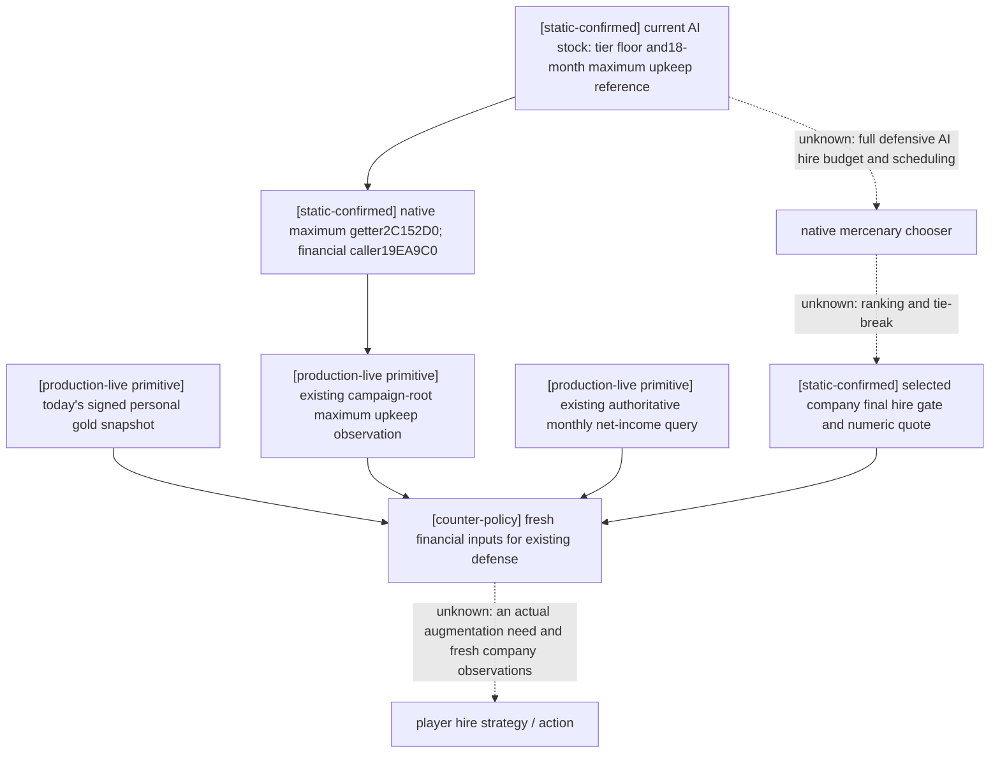
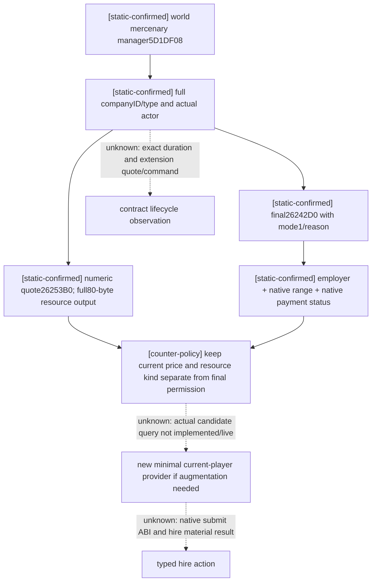

# CK3 1.20.0.3: Robert defense finances and hired troops

2026-10-03. This is file-only research for the original Robert29829 episode
`native-29829-2bc2d599f7f9`. The owner has reopened war research and removed the
former nonwar-only restriction. Historical WAR_CASH/PREWAR OFF records retain
their historical meaning; they do not prohibit this work. ROOT owns the game,
SDK, pipe, actions, runtime build, shared source and Git. This package does not
launch, query or control CK3 and contains no runtime-source change.

The exact executable is CK3 **1.20.0.3 / Steam25652598**, SHA-256
`94B55397ABB687A3DCD436805A5D885E6BE90FA6C693FEB44A9E3BBEEADE02A6`.
The existing frozen executable and intake hash are reused. New stock pins use
`Z:/SteamLibrary/steamapps/common/Crusader Kings III/game`, because the repository
game reference is older. New bounded disassembly is in the external package's
`native/` directory. Each selected complete function has its unwind span and
byte SHA in `NATIVE-RECIPE.json`; registration slices are labeled slices and are
not presented as complete functions.

## The immediate finance path is already implemented

Use a current full snapshot and the existing
`ck3_query_campaign_root_context_v1(expected_revision=current_revision)`.
The snapshot supplies signed personal gold; campaign root supplies authoritative
monthly net gold income and `player_max_monthly_gold_maintenance_v1`. All three
refer to the current played character. Reuse the accepted exact-build transport;
neither `WAR_CASH` nor `PREWAR` is a dependency for this observation.

| Input | Exact native source | Existing public observation |
| --- | --- | --- |
| Personal gold | resolved Character+`1B0` living extension, extension+`100`, signed int64/Q100000 | full snapshot `played_character_gold` |
| Monthly net gold income | `2BCA960(out64, Character, null breakdown, null context)`, output-pointer return | campaign root `player_monthly_gold_income` |
| Maximum monthly military maintenance | `2C152D0(out80, Character)`, ten resource slots, output-pointer return | campaign root `player_max_monthly_gold_maintenance_v1`, gold slot0 |
| Current monthly military maintenance | `2C13F80(out80, Character, null breakdown)`, ten slots, output-pointer return | concrete future leaf; currently absent from normal root |

The current-expense function `2C13F80..2C142CE` is 846 bytes, SHA
`ec59d0b6df3d461361ada627545f0c23976562dd5501924b83894e08f392abc4`.
It initializes an 80-byte resource vector. A scalar buffer is not its ABI.
Its layout and null-breakdown path are confirmed by the new complete span and
the prior cash component's declared three-argument ABI. This is a **monthly
rate**, not an immediate transaction or a guaranteed future-war cost bound.
The already live maximum getter's complete native proof and financial caller
`19EA9C0..19EADA5` are reused from
[Robert Feast finance](ck3-1.20.0.3-robert-feast-finance.md).

Current versus maximum cost is useful when deciding whether to reduce expensive
raised/embarked forces. No such current-versus-maximum strategy blocker has been
shown in this frame, so ROOT requested no new cost provider. If that decision
becomes necessary, extend the same normal root with an optional current
ten-resource observation, validate one focused production-reader fixture, then
one paused actual frame. Do not restore the old multi-purpose cash package just
to obtain this leaf.

Stock declares soldier gold maintenance0.003, embark cost1 per100 soldiers and
embarked maintenance multiplier0.25. These are inputs to native computations,
not a replacement for a quote; MaA types and modifiers also contribute. Never
subtract maximum maintenance a second time from already net monthly income.
Maximum upkeep and an explicit reserve policy remain separate from income and
immediate hire cost.

## Today's accepted Robert frame

ROOT's closed `war-native-readiness/actual-paused-war-v34-01` batch is reused.
`015-ck3_take_snapshot.json` has Robert29829, raw53236608, native5/public2,
paused, gold raw **106140557** /100000 = **1061.40557**. This package has not
queried fresh income or maximum upkeep. The earlier v19 maximum5.886gold/month
must not be carried into today's financial decision.

The actual army-strength query014 reported Robert public Army83886367:
2334 current/2461 maximum soldiers and native base-power raw7588100000. War129's
observed enemy16777683 has2305 soldiers/raw5986000000. The other active war,
16777231, has the sampled enemies1362+101+302 soldiers. These are actual scope
rows, not a combined-contact prediction or proof that a mercenary is required.
The native base-power number is not a win probability. Finance can be observed
without waiting for an unneeded augmentation implementation.

## Native AI funding reference before any player policy

Current `common/defines/ai/00_ai.txt` defines minimum war chests by tier
25/25/50/100/200/300/400 and18 months of maximum maintenance when larger; it
allocates0.6 of earned money to the unfilled war chest after reserved gold.
Mercenary authored controls reduce effective wealth by100 per hired company,
cap expenditure at0.8 of wealth, target enemy overmatching1.25, allow0.7 of the
war chest for overmatching, set minimum hire goal500, maximum overflow1.5, and
rehire checks3 months before expiry. These are **stock-defined native inputs**.
The complete current AI hire cadence, candidate scoring, budget composition and
tie-break caller remain `unknown`; the stock comments do not close that tree.
The18-month financial getter caller is already exact-build confirmed. Do not
describe a copied18-month player allocation as the complete native defensive
hire policy or a future-cost theorem.

## Mercenary hire: concrete headless observation recipe

No current registered mercenary candidate/final-terms query or hire action was
found in the delivered source. This is **research**, not a live capability. The
current final gate and numeric quote now have direct exact-build entry points:

1. `HiredTroopItem.GetMercenaryCompany` is kind1, getter **CCC020**. It resolves
   full company ref+4 through manager slot **5D1DF08**, fallback **5D1DEF8**,
   manager+20 stride16 entries/+2C capacity, entry+8 object. Check company+10
   full ID and company+14 type **0x4D657263** (`Merc`). Manager enumeration can
   produce all actual companies headlessly; this is not a prefiltered eligible
   set. Empty and unavailable remain distinct. Valid public IDs can include0.
2. `CanBeHired`'s kind1 branch **CCC5BC..CCC60F** constructs a caller-owned
   command with actor+20, company+24 and mode+28=**1**, then calls table
   **476DB28 -> 29942E0**. The complete validator resolves both objects,
   requires an actor land-state, checks the company type/ID and calls
   **26242D0(company, actor, uint32 mode, native_string_sink)**. Call that final
   leaf with mode1 for a normal hire; copy the bool and literal native reasons.
   The existing32-byte native string destruction ABI856050 can be reused.
3. The gate checks company employer+48, actual hire-range leaf **26258A0**,
   and payment-status leaf **2625470(company,actor,mode1)**. Range uses actual
   company/title location, actor capital and same-culture range. Retain the
   complete final result rather than reproducing these tests in Python.
4. `MercenaryCompany.GetCostDesc` registrationCC8150/CC8182 selects **CC78B0**.
   Its actual callback reads actor land-state+`1D0` (or0 if absent), passes it
   as R9D, and calls **26253B0(company,out80,actor,that current native value)**.
   The complete cost getter zeroes all80 bytes, uses the native cost evaluator
   **2873670**, returns out80, and writes gold slot0 or treasury slot6 based on
   the actor's native government/payment state. Preserve the full vector;
   do not treat treasury as gold or calculate a price from soldier count.
5. `GetHireDurationDesc` callback **CC7A20** calls **2625580** with the resolved
   actor. The numeric duration getter needs its own complete bound before a
   provider exposes duration. Stock base36/min11/max108 months are parameters,
   not a current observed contract. `HiredTroopItem.CanBeExtended` is distinct;
   extension mode and price are not closed by the hire leaf.

`2625470` returns2 when the native full-cost payment comparison succeeds,1 in
the native permitted debt case,0 outside that allowance. Its mode1 path uses
resource balance getter28B94B0, the same numeric quote26253B0, and the cached
income leaf multiplied by the current allowed-debt-months setting. The final
hire leaf accepts nonzero payment status. Generic `CanAfford(cost80,actor)` may
therefore disagree with mercenary hire legality; preserve this three-valued
native payment status separately and do not replace final CanHire with a generic
affordability check. The status does not authorize our policy to accept debt.

Relevant exact complete spans:29942E0..29943BA,26242D0..26247CD,
2625470..262557E,26258A0..2625A14,26253B0..2625466,
CC78B0..CC7A16,CC7A20..CC7AA5. Their byte pins and caller links are in
`NATIVE-RECIPE.json`. No command submission ABI, material hire postcondition or
duration/renewal capability is claimed. If Robert's real tactical observations
show a deficit requiring hired troops, the next work is a minimal manager
collection + final gate/cost reader using these leaves, a new focused object
fixture and the same played-character paused mailbox. Then add a typed hire
action only after its native constructor/submission and independent employer,
gold debit and resulting unit observations are closed.

## Holy orders and borrowing reuse current religion queries

`ck3_query_player_holy_order_context_v1` already publishes all organisations,
military type, founder/current patron/employer/leases and each military final
CanHire, ten-slot cost, independent CanAfford and reasons. It uses
`allow_private_player_religion_context_query` and
`XAR_CK3_ENABLE_G2_PLAYER_RELIGION_CONTEXT_PRIVATE_QUERY_V1`; no new war flag is
needed. Existing exact source/tree and accepted v32 artifact are reused from
[holy-order systems](religion-holy-order-systems-native-ai-12003.md) and
[current query](religion-holy-order-context-native-query-12003.md).

At historical raw53236176, military order4 cost106piety and CanAfford=true,
but CanHire=false with actual excommunication and already-hired reasons.
These facts explain why money alone is insufficient; they are not today's
fresh eligibility. Stock hire limit1 and minimum enemy hostility2 remain actual
final-gate inputs. Mercenary36-month rules do not apply to holy orders. Current
patron, historical founder and employer must remain separate.

`ck3_query_player_holy_order_loan_context_v1` under the same religion permit
already observes prospective native loan amount, both final decisions and
resource costs, owed principal, holder and loan-year variables. Borrow is shown
only when the current faith has a military holy order and no existing loan; it
costs50piety, has5475-day cooldown, and chooses a currently eligible order leader
before `holy_order.0200`. The option performs the actual cash/ledger transaction.
The newer stock AI factor0 when gold>=holy_order_gold_value and72-month checks
by nonbarony tier are reference inputs, not our decision recipe. Repay's declared
zero decision cost does not mean zero principal payment.

Historical v27 quote300gold/borrow shown=false/can_take=false/affordable=true
and repay shown=false/can_take=true/affordable=true were production-live readonly
results. Borrow/repay action readiness requires their fresh shown+can_take+
affordable fields and independent ledger observations. Neither a hidden repay
nor an absent principal is an action. Full original tree and debt lifecycle are
reused from [loan observation](religion-holy-order-loan-native-observation-12003.md),
without reopening its resolved ABI or repeating old fixtures.

## Flags, permits and follow-up priorities

**No flag change is required for today's finance observation.** Keep WAR_CASH
and PREWAR unchanged while consuming existing campaign root/snapshot/religion
tools. WAR_CASH currently registers an optional executor but its provider,
mailbox, serializer and fee sources were archived out of the current source.
ON alone cannot restore them. The archived mailbox also hardcodes1.20.0.2, and
source bindings/envelopes need deliberate migration if ever restored.

PREWAR's deferred package predicts declaration participants/default muster and
future supply. It neither gives a current mercenary quote nor funds an existing
defensive war. Its broader declaration purpose is owned by the separate war
readiness/mobilization work and is not this package's prerequisite.

Immediate next steps are: ROOT reads current campaign-root income/max upkeep;
ROOT tactical/war-entry work resolves the observed war-entry RED; ROOT uses
current outcomes to decide whether any augmentation is useful. Only an actual
augmentation need promotes the mercenary reader implementation. This package
adds research and concrete implementation entry points, no new live gameplay,
save days, hired units, paid loan, policy gate or G2 completion credit.
