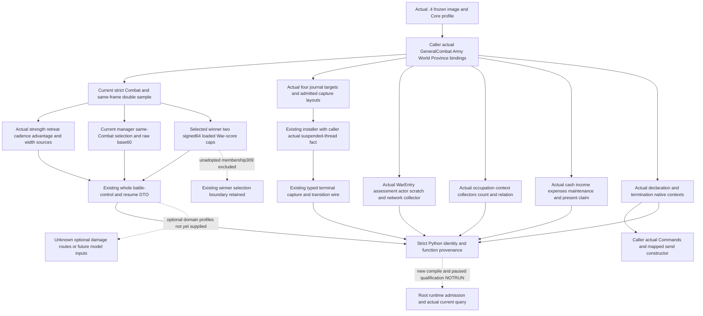

# Actual 1.20.0.4 battle and adopted War domains

This is an adopted-domain source migration written on 2026-10-07
Asia/Shanghai. It uses CK3 **1.20.0.4**, Steam build **25734779**, executable
101040248 bytes, frozen SHA
`98702F88A547CDE2EAF29A85F93B85F68EE4CF8148336A4F7AFAEB75319DD518`.
The semantic version comes from the retained actual PE metadata's ASCII
version entry; the installed-build freeze has no FileVersion/ProductVersion.
No prior-build GREEN or old RVA is used as a new-build qualification.

The source parent is `caa4adc3d1278e324cf4ec19774028e9b9138e28`. Independent
Province source commit `7e880921efd1b7d53e184ea94afcf67bc82fdc1b` supplies the
[Province/siege profile](ck3-1.20.0.4-province-siege-objective.md).
Root owns shared adapter/bridge/CMake integration and actual runtime
qualification. This lane does not edit those shared hooks, run a build,
import production Python, execute tests, install detours or touch a game.
Status is **research with implemented actual domain bindings**. New compile,
native FIRST, sole consumer and paused observations remain **NOTRUN**.

## Native tree and migration flow

The prior exact-build trees remain the input ledger:
[current finalizer manager](battle-current-finalizer-manager-inputs-12003-2026-10-06.md),
[casualty/retreat/terminal outcomes](battle-casualty-retreat-terminal-outcomes-1.20.0.3-2026-10-03.md),
[War entry migration](war-entry-1.20.0.2-migration.md),
[War declaration](war-declaration.md), and
[current War cash](war-cash-current-resources-12003.md).
No counter-policy is changed before or by this migration.

## Concrete actual profiles

All factories reject zero image base and any SHA other than the frozen .4
identity. They directly construct actual native addresses and accept separate
caller-owned actual domain bundles. The old namespace/software DTO and pure
memory algorithms are reused; no .4 SHA is passed to an older image binder.

| Header/TU prefix | Public factory or reader | Adopted production purpose |
| --- | --- | --- |
| `ck3_12004_battle` | `BindBattleImage(base, sha, BattleImageDependencies)` | Current battle-control/transition, manager and retreat observations |
| `ck3_12004_battle_journal` | `BindBattleJournalImage12004(base, sha, actual_battle_bindings)` | Current installer target and capture-layout admission |
| `ck3_12004_war` | `BindWarEntryNativeEnvironment12004`, `BindWarOccupationTargets12004`, `BindBattleCurrentWarscoreCaps12004` | Native War entry, occupation, selected-winner cap pair |
| `ck3_12004_diplomacy` | `BindDiplomacyImage(base, sha, actual_core, actual_commands)` | Adopted termination options and existing native submit paths |
| `ck3_12004_war_cash_claim_terms` | `BindWarCashCurrentImage`, `BindClaimTermsImage`, `SerializeWarCashCurrentResourcesV1` | Current cash and present claim terms with actual provenance |
| `ck3_12004_war_declarations` | `BindDeclarationsImage12004(base, sha, actual_commands)` | Compose the actual holy-war readonly profile with mapped send fields |

The declaration composer depends on the holy-war owner's new
`ck3_12004_holy_war.hpp/.cpp`; it does not duplicate that owner's CB evaluator,
scope, context or readonly-slot mapping. It injects caller Commands and the
actual send constructor `2968150`, primary vtable `448BCF0` and secondary
vtable `448BCC0`, reusing the diplomacy full 164-byte constructor proof.
Commands can remain unavailable while the existing readonly contexts work.
The established submit checks still require the caller's actual Commands.

## Exact proof method and representational facts

Each family uses finite adopted function/operand manifests through the sole
shared mapper. Complete decoding compares non-address immediates, concrete
member operands, local control flow and ordered CALL/RIP target pairs.
No uniform old-to-new address shift is inferred. Cache receipts and peer-owned
actual World/Army/Core layouts are referenced without recapture.

Combat callbacks map actual side strength `26510E0`, entry strength `2657B30`,
manual retreat `258A9F0`, retreat-rule `28C2DF0`, modifiers `28C3AC0/23036E0`,
province numeric leaf `2C4D530`, and holding leaf `C6AF20`. The current manager
constructor's actual RIP operand selects secondary vtable `477F188` and the
daily/date operands retain game-state `A0`, manager domain `2E9D0`, selected
same-Combat list and raw base+60 semantics. Raw0/raw7 are observations; the
unclosed finalizer predicate is not inferred from them.

The current entry final-stat/share producers are actual `2651050/2657AA0`;
the retained complete finalizer closes participant descriptor58, data0/countC,
stride18, full ID8, shareC DWORD and hardloss10 QWORD. Actual roster constructor
anchors and the same finalizer cleanup close roster10/count1C/backlinkB8.
Journal's side baselineA8/current98, soft20, entry stride60 and two roster
arrays28/40 with counts34/4C are actual typed operands. The four array-capacity
instructions use only two named 8-byte constructor anchors; complete capture
use does not require a whole constructor capture. Separate projection/append
suffixes and the current Result188 caller close the adopted journal layout.

WarEntry assessment/actor/network/effective-target callbacks are
`1A23220/1A22D10/1A23FF0/2C13440`. The approved existing environment validator
adds an exact actual .4 pointer-profile branch and retains the old branch.
The actual .4 serializer emits `1A23220/1A23FF0` and Python checks those same
values. Native strategic power retains `Character+1C0 -> +308`, signed
Q100000. Soldier totals do not substitute for it.

The packed occupation getter `2C0DDB0 -> 2C0DD90` is fully decoded with matching
flow and typed operands, but **not** whole normalized equality: native table
literals `480A3B8 -> 480A3C8` and `45B3D58 -> 45B3D68` have explicit paired
actual RIP target proofs. The general allocator `54DEBB8` is proven by its
actual 7-byte use witness, not whole data-section equality.

The selected-winner magnitude helper is actual `2868670`; its two loaded
qword caps remain `5C69B60/5C69B58`, signed64. Zero and negative loaded values
are preserved. This profile does not adopt the separate unqualified .3
membership309 candidate or use terminal history as current membership.

Current cash uses actual `2BCA940/2BCB160/2C13F60/2C152B0` plus expense context
`28BFD80`. The shared serializer accepts explicit version/SHA arguments while
old callers retain their defaults. The new wrapper emits .4 identity and
`ck3-1.20.0.4-native-income-minus-total-expenses-v2`; Python selects the same
exact marker. Treasury retains actual `Character+1B0 -> living extension+100`
signed64 Q100000: absent extension is legitimate zero and negative debt stays
negative, backed by the shared 16-operand resource proof.

Present claim getter `2B9ECB0`, claim vtable `44F17E8` and scalar destructor
`DDC610` have separate actual proofs. CB index10 and string18/size28/cap30
reuse the actual full1515-byte constructor. The authored claim-script pin is
retained only because the frozen game-data depot manifest is equal; that fact
does not stand in for native code/layout mapping.

Termination preserves the complete current 12-key option DTO. Explicit
`recipient_response` unavailable leaves raw decision/acceptance null; native
answer score Q100000 and observed auto-accept remain distinct inputs. The
historical .2/.3 missing-key mode is not extended to this actual .4 producer.
Existing unknown CB-specific option terms remain explicit.

## Source receipts, cost and qualification boundary

Owned artifacts are under
`Z:/ck3_mod_rewrite_process_assets/g2-parallel-20261007/battle-pursuit/migration-steam25734779/`:

- `actual4-domain/combat-map/SOURCE-MAP-RECEIPT.json` and typed operand ledger;
- `war-score-membership/actual4-domain/ROOT-DELIVERY.json`, journal capture
  receipt and source tree;
- `actual4-domain/diplomacy-map/SOURCE-CLOSURE.md`;
- `python-binding/ACTUAL4-SOURCE-DELIVERY.json`;
- `actual4-domain/province-map/PROVINCE-PROFILE-SOURCE-CLOSED.json`;
- parent `ACTUAL4-ROOT-DELIVERY.json` and `ACTUAL4-OCT7-W41-FIELDS.json`.

The external parent ledger records physical old/new finite bytes and calls by
owner, cache reuse and the already-incurred Province Title overlap220 bytes.
Previously captured raw bytes, named old prefixes and new suffix completions
remain distinct. New whole-image reads/hashes, production imports, builds,
tests, SDK/game/process operations and old-case replay are all zero here.

Root's next qualification uses the integrated actual .4 source and real
compiled wire, then one actual paused current query per relevant endpoint.
The Hello/build tuple, Robert29829 scope, public/native revision and same-frame
raw date must come from that packet. An empty current Combat response is a
legal observation. No current-query availability, runtime detour installation,
future callback result, daily combat forecast or OODA loop is claimed by this
source package.
