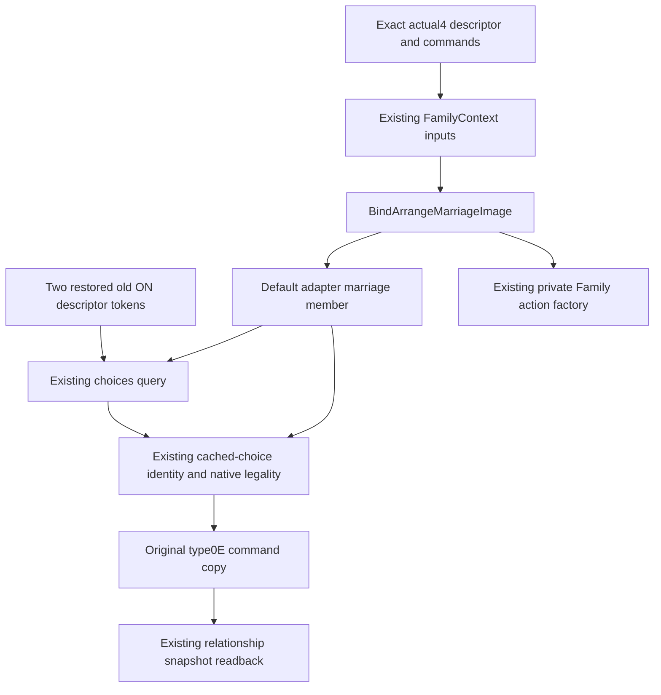

# Restore existing default arrange-marriage tools on CK3 1.20.0.4

The actual4 default adapter omitted `game.command.query-arrange-marriage-choices` and `game.command.arrange-marriage-N`, and left its marriage/family members empty. The existing private actual4 Family factories already provide their native context and sender inputs. This change joins the existing default tools to those same inputs; it does not introduce a new marriage strategy or expand actor scope.

The target is native `1.20.0.4`, Steam build `25734779`, executable SHA `98702F88A547CDE2EAF29A85F93B85F68EE4CF8148336A4F7AFAEB75319DD518`. The original source base is `c8f19a6a067ef8dd56926b8bc11d14b164045974`. Reused source proof and original pins are in `Z:/ck3_mod_rewrite_process_assets/g2-migration-20261007/marriage-family/actual4-adoption/ROOT-DELIVERY.json`. No native mapping or EXE read is repeated.

## Existing native path

`BindFamilyContextImage` constructs actual4 Core/database/role-redirection/all-role context, refresh/finalize/validation/destruction, answer scores, costs and triggers. The existing type0E sender uses independently mapped constructor `2968150`, primary table `448BCF0`, secondary table `448BCC0` and Root's actual4 shared command queue. `BindArrangeMarriageImage` returns this existing software `ContextBindings` contract for the default adapter. It is independent of the private M5 compile flag; the existing private `BindFamilyActionImage` now reuses it.

Default `ReadArrangeMarriageChoices` still enumerates native legal choices for the currently played living character and keeps its existing diagnostics. Default `SubmitArrangeMarriage` still rechecks the actor/candidate identity and native legality, verifies the constructed command tables, submits the original type0E copy and destroys only caller-owned contexts. The bridge keeps its original cached-choice lookup and post-submission snapshot behavior. The family-candidate route retains its original M5 flag and existing subject semantics.

## Root integration and qualification

Root owns the shared adapter changes: include `ck3_12004_family_actions.hpp`, populate `bindings.marriage` with `BindArrangeMarriageImage(image_base, executable_sha256, bindings.commands)`, populate `bindings.family` with the existing actual4 `BindFamilyImage` under the original M5 guard, and restore exactly the two old ON capability tokens. No new TU, CMake registration, test, bridge dispatch or old-descriptor guard change is required for this default marriage path.

The external packet `Z:/ck3_mod_rewrite_process_assets/g2-migration-20261007/marriage-family/default-arrange-marriage/` contains the source-first tree, exact shared-hook patch/recipe, report fields and handoff locators. Root performs source adoption, build/SDK and actual paused query qualification. Worker builds/tests/imports/SDK/game/actions/new EXE reads remain zero.

An available empty choice collection or scene with no actual native legal match retains its real not-applicable boundary. No marriage command is sent to manufacture a qualification opportunity. Previous private Family/Council observations and historical marriage loops are separate evidence; they do not prove a fresh default arrange-marriage action on this build. This package is only completion of existing-tool migration before handoff.
