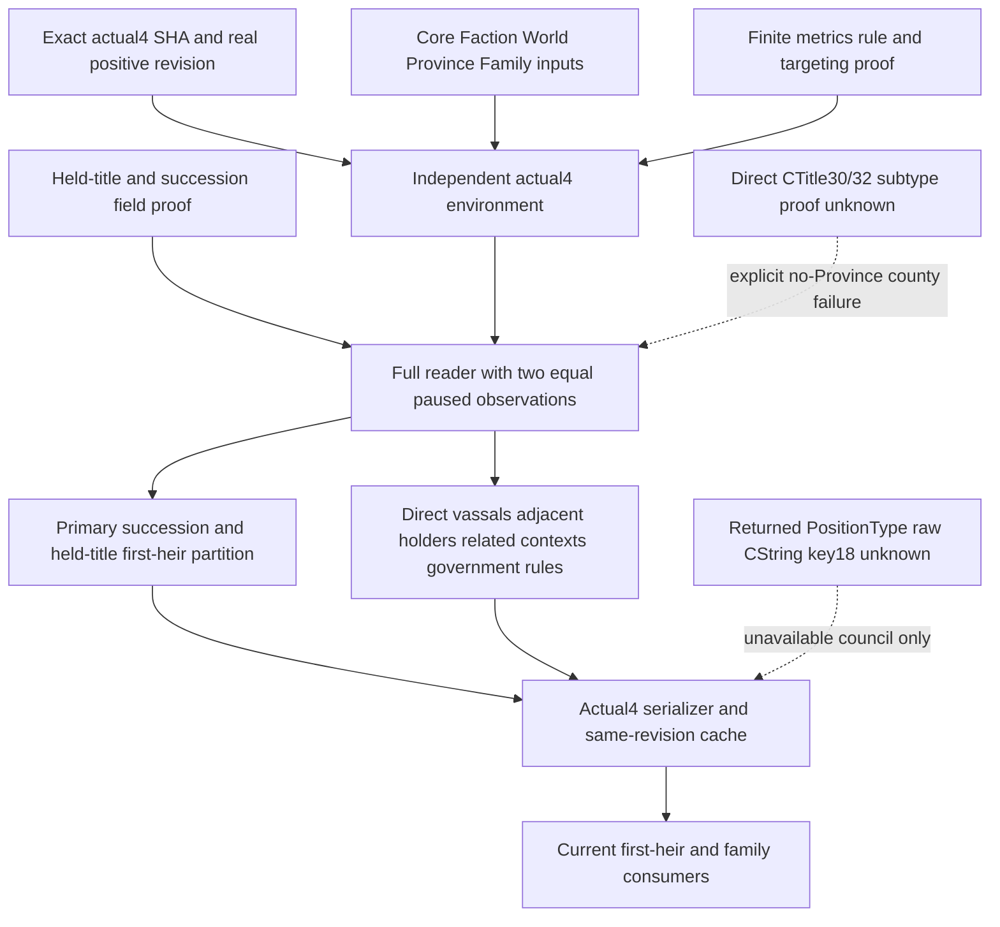

# CK3 1.20.0.4 full CampaignRoot migration

This restores the existing full CampaignRoot provider required by the same-revision current-first-heir and family queries. The separate Faction collector does not publish the complete held-title and primary-succession cache.

The target is native `1.20.0.4`, Steam build `25734779`, executable SHA-256 `98702F88A547CDE2EAF29A85F93B85F68EE4CF8148336A4F7AFAEB75319DD518`. The source base is `6f37a4f6750403b60e203749adb1c24e9a78134d`. The installed-build freeze is `Z:/ck3_mod_rewrite/artifacts/migrations/2026-10-07/installed-build/BUILD-FREEZE.json`. The existing full provider and software DTOs are reused; native bindings are independently populated for the actual image.

## Native inputs and publication

`ck3_12004_campaign.hpp/.cpp` exports the exact-build factory, full reader and serializer in `xar::ck3_12004`. The factory accepts `(module_base, executable_sha256)`, admits only the actual4 SHA and constructs its own native environment. The reader preserves the owning-thread and paused-frame checks, real positive published revision, before/after frame comparison, two equal native observations, identity joins and original ordering. It publishes primary succession, every held title and its first heir, direct landed vassals, adjacent external province holders, related characters, government and selected rules. The current-heir cache must use that same published revision; no revision is invented here.

Core, Faction, Family, World, Province, Government, Faith and Council evidence supplies the shared inputs. The finite mapper closes health `28C64E0`, domain size `28B71E0`, domain limit `28B71B0`, council progress `31AB500/31AB820`, targeting-faction trigger `2B250B0`, rule-setting fallback `5D37A70` and setting CString key `+18`. The fallback is distinct from the break-definition fallback `5D37A60`.

The reused Building full374B proof closes Character `+1C0`, landed-state held-title receiver `+1E0`, count `+C`, DWORD stride4, Title template `+48` and template tier `+64`. The new finite26B source-use proof closes Title succession data `+150`, count `+15C` and first DWORD. The existing typed int32 CArray capacity witness supplies receiver `+8`; these are field-use proofs, not a new independent callable first-heir getter.

The actual4 serializer emits the actual identity and verified RVA strings. It does not depend on relabeling an old native address map. Existing schema and software DTO shapes remain unchanged.

## Precise remaining branches

The returned PositionType raw CString key `+18` has no retained actual4 typed source-use witness. The already qualified council-position lookup proves its request-string capacity and returned ID chain; it does not prove this different member. The common provider therefore reports council unavailable with `actual4_council_position_key_source_unavailable` and `council_ready=false`. This optional diagnostic does not block overall readiness or primary-heir cache. The full council software reader is retained externally for restoration once an exact constructor/getter/serializer member-use witness is located.

The rare county whose native Province has nonpositive ID requires the direct **CTitle** subtype bytes `+30/+32`; these are not template members or stack offsets. Their historical source09 receipt is not locally held, and existing Province/Army bodies do not prove either member. This actual4 branch returns `actual4_county_no_province_subtype_source_unavailable` before reading those bytes. Geographic counties with positive Province IDs retain their complete original partition path. A frame that reaches the rare branch remains unavailable with its held-title failure diagnostic; no incomplete partition is published as complete.

Optional legitimacy returns `actual4_legitimacy_field_source_unavailable`; monthly piety and task-owner monthly piety retain optional absence. These inputs have no new native capture and do not prevent the independently useful cache. No new policy or unadopted fertility-threshold feature is included.

## Evidence and qualification

The external packet is `Z:/ck3_mod_rewrite_process_assets/g2-migration-20261007/marriage-family/actual4-full-campaign-root/`. Its source-first tree, actual provenance, worker fragments and Oct7/W41 report fields accompany the isolated commit.

The sole mapper's compact delivery is `Z:/ck3_mod_rewrite_process_assets/g2-background-20261007/upstream-build-migration/campaign-root-metrics-council/CAMPAIGN-REQUIRED-FINITE-DELIVERY.json`. It records **4,374 bytes /24 exact reads**, split equally between the old actual3 and new actual4 images: metrics/council4,060; first-heir52; typed setting/council34; targeting228. The early234 bytes are included once. The held-title29B join reuses the Building374B decoded evidence with zero fresh reads. Shared Clergy and lookup bodies are not recounted or reread. Initial no-pdata misses remain preserved.

This package is source implemented with precise unsupported branches. It has no worker build, test, production import, FIRST, SDK, game or live execution. Root owns central integration, native compilation, fixtures and paused ordinary-Robert validation. Historical GREEN results do not qualify this provider. No new marriage opportunity, lineage outcome or natural succession is claimed.

## Shared entry integration

The exact actual4 descriptor advertises the existing `game.command.query-campaign-root-context-v1` capability. The existing typed CampaignRoot dispatcher uses the new factory with that descriptor's actual SHA, then calls the full reader under the original owning envelope and full Snapshot comparison. The actual4 thread environment assigns the existing CampaignRoot executor to slot11. It preserves the real positive published revision, connection generation and current-first-heir cache path.

The complete result uses the actual4 serializer before the shared build renderer. Python's existing CampaignRoot contract recognizes the actual4 identity and the nineteen proof-backed RVA fields. It accepts `actual4_council_position_key_source_unavailable` only on that exact build while retaining empty council positions and `council_ready=false`; whole-cache readiness still follows the existing required fields. This is source integration only. Runtime compilation and paused query validation remain pending.

## 2026-10-07: local strict no-Province county restoration

CCC cache attempt R0013/a86 reached the historical unsupported branch on held-title index4, title16850, holder/current player34422, county tier2 and native Province ID0. The complete partition remained unavailable and the original readiness timeout remains RED. Root used the official Quit dialog with autosave unchecked; native process exit0, tree/job/control cleanup and CAS5315 are recorded separately from business acceptance. The independent root observer had already timed out with259/false and is preserved without OS0 credit. [Root review](C:/workspace/ck3-upgrade-20261007/resume-root-02/R0013-ROOT-RED-NORMAL-CLEANUP-REVIEW-02.json) retains these boundaries.

The new local actual4 named source closure follows real registration operands, factories, RTTI and evaluator vtable slot27: `is_landless_type_title` resolves a full-generation CTitle then reads `+30` in the complete94B evaluator `2B49160`; `is_noble_family_title` reads `+32` in complete94B evaluator `2B49510`. A separate typed GUI callback also reaches the five-byte `+32` leaf. These evaluators have trigger/scope ABI and are evidence only; the reader does not call them as unary getters. [Closure02](C:/workspace/ck3-upgrade-20261007/ccc-county04-subtype-readonly-map-agent-01/ACTUAL4-NAMED-COUNTY-SUBTYPE-SOURCE-CLOSURE-02.json) records the exact bodies and chains, SHA `2ff7dfcb7e1868c11b63a59d3bf137132381858c7c916e01bb0cedc79c640161`.

An additional exact118B read of the already mapped actual4 Title Province getter `230F8E0` directly proves Title`+11C` child count, Title`+48` template and template`+64` county tier. [Complete getter04](C:/workspace/ck3-upgrade-20261007/ccc-county04-subtype-readonly-map-agent-01/ACTUAL4-COMPLETE-TITLE-PROVINCE-FIELD-PROOF-04.json), SHA `ec7774770125b968415f4549a60204e4299aaca4edddb7eb55cdccc9ea68bae8`, preserves that body. The existing tracked template-key witness declaration points to remote raw evidence unavailable on this machine; a local actual4 template`+18` witness is still pending at this append. It is not inferred from the old body or a uniform RVA delta. Source implementation and build are therefore recorded separately from complete local source-use qualification and new runtime acceptance.

Source6 restores only the strict rare branch: Province ID must be0 with the stock Null type tag, direct landless/noble-family bytes must each be1, child count must be0, and the native template string must be a canonical county key. All reads and diagnostics are retained; ordinary positive-Province counties follow the original byte-for-byte branch. Failed/malformed reads and other Null counties remain unavailable. No memory writes or new native game calls are added. [Production patch](C:/workspace/ck3-upgrade-20261007/local12004-runtime-build-01/held-title-no-province12004-candidate-01/actual4-noble-family-no-province-strict-branch-01.diff) changes one CPP file, SHA `392819e4c737a8260cf7e7ece80d6d17bfd215fb2cbe24674d4892484707e30e`.

The immutable source-index04 contains7172 files and14 cumulative deltas, SHA `59384c1574c01e9ce813cdd3f1039b4f056ef907f60e19da27e51b7160f1837f`; the prior Source5 lazy Python import fix is byte-identical. The actual production-reader focused consumer ran once with24 cases and exit0 under `/W4 /WX /UNDEBUG`, and its exact project EXE Defender registration was read back verified. Actual native compilation reused existing per-profile objects, compiled one new shared TU, built two archives and linked both DLLs successfully. Initial fixture/link failures remain preserved; no full matrix was repeated. [Final packet01](C:/workspace/ck3-upgrade-20261007/local12004-runtime-build-01/held-title-no-province12004-candidate-01/SOURCE06-STRICT-NO-PROVINCE-NATIVE-FINAL-01.json) and [partial qualification addendum02](C:/workspace/ck3-upgrade-20261007/local12004-runtime-build-01/held-title-no-province12004-candidate-01/SOURCE06-DIRECT-FIELD-PARTIAL-ADDENDUM-02.json) bind the real evidence without editing old freezes.

The new frozen CCC DLL is8173056 B, SHA `5352ab4477e55d9feb4bac55a9f93101168ce93abc9788fb57e65fd627b24106`; PAM DLL is8590336 B, SHA `cc9900ec7565cb9d35c3da8d06fad8c3e3da5634784d55133ebff1f8f6094e75`. [Root adoption review](C:/workspace/ck3-upgrade-20261007/resume-root-02/SOURCE6-ROOT-CPP-ADOPTION-REVIEW-01.json) checks the production CPP against the frozen Source6 bytes. Old builds, profiles, budgets and raw failures remain intact. New Source6 game execution, whole product acceptance and release completion are NOT_RUN/PENDING here; the remaining witness requires a separate evidence append and does not require a new DLL, index or test run.
