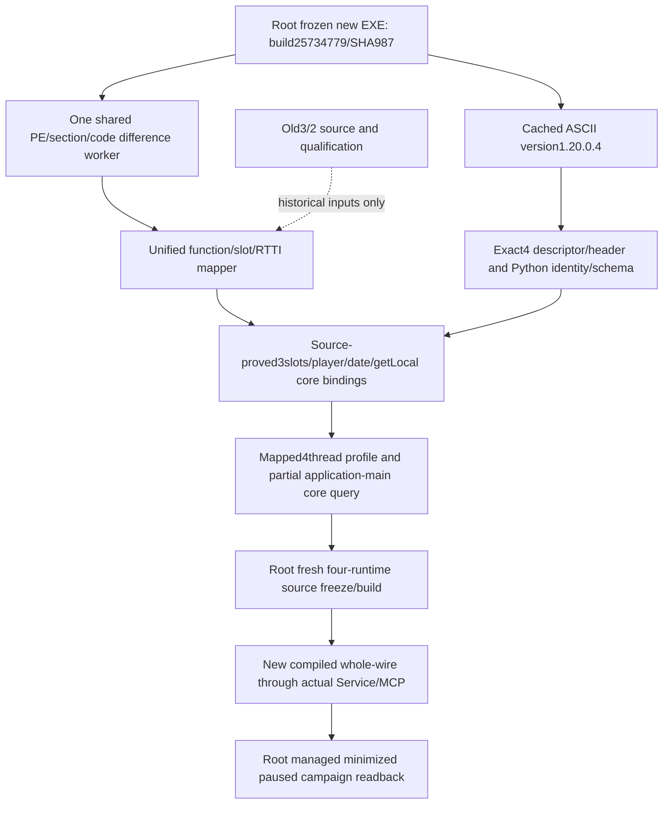

# CK3 1.20.0.4 native/MCP migration

Source preparation began on October7,2026 from Root's adopted `0597bddcd6bea7d441efe2ce6546106953f05c22`. The updated installation is Steam build25734779, EXE101,040,248 bytes, SHA-256 `98702f88a547cde2eaf29a85f93b85f68ee4cf8148336a4f7afaeb75319dd518`, frozen by Root in `artifacts/migrations/2026-10-07/installed-build/BUILD-FREEZE.json`. No child read or rehashed the executable.

The PE resource only reports1.0. The actual semantic version1.20.0.4 is instead present as ASCII at `.rdata` RVA71871232/file offset71866624 adjacent to `ck3` and `Crozier`; the retained global-PE metadata captures the exact context. The new image remains SizeOfImage102518784. Root's single old/new PE worker reports real `.text` and `.rdata` changes, so existing `.3` RVAs/layouts are not accepted merely because the image size or strings match.

The original Robert29829 campaign is preserved at Root's h9613/5997-day freeze. The owned job exited0 with cleanup proven; CK3 stop exit1 remains recorded. G106 source candidate b98 was adopted as0597, but its old `.3` build and thirteen FIRST fixtures were not run and are superseded by this migration. Old g105 source97a completed RED, solely at Holywar Scope alignment padding C4324 under `/W4 /WX`; its finite source-layout correction is a separate Root adoption, without a repeated old build.

The native core owner adds `ck3_12004.hpp`, its descriptor/profile/adapter and the four-first registry entry. The existing Crozier renderer delegates exact4 identity to a dedicated renderer while retaining older identities. The actual `.3` implementation deliberately used a reviewed `.2` ABI projection; the new `.4` binding will not widen that projection before the shared mapper closes the required startup, Jomini/gameState, Character/player and date/speed/paused inputs. An identity-only or disabled binding is intermediate source preparation, not a completed migrated observation capability.

The existing shared adapter's complete `read_snapshot` enters treasury, resources, relationships, events and world readers after the core prefix. Mapping core fields alone therefore does not qualify that complete snapshot. A core-reader callback appended to the existing binding bundle preserves aggregate initialization prefixes, defaults to the old reader and selects the actual `.4` reader for the new factory. Its existing timeline-prefix accessor can provide the bounded core result while the full `.4` snapshot remains unavailable before those unported readers. Startup also directly reaches `BindBattleImage` and four terminal-journal detours; their new function/prologue proofs are part of the concrete bootstrap dependency.

Root approved a minimal `query-core-frame-v1` observation using the existing application-main mailbox and the actual `.4` core prefix. It publishes local player, full-generation played Character ID, date, speed, paused and map/alive state under `ck3_12004_core_frame_v1`, with explicit partial scope. It does not use the existing mailbox's complete `CaptureQuerySnapshot` wrapper, which calls `ReadSnapshot`. The query's first source/compiled/paused-frame validations remain pending. Once independently validated it can restore a useful read-only primitive for the original campaign; full snapshot, old MCP tools and the remaining migration continue separately.

The compact `function-match-core/CORE-FUNCTION-MAP.json` proves nine function mappings, eighteen actual verifier windows and four directly reached journal detours. `GetLocalPlayer` moves from0x383E2B0 to0x383E290; the three core global slots remain0x5C6A520,0x5C68C50 and0x5C67568. `core-global-slots/CORE-LAYOUT-OPERAND-PAIRS.json` closes thirty-three reached reader operands, including GameState+0xA0, manager+0x222E8, entries/count+0x58/+0x64, player/Character IDs+0xD8/+0xB0, Character fullID+0x18 and death pointer+0x1D0. The isolated new binder and reader now use these actual proofs. Its dedicated thread profile uses the eighteen new verifier windows, Peek return0x40D9412/IAT0x43DAE38, RNG0x54DEFC0 and TLS flag0x5CBE6BF/getter0x3F784A0. Existing thread installation software consumes this actual4 profile, without calling the old image binder. The mapper owns the finite binary capture cost; this core integration owner read no executable bytes. Function and vtable shifts differ, so there is no universal address delta.

The Python owner adds the exact1.20.0.4/SHA987 pair and explicit `.2`/`.3` to `.4` private schema/provenance selection. `NativeHeadlessGameplayDriver` already consumes generic hello and semantic snapshot metadata, so it needs no speculative version branch. Clock reading still needs the new authoritative header/layout selection from the native core mapping. Individual feature transports retain their own pending `.4` ABI/source contracts; recognizing the global version does not advertise all old gameplay capabilities.

The bootstrap owner verified the actual official production route: `agent.py prepare-profile`, `rebind-ordinary-seed-v1`, then `native-one-generation-preflight`. `environment.prepare_profile` records actual launcher version and EXE identity; the CLI does not force its optional expected version. Rebind/preflight have no literal `.2`/`.3` rejection. Those files remain unchanged. The unused `.2` candidate generator's literal version check is not on this route and is not repaired. Generic injector/attach host transport also has no required game-version predicate; only the synthetic host's new preferred identity expectation changes.

Wire protocol1, gameplay MCP server0.1.0, operator1.2.0 and run-ID schema1 are independent protocol versions and remain unchanged unless their own interface changes. Operator required-path file rows hold size/hash; guard target holds build ID/hash, without inventing an extra size field. The next profile/recipe binds the actual new source and DLL manifest when Root freezes them; no new run number or binary hash is fabricated.

Parent owns runtime CMake registration for the three real new source units (`ck3_12004_adapter.cpp`, `ck3_12004_abi_profile.cpp`, `ck3_12004_core_frame_v1.cpp`), this topic and the integrated English source commit. Three children own disjoint native profile/adapter, Python identity/schema/clock and bootstrap/actual recipe files. Root registers the one new combined core-frame fixture and owns main integration, updated-EXE data, source/binary freeze, native execution, reports/publication and the real game. No old body is reread, no whole EXE comparison is repeated, and the enormous global difference-range JSON is not independently parsed by the core owner.

Root's later integration base is `ea222238efe45f4916057d90b2830d01e7fd57c7`, including the separately reviewed Holywar Scope correction and SDK text-payload reduction. The migration owners keep their original0597 working base while their disjoint edits are in flight; Root adopts their minimal source delta onto the current base. The previous build failure and SDK harness failure remain historical evidence, and no successful old test or old native build is repeated here.

The actual installed MCP SDK2.0 exposes `mcp/server/mcpserver/tools/tool_manager.py`, rather than the previous `fastmcp` namespace. Root located this real file and an already qualified registered-tool source pattern. The new core-frame consumer uses that actual route; no legacy SDK discovery, duplicate test or alternate server facade is introduced. The later publicationa9e6d5ab preserves the same integration code plus ordinary documentation and sibling changes.

The minimum future validation is one actual new core producer/whole-input consumer and a fresh strict four-runtime build using real source closure, followed by Root's actual minimized paused local-player/date and needed Army/War queries. Any selected action needs independent after-state/save results. No compiler, SDK, game, process, Steam, pipe or project test has been executed by these migration children yet; current status is research/source implemented with core ABI mappings pending.

External packet: `Z:/ck3_mod_rewrite_process_assets/g2-background-20261007/ck3-update-migration-interface-preparation/`. Shared difference evidence: `Z:/ck3_mod_rewrite_process_assets/g2-background-20261007/upstream-build-migration/global-pe-diff/NEW-PE-METADATA.json`. The old/new field ledger and remaining capability boundaries are recorded by their assigned domain owners.
