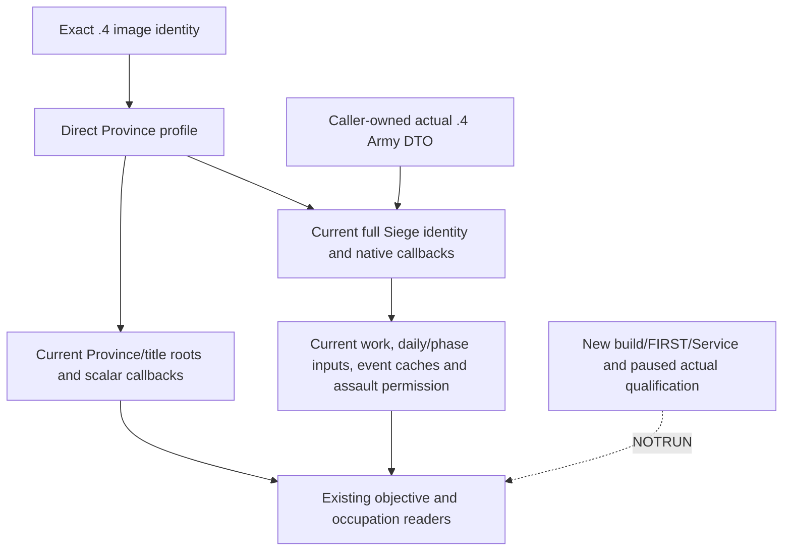

# CK3 1.20.0.4 Province, Siege and objective profile

The already adopted objective, occupied-holding, battle/war and hired-army
queries require an actual **1.20.0.4 Crozier / Steam 25734779** Province profile.
The executable identity is
`98702F88A547CDE2EAF29A85F93B85F68EE4CF8148336A4F7AFAEB75319DD518`.
This package implements that profile in `ck3_12004_province.hpp/.cpp`; it is
source implementation with finite native evidence. Build, production import,
FIRST, Service, SDK and game qualification are **NOTRUN**. Historical .3 live
results do not grant this profile live readiness.

`BindProvinceImage12004(base, sha, actual_armies={})` constructs the existing
`ck3_12002::ProvinceBindings` software DTO directly from actual .4 roots and
callbacks. It does not call the old Province, Army or Core binder. A caller
with the actual .4 Army profile passes that same DTO for current unit,
regiment and commander inputs. The default empty Army DTO permits independent
province/title resolution and occupation/fort reads without inventing Army
availability. Existing readers and published query semantics are retained.

| Adopted callable | Actual .4 RVA |
| --- | --- |
| Title → Province | `0x230F8E0` |
| Province occupation / fort / garrison / besieging strength | `0x247D0C0` / `0x247AB70` / `0x247F350` / `0x247F1B0` |
| Eligible regiment work / highest eligible siege tier | `0x247ECC0` / `0x247EFA0` |
| Siege progress / total work / current days left | `0x251C9A0` / `0x251DD00` / `0x251CAE0` |
| Army exclusion / Army–Province eligibility | `0x24E8340` / `0x2C16670` |
| Current ordinary daily work / current phase length / blocked | `0x251F150` / `0x251E780` / `0x251CF50` |
| Current assault daily work / expected daily casualties | `0x25207D0` / `0x25205A0` |
| Complete native start / stop assault validators | `0x29738A0` / `0x2973A50` |

Each entry follows its paired native instructions and decoded targets; this
table is not a global RVA shift rule. The Title getter is the complete
118-byte native function, including county first-child recursion. An earlier
8-byte tier comparison is only a prefix. Existing Army owners' complete
exclusion and 214-byte eligibility proofs are reused. M and K have complete
732- and 522-byte finite windows; actual K instruction `0x247F169` reads the
regiment type's `+0x2A0` tier.

The actual core roots remain GameState `0x5C68C50` and Character storage
`0x5C67568`. The mapped source uses Unit storage `0x5D1E380`, Province fallback
`0x5D1E390`, Siege storage `0x5D1EC88` and landed-title storage `0x5D1DAF8`.
Current GameData `+0x140/+0x14C` Province table and Province `+0x10/+0x85C`
identity are anchored by the existing actual .4 Army/native domain proof and
this package's callbacks. Full-generation storage and existing backlink
checks retain their meanings.

Current Siege raw fields are independently anchored: Province backlink
`+0x200`, internal ArmyID `+0x208`, work `+0x3D0`, five signed event states
`+0x3D8 + native_enum*4`, prepared phase/event caches `+0x20/+0x28`, phase
counter `+0x43C`, and assault byte `+0x44C`. Actual native prepare and event
writer source windows prove the state array and counter. They contain
image-relative jump tables whose literal addresses changed. Their six
cached entries preserve the exact native target offsets; those operands are
interpreted explicitly. The mixed code/data windows retain their original
partial mapper statuses and are not described as wholly normalized-equal.
Neither writer is called by this profile, and this proof does not implement
future event RNG or forecast a siege outcome.

Title children retain the existing 16-byte CArray software descriptor:
native `+0x110` data and `+0x11C` count identify its base and layout; the
existing capacity at base `+8` is consequently `+0x118`. This is the existing
generic descriptor ABI inference, not a claim that the native Title getter
reads capacity. The actual 408-byte child iterator confirms pointer/count
operands. Existing recursion budgets and shape checks stay unchanged; no
new gate or Title writer audit is introduced for this guard.

Evidence is frozen at
`Z:/ck3_mod_rewrite_process_assets/g2-parallel-20261007/battle-pursuit/migration-steam25734779/actual4-domain/province-map/`:
`PROVINCE-PROFILE-SOURCE-CLOSED.json`, `first01/FAMILY-MAP.json`,
`CURRENT-PHASE-RAW-LAYOUT-CLOSED.json`, and `OCT7-W41-FIELDS.json` record the
entry/field pairs, reused owners and readiness boundary. The sole shared
finite mapper reused cached PE/runtime metadata and claims. Physical finite
EXE reads total **27,312 bytes / 40 calls**, equally split across the two
frozen builds; whole EXE reads/hashes, PE reparses and new pdata extraction
are zero. A concurrent Title suffix overlap of **220 bytes** is recorded
honestly: another owner's complete suffix locator arrived after this batch.
The previous 8-byte prefix in each build was reused. Retained phase-table
interpretation adds 96 cache bytes and no EXE read. This child performs no
Git, build, tests or game actions; the parent owns joint qualification and
the combined commit/push.
