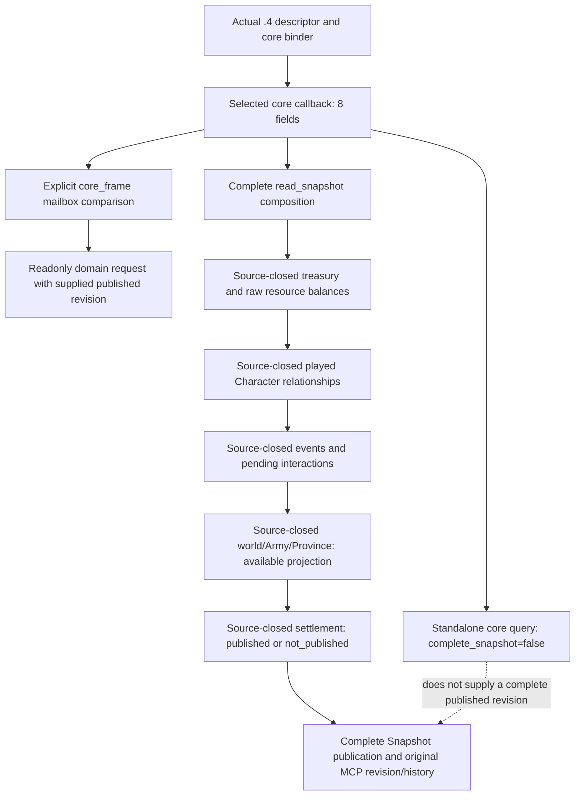

# CK3 1.20.0.4 snapshot and query composition

The actual target is Steam build `25734779`, game version `1.20.0.4`, and executable SHA-256 `98702f88a547cde2eaf29a85f93b85f68ee4cf8148336a4f7afaeb75319dd518`. This source package starts at `c2191cec915e8fc70a5057b2a20cddb6a5be2f75`, including the qualified clock decoder fix. The independently frozen first core package and its failed build attempts remain unchanged.

The existing Crozier software adapter has a complete `read_snapshot` contract. Its actual `.4` route now dispatches `ReadCk3_12004Snapshot` using a tail-appended typed foundation bundle, actual Army/Province/World factories and the actual `.4` family reader. The selected `.4` core callback separately supplies eight fields: date, speed, paused state, local-player ID, map readiness, played Character presence, full ID and alive state. Its `query-core-frame-v1` result explicitly has `complete_snapshot=false`.

## Reached native and software inputs

| Reached source | Required actual `.4` composition | Owner and boundary |
| --- | --- | --- |
| `ck3_12002_adapter.cpp:144` | Gold/treasury, prestige, piety and stress | Source-closed foundation with actual `.4` Character resolution and proven memory fields |
| `ck3_12002_adapter.cpp:166` | Betrothed, primary spouse and ordered spouse list | Source-closed `ReadPlayedCharacterRelationships`; receiver-linked capacity proof is sealed by the Family owner |
| `ck3_12002_adapter.cpp:177` | Event/pending interaction inputs and reached reply-validation vtables | Source-closed actual `.4` event functions, fields and readonly Reply command vtables |
| `ck3_12002_adapter.cpp:178` | World, Army and Province readers with an `available` result | Source-closed World `56861a12`, Army/support `8bcd301e`, Province `7e880921`; a partial world remains a partial result |
| `ck3_12002_adapter.cpp:182` | Settlement reader | Source-closed actual `.4` accessor, getter, lookup and 39 joined field/function pins; `not_published` remains a legal value |
| `ck3_12002_query_mailbox.cpp` | Owning-thread frame capture and comparison | Shared composition; an explicit core comparison mode uses the existing selected core reader |

Actual domain binders receive the actual `.4` SHA and populate mapped addresses. Existing DTOs and function types can be reused where their exact layouts are proven. This is software reuse; it does not widen `ReviewedCrozierAbiVersion` or pass an old reviewed SHA to a legacy whole-image binder.

The holy-war mailbox borrows `bindings_.declarations` through `game::BorrowOrdinaryHolyWarDeclarations12004`. The pointer refers to the selected `.4` adapter's already composed software bundle and is copied into the typed request. The accessor performs no image binding or native call. Domain factory composition remains responsible for filling the actual readonly and action slots; an unfilled bundle is not a ready declarations capability.

## Core comparison is a declared input scope

`QuerySnapshotComparison12002::core_frame` preserves the existing mailbox ticket, execution stamp, owning-thread checks and nonzero supplied snapshot revision. Capture and finish use `ReadCk3_12002TimelineCoreSnapshot`, whose Crozier implementation invokes the selected `.4` core callback. Comparison covers only the eight core fields. Full Snapshot comparison remains the default.

This mode does not manufacture a published revision from the standalone core query, replace the Driver's complete Snapshot/history requirements, or promote the partial core result. Domain owners must either use the existing published revision after complete Snapshot composition or provide a separate concrete source-bound request path. Their current source-only fixtures and hook proposals are not live qualification.

## Evidence and remaining work

The independent `ck3_12004_snapshot_foundation.cpp` supplies actual `.4` resource, event, settlement and command bindings. `RESOURCE-FAMILY-STRESS-MAP.json` proves Character `+1B0`, extension QWORDs `+100/+130/+110`, and signed stress DWORD `+2F8`; a null extension has lawful zero balances. The resource reader reuses a software memory parser after actual `.4` full-ID resolution. It never calls an old image binder.

`EVENTS-FUNCTION-MAP.json` and `EVENTS-FIELD-MAP.json` close the current event and pending interaction paths, including both Reply command tables `0x448BC28/0x448BBF8`. The selected pending command is constructed only for the existing readonly validation; no Reply, selection, acknowledgement or queue action is performed. All 31 assigned field checks are closed. `SETTLEMENT-39-PIN-JOIN.json` closes 31 global/field and eight helper pins; the selected getter/lookup are `0x3F8A7E0/0x3F8A660`.

`COMMAND-LAYOUT-MAP.json` closes manager `0x5CC1240`, queue `0x37F06D0`, and pause, speed and save constructors/clones. `BindCommandImage12004` fills the shared software command bundle with the actual `.4` vtables. These source-ready commands still require the owning application-main route and Root's fresh native/registered/live qualification.

These proofs are reused from the sole mapper. This package reads no executable bytes and performs no hash operation. The source composition now binds every mandatory full Snapshot input. Its actual production publication still requires Root's fresh native, registered-consumer and paused qualification; source closure does not borrow those results from the first core build.

## Application-main publication and preserved software contracts

The `.4` software bundle appends `snapshot_foundation12004` after all existing members. The dedicated full reader fills resources and relationships only for an actual played Character, reads the actual event/pending state, requires an available world, and accepts both settlement `published` and legal `not_published`. A missing demanded input returns false without publishing a partial frame through the complete Snapshot contract. Startup/menu remains the lawful map-absent core Snapshot.

The production bridge selects the existing `WorkerAdapter` for the source-closed `.4` full Snapshot capability. `InstallCoreFrame12004` installs the actual `.4` thread profile and existing software snapshot observer. `WorkerAdapter::Observe` explicitly admits this exact descriptor and invokes the actual `.4` full reader on the application main thread. The worker reads only the published cache; its original positive revision and owning epoch/date/pause semantics remain in place. No old reviewed SHA or native thread profile is substituted.

The Army factory also preserves the existing owned-regiment software attachment: its persistent registry slot comes from the same actual `.4` Army bundle, and `ReadOwnedRegimentTypeV1` parses the source-proven software layout. MAA recruitment/create and further domain capabilities remain separate owner packages rather than being inferred from the Army base profile.

`SerializeArmyCommanderCandidates12004` retains the existing whole six-argument software publisher, changes only the three source-proven `native_getter_rva` fields and renders actual `.4` metadata. Its candidate and movement schemas are `ck3_12004_army_commander_candidates_v1` and `ck3_12004_army_current_movement_speed_v1`; the legacy six-argument publisher remains unchanged. Actual command/query dispatch must select `BindCommanderImage12004` before supplying this observation.

Native mapping evidence is held in `upstream-build-migration/function-match-core/CORE-FUNCTION-MAP.json` and `core-global-slots/CORE-LAYOUT-OPERAND-PAIRS.json`. The reached software input inventory is in `ck3-update-migration-interface-preparation/native-profile/FULL-SNAPSHOT-DEPENDENCIES.json`. All reside under `Z:/ck3_mod_rewrite_process_assets/g2-background-20261007/`.

The next composition consumes source-closed family packages incrementally, registers only their real runtime translation units, and publishes capabilities after their actual binders are reachable. Time/save operations also require their mapped command operands, not merely the new descriptor. No EXE read/hash, import, test, native build, SDK, game or deployment operation was performed by this source package. Root owns the fresh build, registered consumer and paused live validation.

## First complete Snapshot fixture and registered consumer

The new `xar_ck3_12004_snapshot_foundation_test` constructs owned memory for the actual `.4` core, resources, relationships, active event, pending interaction and valid empty world. It invokes the actual selected adapter's `read_snapshot` and the production `SerializeStateSnapshotFrameV1` wrapper. The wrapper delegates the existing bridge formatter; it does not copy a serializer or invent a new wire shape. The separate missing-settlement scene returns false through the full reader while the independent core reader remains available with `complete_snapshot=false`.

The registered consumer reads the compiled `state-snapshot-robert-paused.json` unchanged into `NativeHeadlessGameplayDriver`, then uses the real Service and SDK 2 registered `ck3_take_snapshot` tool. Only endpoint packet I/O is replaced for the offline fixture. Native revision `1` originates in the compiled full-frame producer; the separate partial core result is never ingested as a complete Snapshot. The FIRST source is authored but has not been compiled or executed. Root's first core build and consumer GREEN results are separate evidence, not qualification of this new foundation fixture or full Snapshot publication.

The full-frame fixture owns a `0x300` Character buffer. It copies the original core-only `0x1D8` prefix and installs the enlarged buffer in its Character registry before assigning the source-proven stress DWORD at `+0x2F8`. This is a fixture memory-layout correction; the production resource reader and expected stress value remain unchanged.

## First mapped domain dispatch composition

The `.4` application-main environment registers the five source-closed executors for paused realm-law terms and basic reform, current doctrines, doctrine knowledge and Tenets. `IsNonwarPrivateStep12004` selects only their existing steps under their existing compile flags. The bridge preserves its actual positive published Snapshot revision and paused-frame comparison before dispatching the existing topic handlers. It renders responses with the owning actual `.4` descriptor. The independent religion factories come from original `1262d563`; realm-law factories come from `86fae6d1`. Additional adopted religion providers and other domains are composed in subsequent owner packages, rather than calling their legacy image binders under the new hash.

The readonly commander route now selects the actual `.4` Commander binder, retains the owning complete published Snapshot, and emits its existing whole result with `SerializeArmyCommanderCandidates12004`. The application-main environment registers the existing software query executor in its original slot. The `.4` descriptor advertises the basic candidate query; assignment and target-roll depend on separately composed actual command and Combat bindings. An optional target request currently preserves the existing explicit `target_province_bindings_unavailable` result and calls no old-image callback. The new movement metadata fixture from original `abe58a29` remains authored and unrun.

The shared GUI environment now declares the distinct `GuiAbiRevisionV1::crozier12004` value and appends `executable_sha256` after all existing data members. This preserves its aggregate initialization prefix and supplies exact build provenance to domain binders. This declaration alone does not activate a GUI profile: the reached FindTop, root-chain and widget operands are a finite source-mapping package owned by the frontend maintainer, and the actual `.4` helper selection is composed only from that delivered proof.
