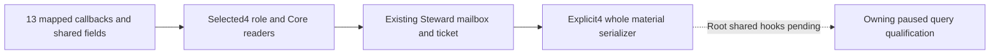

# CK3 1.20.0.4 Steward develop-county material port

2026-10-07: source implementation only, NOTRUN; compilation and paused-query qualification are Root-owned.
Exact build: `1.20.0.4`, Steam `25734779`, SHA `98702F88A547CDE2EAF29A85F93B85F68EE4CF8148336A4F7AFAEB75319DD518`.
Supplied source baseline: `c8f19a6a067ef8dd56926b8bc11d14b164045974`; independent parent TitleHolder pin `13c78d75`.

All13 callbacks have actual mappings; the complete old/new table and typed uses are in external `steward/ASSESSMENT.json` below.
The sole mapper freshly closed growth `24CF900→24CF8E0` /591B and decay `24CFB50→24CFB30` /407B:1996B,4 reads.
Both are `int64_t*(int64_t*out,const void*county,void*context)`; output is written/returned and source passes null context.
Other11 callbacks reuse held Clergy/FullCampaign/Faction proofs; no global RVA delta or child native capture was used.
The existing two samples, paused role-frame comparison, full identity joins, candidate sorting, raw scale100000 and failure/status semantics remain.

New `ck3_12004_steward_develop_county.hpp/.cpp` provides factory, validator and reader using the existing environment/access/DTO shapes.
Its `council12004` member is appended at the tail; actual4 Council owns role capture and character resolve, with mapped allocator/init/release.
The old reader selects explicit4 admission/Resolve/Capture; the existing mailbox selects actual4 Core and material readers.
Explicit4 material/whole serializers validate the environment and select actual4 version/SHA/backend directly; old3 defaults and old19 remain.
Backend: `ck3-1.20.0.4-native-steward-develop-county-material-v1`; existing reader_mode/next_reverse and JSON shape stay unchanged.

Root selects exact4 before old3, binds `BindStewardDevelopCounty12004(base,actualSHA)` and `ck3_12004::BindCoreImage`, then publishes with `SerializeStewardDevelopCountyQueryResult12004(environment,id,sequence,result)`.
Root registers original `ExecuteStewardDevelopCountyCandidatesMailboxQueryV1` via `nonwar.steward_develop_county` / `permitted_executor_quattuordenary`; submit remains `executor_context=&query`, `query.ticket`.
Root restores existing `kStewardDevelopCountyCandidatesV1Capability`, retains positive published revision/wait/reclaim protocol, and adds the one new4 TU beside old3 in the production Bridge list; actual4 Council/Core are runtime dependencies.
Parent owns the necessary Python exact4 material-provenance dictionary. No new MCP, action, policy, fixture or old test replay is added.

Delivery root: `Z:/ck3_mod_rewrite_process_assets/g2-background-20261007/upstream-build-migration/title-steward-12004/`.
`steward/ASSESSMENT.json`, `SOURCE-READY-RECEIPT.json`, `ROOT-HOOK-RECIPE.md` hold precise source/proof/hooks; `steward-growth-decay-map01/FAMILY-MAP.json` + `SOURCE-ABI-FRAGMENTS.json` hold the new complete-body ABI.
Shared proof: `Z:/ck3_mod_rewrite_process_assets/g2-migration-20261007/clergy-appointment/county/county-first01/CLERGY-COUNTY-FUNCTION-AND-FIELD-MAP.json`; `council-government/ROOT-DELIVERY.json` in that migration root.
IsHuman: `Z:/ck3_mod_rewrite_process_assets/g2-parallel-20261007/adopted-lifestyle-building-faction-12004/faction/map01/FAMILY-MAP.json`; [FullCampaign source/proof](ck3-1.20.0.4-full-campaign-root.md).
The FullCampaign optional PositionType key gap is a different type; Steward TaskType key18 uses the held Clergy proof.
Child source checks/build/tests/import/SDK/game/EXE/hash/Git are zero. Parent reviewed source once; this is neither static-ready nor live-qualified.
