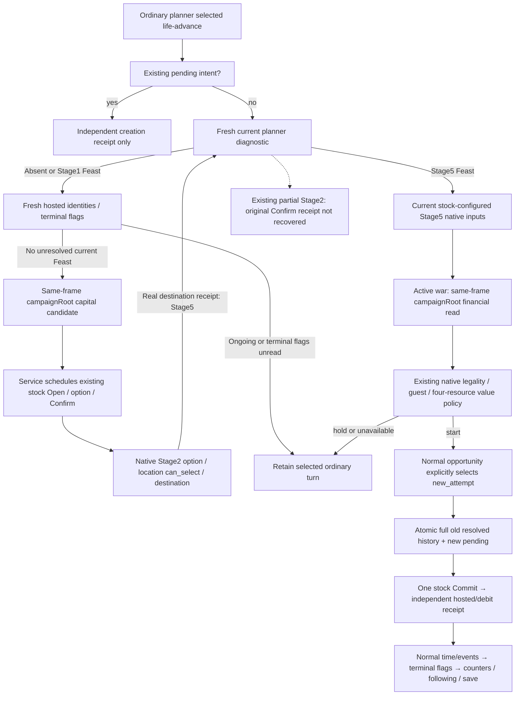

# Ordinary Feast repeats and lifecycle continuation on actual 1.20.0.4

R77 source repair, 2026-10-08. Base: a59b2df4a2b3ab6a951bfdc4f12845faf27439d7.
Status: authored; Root FIRST compound is NOT_RUN. No new native ABI, SDK call,
EXE capture, game launch, project import or build was performed by this source owner.

The R76 durable ledger retained an old .3 completed Feast. The original bounded
consumer always recovered any resolved record, so a later current legal Feast
could not create a new recorded attempt. Its Stage5 assessor also omitted the
existing same-frame campaignRoot argument, leaving active-war financial reserves
unknown despite an available native observation.



With the existing private Feast action switch enabled, ordinary
GameplayBridgeService.plan_turn now selects stock configuration or values the
current Stage5 before an otherwise selected advance. Fresh planner diagnostics
choose the source route. With an absent planner or a selected Stage1 Feast,
fresh hosted identities must contain no Feast with ongoing or unread terminal
flags. The current campaignRoot capital is only a location candidate. Service
then executes the existing typed Open, Stage1 option/Confirm, Stage2 option,
location and destination helpers; native can_select determines legality.
The destination receipt must independently report Stage5, unchanged gold,
unchanged paused frame and no started activity. The next ordinary turn reads
the configured costs, guest route and CanStart through existing Start inputs.
Configuration has no visible Start credit and does not alter the durable ledger.
A held Stage1 attempt yields to an ordinary advance in the same frame.
The route preserves earlier ordinary actions,
uses native CanStart and the qualified guest route, and passes the current
campaignRoot into the existing war-budget consumer. A positive opportunity is
the explicit new-attempt intent; the Service executor passes new_attempt=True
to the durable consumer. Pending always takes the independent receipt route.

The ledger accepts an optional history array. Default consume calls still
recover the existing resolved record. A selected new attempt appends that entire
record, including all historical build, terminal, counter and ACK provenance,
and establishes its new pending intent in the same atomic write. A held decision
does not archive anything. Historical receipts are not relabeled as actual4
observations, and no existing user ledger is edited as part of source deployment.

The native runner's --allow-private-activity-feast-normal option connects this
ordinary opportunity path and the existing lifecycle observer. It does not use
the bounded formal-trial recovery-break path. The old bounded formal-trial
default remains a recovery route. The existing ledger also enables readonly
lifecycle queries during an ordinary continuation without authorizing another
Start. A pending Start is saved and followed by receipt-only ordinary turns;
only an independent creation/debit receipt supplies visible Start credit.
Ordinary Service records the existing one-time following-turn observation.

Both normal and bounded Stage5 assessors query the existing same-frame
campaignRoot during active war and pass player_max_monthly_gold_maintenance_v1
to the current budget policy. Its 18-month coefficient is a discretionary
allocation, not a future war cost bound. Missing actual financial data remains
unknown. War is not an authorization veto.

Native fields and stock operations remain the adopted Activity16 implementation:
[migration source](activity-feast-mcp-migration-12004.md) and
[durable lifecycle](ck3-1.20.0.2-feast-durable-lifecycle.md). This minimum repair
uses those same stock Open → stage1 → stage2 → destination helpers from the
ordinary Service executor, so configuration is not limited to a bounded CLI
trial. A pre-existing partial Stage2 planner remains a source seam: these
helpers require the real original Confirm receipt, which this package does not
recover or invent. Ambiguous native configuration exceptions retain their
existing stop behavior. Native CanStart decides current stock
eligibility; raw date differences and old Feast absence do not prove a cooldown.

Root FIRST recipe:

```text
python -B -m pytest ck3_autonomous_player/tests/unit/test_r77_feast_normal_repeat_compound_v1.py -q
```

Run only in Root's selected source environment after adoption. The one compound
case covers default historical recovery, an absent planner reaching Stage5
through the production typed helper chain and only native wire substitutions,
normal Service opportunity selection,
the active-war 18-month reserve, complete history retention, unresolved pending
without resend, independent creation/debit resolution, a following ordinary
turn and explicit terminal/counter observation. Native frames/reads, physical
Commit and unrelated baseline/succession scheduling are fixture seams; the
case is not a new native or live qualification. Ordinary Feast OODA completion
is not claimed before Root executes FIRST and a future real paused continuation
demonstrates the lifecycle and material save.

The external source tree, FIRST recipe and report fields are in
Z:/ck3_mod_rewrite_process_assets/g2-background-20261008/r77-feast-normal-loop-repair/.
